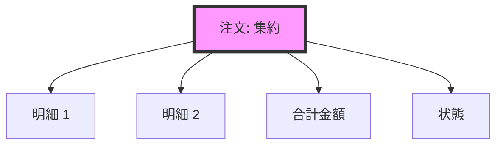
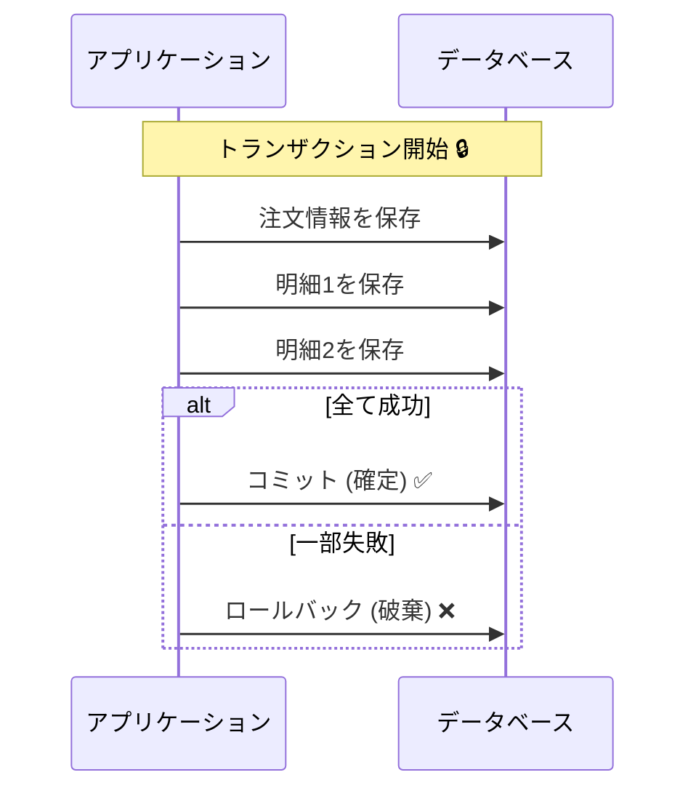

# 第01章：この教材のゴール🎯✨

## 1. この章でわかること（読了ゴール）✅🌸

この章を読み終わったら、次の3つがスッと説明できるようになります☺️✨

* **集約（Aggregate）って何？**
  → 「整合性（ルール）を守るための、ひとまとまり」🌳
* **トランザクション境界って何？**
  → 「1回の処理で、まとめて成功/失敗させる“区切り”」🔒
* **なぜそれが必要？**
  → 「うっかり整合性バグ（ズレ）を減らすため」🛡️

---

## 2. 最後にできるようになること（この教材のゴール）🏁✨


この教材のゴールは、ざっくり言うとこれです👇

* ✅ どこを「同じまとまり（集約）」にするか考えられる
* ✅ どこに「1回で守る境界（トランザクション境界）」を置くべきか判断できる
* ✅ “整合性が壊れそうな瞬間”を見つけて、事故を防げる🚑💦

そして最終的には…
**「小さな注文アプリ（カフェ注文）」を題材に、集約と境界を自分で切って、実装の形まで落とす**ところまで行きます☕️📦✨

---

## 3. そもそも「整合性バグ」ってなに？😵‍💫🧠


整合性バグって、要するに **「データのつじつまが合ってない状態」** のことです💥

たとえば…カフェでよくある（？）事故👇

* 注文は「確定」になってるのに、明細が空っぽ🧾❓
* 支払いは「完了」なのに、注文が「未確定」のまま💳❓
* 在庫は「減ってる」のに、注文が「キャンセル」になってる📦❓

こういうの、実装の途中でエラーが起きたり、同時更新が起きたりすると簡単に発生します😇💦
だからこそ…

* **集約**で「守るべきルールを1か所に集める」🌳
* **トランザクション境界**で「1回の処理で、まとめて確定する」🔒

この2つがめちゃくちゃ効きます✨

---

## 4. まず覚える“超ミニ用語”セット📚✨


### 4.1 集約（Aggregate）🌳

**「一緒に整合性を守りたい“まとまり”」**です。

* 例：注文（Order）って、
  「明細（OrderItem）」「合計金額」「状態（未確定/確定/支払い済み）」みたいに、いろいろセットでルールがあるよね？☕️🧾
* それを **バラバラに更新させない** ために、
  “ひとまとまり”として扱うのが **集約**🌳✨



### 4.2 集約ルート（Aggregate Root）👑🚪


集約には「入口」が必要です✨
外部からの更新は **入口（ルート）経由だけ**にします。

* 「OrderItemだけ勝手に更新」みたいなのを禁止🙅‍♀️
* Orderが責任もってルールを守る👑✨

### 4.3 トランザクション境界🔒


**「ここからここまでを1回で成功させる！」**という境界です🎬✨

* 成功：全部保存される✅
* 失敗：全部なかったことになる❌
* 途中まで保存される…は基本NG😵‍💫

この“成功/失敗のまとまり”が、境界の感覚です🔒✨



---

## 5. ミニアプリのイメージ（カフェ注文）☕️📦


この教材の題材は、こういう流れを想像してね👇✨

1. お客さんが商品を選ぶ🧁
2. 注文を作る（明細を追加する）🧾
3. 注文を確定する✅
4. 支払いする💳
5. （少し遅れてもOKで）発送準備/受け取り準備が進む📦⏳

ここで大事なのは…
**「全部を一気に同じトランザクションでやらない」**ケースも現実には多いってこと😌✨
だから、どこまでを“今すぐ守る（即時整合）”にして、どこからを“あとで揃えばOK（最終的整合）”にするかが超重要になります⚖️

---

## 6. この教材で使う“今どきのC#”ってどれ？🆕✨


この教材では、いまのC#/.NETの標準的な組み合わせで進めます😊

* **.NET 10 は LTS（長期サポート）**で、安定運用向きだよ🛡️✨ ([Microsoft for Developers][1])
* **.NET 10 をターゲットにすると C# 14 が既定**になるよ（特別な設定がなければ）🧠✨ ([Microsoft Learn][2])
* **Visual Studio 2026**が提供されていて、最新系の開発体験に寄せられるよ💻✨ ([Visual Studio][3])

※この章では「機能紹介」よりも、**考え方（集約/境界）**が主役だよ🌸

---

## 7. AI拡張（Copilot / Codex）との付き合い方🤖✨


AIは“丸投げ”すると事故りやすいけど、**設計学習とは相性がいい**です😊✨
この教材では、AIをこんな風に使います👇

* ✅ 「業務ルールの洗い出し」を手伝ってもらう📋
* ✅ 「境界案を複数出して比較」する⚖️
* ✅ 「この設計の弱点どこ？」をツッコませる🔍

### 7.1 そのまま使えるAIプロンプト例💬🤖

（コピペしてOKだよ✌️）

```text
カフェ注文ドメインです。
「集約」と「トランザクション境界」を決めたいです。

前提:
- 注文は明細を持つ
- 注文確定後は明細追加できない
- 支払い完了後はキャンセルできない（例外は返金フロー）

お願い:
1) 集約の候補を2〜3案出して
2) それぞれのトランザクション境界（1ユースケース=1回の確定単位）を説明して
3) 事故りやすい整合性バグもセットで教えて
```

---

## 8. ここでミニ練習✍️🌸（3分でOK）


次の「おかしな状態」を見て、直感で答えてみてね😊✨

### 問題：どれが“整合性が壊れてる”状態？🚨

A. 注文が未確定、明細が2件ある🧾
B. 注文が確定、明細が0件🧾❌
C. 支払い済み、注文が未確定💳❌
D. 注文が確定、支払いが未完了（支払い待ち）⏳

✅ **答え（考え方）**

* **B と C は危険**：多くの業務ルールで「ありえない組み合わせ」になりがち😵‍💫
* **A と D はありえる**：未確定でも明細は作るし、確定後に支払い待ちも普通にあるよね😊

こういう「ありえない状態」を作らせないのが、
**集約（ルールの責任者）＋境界（まとめて確定）**の役目だよ🛡️✨

---

## 9. まとめ（この章で押さえたこと）🎀✨

* 集約＝**整合性を守る“まとまり”**🌳
* 境界＝**1回で成功/失敗させる“区切り”**🔒
* 目的＝**整合性バグを減らして、事故りにくい設計にする**🛡️
* 最後はカフェ注文アプリで、実際に「切る→実装」までやる☕️📦✨

---

## 10. 次章でやること予告👀✨

次は、プロジェクト作成〜最小の開発の流れを整えつつ、**AI拡張の使い方ルール**も“型”として固めます🪟🛠️🤖

[1]: https://devblogs.microsoft.com/dotnet/announcing-dotnet-10/?utm_source=chatgpt.com "Announcing .NET 10"
[2]: https://learn.microsoft.com/en-us/dotnet/csharp/language-reference/language-versioning?utm_source=chatgpt.com "Language versioning - C# reference"
[3]: https://visualstudio.microsoft.com/downloads/?utm_source=chatgpt.com "Visual Studio & VS Code Downloads for Windows, Mac, Linux"
