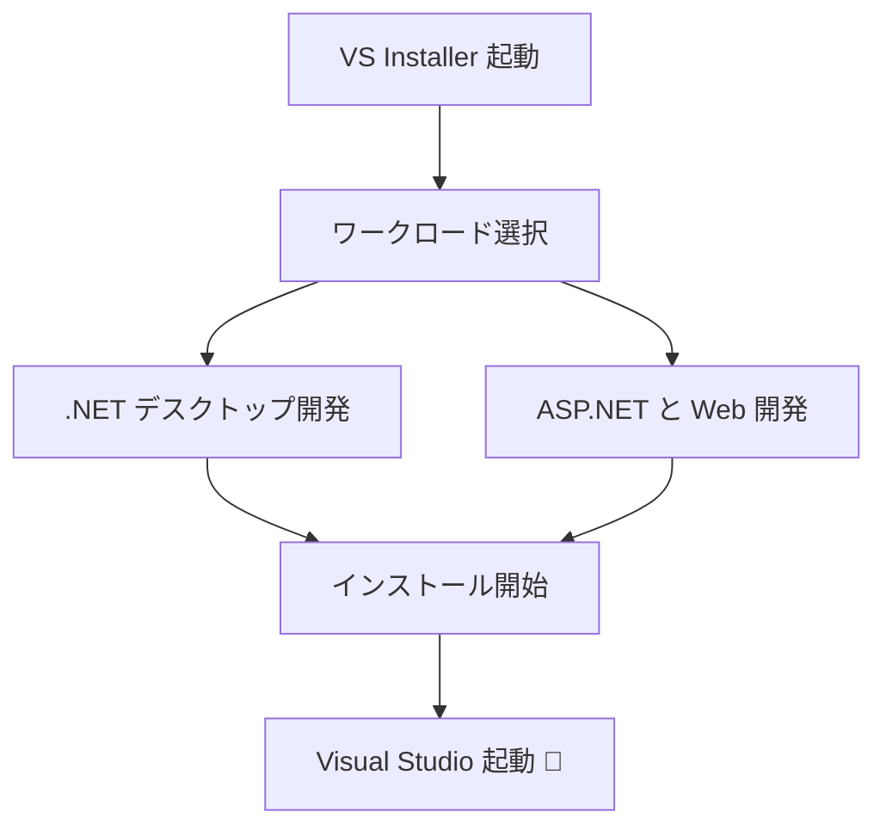
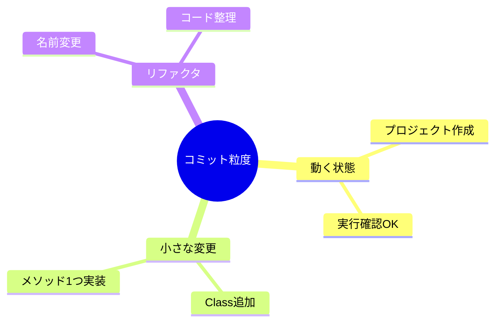
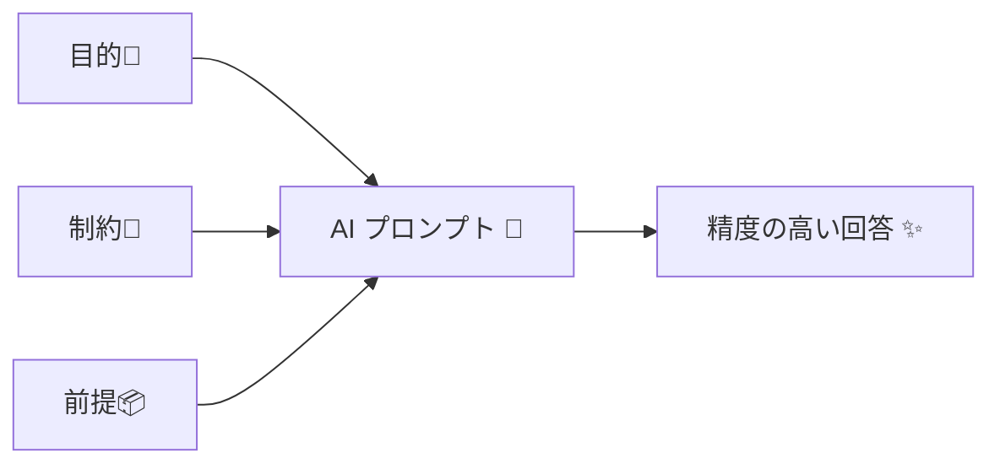

# 第02章：開発環境の準備（Windows + VS）🪟🛠️

## 2.0 この章でできるようになること🎯✨


* Visual Studio をサクッと使い始められる（プロジェクト作成〜実行まで）💻✅
* Git を「最小ルール」で回せる（迷わないコミット・ブランチ運用）🐙🌱
* Copilot（や類似のAI拡張）を“安全に・上手に”使える（丸投げしない型）🤖🧠

---

## 2.1 Visual Studio をインストール＆最新化しよう⬆️✨

## 2.1.1 インストールの流れ（超ざっくり）🧩

Visual Studio Installer で「ワークロード」を選んで入れるのが基本だよ📦
Microsoft 公式の手順はこの流れ（Installer → ワークロード選択 → インストール）になってるよ。([Microsoft Learn][1])

## 2.1.2 まず入れるワークロード（迷ったらこの2つ）🎁

学習用に、最初は“欲張りすぎない”のがコツ😊🌸

* **.NET デスクトップ開発**（Consoleアプリやライブラリなど、基礎練習でよく使う）🧱
* **ASP.NET と Web 開発**（後半でWeb APIやBlazorを触る時に効いてくる）🌐

ワークロードは後から追加できるから安心してね👌✨（Installer からいつでも変更OK）([Microsoft Learn][1])



## 2.1.3 「最新の .NET / C#」の目安（2026のいま）🆕✨

* **.NET 10 は 2025-11-11 リリースの LTS**（長期サポート）で、サポートは **2028-11-14** までだよ📅✨ ([Microsoft][2])
* **C# 14** は .NET 10 世代で、Visual Studio 2026 や .NET 10 SDK で試せるよ🎀 ([Microsoft Learn][3])
* Visual Studio は **2026 系の安定版が 2026-01-13 に更新**されてるよ（例：18.2.0）🧊 ([Microsoft Learn][4])

> ポイント：学習中は「とにかく最新へ」よりも、**同じ世代で揃える**ほうが混乱しないよ（VS 2026 × .NET 10 みたいに）🧠✨

---

## 2.2 最初のソリューションを作ろう📁✨（“教材用の箱”を用意）

ここでは、後の章でずっと使える「入れ物」を作るよ🎁
題材はカフェ注文（後で出てくる）っぽい名前でOK☕️🍰

## 2.2.1 Visual Studioで作る（いちばん簡単）🪄

1. Visual Studio を起動
2. **「新しいプロジェクトの作成」** を選ぶ
3. 検索で **Console** を入れて、
   **「コンソール アプリ」**（C#）を選ぶ🧁
4. プロジェクト名：`CafeOrdering.App` みたいにする☕️
5. ターゲットは **.NET 10** を選ぶ（一覧に出るはず）🧷
6. 作成したら、まずは **実行（▶）** して “動いた！” を確認🎉

### まず確認したい設定（初心者にやさしいやつ）🌸

* **Nullable（null安全）**：ON（バグ減る）🛡️
* **暗黙の using**：ON（おまじない減る）🪄

> 「どこで変えるの？」は、プロジェクト作成時のオプション or `.csproj` でOK（慣れたらで大丈夫）😊✨

---

## 2.3 Git の最小運用（まずは“事故らない型”）🐙✨


この教材では、Gitは“高度なことをする道具”じゃなくて、
**ミスを戻せるタイムマシン**として使うよ⏪🕰️

## 2.3.1 Git for Windows を入れる（入ってなければ）🧰

Git 公式の Windows 版インストールでOK。
2026-01 時点の「最新（maintained）」として **2.52.0（2025-11-17）** が案内されてるよ。([git-scm.com][5])

## 2.3.2 Visual Studio の中だけで Git を回す（初心者向け）🎀

Visual Studio は Git 操作をかなり GUI でできるよ😊

* **Git リポジトリ作成**：ソリューション作成時に「Git を有効化」できることが多い📁
* 変更が出たら **Git Changes**（変更一覧）を見る👀
* メッセージ書いて **Commit**（コミット）✅
* GitHub に置くなら **Push**（最初は“公開/非公開”は自分で選ぶ）🐙

## 2.3.3 コミット粒度のコツ（超重要）📌✨

“でっかい1コミット”は、後で泣きがち😭
なので、粒度はこの3つで切ると安定するよ🌷

* ✅ **動く状態を作った**（プロジェクト作成・起動できた）
* ✅ **1つの小さな変更が完了**（例：Orderクラス追加）
* ✅ **リファクタだけ**（名前変更だけ、移動だけ）🧹

コミットメッセージは短くてOK：
例）`Add Order entity` / `Rename status enum` / `Fix null guard` ✍️🌸



## 2.3.4 CLI派のための最小コマンド（覚えるのはこれだけ）⌨️✨

```bash
git --version
git status
git add .
git commit -m "Initial commit"
git log --oneline
```

> Windows で改行が気になる時は、最初にこれも定番だよ（好みでOK）🧷

```bash
git config --global core.autocrlf true
```

---

## 2.4 AI拡張（Copilot等）のセットアップ＆“使い方ルール”🤖⚠️

AIは便利だけど、**使い方をミスると学習が進まない**のが落とし穴😵
ここでは「伸びる使い方」に寄せるよ🌱✨

---

## 2.4.1 Visual Studio で Copilot を使い始める（基本操作）🪄

Visual Studio では、右上の **Copilot バッジ**からチャットを開いてサインインできるよ。([Microsoft Learn][6])
また、メニューから **View → GitHub Copilot Chat** でチャットを開ける案内もあるよ。([GitHub Docs][7])

Copilot の状態（有効/無効/未導入など）は IDE 上で確認・管理できるよ（右上アイコン周り）。([Microsoft Learn][8])

---

## 2.5 丸投げ禁止の型（AIに頼るほど、上手くなるやつ）🧠💕

## 2.5.1 “AIに投げる前”に書く3点セット🧾✨

AIに質問するとき、これを先に書くと精度が上がるよ👇

1. **目的**：何をしたい？（例：注文を確定したい）🎯
2. **制約**：やってほしくないこと（例：外部ライブラリ増やさない）🧷
3. **前提**：いま何がある？（例：Orderクラスはある）📦



---

## 2.5.2 「丸投げ」にならない黄金テンプレ🍯✨

そのままコピペして使えるよ💗

**テンプレA：設計相談（まず考え方が欲しい）**

```text
次の要件をC#で設計したいです。
- 目的：
- 制約：
- いまあるコード（要点だけ）：
お願い：
1) まず設計方針を箇条書きで
2) その後に最小コード例
3) ありがちな落とし穴も3つ
```

**テンプレB：既存コードの改善（差分で欲しい）**

```text
このコードを改善したいです。目的は〇〇です。
制約：公開APIは変えない／挙動は維持
お願い：
- 変更点を「理由つき」で説明
- 最後に diff 形式（もしくは変更ファイル一覧）で提案
コード：
（ここに貼る）
```

**テンプレC：テストも一緒に（学びが速い）🧪**

```text
この機能に対して、最小のテスト（Arrange-Act-Assert）も書いてください。
テストで確認したいこと：
- 正常系：
- 例外/エラー系：
```

---

## 2.5.3 AIの回答を“そのまま採用しない”チェックリスト✅🔍

AIが出したコードは、かわいく見えても🐣、たまに危ない😇
この5個だけチェックすると安全度が上がるよ✨

* ✅ **ビルド通る？**（まず動く？）
* ✅ **例外の出し方が雑じゃない？**（throwしっぱなし、みたいな）💥
* ✅ **null が混ざっても大丈夫？**（ガード節ある？）🛡️
* ✅ **命名が業務の言葉になってる？**（ふわっとしてない？）🗣️
* ✅ **“勝手に仕様を追加”してない？**（AIあるある）🌀

---

## 2.6 ミニ演習：環境が完成したか最終チェック🎓🌸

## 演習1：動作確認（30秒）⏱️

* Consoleアプリを実行して「Hello」が出る🎉
* 変更して、もう一回実行できる🎯

## 演習2：Git確認（2分）🐙

1. 1行だけ変更する✍️
2. Git Changes に差分が出る👀
3. `Commit` する✅

## 演習3：AI確認（3分）🤖

Copilot Chat にこれを聞く💬

* `このプロジェクトは何をするもの？`
* `Program.cs をやさしく説明して`
* `初心者が混乱しそうな点は？`

---

## 2.7 よくあるつまずき（ここだけ見ればOK）🚑💦

## ✅ ビルドできない（SDKが足りない気がする）

* Visual Studio Installer を開いて、ワークロードに **.NET系** が入ってるか確認🔧
* 追加したら Visual Studio を再起動🔄

## ✅ Git が見えない／使えない

* Git for Windows が入ってるか確認（`git --version`）⌨️
* Visual Studio は再起動すると認識することが多いよ🔄

## ✅ Copilot のボタンが出ない

* IDE右上の Copilot 状態（未導入/無効/サインイン未完了）を確認👀 ([Microsoft Learn][8])
* Copilot は Visual Studio のバージョン要件がある（例：17.8+ 推奨）ので、更新もチェック⬆️ ([Microsoft Learn][6])

---

## まとめ🎀

この章で、

* いつでも作業できる Visual Studio 環境💻✨
* 迷わない Git の最小運用🐙🌱
* 学びを加速する AI の“正しい使い方”🤖🧠

がそろったよ✅🌸

[1]: https://learn.microsoft.com/ja-jp/visualstudio/install/install-visual-studio?view=visualstudio&utm_source=chatgpt.com "Visual Studio をインストールし、お好みの機能を選択する"
[2]: https://dotnet.microsoft.com/ja-jp/platform/support/policy?utm_source=chatgpt.com "公式の .NET サポート ポリシー | .NET"
[3]: https://learn.microsoft.com/en-us/dotnet/csharp/whats-new/csharp-14?utm_source=chatgpt.com "What's new in C# 14"
[4]: https://learn.microsoft.com/en-us/visualstudio/releases/2026/release-history?utm_source=chatgpt.com "Visual Studio Release History"
[5]: https://git-scm.com/install/windows?utm_source=chatgpt.com "Git - Install for Windows"
[6]: https://learn.microsoft.com/en-us/visualstudio/ide/visual-studio-github-copilot-get-started?view=visualstudio&utm_source=chatgpt.com "Get Started with GitHub Copilot - Visual Studio (Windows)"
[7]: https://docs.github.com/en/copilot/get-started/quickstart?utm_source=chatgpt.com "Quickstart for GitHub Copilot"
[8]: https://learn.microsoft.com/en-us/visualstudio/ide/visual-studio-github-copilot-install-and-states?view=visualstudio&utm_source=chatgpt.com "Manage GitHub Copilot installation and state"
