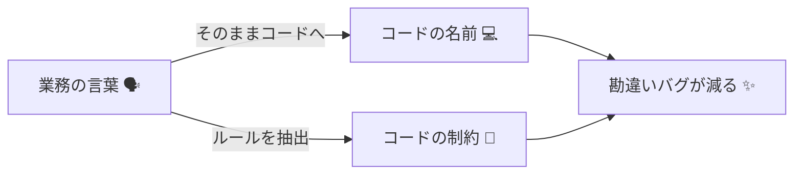
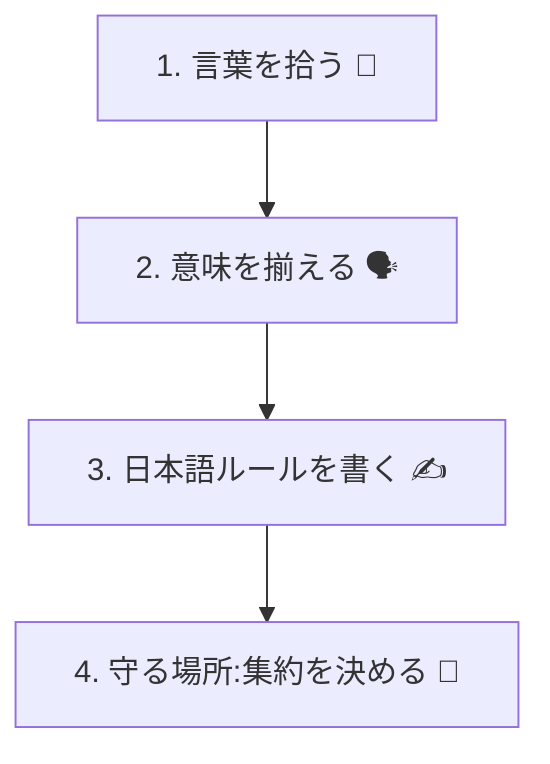
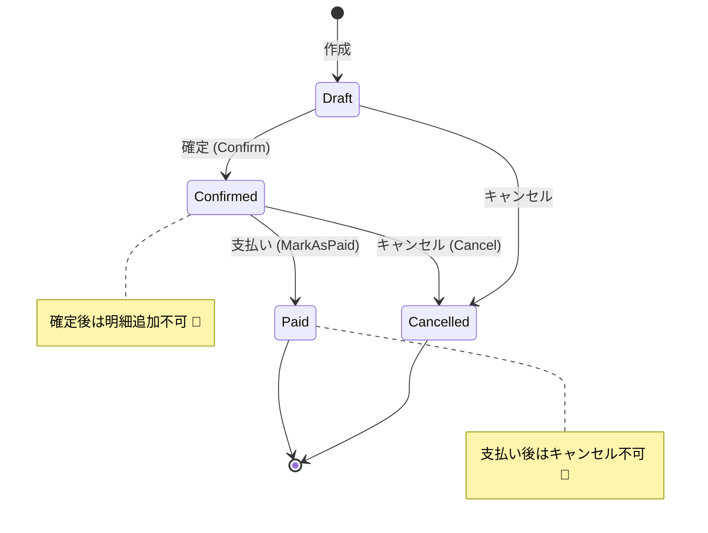

# 第03章：DDDってなに？こわくない版🧁

## この章でできるようになること🎯✨

* DDDが目指してることを「一言で」説明できる🗣️✨
* 仕様書や会話から「業務の言葉」を拾って、コードの名前にできる🔎💡
* “難しいDDD全部”を一旦置いといて、今日の主役「集約」の入口に立てる🌳🚪

---

## 1. DDDって結局なに？🧠💭

DDD（Domain-Driven Design）は、めちゃくちゃ雑に言うと👇

* **業務で使ってる言葉を、そのままコードにする**📖➡️💻
* **大事なルールを、コードの中心に置く**🔐✨
* **「仕様の勘違い」で起きるバグを減らす**🛡️😇



ここで言う「業務」って、会社の業務だけじゃなくてOKだよ🙆‍♀️
カフェの注文でも、サブスクでも、ゲームのアイテム管理でも、ぜんぶ“ドメイン”☕️🎮📦

---

## 2. なんでDDDをやるの？🎁✨

DDDをやる理由は、主にこの3つが強いよ💪🌸

## 2.1 仕様の「思い込みバグ」が減る😵➡️😊

* 例：「注文確定」と「支払い完了」を同じ意味だと思ってた…💥
* 言葉を揃えると、こういう事故が減る🧯✨

## 2.2 コードの説明がしやすくなる📣📘

* `ConfirmOrder()` って名前なら、何をするか想像できるよね👀
* `DoProcessA()` みたいなのは、未来の自分が泣く😭

## 2.3 変更に強くなる🔧🌱

* ルールが散らばってると、変更のたびに見落として壊す😇💥
* ルールがまとまってると、直す場所が読める📍✨

---

## 3. DDDでよく出る言葉 こわくない辞典📖🌸


ここでは“最小だけ”いくよ🧁✨（本格用語は後でゆっくり）

* **ドメイン**：対象の世界。例：カフェ注文、在庫、会員管理☕️📦
* **モデル**：ドメインを理解して、扱いやすくした“形”📦✨
* **ユビキタス言語**：みんなで合意した“同じ意味の言葉”🗣️🤝

  * 例：「注文確定」「支払い完了」「発送準備中」など
* **集約**：**一緒に整合性を守る“まとまり”**🌳🔒

  * 今日このあと、集約に入っていくよ〜！

---

## 4. ミニ題材 カフェ注文の世界☕️🍰

まずは、カフェの注文でありがちな言葉を並べてみよう👀✨

## 登場しそうな言葉たち🧾

* 注文（Order）☕️
* 注文明細（OrderItem）🍰
* 金額（Money）💰
* 支払い（Payment）💳
* 注文状態（OrderStatus）🚦
* 注文確定（Confirm）✅
* キャンセル（Cancel）🧨
* 返金（Refund）💸

この時点で大事なのは👇
**「コードの名前は、業務の言葉を優先する」**ってこと🌸📌

---

## 5. 業務の言葉をコードにする手順 4ステップ🪜✨

## ステップ1 まず言葉を拾う🔎📝

仕様・会話・メモから、名詞と動詞を拾うよ〜！

* 名詞：注文、支払い、金額、明細…
* 動詞：確定する、追加する、キャンセルする、返金する…

## ステップ2 言葉の意味を揃える🗣️🤝

ここがDDDの強いところ✨
「その言葉って、いつの状態のこと？」を揃えるよ👀

* 「注文確定」＝明細の追加がもうできない状態？🤔
* 「支払い完了」＝決済会社から成功通知が来た状態？📩

## ステップ3 ルールを文章で書く🔐✍️

コードにする前に、“日本語ルール”を作ると爆速で安全になるよ💨🛡️

例👇

* 注文が確定したら、明細は追加できない🧾🚫
* 支払い完了した注文はキャンセルできない💳🚫
* 合計金額は、明細の合計と一致していないとダメ💰✅

## ステップ4 ルールを守る場所を決める🏠🔒

この「守る場所」が、のちに **集約** の話につながる🌳✨
（ルールが散らばると事故るので、守る責任者を作るイメージ👑）



---

## 6. ちょいコードで雰囲気だけ C#で業務の言葉を置く💻✨

「DDD＝難しい設計」ってより、まずは
**“名前を業務に寄せる”**だけで一気に変わるよ🌸

```csharp
public enum OrderStatus
{
    Draft,       // 下書き（まだ確定してない）
    Confirmed,   // 注文確定
    Paid,        // 支払い完了
    Cancelled    // キャンセル
}

public sealed class Order
{
    public Guid OrderId { get; }
    public OrderStatus Status { get; private set; }

    public Order(Guid orderId)
    {
        OrderId = orderId;
        Status = OrderStatus.Draft;
    }

    public void Confirm()
    {
        if (Status != OrderStatus.Draft)
            throw new InvalidOperationException("下書き以外は確定できません🧾🚫");

        Status = OrderStatus.Confirmed;
    }

    public void MarkAsPaid()
    {
        if (Status != OrderStatus.Confirmed)
            throw new InvalidOperationException("確定してない注文は支払い完了にできません💳🚫");

        Status = OrderStatus.Paid;
    }
}
```

ポイントはこれ👇✨

* `Confirm()` や `MarkAsPaid()` が、業務の言葉そのまま🗣️
* 状態とルールが、1か所にまとまってる🔒
* “なんとなくif”じゃなくて、意味があるifになってる🧠

---

## 7. 演習1 仕様から言葉を抜き出そう✍️🌸

## お題🧁

次の文章から「名詞」と「動詞」を抜き出してみてね💡

* 「注文は下書きで作成される。確定すると明細は追加できない。支払い完了後はキャンセルできない。」

## 例の答え📝✨

* 名詞：注文 / 下書き / 明細 / 支払い完了 / キャンセル
* 動詞：作成する / 確定する / 追加する / できない / キャンセルする

できたら、次に👇
**「同じ意味に見える言葉」**を探して丸をつけよう⭕️
（例：「確定」と「注文確定」って同じ？違う？🤔）

---

## 8. 演習2 ルールを “if文” に変換してみる🔁🧠

文章ルールを “機械っぽい形” にすると、漏れが見えやすいよ👀✨

例👇

* ルール：注文が確定したら明細は追加できない
* 変換：**IF Status == Confirmed THEN AddItemは禁止**🧾🚫

この形にすると👇

* 「Paidのときは？」って自然に気づける💡
* “例外ケースの穴”が見える🕳️😇

---

## 9. AI拡張の使いどころ こわくない使い方🤖✨

AIは「答え」じゃなくて、**案を出す相棒**にすると超強いよ💪🌸
（そのまま採用はせず、必ず意味チェック✅）

## 9.1 用語候補を出してもらう🗣️💡

```text
カフェ注文ドメインです。
「注文確定」「支払い完了」「キャンセル」などの用語を、
ユーザー向けの画面文言と、コード名（英語）でペアにして提案して。
意味の違いが出るものは注意点も添えて。
```

## 9.2 ルールの抜け漏れを探してもらう🔍🧯

```text
以下のルール一覧の「抜け漏れ」「矛盾」「曖昧な言葉」を指摘して、
質問すべき確認事項を10個出して。
（ルール）
- 注文確定後は明細追加できない
- 支払い完了後はキャンセルできない
- 合計金額は明細合計と一致
```

## 9.3 状態遷移の図を作ってもらう🚦✨

```text
注文の状態を Draft / Confirmed / Paid / Cancelled とします。
この状態遷移の一覧を「表」で作って。
禁止される操作も含めて。
```
AIの出力を見たら、最後にこれだけやってね👇


AIの出力を見たら、最後にこれだけやってね👇

* **その言葉、現場の意味と同じ？**🗣️✅
* **例外ケースは現実にある？**🧯✅
* **UI文言とコード名がズレてない？**📱💻✅

---

## 10. 今日の主役 集約の入口だけ先にチラ見せ🌳👀

DDDで「整合性バグを減らす」って話をしたけど、
その中心にいるのが **集約** だよ🌳🔒

集約の感覚はこれ👇

* **一緒に守るルールがあるものは、ひとまとまり**🧩
* **外から更新するときは、入口を1つにする**🚪
* **ルールを守る責任者がいる**👑✨

カフェだと例えば👇

* 注文（Order）と明細（OrderItem）は、同じタイミングで整合性を守りたくなる

  * 「合計金額＝明細合計」みたいなルールがあるから💰✅

だから、次の章以降で「集約」を学ぶと
**“どこまでを一緒に守る？”**が自然に決められるようになるよ🌸

---

## 11. この章のまとめ🎀✨

* DDDは「業務の言葉をコードにする」📖➡️💻
* 最初にやるのは、難しい設計より **言葉合わせ**🗣️🤝
* ルールを文章で書くと、漏れに気づける🔐✍️
* そして、そのルールを守るまとまりが「集約」につながる🌳✨

---

## 参考になる最新情報メモ📌🆕

* **C# 14 が最新**で、**.NET 10** 上でサポートされているよ📚✨ ([Microsoft Learn][1])
* **.NET 10 は 2025年11月のLTS**として公開されているよ🗓️🔒 ([Microsoft][2])
* **EF Core 10** も **.NET 10 前提のLTS**として案内されてるよ🧪✨ ([Microsoft Learn][3])

---

## 次章予告：トランザクションってなに？🔒

次は「全部成功 or 全部失敗」っていう、境界の大事な話に入っていくよ〜💥✅

[1]: https://learn.microsoft.com/en-us/dotnet/csharp/whats-new/csharp-14?utm_source=chatgpt.com "What's new in C# 14"
[2]: https://dotnet.microsoft.com/en-us/platform/support/policy/dotnet-core?utm_source=chatgpt.com "NET and .NET Core official support policy"
[3]: https://learn.microsoft.com/en-us/ef/core/what-is-new/ef-core-10.0/whatsnew?utm_source=chatgpt.com "What's New in EF Core 10"
