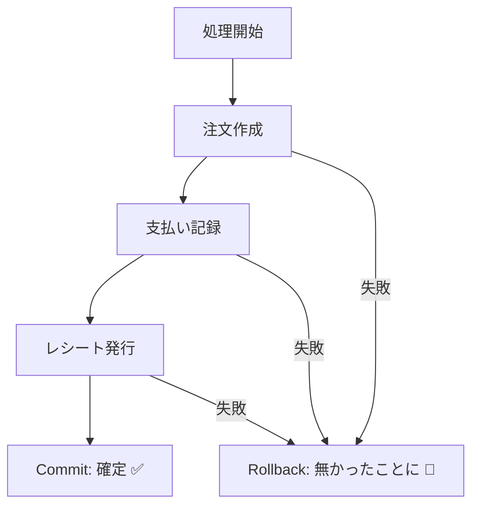
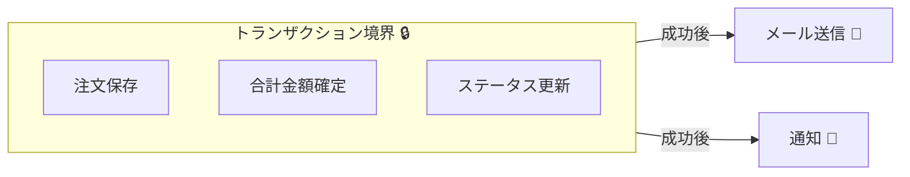
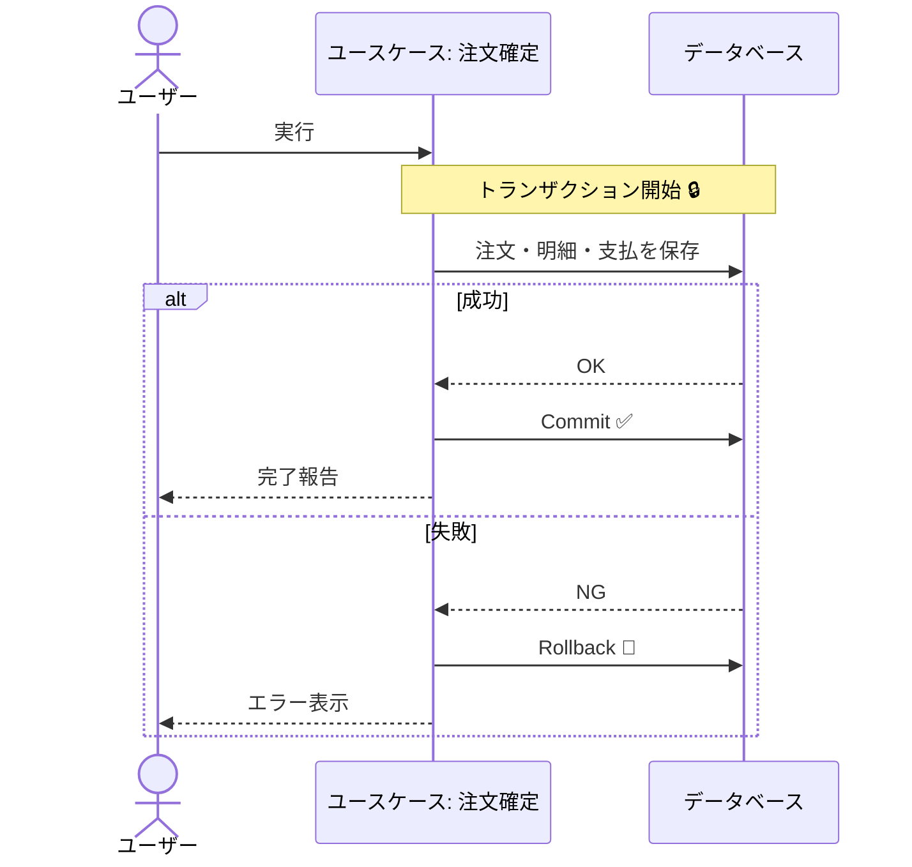

# 第04章：トランザクションってなに？🔒

## この章でできるようになること🎯✨

* 「トランザクション＝**全部成功 or 全部失敗**」を、説明できるようになる😊
* 「どこまでを1回で守る？」＝**トランザクション境界**の感覚がつかめる🧱
* まずは基本の型「**1ユースケース＝1トランザクション**」を覚える🙆‍♀️🌸

---

## 1. トランザクションは“レシート1枚分”の約束🧾🔒


トランザクションって、超ざっくり言うとこう👇

> 「この一連の処理は、**全部うまくいったら確定（Commit）**。
> 途中でコケたら、**何もなかったことにする（Rollback）**」

たとえばカフェで☕️

* 注文を作る📝
* 支払いを記録する💳
* レシートを出す🧾

この3つ、途中で止まったら困るよね…？😵
「注文だけ入ったけど支払いがない」みたいな状態が残ると、後で地獄🔥

だからトランザクションは、**“中途半端な結果を残さないための安全装置”**なんだよ🛡️✨



---

## 2. 「全部成功 or 全部失敗」ってどういうこと？💥✅


## 2.1 失敗する例（トランザクションが弱い/境界がズレてる）😇💣

たとえば「注文確定」ユースケースで👇

1. Orders テーブルに注文を保存✅
2. Payments テーブルに支払いを保存✅
3. 2)でエラー発生💥（カード決済エラー、DB制約違反など）

このとき、1)だけ残っちゃったら…
**“注文あるのに未払い”が量産**される😱

## 2.2 成功する例（ちゃんと同じトランザクションに入ってる）🌈

1. 注文を保存
2. 支払いを保存
3. どっちも成功！→ **Commit**✨

もし途中で失敗したら？
→ **Rollback**して「両方なかったことに」🎮✨

---

## 3. 重要ワード3つだけ覚えよ🧠🔑

* **トランザクション**：一連の処理をまとめる箱📦
* **Commit（確定）**：箱の中身を正式採用！✅
* **Rollback（取り消し）**：箱の中身を全部なかったことに！🧹

これだけでOK🙆‍♀️🌸
（“ACID”とかは今は雰囲気で大丈夫〜😌）

---

## 4. 「境界」ってなに？🧱✨ 〜どこまでを1回で守る？〜

ここからがこの教材のテーマに直結するよ🎯

## 4.1 境界＝「この線の内側は、運命共同体」🧷

トランザクション境界って、イメージはこれ👇

* **境界の内側**：一緒に成功してほしいもの✅
* **境界の外側**：失敗しても後で辻褄を合わせられるもの⏳



例（カフェ注文）☕️
✅ 同時に守りたい（同じ境界に入れたい）

* 注文の保存📝
* 注文合計の確定💰
* 注文ステータス更新（確定/取消）🚦

⏳ 後で整えばOKになりやすい（境界の外に出しやすい）

* 送信メール📧
* 管理画面への通知🔔
* レコメンド更新🛍️

---

## 5. まずは「1ユースケース＝1トランザクション」から😊🔒

初心者が最初に迷子にならないための型がこれ👇

## ✅ 基本の型

* **ユースケース（ユーザーがやりたい1行動）**
  ＝ **1トランザクション**

たとえば

* 「注文を確定する」＝1トランザクション
* 「明細を追加する」＝別トランザクション
* 「支払いを確定する」＝別トランザクション

この型にすると何が嬉しい？✨

* 「どこまで守る？」の判断がシンプルになる😊
* “巨大トランザクション”になりにくい（後で困らない）🧠
* 例外やエラーの扱いも整理しやすい💬



---

## 6. ちょこっと先取り：EF Coreだと何が起きるの？🧪✨

この教材では後半でEF Coreを使うけど、ここで**超大事な挙動**だけ先に知っておくと強い💪

## 6.1 SaveChangesは“勝手にトランザクション”になりやすい😳

EF Coreは設定によって細部はあるけど、基本は
**SaveChanges() の保存処理はトランザクションで守られる**ように作られてるよ🛡️
（自動トランザクションが有効なのがデフォルト、という説明がある）([Microsoft Learn][1])

つまり、**1回の SaveChanges にまとめて保存できるなら**、それだけで「全部成功or全部失敗」になりやすい👍✨

## 6.2 でも「SaveChangesを2回以上」すると危険が増える⚠️

例えば👇

* 1回目 SaveChanges ✅（ここでDBに確定しちゃう）
* 2回目 SaveChanges 💥失敗

すると、**1回目だけ残る**ことがある😱
（だから「できるだけ1回のSaveChangesにまとめよう」って話が後で効いてくるよ🎯）

## 6.3 明示トランザクションの中だと“セーブポイント”を使うことがある🪜

すでにトランザクションが進行中のとき、SaveChangesは**セーブポイント**を作って失敗時にそこまで戻す、という説明があるよ🧠✨([Microsoft Learn][2])

---

## 7. ミニ実験：2回SaveChangesすると何が怖い？😈🧪

ここは「意味が分かればOK」な実験コーナーだよ🎀
（後半でEF Coreをちゃんと学ぶので、今は雰囲気で大丈夫🙆‍♀️）

## 7.1 やりたいこと（注文＋支払いを1セットにしたい）☕️💳

* 注文（Order）を保存
* 支払い（Payment）を保存
* どっちも成功したらOK✅
* 途中で落ちたら“なかったこと”にしたい🧹

---

## 実験コード（イメージ）🧩✨

## パターンA：2回SaveChanges（トランザクション無し）😵

「注文だけ残る」事故が起きやすい💥

```csharp
// 例：注文だけ先に保存して、そのあと何かで落ちる…😇
db.Orders.Add(order);
await db.SaveChangesAsync();     // ✅ ここで注文がDBに確定しやすい

throw new Exception("ここでアプリが落ちた想定😵");

db.Payments.Add(payment);
await db.SaveChangesAsync();
```

## パターンB：明示トランザクションで包む🔒✨

「途中で落ちたら、まとめてRollback」しやすい👍
（BeginTransactionAsync の使い方はMicrosoft Learnにも例があるよ）([Microsoft Learn][3])

```csharp
await using var tx = await db.Database.BeginTransactionAsync();
try
{
    db.Orders.Add(order);
    await db.SaveChangesAsync();

    throw new Exception("ここでアプリが落ちた想定😵");

    db.Payments.Add(payment);
    await db.SaveChangesAsync();

    await tx.CommitAsync(); // ✅ 最後に確定
}
catch
{
    await tx.RollbackAsync(); // 🧹 まとめて取り消し
    throw;
}
```

---

## 8. 境界を決める“ミニチェックリスト”✅🧠

トランザクション境界で迷ったら、これを順に考えるとラクだよ✨

1. **同時に守らないと困るルールはどれ？**🔒
2. **途中状態が外に見えたら困る？**👀💦
3. **失敗したら取り消したいのはどれ？**🧹
4. **外部I/O（メール、決済API、外部HTTP）は中に入ってない？**🌐⚠️

   * トランザクションを長くするとロックが伸びたりしてつらいことがある😵
5. **ユースケース1本で説明できる範囲？**🎬

   * 説明できないなら境界がデカすぎるサインかも📏

---

## 9. よくある勘違いあるある😅💡

## Q1. 「トランザクションを大きくすれば安全では？」🤔

安全そうに見えるけど、やりすぎると

* ロックが長い
* 遅い
* 競合しやすい
* 失敗範囲がデカい
  で、だんだん運用がしんどくなる😵‍💫

だからまずは
✅ **1ユースケース＝1トランザクション**
がバランス良いよ🌸

## Q2. 「例外を握りつぶして続行すれば…？」🫠

それ、**中途半端状態の温床**になりがち😇
失敗したら基本は

* ロールバック
* ちゃんとエラーにする（ユーザーには優しく表示）
  が王道だよ🛡️✨

---

## 10. ミニ演習（ワーク）✍️🎀

## 演習1：境界を引いてみよう🧱

次の処理で「同じトランザクションに入れるべきもの」に✅を付けてね💡

* 注文を作成する
* 注文明細を保存する
* 注文合計を計算して保存する
* サンキューメールを送る
* 管理画面に通知する
* “注文確定”ステータスにする

💡ヒント：**“途中で失敗したら困る”**ものほど同じ境界に入りやすいよ🔒

---

## 演習2：「1ユースケース＝1トランザクション」を言葉で説明しよう🗣️

次の文章を完成させてね✨

> 「ユースケースとは＿＿＿＿＿＿＿＿で、
> それを実行する間に守りたい整合性の範囲を＿＿＿＿＿＿＿＿という。
> だから基本は＿＿＿＿＿＿＿＿だよ」

---

## 演習3：事故シナリオを考えよう🚑

「注文保存のあと、支払い保存の前に落ちたらどうなる？」
を2パターン書いてね👇

* SaveChangesが1回のとき
* SaveChangesが2回のとき

---

## 11. Copilot / Codexに聞くならこんな感じ🤖✨

## 11.1 “理解用”プロンプト🧠

* 「トランザクションをカフェ注文でたとえて、Commit/Rollbackを説明して」☕️🧾
* 「“1ユースケース＝1トランザクション”が初心者に良い理由を3つ」🎯
* 「トランザクション境界を決めるチェックリストを作って」✅

## 11.2 “コード用”プロンプト🛠️

* 「EF Coreで2回SaveChangesする処理を、BeginTransactionで包む例を書いて」🔒
* 「try/catchでRollbackしつつ、例外は握りつぶさない形にして」⚠️
* 「外部API呼び出しをトランザクションの外に出す設計案を3つ」🌐

## 11.3 AIを使うときの“コツ”🌸

* そのまま採用せず、**“どこが境界？”を言語化**してから貼る🧠
* 「失敗したらどうなる？」を必ず質問して、**事故パターンを潰す**🚑
* 「この境界、デカすぎない？」って毎回ツッコむ📏😇

---

## まとめ🎀✨

* トランザクションは「**全部成功 or 全部失敗**」の約束🔒
* 境界は「**どこまでを1回で守る？**」の線引き🧱
* まずは「**1ユースケース＝1トランザクション**」で迷子回避😊
* EF Coreは SaveChanges が自動でトランザクションを使う設定が基本で、必要なら明示トランザクションも使えるよ🛡️([Microsoft Learn][1])

（参考：C#は最新がC# 14で、.NET 10でサポートされるよ）([Microsoft Learn][4])

[1]: https://learn.microsoft.com/en-us/dotnet/api/microsoft.entityframeworkcore.infrastructure.databasefacade.autotransactionsenabled?view=efcore-9.0&utm_source=chatgpt.com "DatabaseFacade.AutoTransactionsEnabled Property"
[2]: https://learn.microsoft.com/en-us/ef/core/saving/transactions?utm_source=chatgpt.com "Transactions - EF Core"
[3]: https://learn.microsoft.com/ja-jp/ef/core/saving/transactions?utm_source=chatgpt.com "EF Core - トランザクションの使用"
[4]: https://learn.microsoft.com/ja-jp/dotnet/csharp/whats-new/csharp-14?utm_source=chatgpt.com "C# 14 の新機能"
