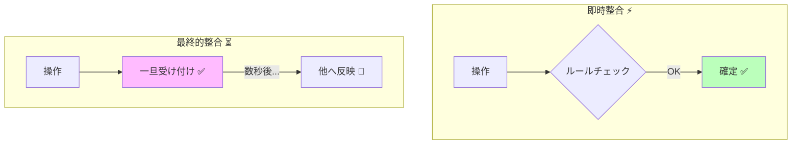
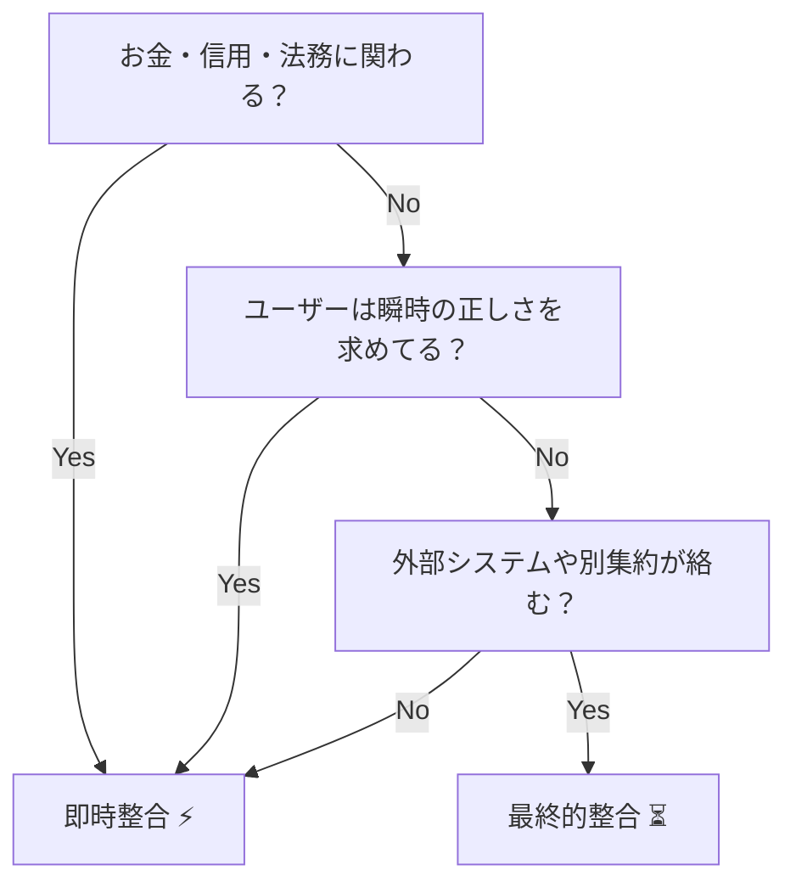
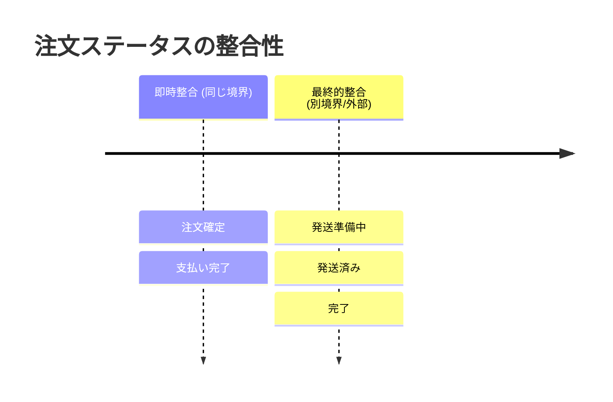

# 第05章：整合性ってなに？（即時 vs あとでOK）⏱️⏳

## この章でできるようになること🎯✨

* 「**今この瞬間に絶対そろってないとダメ**」なルール（即時整合）と、「**あとでそろえばOK**」なルール（最終的整合）を分けられるようになるよ⚖️😊
* その分け方を、**UX（画面の見せ方・文言）**まで含めて説明できるようになるよ💬🌸
* C#で「**処理中**」「**反映待ち**」みたいな状態を表現して、ユーザー不安を減らす土台が作れるよ🧱✨

---

## 1. そもそも「整合性」ってなに？🧩


「整合性」はざっくり言うと、

> **“ルール的におかしくない状態が保たれてること”** ✅

たとえばカフェ注文だと…☕️🍰

* ❌「支払いが終わってないのに発送（提供）済み」
* ❌「合計金額が明細の合計と一致しない」
* ✅「注文が確定して、合計が合ってて、支払い状況も筋が通ってる」

こういう **“筋の通った状態”** を守るのが整合性だよ〜😊✨

---

## 2. 2種類あるよ：「即時整合」と「最終的整合」⚡️⏳


## 2-1. 即時整合（Strong / ACID寄り）⚡️🔒


**「この操作が終わった直後に、絶対にルールを満たしてないとダメ」** なやつ！

* 例：

  * 注文確定の瞬間に「明細が0件」は絶対ダメ🙅‍♀️
  * 「確定後に合計がマイナス」も絶対ダメ🙅‍♀️
  * 「在庫が足りないのに確定」も（業務によっては）絶対ダメ🙅‍♀️

**ポイント💡**
即時整合にすると「安心」だけど、守る範囲を広げすぎると **重くなる**（遅い・複雑・失敗しやすい）ことがあるよ⚠️

---

## 2-2. 最終的整合（Eventual Consistency）⏳📣


**「いまはズレてても、しばらくしたら正しい状態に収束すればOK」** なやつ！

マイクロサービスや分散っぽい構成だと特に重要で、Microsoftの設計ガイドでも「どの整合性が必要かを部品ごとに決めて、可能なら最終的整合を選ぶ」みたいな考え方が出てくるよ📚✨ ([Microsoft Learn][1])

* 例：

  * 支払い完了の通知が来てから「発送準備中」になるまで数秒〜数分遅れてもOK⏳
  * 注文完了メールがちょい遅れて届いてもOK📩
  * レコメンドやランキングが遅れて更新されてもOK🏆

**ポイント💡**
最終的整合は、可用性や性能が良くなることが多いけど、アプリ側が「ズレてる時間がある」前提で作らないといけないよ〜😇
（たとえばCosmos DBの説明でも、強い整合性は可用性が下がりうる一方、最終的整合は性能は出やすいけど実装が難しくなるって話があるよ） ([Microsoft Learn][2])



---

## 3. どうやって分ける？いちばん簡単な判断ステップ🧠⚖️


## ステップ①：それ破ったら「お金・信用・法務」が即死？💸🚨

* 即死する → **即時整合**に寄せる
* 多少遅れても致命傷じゃない → **最終的整合**候補

例：

* 💳「二重課金」→ 即死（即時整合寄り）
* 📩「メール送信」→ 遅れてもOK（最終的整合寄り）

---

## ステップ②：ユーザーがその瞬間に“正しさ”を必要としてる？👀

* 画面で「今どうなってるか」が大事 → 即時寄り
* 「処理中であること」がわかればいい → 最終的でもOK

例：

* 「今すぐ注文番号が欲しい」→ 即時寄り
* 「発送準備は後で反映」→ 最終的でもOK（ただし表示が大事）✨

---

## ステップ③：同じトランザクションで“まとめて守る”必要ある？🔒

第4章で出た「全部成功 or 全部失敗」の範囲に入れるかどうか、だね😊
分散してると強い整合性を保つのが難しくなるので、複数ステップは最終的整合＋補償（取り消し）で扱うことも多いよ📣 ([Microsoft Learn][3])



---

## 4. 具体例：「支払い直後に発送が即反映じゃなくてもOK？」🤔📦


## よくある状態遷移（イメージ）🚦

* 注文確定 ✅
* 支払い完了 ✅（ここは即時整合に寄せがち）
* 発送準備中 ⏳（ここは遅れてもOKにしがち）
* 発送済み ✅

### タイムラインで見るとこんな感じ⏱️

```text
[注文確定]──(即時)──>[支払い完了]──(数秒〜数分遅れOK)──>[発送準備中]──>[発送済み]
```



**なぜ「遅れてOK」になりやすいの？**
発送準備は、倉庫・配送・在庫・外部システムなど、別世界の都合が入りやすいからだよ📦🚚
その世界まで「1回で全部成功にしよう」とすると、遅い・失敗しやすい・復旧も大変…になりがち😵‍💫
（分散になるほど“まとめて1トランザクション”が難しくなって、結果として最終的整合を扱う必要が出る、って話は有名だよ） ([martinfowler.com][4])

---

## 5. 最終的整合を“安全”にするコツはUX💬🌸

最終的整合で一番やっちゃダメなのはこれ👇

* ❌ 何も説明せずに「反映されてないように見える」
* ❌ ユーザーに再実行させて二重処理を誘う

## 5-1. ユーザーを安心させる3点セット🧸✨


1. **状態を見せる**：「処理中」「確認中」「反映待ち」
2. **次に起こることを言う**：「数分以内に反映されます」
3. **やってほしくないことを言う**：「連打しないでね」「画面を閉じても大丈夫」

例：支払い直後の表示💳

* ✅ 「お支払いを確認中です。確認でき次第、発送準備に進みます」
* ✅ 「反映まで最大数分かかることがあります」
* ✅ 「この画面を閉じても注文は保存されています」

---

## 6. C#ミニ実装： “処理中” を状態で表現してみよう🛠️✨

## 6-1. ステータス設計（最小）🚦


```csharp
public enum PaymentStatus
{
    Unpaid = 0,
    Confirming = 1, // 支払い直後：確認中（ズレが起きる時間を表す）
    Paid = 2,
    Failed = 9
}

public enum FulfillmentStatus
{
    NotStarted = 0,
    Preparing = 1,  // 発送準備中（遅れて反映してOK）
    Shipped = 2,
    Canceled = 9
}
```

## 6-2. 「即時で守るルール」と「あとで揃う状態」を分ける🧱

注文（集約）内で守りたい“即時ルール”は、こんな感じでガードすると安全だよ🔒✨
（第18章でもっと本格的にやるけど、ここは雰囲気でOK👌）

```csharp
public sealed class Order
{
    public Guid Id { get; }
    public PaymentStatus PaymentStatus { get; private set; } = PaymentStatus.Unpaid;
    public FulfillmentStatus FulfillmentStatus { get; private set; } = FulfillmentStatus.NotStarted;

    private readonly List<OrderItem> _items = new();
    public IReadOnlyList<OrderItem> Items => _items;

    public Order(Guid id)
    {
        Id = id;
    }

    public void AddItem(string name, int unitPrice, int quantity)
    {
        if (PaymentStatus is PaymentStatus.Paid or PaymentStatus.Confirming)
            throw new InvalidOperationException("支払いが始まった後は明細を変更できません。");

        if (unitPrice <= 0) throw new ArgumentOutOfRangeException(nameof(unitPrice));
        if (quantity <= 0) throw new ArgumentOutOfRangeException(nameof(quantity));

        _items.Add(new OrderItem(name, unitPrice, quantity));
    }

    public void StartPayment()
    {
        if (_items.Count == 0)
            throw new InvalidOperationException("明細が0件の注文は支払いに進めません。");

        // ✅ 即時で守る：支払い開始に進める最低条件
        PaymentStatus = PaymentStatus.Confirming;

        // ⏳ 最終的整合でOK：発送準備は“支払い確定後”に別処理で進む想定
    }

    // 支払い確認の結果が後で届く想定（Webhook / バッチ / メッセージなど）
    public void MarkPaymentConfirmed()
    {
        if (PaymentStatus != PaymentStatus.Confirming)
            throw new InvalidOperationException("支払い確認できる状態ではありません。");

        PaymentStatus = PaymentStatus.Paid;
    }

    public void StartPreparing()
    {
        // ✅ 即時で守る：支払い確定前に発送準備は絶対NG
        if (PaymentStatus != PaymentStatus.Paid)
            throw new InvalidOperationException("支払い完了前に発送準備へ進めません。");

        FulfillmentStatus = FulfillmentStatus.Preparing;
    }
}

public sealed record OrderItem(string Name, int UnitPrice, int Quantity);
```

ここでの大事ポイントはこれだよ👇✨

* **即時整合で守りたいルール**（例：支払い前に発送準備しない）を、Orderのメソッドで固める🔒
* **最終的整合の“遅れ”はステータスで表現**して、UIで説明できるようにする💬🌸

---

## 7. ありがちな事故と、その回避法🚑😅


## 事故①：反映が遅い → ユーザーが連打 → 二重処理💥

* 回避：ボタンを連打できないUI＋「処理中」表示＋冪等性（これは第32章で登場🗝️）

## 事故②：「失敗したの？成功したの？」がわからない😵

* 回避：**Confirming / Preparing** みたいに “中間状態” を用意して説明する✨

## 事故③：最終的整合なのに、即時整合の顔で見せる🎭

* 回避：「反映に少し時間がかかる」ことを前提に、文言と状態を設計する💬

---

## 8. ワーク✍️🎀：「即時」or「あとでOK」を仕分けしよう


次のルール、どっちにする？🤔
（正解は1つじゃないよ。**理由が言えたら勝ち**🏆✨）

## ルールカード🃏

1. 注文確定時、明細が1件以上ある
2. 注文確定後、合計金額が明細合計と一致する
3. 支払い完了の通知が届いたら、注文画面に「支払い済み」と表示される
4. 支払い済みになったら、発送準備に進む
5. 注文完了メールが送られる
6. 管理画面の売上集計に反映される

## 仕分けのヒント🧠✨

* 「ユーザーがその瞬間に困る？」
* 「お金・信用が壊れる？」
* 「外部が絡む？」（メール・配送・集計は外部っぽいよね）

---

## 9. AI（Copilot / Codex）に手伝ってもらうコツ🤖✨

「丸投げ禁止」で、**判断の根拠**を引き出すのが大事だよ😊

## 9-1. 仕分けを手伝わせるプロンプト例📝

```text
以下の業務ルールを「即時整合で守るべき」「最終的整合でもよい」に分類して、
それぞれ理由を1行で説明して。判断基準は「お金/信用」「ユーザー体験」「外部依存」の観点を使って。
（題材：カフェ注文：注文→支払い→発送準備→発送）
```

## 9-2. UX文言を作らせるプロンプト例💬

```text
支払い直後に画面が「支払い済み」へ切り替わるまで数分遅れる可能性がある。
ユーザーが不安にならず、連打や二重操作を避けられるUI文言を3パターン作って。
トーンはやさしく、短めで。
```

---

## 10. まとめチェック✅✨

* 整合性は「ルール的におかしくない状態」だよ🧩
* **即時整合**＝今すぐ絶対守る⚡️🔒
* **最終的整合**＝遅れてそろえばOK⏳📣（ただし“ズレる時間”をUXでケアする）
* 実装はまず **ステータスで“処理中”を表現**すると一気に安全になるよ🚦✨

---

## ミニ確認テスト🧠🌸

1. 「支払い確認中（Confirming）」みたいな中間状態を作るメリットは？
2. 「最終的整合なのにユーザーに即時っぽく見せる」と何が起きやすい？
3. 「支払い完了前に発送準備へ進めない」を守るのは即時整合？最終的整合？どっち？

---

### ちょい豆知識（2026時点のC#周り）🍀

* .NET 10 は 2025年11月にリリースされ、LTSとしてサポートされているよ📌 ([Microsoft Learn][5])
* C# 13 の新機能まとめは Microsoft Learn にあるよ📚✨ ([Microsoft Learn][6])

[1]: https://learn.microsoft.com/en-us/azure/architecture/microservices/design/data-considerations?utm_source=chatgpt.com "Data Considerations for Microservices - Azure"
[2]: https://learn.microsoft.com/en-us/azure/cosmos-db/consistency-levels?utm_source=chatgpt.com "Consistency level choices - Azure Cosmos DB"
[3]: https://learn.microsoft.com/en-us/azure/architecture/patterns/compensating-transaction?utm_source=chatgpt.com "Compensating Transaction pattern - Azure"
[4]: https://martinfowler.com/articles/microservice-trade-offs.html?utm_source=chatgpt.com "Microservice Trade-Offs"
[5]: https://learn.microsoft.com/ja-jp/lifecycle/products/microsoft-net-and-net-core?utm_source=chatgpt.com "Microsoft .NET および .NET Core - Microsoft Lifecycle"
[6]: https://learn.microsoft.com/en-us/dotnet/csharp/whats-new/csharp-13?utm_source=chatgpt.com "What's new in C# 13"
