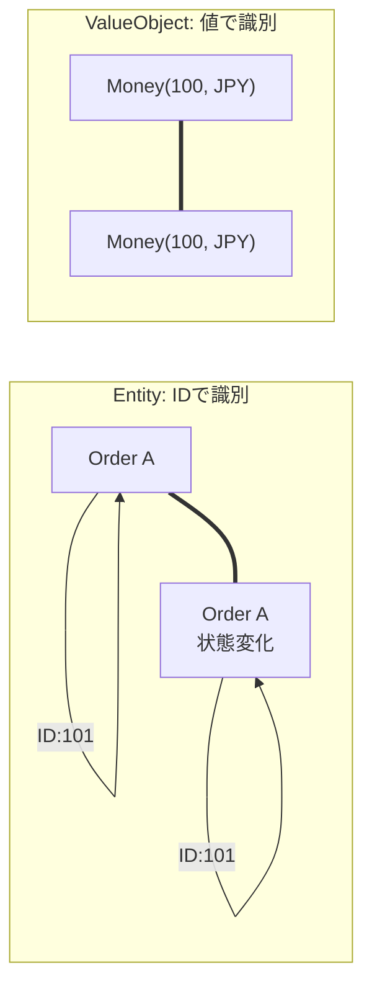
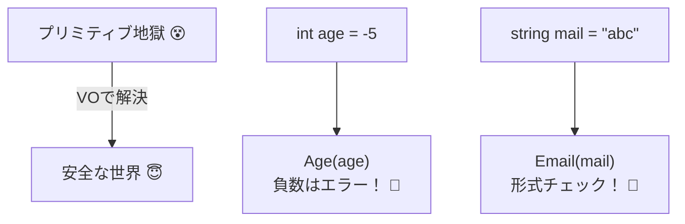
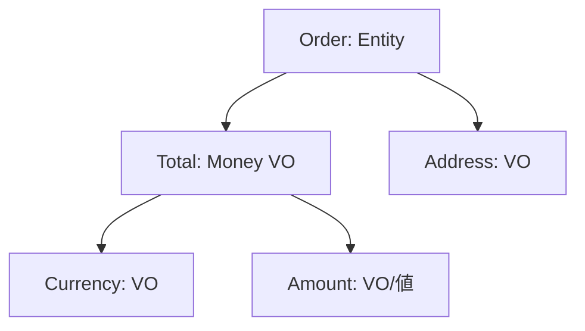

# 第06章：EntityとValueObject（最小でOK）🧩

## 6.0 この章でできるようになること🎯✨

* 「これは Entity？それとも ValueObject？」を迷わず仕分けできるようになる💡
* ValueObject を使って “バグりやすい値” を安全にできる🛡️
* 集約の中で ValueObject が効く理由が腑に落ちる🌳✨

---

## 6.1 まず結論：見分け方は「IDで追うか？」だけでOK👀🆔


### ✅ Entity（エンティティ）

* **IDで追いかける存在**👤
* 中身（名前や住所）が変わっても「同じ人・同じ注文」って言える
* 例：Customer、Order、Payment など🧾💳

### ✅ ValueObject（値オブジェクト）

* **値そのもの**💎
* 「同じ値なら同じもの」＝中身が同じなら等しい
* 例：Money（金額）、Address（住所）、DateRange（期間）など🏠💰📅



---

## 6.2 いちばん大事な違い（表でサクッと）📋✨


| 観点     | Entity👤         | ValueObject💎 |
| ------ | ---------------- | ------------- |
| 同一性の基準 | ID（識別子）🆔        | 値（中身）🧾       |
| 変更     | される（状態が育つ）🌱     | 基本しない（作り直す）🔁 |
| 等価性    | 「IDが同じ？」         | 「値が同じ？」       |
| 目的     | 追跡・履歴・ライフサイクル🕰️ | 安全な値・バグ削減🛡️  |

---

## 6.3 “プリミティブ地獄” を卒業しよう😵➡️😇


いきなり例いくね☕️🍰
カフェ注文でよくあるやつ👇

* 金額：decimal
* 通貨：string
* 住所：string
* 期間：DateTime と DateTime
* 個数：int

これ、最初は書けるけど…
だんだんこうなる😇💥

* 「通貨が混ざる」💱（JPY と USD 足しちゃう）
* 「住所の形式がバラバラ」🏠（郵便番号なし、都道府県抜け、など）
* 「期間の開始＞終了」が混入📅（いつの間にか逆転）
* 「個数が0やマイナス」🧮（気づいたら注文崩壊）



👉 こういう “危ない値” を ValueObject にすると、バグが減る✨🛡️

---

## 6.4 ValueObject の作り方：超ミニマム版（C#）🧩💎

### 6.4.1 ValueObject は「immutable（不変）」が基本🔒✨

* 作ったら中身は変えない
* 変えたいなら “新しく作る” 🔁

C# なら「record」が相性よすぎる💘
そして、今の最新は C# 14（.NET 10世代）だよ🆕✨ ([Microsoft Learn][1])

---

## 6.5 例①：Money（お金）💰✨ 〜バグを減らす最強VO〜


### 💥 ありがちなバグ

* 「-100円」みたいな値が紛れ込む
* 「通貨違いを足す」
* 「小数の丸めが画面とDBでズレる」

### ✅ Money に閉じ込めたいルール

* 金額は 0以上
* 通貨は必須
* 通貨が違うなら足せない

```csharp
using System;

public readonly record struct Money
{
    public decimal Amount { get; }
    public string Currency { get; }

    public Money(decimal amount, string currency)
    {
        if (amount < 0) throw new ArgumentOutOfRangeException(nameof(amount), "金額は0以上だよ💦");
        if (string.IsNullOrWhiteSpace(currency)) throw new ArgumentException("通貨は必須だよ💦", nameof(currency));

        // 例として小数2桁に丸め（通貨ごとの桁数は後で拡張できるよ✨）
        Amount = decimal.Round(amount, 2, MidpointRounding.AwayFromZero);
        Currency = currency.Trim().ToUpperInvariant();
    }

    public static Money Zero(string currency) => new(0m, currency);

    public Money Add(Money other)
    {
        EnsureSameCurrency(other);
        return new Money(Amount + other.Amount, Currency);
    }

    public Money Multiply(int factor)
    {
        if (factor < 0) throw new ArgumentOutOfRangeException(nameof(factor), "個数は0以上だよ💦");
        return new Money(Amount * factor, Currency);
    }

    private void EnsureSameCurrency(Money other)
    {
        if (Currency != other.Currency)
            throw new InvalidOperationException($"通貨が違うよ💥 {Currency} と {other.Currency} は足せない！");
    }

    public override string ToString() => $"{Amount:N2} {Currency}";
}
```

✅ ここが嬉しいポイント🎀

* どこで計算しても「通貨チェック」が必ず入る💱🛡️
* “金額は0以上” ルールが散らからない📌
* テストも超ラク（Money だけをテストすればOK）🧪✨

---

## 6.6 例②：DateRange（期間）📅✨ 〜逆転バグを根絶〜


```csharp
using System;

public readonly record struct DateRange
{
    public DateTime Start { get; }
    public DateTime End { get; }

    public DateRange(DateTime start, DateTime end)
    {
        if (end < start) throw new ArgumentException("期間が逆だよ💦 Start <= End にしてね");
        Start = start;
        End = end;
    }

    public int Days => (End.Date - Start.Date).Days + 1;
}
```

* 「開始日と終了日が逆」みたいな事故が入り込めない🚫✨
* “期間の意味” がコードに出てくる（読みやすい）📖💕

---

## 6.7 例③：Address（住所）🏠✨ 〜文字列1本を卒業〜


住所を string 1本にすると、だいたい地獄になる😇
なので “部品に分ける” が基本だよ🌸

```csharp
using System;

public sealed record Address
{
    public string PostalCode { get; }
    public string Prefecture { get; }
    public string City { get; }
    public string Street { get; }

    private Address(string postalCode, string prefecture, string city, string street)
    {
        PostalCode = postalCode;
        Prefecture = prefecture;
        City = city;
        Street = street;
    }

    public static Address Create(string postalCode, string prefecture, string city, string street)
    {
        if (string.IsNullOrWhiteSpace(postalCode)) throw new ArgumentException("郵便番号が空だよ💦");
        if (string.IsNullOrWhiteSpace(prefecture)) throw new ArgumentException("都道府県が空だよ💦");
        if (string.IsNullOrWhiteSpace(city)) throw new ArgumentException("市区町村が空だよ💦");
        if (string.IsNullOrWhiteSpace(street)) throw new ArgumentException("番地が空だよ💦");

        return new Address(
            postalCode.Trim(),
            prefecture.Trim(),
            city.Trim(),
            street.Trim()
        );
    }

    public override string ToString() => $"{PostalCode} {Prefecture}{City}{Street}";
}
```

---

## 6.8 Entity の作り方：最小でOK👤✨（まずは「IDがある」だけ）


Entity は「IDで追う」だけ覚えたら勝ち🏆

例：注文（Order）☕️🧾

* OrderId がある
* 明細（OrderItem）を追加できる
* 合計金額を出せる（ここで Money が効く！）💰✨

```csharp
using System;
using System.Collections.Generic;
using System.Linq;

public sealed class Order
{
    public Guid Id { get; }
    private readonly List<OrderItem> _items = new();

    public IReadOnlyList<OrderItem> Items => _items;

    public Order(Guid id)
    {
        if (id == Guid.Empty) throw new ArgumentException("Id が空だよ💦");
        Id = id;
    }

    public void AddItem(string productName, Money unitPrice, int quantity)
    {
        if (string.IsNullOrWhiteSpace(productName)) throw new ArgumentException("商品名が空だよ💦");
        if (quantity <= 0) throw new ArgumentOutOfRangeException(nameof(quantity), "個数は1以上だよ💦");

        _items.Add(new OrderItem(productName.Trim(), unitPrice, quantity));
    }

    public Money Total()
    {
        if (_items.Count == 0) return Money.Zero("JPY"); // 例：通貨固定は後で改善でOK✨
        var currency = _items[0].UnitPrice.Currency;

        var sum = Money.Zero(currency);
        foreach (var item in _items)
        {
            sum = sum.Add(item.LineTotal());
        }
        return sum;
    }
}

public readonly record struct OrderItem(string ProductName, Money UnitPrice, int Quantity)
{
    public Money LineTotal() => UnitPrice.Multiply(Quantity);
}
```

✅ ここでのポイント🌟

* Order は Entity（IDで追う）🆔👤
* OrderItem は “値の集合” として ValueObject にしてOK（まずはこれで十分）💎
* 計算は Money に任せると安全💰🛡️

---

## 6.9 集約の中で ValueObject が効く理由🌳✨（超重要！）


集約って「整合性を守るまとまり」だったよね🔒
その “守るべきルール” は、だいたい **値に宿る** の🥺✨

* 金額：マイナス禁止・通貨一致💰
* 期間：逆転禁止📅
* 住所：必要項目が揃ってる🏠

これを ValueObject にすると…

* ルールが散らばらない📌
* 集約ルート（Order）が “本業” に集中できる👑✨
* テストが細かくできる🧪💕



---

## 6.10 先取り：DBに保存するときどうする？（EF Core 10 の今どき事情）🗄️✨


ValueObject をDBに入れるとき、昔は「Owned Types」が多かったけど、今は **Complex types** がかなり推しになってるよ📣✨
EF Core 10 では Complex types が「中に入る・IDを持たない型」を表現する仕組みとして説明されていて、値の比較も “中身で比較” できる（＝ValueObject と相性がいい）って流れになってるよ🧠💎 ([Microsoft Learn][2])

EF Core 10 自体は 2025年11月リリースで、.NET 10 が必要だよ🆕 ([Microsoft Learn][2])

### 例：Address を Complex type としてマッピングするイメージ🏠🧩

```csharp
using Microsoft.EntityFrameworkCore;

protected override void OnModelCreating(ModelBuilder modelBuilder)
{
    modelBuilder.Entity<Order>(b =>
    {
        // 例：注文に配送先住所がある想定
        b.ComplexProperty(o => o.ShippingAddress);
    });
}
```

※ Complex types は「同じ型を複数プロパティで持てる」「値として扱える」など、Owned Typesで起きがちな困りごとを避けられるよ〜、という説明も EF Core 10 のリリースノートにまとまってるよ📝✨ ([Microsoft Learn][2])

---

## 6.11 AI活用コーナー🤖✨（丸投げ禁止の“型”つき）

### 🎀 使い方のコツ

AIにお願いするときは、**目的→制約→例→テスト観点** の順で渡すと失敗が減るよ💡✨

### そのままコピペで使えるプロンプト例🪄

* 「Quantity（個数）の ValueObject を作って。ルールは 1以上、上限は 99。例外メッセージは日本語。等価性は値。ついでに簡単な単体テスト例もつけて」
* 「Money の通貨ごとの小数桁（JPYは0、USDは2）を考慮した丸めを入れたい。設計案を3つ出して、メリット・デメリットも書いて」
* 「Order の AddItem に “同じ商品は数量を加算する” 仕様を入れたい。どこにロジックを置くべき？（Order側？OrderItem側？）理由も」

✅ 生成されたコードは、次の観点だけは必ずチェックしてね🧪✨

* ルールがコンストラクタ or Create に入ってる？🔒
* 例外メッセージが利用者向けに分かる？💬
* 変更が必要なら “作り直し” になってる？🔁

---

## 6.12 練習問題（ワーク）✍️🎀

### ワーク1：Entity / ValueObject 仕分けクイズ🧠✨

次のうち、どれが Entity？どれが ValueObject？（理由も1行で！）

1. 注文（Order）☕️
2. 注文番号（OrderNumber）🔢
3. 金額（Money）💰
4. 顧客（Customer）👤
5. 期間（DateRange）📅
6. 住所（Address）🏠

---

### ワーク2：Money を強化してみよう💪💰

* Currency を “JPY / USD” 以外は弾く（簡易でOK）🚫
* JPY は小数 0 桁、USD は 2 桁で丸める🔧
* Add のときに通貨違いなら分かりやすい例外にする💥

---

### ワーク3：住所入力のバグを潰そう🏠🛡️

* PostalCode を「数字とハイフンだけ」にしてみる（簡易チェックでOK）✂️
* ToString の表示形式を統一する📏✨

---

## 6.13 この章のまとめ（持ち帰り3つ）🎁✨

* **IDで追うなら Entity👤、値そのものなら ValueObject💎**
* ValueObject は「危ない値」を閉じ込めて **整合性バグを減らす**🛡️
* 集約の中で ValueObject を使うと、ルールが散らからず読みやすい🌳✨

---

## 6.14 最新メモ🆕📝（2026-01-27時点）

* 最新LTSは .NET 10（2025-11-11公開）、最新パッチは 10.0.2（2026-01-13）だよ📌 ([Microsoft][3])
* C# は .NET 10世代で C# 14 が最新として案内されてるよ✨ ([Microsoft Learn][1])
* EF Core 10 は 2025年11月リリースで、Complex types が ValueObject と相性いい方向に強化されてるよ🧩💎 ([Microsoft Learn][2])

[1]: https://learn.microsoft.com/ja-jp/dotnet/csharp/whats-new/csharp-14 "C# 14 の新機能 | Microsoft Learn"
[2]: https://learn.microsoft.com/en-us/ef/core/what-is-new/ef-core-10.0/whatsnew "What's New in EF Core 10 | Microsoft Learn"
[3]: https://dotnet.microsoft.com/en-us/platform/support/policy/dotnet-core ".NET and .NET Core official support policy | .NET"
