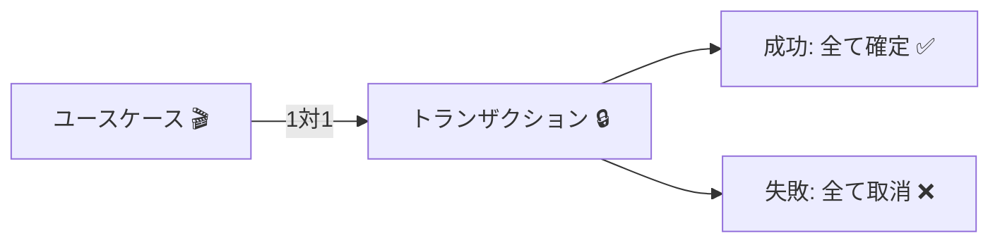
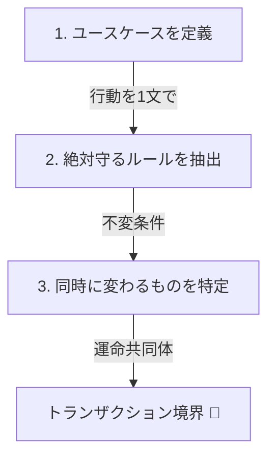
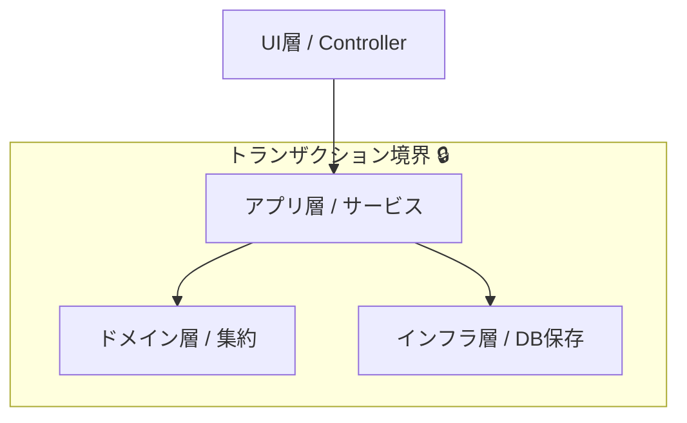

# 第07章：ユースケースと「境界」の関係🎬

## この章でできるようになること🎯✨

* 「ユースケース（ユーザーの1行動）」を言葉でちゃんと切れるようになる👆🗣️
* 「このユースケースで守るべき整合性の範囲＝トランザクション境界」を決められるようになる🧠🔒
* “DBの都合”じゃなくて“業務の都合”で境界を置けるようになる📌💼

---

## 1. ユースケースってなに？（めっちゃ短く）🧁


ユースケースは「ユーザーがやりたい1つの行動」のことだよ👆✨
たとえばカフェアプリならこんな感じ👇☕️

* ✅ 商品をカートに入れる
* ✅ 注文を確定する
* ✅ 支払いを完了する
* ✅ 注文をキャンセルする

ポイントは「画面」じゃなくて「行動」で切ること🎬🧠
同じ画面でも、ボタンが違えばユースケースが違うこともあるよ🙆‍♀️✨

---

## 2. 境界ってなに？（この章の主役）🧱🔒


境界（トランザクション境界）は、ざっくり言うとこう👇

> **そのユースケース中に “必ず同時に守りたい整合性” を、まとめて守る範囲** 🔒✨

そして基本の型はこれ👇（まずはここから！）

## ✅ ルール：1ユースケース＝1トランザクション（基本形）💾✅


* ユースケースが成功したら **全部コミット** ✅
* 失敗したら **全部ロールバック** ❌
* 途中状態を外に漏らさないのが大事🛡️✨

これが “整合性バグを減らす” 最短ルートだよ🚀



---

## 3. ありがちな誤解（先に潰す）⚠️😵

## ❌ 誤解A：境界はDBテーブルで決める


→ **違うよ！** 境界は「業務ルール」で決める🧠📌
テーブル構造は後から変えられるけど、業務ルールはそう簡単に変わらないことが多いの🥺

## ❌ 誤解B：境界＝画面の単位

→ 近いこともあるけど、**一致しないことも多い**🎬💥
「保存」「確定」「支払い」みたいに、ボタンごとにユースケースが分かれることあるよ👆

## ❌ 誤解C：境界は“なるべく大きく”したほうが安全


→ 大きすぎると逆に危ない😇💥

* ロックが長い
* 遅い
* 事故ったときの影響範囲がでかい
* 将来の拡張がしんどい

---

## 4. 「ユースケース」→「境界」を決める3ステップ🧠🪄


## Step1：ユースケースを1文で言う📝

例：「注文を確定する」
→ “ユーザーがやること” を1文にするだけでOK😊✨

## Step2：「この1回で絶対守るルール」を箇条書き✅📋

例（注文確定）：

* 注文が空（商品0件）なら確定できない🧾🚫
* すでに確定済みなら二重確定できない🔁🚫
* 合計金額は明細から計算された値と一致してほしい💰✅

この “絶対守るルール” が **境界の芯** になるよ🔒✨

## Step3：「同時に変わるべきもの」をまとめる📦

例（注文確定）：

* Order の状態が Draft → Submitted になる🚦
* 確定日時が入る🕒
* 合計金額が確定する💰

この “同時に変わるもの” を **1トランザクション** に閉じ込める💾🔒



---

## 5. 例題：カフェ注文で境界を考えてみよう☕️🍰

ここでは、ざっくり登場人物を決めるよ👀✨

* **Order（注文）**：カート〜確定までを管理🧾
* **OrderItem（明細）**：注文の中の行（ラテ、ケーキなど）🍰
* **Payment（支払い）**：支払いの結果（成功/失敗）💳

---

## ユースケース例①：商品をカートに入れる🛒➕

**守りたい整合性（この1回で絶対）** ✅

* 数量は1以上
* 注文が「確定後」なら追加できない

**境界のイメージ** 🔒

* Order（とその中のOrderItem）を更新して保存 → 終わり💾✨
* つまり **Order集約の中だけで完結** しやすい👍

---

## ユースケース例②：注文を確定する🧾✅


**守りたい整合性（この1回で絶対）** ✅

* 明細0件なら確定NG
* 二重確定NG
* 合計金額の確定

**境界のイメージ** 🔒

* Order をロード
* ドメインメソッドで確定
* 保存（SaveChanges）
* ここまでを1回でやる💾✅

---

## ユースケース例③：支払いを完了する💳✅

ここがちょっと難しくなるゾーン😇⚡️
なぜなら、支払いは外部サービス（決済）と絡みやすいから💥

基本の考え👇

* **外部I/O（決済API呼び出し）をトランザクションの中に入れすぎない**🧷⚠️
* DBトランザクションは “短く” が正義⏱️✨

この章ではまず「境界の切り方の感覚」を掴むのがゴールなので、支払いは次の章以降で深掘りしていくよ📘🌸

---

## 6. 「境界はどこに置くの？」超入門の答え🎬🔒

結論：**アプリケーション層（ユースケース側）** に置くのが基本だよ😊✨

イメージ👇

```text
UI(Controller/画面)
   ↓
Application Service（ユースケース）
   ↓   ← ここが「境界」になりやすい！🔒
Domain（集約・不変条件）
   ↓
Infrastructure（Repository/EF Core）
```

Domain（集約）は「業務ルールを守る」ことに集中して、
トランザクション開始/確定（コミット）はユースケース側でやるのがスッキリしやすい🧠✨



---

## 7. C#で「ユースケース＝境界」を感じるミニ実装🛠️💖

## 7.1 ドメイン：Order（超ミニ版）🌳🧾

* **不変条件**を守る責任者＝集約ルート👑
* 外から勝手に壊されないように、更新はメソッド経由にする✋🔒

```csharp
public enum OrderStatus
{
    Draft,
    Submitted
}

public sealed class Order
{
    private readonly List<OrderItem> _items = new();

    public Guid Id { get; }
    public OrderStatus Status { get; private set; } = OrderStatus.Draft;
    public IReadOnlyList<OrderItem> Items => _items;

    public Order(Guid id)
    {
        Id = id;
    }

    public void AddItem(string menuItemName, int quantity, decimal unitPrice)
    {
        if (Status != OrderStatus.Draft)
            throw new InvalidOperationException("確定後は追加できません🥺");

        if (quantity <= 0)
            throw new ArgumentOutOfRangeException(nameof(quantity), "数量は1以上だよ🍰");

        _items.Add(new OrderItem(menuItemName, quantity, unitPrice));
    }

    public void Submit()
    {
        if (Status != OrderStatus.Draft)
            throw new InvalidOperationException("すでに確定済みだよ🔁");

        if (_items.Count == 0)
            throw new InvalidOperationException("商品が0件だと確定できないよ🧾🚫");

        Status = OrderStatus.Submitted;
    }
}

public sealed record OrderItem(string Name, int Quantity, decimal UnitPrice);
```

ここでやってるのは、

* 「確定後は追加できない」
* 「空注文は確定できない」
  みたいな **業務ルールを、Orderの中に閉じ込める** ことだよ🔒✨

---

## 7.2 アプリ層：SubmitOrder（ユースケース＝境界）🎬💾

ここがこの章のメイン！
「注文確定」というユースケースを **1トランザクションで完結** させるよ✅✨

```csharp
public sealed class SubmitOrderService
{
    private readonly IOrderRepository _orders;

    public SubmitOrderService(IOrderRepository orders)
    {
        _orders = orders;
    }

    public async Task SubmitAsync(Guid orderId, CancellationToken ct)
    {
        // 1) 集約を取る（境界の内側）📦
        var order = await _orders.GetAsync(orderId, ct)
            ?? throw new InvalidOperationException("注文が見つからないよ😵");

        // 2) ドメインルールで確定（境界の内側）🔒
        order.Submit();

        // 3) まとめて保存（ここで確定）💾✅
        await _orders.SaveAsync(order, ct);
    }
}
```

> ✅ **この SubmitAsync が “境界の中心”**
> この中で「守るべき整合性」を全部守って、最後に保存する💾✨

---

## 7.3 Repository（雰囲気だけ）🏪🧩

EF Core 10 は .NET 10 が必要で、LTSとして提供されているよ📌✨ ([Microsoft Learn][1])
（この教材では “最新の王道セット” としてこの世代をイメージして進めるよ😊）

```csharp
public interface IOrderRepository
{
    Task<Order?> GetAsync(Guid id, CancellationToken ct);
    Task SaveAsync(Order order, CancellationToken ct);
}
```

※ 実際のEF Core実装（DbContextの具体例）は後の章でガッツリやるよ🧪✨
ここでは「保存の確定が境界の終わり」って感覚が掴めたら勝ち🏆🌸

---

## 8. “境界がズレてる”と何が起きる？（事故のイメージ）🚑💥

## ケース：注文確定の途中で別保存しちゃう😇


* 明細追加を先に保存
* その後、確定処理でコケる
  → 「明細は増えたのに注文は確定してない」みたいな中途半端状態が残る😵‍💫

こういうのが **整合性バグ** だよ🧨
だから **“1ユースケース＝1回で確定”** が効くの✨

---

## 9. 境界を決めるチェックリスト✅🧠

ユースケースごとに、これを自問してみてね👀✨

* ✅ この1回で「絶対守る」業務ルールはどれ？🔒
* ✅ 同時に変わるべきデータは何？📦
* ✅ 途中状態が外に見えたら困る？😵
* ✅ 外部I/O（API呼び出し、メール送信など）を中に入れすぎてない？📮⚠️
* ✅ “今すぐ一致”じゃなくてもよい部分はある？⏳

---

## 10. AI（Copilot/Codex）を使うときの型🤖✨


AIは速いけど、境界の設計は人間の責任だよ👑🔒
なので「AIに任せる場所」を決めて使うのがコツ😊

## 10.1 使えるプロンプト例🧠🪄

**① ユースケースの整理**

```text
カフェ注文ドメインで「注文確定」のユースケースを1文で定義して、
このユースケースで“即時に守る不変条件”を箇条書きで5個出して。
```

**② 1トランザクション実装の雛形**

```text
C#で、Order集約のSubmit()を呼んで保存するSubmitOrderServiceの雛形を作って。
ポイントは「1ユースケース＝1回の保存」で、途中で複数回Saveしないこと。
```

**③ ダメ設計検出**

```text
この処理で境界が大きすぎる/小さすぎる兆候をチェックして、
改善案を3パターン出して。理由もつけて。
```

## 10.2 AIの出力をチェックする観点🔍✅

* 「途中でSaveChangesが複数回」になってない？💥
* 「外部API呼び出しをトランザクション内に入れてない？」⚠️
* 「ドメインがDbContextを触ってない？」🙅‍♀️
* 「不変条件がService側に散らばってない？」😵

---

## 11. 練習問題（3問）✍️🎀

## 問1：この“行動”はユースケースとして切れる？🎬

「カート画面で数量を変えて保存する」

* A. 画面だからユースケースではない
* B. “数量変更”という行動なのでユースケースになりうる

➡️ 答え：**B** ✅（行動で切る！）

---

## 問2：境界に入れるべきものはどれ？🔒

「注文確定」ユースケースで、必ず同時に守りたいのは？

* A. 注文の状態（Draft→Submitted）
* B. 決済会社へのAPI呼び出し
* C. 注文が空じゃないことのチェック

➡️ 答え：**AとC** ✅
Bは外部I/Oなので、入れ方には注意が必要⚠️

---

## 問3：この設計、どこが危ない？🚑

「注文確定処理の途中で、明細を先に保存してから、注文状態を更新して保存してる」

➡️ 答え：**途中状態が残る可能性** があって危ない😵‍💫
“1回で確定”に寄せるのが基本形💾✅

---

## 12. まとめ🌸📌

* ユースケース＝ユーザーの1行動👆🎬
* 境界＝その行動で “絶対守る整合性” を守る範囲🔒✨
* まずは **1ユースケース＝1トランザクション** が基本形💾✅
* 境界は “DB都合” じゃなく “業務都合” で決める🧠📌
* 最新の王道セットとして、.NET 10（LTS）とC# 14が対応関係になっているよ📘✨ ([Microsoft][2])
* Visual Studio 2026 も継続アップデートされているよ🛠️✨ ([Microsoft Learn][3])

[1]: https://learn.microsoft.com/en-us/ef/core/what-is-new/ef-core-10.0/whatsnew?utm_source=chatgpt.com "What's New in EF Core 10"
[2]: https://dotnet.microsoft.com/ja-jp/platform/support/policy/dotnet-core?utm_source=chatgpt.com ".NET および .NET Core の公式サポート ポリシー"
[3]: https://learn.microsoft.com/en-us/visualstudio/releases/2026/release-notes?utm_source=chatgpt.com "Visual Studio 2026 Release Notes"
