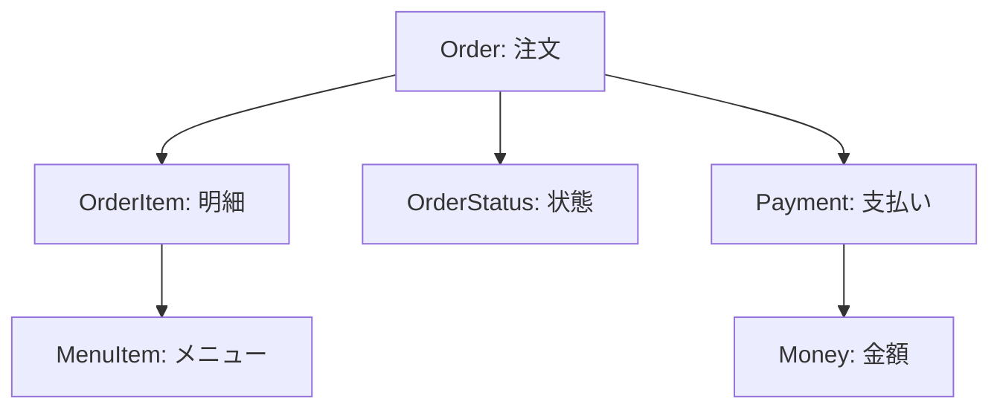
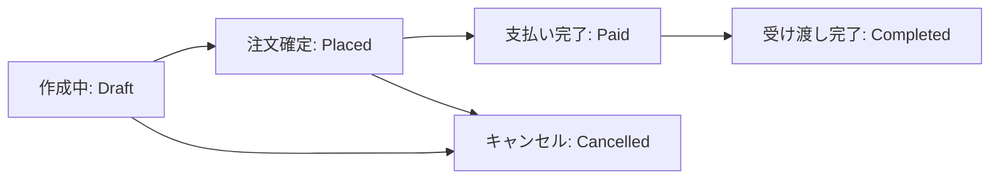
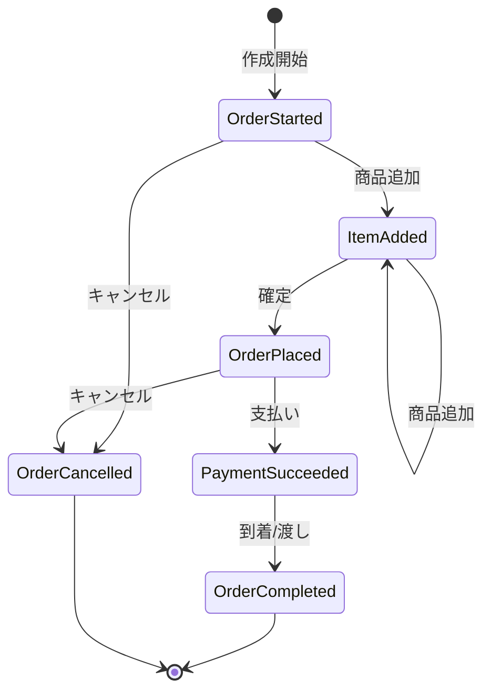

# 第08章：題材ドメイン紹介（カフェ注文）☕️🍰

## 8.1 この章でやること🎯✨

この章は「設計の前に、題材の世界（ドメイン）をちゃんと知る」回だよ〜😊
ここで **カフェ注文**の登場人物・流れ・用語・よくあるルールをそろえて、次章以降で **集約**や**境界**を切る準備をするよ🌸

---

## 8.2 題材の舞台：カフェの注文って、実はイベントだらけ☕️🎬


カフェ注文って、日常っぽいのに **業務ルールがぎゅっと詰まってる**から教材にぴったり🍀

たとえばこんな「起きること」があるよ👇

* 注文を作り始める（まだ確定じゃない）✍️
* 商品を追加する（ラテ、チーズケーキ…）🍰
* オプションを選ぶ（ミルク変更、サイズ変更）🥛
* 注文を確定する✅
* 支払いする（現金/カード/QR）💳📱
* キャンセルする（確定前ならOK？確定後は？）🌀
* 作り始める / できた / 渡した👩‍🍳➡️🙋‍♀️

この「起きること」の粒度が、あとで **集約**や**トランザクション境界**の材料になるよ🧠✨

---

## 8.3 まずは “登場人物（概念）” を出しちゃおう👀🧩


この教材では、最低限こういう概念を使うよ👇（この時点で完璧に決めなくてOK！）

* **Order（注文）**：注文全体のまとまり📦
* **OrderItem（注文明細）**：注文の中の1行（ラテ×1 など）🧾
* **MenuItem（メニュー商品）**：売ってるもの（ラテ、ケーキ）📋
* **Customer（顧客）**：会員かどうか、ポイントなど（今回は軽め）👤
* **Payment（支払い）**：支払い方法・状態・金額💳
* **Money（お金）**：金額＋通貨（今回はJPY固定でOK）💰
* **OrderStatus（注文状態）**：今どの段階？🚦

この章のゴールは「**どんな言葉が必要か**」を並べること。
次の章で「言葉の定義（ユビキタス言語）」をキレイに揃えるよ🗣️🌸



---

## 8.4 注文の流れ（まずは素直に1本）📈✨


教材の基本フローはこれ👇（最小でやるよ！）

1. 注文を作る（Draft）📝
2. 明細を追加/変更する（まだ自由）➕
3. 注文を確定する（Placed）✅
4. 支払いする（Paid）💳
5. 受け渡し完了（Completed）🎁

そして例外として👇も入れるよ

* 確定前キャンセル（Cancelled）🙅‍♀️
* 支払い後キャンセル（Refunded…扱いは後で丁寧に）↩️💸



---

## 8.5 “ありがちな業務ルール” を先に並べよう📋✨（ここが超大事！）


### ルールA：注文の編集できるタイミング🧾🚫

* 注文が **確定（Placed）** したら、明細の追加・変更はできない（原則）✋
* 確定前（Draft）だけ編集OK👌

### ルールB：金額の決まり方💰🧠

* 注文の合計は「明細の合計」から計算する🧮
* **注文時点の価格を保持する**（メニュー価格が後で変わっても、過去の注文は変えない）📌
* 税率や端数処理（四捨五入/切り捨て）をルール化する🧾✨

### ルールC：支払いの扱い💳📱

* 支払い金額は「注文合計」と一致している必要がある✅
* 支払い後にキャンセルするなら、返金が必要になる（＝別の出来事）↩️💸
* 支払い方法ごとに細かい差がある（現金は即確定、カードは処理中がある等）🌀

### ルールD：作る・渡す（オペレーション）👩‍🍳🎁

* 支払いが完了してから作り始める（お店によるけど教材ではこれで統一）👩‍🍳
* できたら「呼び出し番号」などで受け渡し管理する📣🔢

この「ルールのリスト」が、のちの **不変条件（Invariants）** になっていくよ🔐✨
今は「並べるだけ」でOK😊

---

## 8.6 “状態（ステータス）” を決めると一気にラク🚦✨


ここではシンプルにこの5つでいくよ👇

* `Draft`：作成中📝
* `Placed`：注文確定✅
* `Paid`：支払い完了💳
* `Completed`：受け渡し完了🎁
* `Cancelled`：キャンセル🙅‍♀️

ポイントはこれ👇💡
**状態が増えるほど、ルール（できる/できない）が増える**
だから最初は少なく！必要になったら増やす🌱✨

---

## 8.7 “起きた事実（イベント）” っぽく言う練習📣✨


DDDでは「起きたこと」を過去形で言うクセがあるよ〜😊（あとでイベントに繋がる！）

* `OrderStarted`（注文作り始めた）📝
* `ItemAdded`（商品追加した）➕
* `OrderPlaced`（注文確定した）✅
* `PaymentSucceeded`（支払い成功した）💳
* `OrderCompleted`（受け渡し完了した）🎁
* `OrderCancelled`（キャンセルした）🙅‍♀️

この章では「イベント名を出せる」だけで十分✨
次にお章以降で “何を集約の中で守る？” に効いてくるよ🧠🌸



---

## 8.8 ここで “決めること / 決めないこと” を分ける⚖️😊

### ✅ 今決める（この章の成果物）🎀

* 使う言葉（Order / OrderItem / Payment …）🗣️
* 最小の注文フロー（Draft→Placed→Paid→Completed）📈
* ありがちな業務ルール（編集可否、価格保持、支払い一致…）📋
* 状態（ステータス）5つ🚦

### ⏳ まだ決めない（あとでやる）🌱

* どれが **集約** で、どこまでが1トランザクション境界か🧱
* DBテーブル設計・正規化の話🗃️
* 例外処理の最終形（Result型にする？例外？）💬
* 外部決済のリアルな非同期（今回は後半で触る）📡

---

## 8.9 C#で “仮のドメインモデル” を置いてみる（まだ下書き）✍️🧩

> ここは「完成形」じゃなくて、「概念をコードに写す練習」だよ😊
> 次章以降でどんどん直す前提でOK✨

```csharp
public enum OrderStatus
{
    Draft,
    Placed,
    Paid,
    Completed,
    Cancelled
}

public sealed class Order
{
    public Guid Id { get; }
    public OrderStatus Status { get; private set; } = OrderStatus.Draft;

    private readonly List<OrderItem> _items = new();
    public IReadOnlyList<OrderItem> Items => _items;

    public Order(Guid id)
    {
        Id = id;
    }

    public void AddItem(Guid menuItemId, string name, int unitPriceYen, int quantity)
    {
        if (Status != OrderStatus.Draft)
            throw new InvalidOperationException("確定後は明細を編集できません。");

        if (quantity <= 0) throw new ArgumentOutOfRangeException(nameof(quantity));
        if (unitPriceYen < 0) throw new ArgumentOutOfRangeException(nameof(unitPriceYen));

        _items.Add(new OrderItem(menuItemId, name, unitPriceYen, quantity));
    }

    public int TotalYen()
        => _items.Sum(x => x.UnitPriceYen * x.Quantity);

    public void Place()
    {
        if (Status != OrderStatus.Draft)
            throw new InvalidOperationException("注文確定はDraftからのみ可能です。");
        if (_items.Count == 0)
            throw new InvalidOperationException("商品が1つもない注文は確定できません。");

        Status = OrderStatus.Placed;
    }
}

public sealed class OrderItem
{
    public Guid MenuItemId { get; }
    public string Name { get; }
    public int UnitPriceYen { get; }
    public int Quantity { get; }

    public OrderItem(Guid menuItemId, string name, int unitPriceYen, int quantity)
    {
        MenuItemId = menuItemId;
        Name = name;
        UnitPriceYen = unitPriceYen;
        Quantity = quantity;
    }
}
```

このコードの「狙い」はこれ👇✨

* **更新できるタイミング**を `Status` で縛る🚦
* 合計金額は “計算で出す” 🧮
* 価格は OrderItem に保持（注文時点の価格を残す）📌

---

## 8.10 AIに「ありそうなルール」を出させる🤖✨（でも丸呑み禁止！）


AIは “叩き台づくり” が得意だよ〜！
この章では **ルールの洗い出し** に使うのが最高に相性いい😊🌸

### プロンプト①：カフェの業務ルールを広く出す☕️📋

```text
あなたはカフェの業務担当です。
カフェ注文（注文作成→確定→支払い→受け渡し）の業務ルールを
「編集可否」「金額/税/端数」「支払い」「キャンセル/返金」「オペレーション」
のカテゴリに分けて、初心者にも分かる文章で20個出してください。
矛盾しやすい点もあれば注記してください。
```

### プロンプト②：状態ごとの “できる/できない” 表を作る🚦🧾

```text
OrderStatus を Draft / Placed / Paid / Completed / Cancelled とします。
各状態で可能な操作（AddItem, Place, Pay, Complete, Cancel）を表にしてください。
例外（支払い後のキャンセルは返金扱い等）があれば別行で提案してください。
```

### プロンプト③：テスト観点を出してもらう✅🧪

```text
上記ルールに対して、単体テストで確認すべきケースを15個列挙してください。
「正常系」「境界値」「不正操作（例：確定後にAddItem）」に分類してください。
```

AIが出した内容は、**この教材のルールに合わせて削ったり統一したり**してね✂️😊
（次章で “言葉合わせ” をやるから、ここで多少ブレてもOK！）

---

## 8.11 ミニ演習（この章のゴール確認）✍️🌸

### 演習1：用語を10個書き出す🗣️

「カフェ注文で出てくる言葉」を10個書いて、短く説明してみよう😊
例：注文、明細、確定、支払い、返金、受け渡し…✨

### 演習2：ルールを “今すぐ守る/あとで揃えばOK” に分ける⚖️

ルールを10個選んで👇に分類してみよう😊

* **今すぐ守る（同じ操作内で絶対守る）** ✅
* **あとで揃えばOK（最終的整合でも許せる）** ⏳

### 演習3：状態遷移を矢印で描く➡️

`Draft → Placed → Paid → Completed`
`Draft → Cancelled`
をノートに矢印で描いて、各矢印に「何が起きた？」って書いてみてね📣✨

---

## 8.12 2026-01-27時点の “実装に効く最新トピック” だけ、ちょいメモ🧷✨

この教材で後半にEF Coreを触るけど、いまの最新版の流れだけ軽く押さえるよ〜😊

* .NET 10 は 2026-01-13 に更新が出ていて、安定版としては 10.0.2 が配布されてるよ📦✨ ([マイクロソフトサポート][1])
* EF Core 10 は .NET 10 前提の LTS で、2025年11月リリース＆サポートは 2028-11-10 までだよ🛡️ ([Microsoft Learn][2])
* C# 14 も .NET 10 世代の機能がまとまっていて、たとえば field-backed properties など “書きやすさ” 系が増えてるよ🧁✨ ([Microsoft Learn][3])

---

## 8.13 この章のまとめ🎀

* ドメイン紹介は「**言葉・流れ・ルール**」をそろえる回☕️📋
* ルールを先に並べると、後で **集約**や**境界**が切りやすくなる🧱✨
* AIは “ルール洗い出し” に強いけど、教材の前提に合わせて整えるのが大事🤖✂️

次章は、今日出した用語を “辞書化” してズレを潰すよ🗣️🌸

[1]: https://support.microsoft.com/en-us/topic/-net-10-0-update-january-13-2026-64f1e2a4-3eb6-499e-b067-e55852885ad5 ".NET 10.0 Update - January 13, 2026 - Microsoft Support"
[2]: https://learn.microsoft.com/en-us/ef/core/what-is-new/ef-core-10.0/whatsnew "What's New in EF Core 10 | Microsoft Learn"
[3]: https://learn.microsoft.com/en-us/dotnet/core/whats-new/dotnet-10/overview "What's new in .NET 10 | Microsoft Learn"
