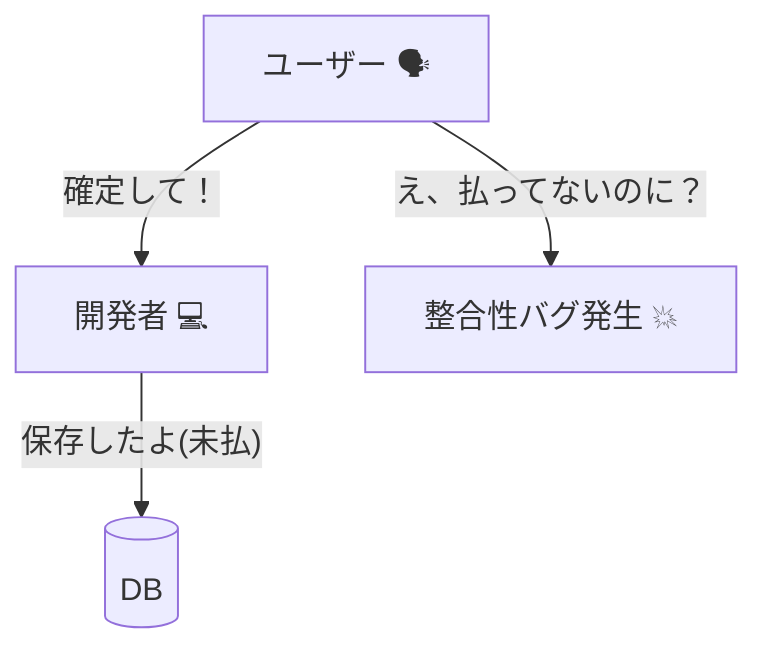
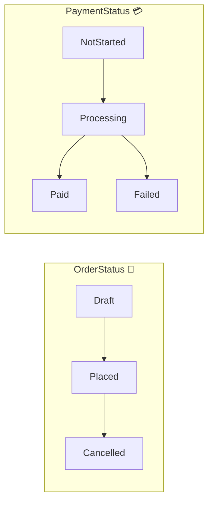

# 第09章：ユビキタス言語（言葉合わせ）🗣️🌸

## 9.1 ユビキタス言語ってなに？📖✨


**ユビキタス言語（Ubiquitous Language）**は、ざっくり言うと👇
**「みんなが同じ意味で同じ言葉を使う」ための“約束”**だよ😊💞

* 仕様書📄・会話🗣️・画面UI🪟・コード💻の **全部で同じ言葉**を使う
* “なんとなく似てる言葉”を混ぜない（ここ超大事）⚠️
* **言葉の定義を短く書いて残す**（辞書にする）📚✨

---

## 9.2 なんで言葉がズレると設計が壊れるの？😵‍💫💥


### 例：カフェ注文で起きがちな「言葉ズレ事故」☕️🍰

たとえば会話で…👇

* 店員さん：「注文、**確定**しました〜」✅
* 別の人：「確定って…**支払い完了**って意味ですよね？」💳
* エンジニア：「確定＝DBに保存しただけ、のつもりでした…」💾😇

この瞬間に起きる悲劇🎭💥

* 「確定したのに支払いできてない」みたいな **状態バグ**が生まれる😱
* 例外・分岐だらけで **読めないコード**になる🌀
* そして最後に「仕様が悪い」「実装が悪い」論争が始まる🔥（不毛）🥲



✅ 解決策：**言葉を“状態”まで含めて定義する**こと！

---

## 9.3 この章のゴール🎯🌸

この章が終わると、次ができるようになるよ✌️✨

* 「注文確定」「支払い完了」みたいな **紛らわしい言葉を分解**できる🧠🔪
* “言葉の辞書（ミニ）”を **1ページで作れる**📖✨
* その辞書を **C#の型・メソッド名に落とせる**💻🎀

---

## 9.4 ユビキタス言語の「3つの鉄則」🧷✨


### 鉄則①：1つの概念に1つの名前🏷️✅

* 同じ意味なのに

  * 「注文確定」
  * 「オーダー完了」
  * 「注文完了」
    みたいに呼ぶのはNG🙅‍♀️💦
    → **どれか1つに統一**！

### 鉄則②：名詞だけじゃなく「動詞」も揃える🏃‍♀️💨

* “注文”という名詞だけ揃ってても、動作がズレると事故る😵

  * 「確定する」って何？保存？ロック？取り消し不可？🤔
    → **動作（コマンド）も言葉にする**🗣️✨

### 鉄則③：「状態」を言葉で持つ🚦🌈

* “いま何中？”が曖昧だと分岐が壊れる😇
  → **状態（Status）をユビキタス言語に含める**のが強い💪✨

---

## 9.5 カフェ注文ドメイン：まず登場人物（概念）を並べよう☕️📦


この教材では、ざっくりこんな世界観で進めるよ😊

* **Order（注文）**：お客さんの注文のまとまり🧾
* **OrderItem（注文明細）**：コーヒー1杯、ケーキ1個みたいな行🍰
* **Payment（支払い）**：支払いの記録💳
* **Customer（客）**：会員でもゲストでもOK👤
* **MenuItem（商品）**：商品マスタ📋

ここで大事なのは👇
**「Order」と「Payment」を同じ言葉でぐちゃぐちゃにしない**こと⚠️💥
（“支払いしたら注文が確定”みたいな言い方が混ざると、設計が破壊されるよ…😇）

---

## 9.6 “注文確定”と“支払い完了”を分けて言語化しよう✅💳


### よくある曖昧ワード：「確定」😵‍💫

「確定」って、人によって意味が違いがち💦
なので、**状態と動作を分けて命名**するのがコツだよ✨

例👇（おすすめの切り方）

* **注文確定（Place Order）**：

  * 明細が確定して、合計金額が確定し、以後は明細変更不可🧾🚫
  * でも、支払いはまだかもしれない💳❓

* **支払い完了（Complete Payment）**：

  * 決済が成功して、支払い状態が「Paid」になる✅💳
  * でも、提供（調理）開始は別かもしれない👩‍🍳🔥

この2つを分けると、UIもコードもすっごく綺麗になるよ🌸✨

---

## 9.7 「辞書（1ページ）」を作ろう📖🫶


### ミニ辞書テンプレ（これだけでOK）📝✨

各用語は、最低これを書けば強い💪

* **用語**（例：注文確定）
* **定義（1〜2行）**（何をしたら“その用語”なの？）
* **同義語NG**（混ぜると危険な言い方）⚠️
* **関連する状態**（例：OrderStatus = Placed）🚦
* **例**（OK例 / NG例を1つずつ）👀

---

## 9.8 カフェ注文：ミニ辞書（サンプル）☕️📖✨

> ✅ ここは“教材の正解例”として、そのまま使ってOKな形にしてあるよ💞

### 注文まわり🧾

* **注文（Order）**：お客さんの注文のまとまり（明細の集合）

  * NG同義語：オーダー情報、買い物カゴ（※状況次第で別概念）⚠️

* **注文明細（OrderItem）**：商品1種類＋数量の1行

  * 例：カフェラテ×2 ☕️☕️

* **注文確定（Place Order）**：明細を固定し、合計を確定し、以後の明細変更を禁止する

  * 関連状態：`OrderStatus = Placed` ✅
  * NG例：「保存しただけ」を注文確定と言う💾❌

### 支払いまわり💳

* **支払い開始（Start Payment）**：決済手段に処理を依頼した状態（まだ成功とは限らない）

  * 関連状態：`PaymentStatus = Processing` ⏳

* **支払い完了（Complete Payment）**：決済が成功し、支払いが成立した状態

  * 関連状態：`PaymentStatus = Paid` ✅

* **支払い失敗（Fail Payment）**：決済が失敗した状態

  * 関連状態：`PaymentStatus = Failed` ❌

### キャンセルまわり🛑

* **注文キャンセル（Cancel Order）**：注文を取り消し扱いにする（提供・決済の状況で可否ルールあり）

  * 関連状態：`OrderStatus = Cancelled` 🛑
  * 注意：返金（Refund）は別用語にするのが安全💰⚠️

---

## 9.9 辞書をC#の名前に落とすコツ💻🎀


### コツ①：クラス名＝名詞、メソッド名＝動詞✨

* 名詞：`Order`, `Payment`, `OrderItem`
* 動詞：`Place()`, `StartPayment()`, `CompletePayment()`

### コツ②：Statusは“言葉そのもの”にする🚦

`Status = 1,2,3` みたいな数字は地獄👻
**状態名をそのままユビキタス言語にする**のが正義✨

```csharp
public enum OrderStatus
{
    Draft,      // まだ確定してない（明細いじれる）
    Placed,     // 注文確定
    Cancelled   // 注文キャンセル
}

public enum PaymentStatus
{
    NotStarted, // 未開始
    Processing, // 支払い中
    Paid,       // 支払い完了
    Failed      // 支払い失敗
}
```



### コツ③：イベントは「起きた事実」を過去形で📣✅

後の章（ドメインイベント）にも繋がるけど、先に“言葉の型”だけ覚えるよ😊

* ✅ `OrderPlaced`（注文が確定した）
* ✅ `PaymentCompleted`（支払いが完了した）
* ❌ `CompletePayment`（これは命令っぽい＝コマンド寄り）

※C# 14 は Visual Studio 2026 / .NET 10 SDK で試せるよ、って公式にも書いてあるよ🧩✨ ([Microsoft Learn][1])

---

## 9.10 “言葉合わせ”の実務ワークフロー（軽量版）🪶🛠️

### ステップ1：曖昧ワードを洗い出す🕵️‍♀️💥

まずはこのへんが事故りがち👇

* 完了✅ / 確定✅ / 承認✅ / 成立✅ / 受付✅
* キャンセル🛑 / 返金💰 / 取り消し🔙

### ステップ2：1ワードにつき「状態＋動作」に分解する🔪✨

例：

* 「注文完了」→ それって

  * 注文確定？
  * 支払い完了？
  * 提供完了？
    どれ？って分解する😊

### ステップ3：辞書に固定して、UIとコードも合わせる🪄📖

* 画面ボタン：「注文確定」
* API/ユースケース名：`PlaceOrder`
* ドメイン：`Order.Place()`
  みたいに **全部同じ言葉の方向**へ寄せる💞

---

## 9.11 AI拡張（Copilot/Codexなど）で“言葉ズレ”を減らす🤖✨


AIは“たたき台作り”が得意だよ😊💪
おすすめの使い方はこれ👇

### 使い方①：候補の辞書を出させる📖✨

* 「カフェ注文ドメインで曖昧になりやすい用語を10個、定義とNG同義語つきで」
  みたいに聞くと、早い💨

### 使い方②：用語の衝突（同義語・別概念）を検出させる🧠🔍

* 「“確定”と“完了”が混ざってない？どこが危険？」
  みたいに突っ込ませると、事故予防になる🛡️✨

### 使い方③：コードの命名レビューに使う💅

* 「この `OrderStatus` の名前、辞書とズレてない？」
* 「`PaymentCompleted` と `CompletePayment` の違い、命名としてどっちが適切？」
  みたいに、**“言葉合わせ視点”でレビュー**させるのが強いよ🌸✨

---

## 9.12 練習問題（ワーク）✍️🎀

### ワーク1：この言葉、何が曖昧？😵‍💫

次の言葉を「状態＋動作」に分解してみてね👇

1. 注文完了
2. 決済完了
3. 受付完了

💡ヒント：

* 注文（Order）
* 支払い（Payment）
* 提供（Fulfillment）
  が混ざってないか見る👀✨

---

### ワーク2：辞書エントリを3つ書こう📖🖊️

次の3つをテンプレで書く👇

* 注文確定
* 支払い開始
* 注文キャンセル

**1つにつき1〜2行の定義**でOKだよ😊🫶

---

### ワーク3：命名のどっちが良い？🏷️✨

次のペアで、ユビキタス言語として良い方を選んで理由も一言✍️

1. `PaymentCompleted` vs `CompletePayment`
2. `OrderPlaced` vs `OrderFinished`
3. `CancelOrder` vs `RemoveOrder`

---

## 9.13 チェックリスト✅🌸

* [ ] 「確定」「完了」みたいな曖昧ワードを放置してない？😇
* [ ] **注文**と**支払い**の言葉が混ざってない？🧾💳
* [ ] 用語の辞書が **1ページで存在**してる？📖✨
* [ ] Status名が「数字」や「謎コード」になってない？👻
* [ ] UIの文言とコードの命名がズレてない？🪟💻

---

## 9.14 ミニまとめ🌸📘

ユビキタス言語は、難しい理論じゃなくて👇
**「言葉のズレでバグを作らないための、超現場テク」**だよ🛡️✨

* 1概念1ワード🏷️
* 動作（コマンド）も揃える🏃‍♀️
* 状態（Status）まで言葉にする🚦

そして、C# 14 は Visual Studio 2026 / .NET 10 SDK で試せる流れになってるよ🧩✨（最新の .NET 10 系が提供されてるよ） ([Microsoft Learn][1])

[1]: https://learn.microsoft.com/en-us/dotnet/csharp/whats-new/csharp-14?utm_source=chatgpt.com "What's new in C# 14"
