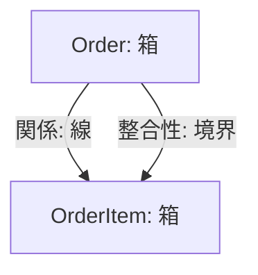
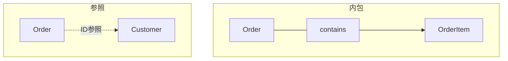
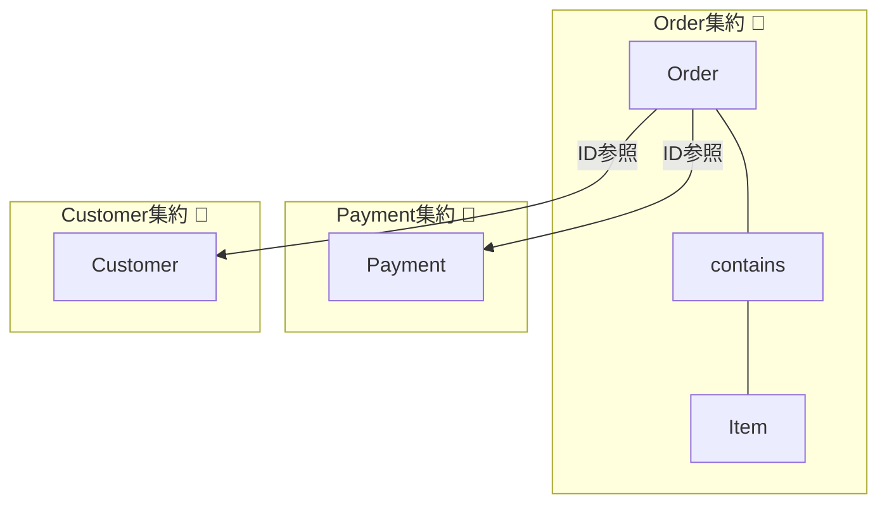

# 第10章：最初のモデル図を描こう📦➡️

## この章でできるようになること🎯✨

* ドメインを「箱（概念）＋線（関係）」でシンプルに描ける🧩
* 「どれが一緒に更新される？」に注目して、集約の“候補”を置ける🌳
* いきなりUMLガチ勢にならず、設計の会話ができる“たたき台”が作れる🗣️🌸

---

## 1) モデル図ってなに？（今日のゴール）🗺️


モデル図は、**業務の世界を、コードに落とす前に整理するための地図**だよ🧠✨
ここで大事なのは「正確な図法」じゃなくて、次の会話ができること！

* どんな概念がいる？（箱）📦
* どう関係する？（線）🔗
* **どこまで一緒に更新する？**（ここが一番大事）👀🔒



> ※この教材は C# 14 / .NET 10 / Visual Studio 2026 の最新世代を前提に進めるよ（この世代で試せることが公式に示されてるよ）([Microsoft Learn][1])

---

## 2) 今日の題材：カフェ注文ドメイン☕️🍰

登場人物（概念）の例はこんな感じ👇（第8〜9章の用語を使うよ🗣️）

* Order（注文）🧾
* OrderItem（注文明細）🥐
* Customer（顧客）👤
* Payment（支払い）💳
* Product / MenuItem（商品）🍩
* Coupon（クーポン）🎟️
* Store（店舗）🏪

この章では「全部決め切る」じゃなくて、**まず描いて、迷ったらメモして先に進む**のがコツだよ✌️😇

---

## 3) まずは“名詞”を箱にする📦🖊️

### 3-1. 名詞リストを作る（最短ルート）📝

ユビキタス言語（第9章）から、**名詞だけ**拾ってみよう✨
例：

* 注文 / 明細 / 支払い / 顧客 / 商品 / 店舗 / クーポン …

ここでのポイントは👇

* 似てる言葉は並べておく（あとで統合できる）🔁
* 迷う言葉は「？」付きで残す（消さない）❓

### 3-2. 箱の中に“ひとこと役割”を書く🧠

箱を描いたら、1行で役割を書くと一気に分かりやすくなるよ😊

* Order：注文全体の状態と合計金額を持つ🧾
* OrderItem：注文の中の1品（商品・数量・単価）🥐
* Payment：支払いの状態（未払い/支払い中/完了/失敗）💳

> コツ：説明が3行以上になる箱は「大きすぎ」か「まだ言葉が曖昧」かも😵

---

## 4) 線を引く：関係は3種類だけ覚える🔗✨


難しい線は要らない！まずはこの3つだけでOK🙆‍♀️🌸

### A. 内包（注文の中に明細が入る）📦➡️📦

* Order ─ contains → OrderItem
  → 「注文が消えたら明細も消える」みたいな親子関係👨‍👧‍👦

### B. 参照（IDでつながる）🆔

* Order ─ references → Customer（CustomerId）
* Order ─ references → Payment（PaymentId）
  → “別のまとまり”っぽいものは、まず **ID参照**にしておくと安全🔒✨
  （集約どうしをオブジェクト参照で絡めると、同一トランザクションで触りたくなって危険…っていう考え方が有名だよ）([インフォーミット][2])

### C. ただの関連（把握だけしておく）👀

* Store と Order は関係あるけど、更新を一緒にするかはまだ決めない
  → 線は引くけど、**境界は保留**でOK🙆‍♀️



---

## 5) 今日の主役：「更新される単位」を探す👀🔒

ここからがこの章のいちばんおいしいところ🍰✨
モデル図を「集約候補の地図」に変える質問はこれ👇

### ✅ 質問1：この2つは“同時に”更新される？⏱️

例：

* 注文確定（OrderのStatus変更）と、明細追加（OrderItem追加）は同時に？🤔

  * たいてい「同時」が自然 → 同じ集約候補になりやすい🌳

### ✅ 質問2：片方だけ成功しても困る？（全部成功 or 全部失敗）💥

例：

* 「注文の合計金額」だけ更新されて「明細が追加されてない」
  → これは困る😵 → 同じトランザクションで守りたい → 同じ集約候補✨

### ✅ 質問3：別チーム/別機能で育つ？（ライフサイクルが別）🌱

例：

* Customer（顧客）は、注文とは別のタイミングで更新されがち
  → 別集約候補になりやすい👤✨

---

## 6) 集約の“候補”をふわっと置いてみる🌳🧸


ここでは「確定」じゃなくて「候補」だよ！✌️

### 候補A：Order 集約🌳🧾

* ルート（入口）候補：Order
* 内側に入りそう：OrderItem / Coupon（適用結果）
* 外はID参照にしそう：CustomerId / PaymentId / StoreId

理由（初心者の鉄板）👇

* 注文の整合性（合計金額、確定後の編集禁止など）を **1回で守りたい**🔒✨

### 候補B：Payment 集約🌳💳

* ルート候補：Payment
* 外はID参照：OrderId

理由👇

* 支払いは外部サービスや失敗・再試行が絡むことが多く、注文と同じ塊にすると巨大化しがち😵‍💫
* 状態遷移が独立しやすい（支払い中→成功/失敗）🚦

### 候補C：Customer 集約🌳👤

* ルート候補：Customer
* 外はID参照：CustomerIdがOrderに入る

理由👇

* 顧客情報の更新（住所・名前など）は注文操作とは別に起きることが多い🏠📝



---

## 7) “ざっくりモデル図”の例（文字で表現）🖼️✨

紙でもホワイトボードでも同じ！まずはこの粒度を目指そう😊

```text
[Order] 1 --- contains ---> * [OrderItem]
  |
  | references (by ID)
  +--> [Customer]   (CustomerId)
  +--> [Payment]    (PaymentId)
  +--> [Store]      (StoreId)

集約候補：
- Order Aggregate: Order + OrderItem (+ CouponApplied?)
- Payment Aggregate: Payment
- Customer Aggregate: Customer
```

> 「参照はIDで」ってルールは、集約境界を守りやすくする定番の考え方だよ([インフォーミット][2])

---

## 8) C#の“骨組み”にしてみる（まだ薄くてOK）🦴✨

この章は「モデル図」なので、コードは薄味でOK！
でも、**箱→クラス**に一回変換すると理解が固定されるよ🧠

### 8-1. IDと状態だけ置く例🧾💳

```csharp
public sealed class Order
{
    public Guid OrderId { get; }
    public Guid CustomerId { get; }   // 他集約はID参照
    public Guid? PaymentId { get; private set; }

    private readonly List<OrderItem> _items = new();
    public IReadOnlyList<OrderItem> Items => _items;

    public OrderStatus Status { get; private set; }

    public Order(Guid orderId, Guid customerId)
    {
        OrderId = orderId;
        CustomerId = customerId;
        Status = OrderStatus.Draft;
    }
}

public sealed class OrderItem
{
    public Guid ProductId { get; }
    public int Quantity { get; }

    public OrderItem(Guid productId, int quantity)
    {
        ProductId = productId;
        Quantity = quantity;
    }
}

public enum OrderStatus
{
    Draft,
    Confirmed,
    Cancelled
}
```

ポイント👇

* 他の箱（Customer, Payment）を **オブジェクトで持たない**（まずはIDで）🆔✨
* OrderItem は Order の内側っぽい（contains）📦
* Status は後の「状態遷移」につながる🚦

---

## 9) AIに手伝ってもらう（丸投げ禁止の型）🤖✨

AIはめっちゃ便利だけど、設計は「理由」が命！🔥
おすすめは **出力を“比較用の案”として使う**ことだよ😊

### 9-1. 概念の洗い出し（名詞）🧠

```text
カフェ注文ドメインです。
「注文〜支払い〜受け取り」までの流れで、登場しそうな名詞（概念）を20個、
それぞれ1行で役割も書いて。
その後、似ている概念を統合する候補も出して。
```

### 9-2. 集約候補を3案出させる🌳

```text
次の概念があります：Order, OrderItem, Payment, Customer, Store, Coupon, Product。
「更新される単位」に注目して、Aggregate候補を3パターン提案して。
各案について、同時に守るべきルール（不変条件）の例も3つずつ書いて。
```

### 9-3. 反証させる（これ超大事）⚔️

```text
あなたが出したAggregate案の弱点を、最悪ケースで指摘して。
「巨大化」「跨ぎ更新」「将来の変更しづらさ」の観点で反論して。
```

---

## 10) よくある失敗あるある😅💥（先に潰す！）

* **DBのテーブル図**になっちゃう（正規化の話に吸われる）🌀
  → まずは「業務の言葉」「更新単位」だよ👀
* 線を引きすぎてスパゲッティ🍝
  → 線は“関係がある”くらいでOK、境界は保留でいい🙆‍♀️
* 1つの箱に全部入れて「巨大集約」になりそう😱
  → 「ライフサイクルが別」なら分ける候補✨

---

## 11) ミニ課題🎒✨（15〜30分でOK）

### 課題A：モデル図を1枚描こう🖊️

1. 名詞を10個書く
2. 箱にして1行役割を書く
3. contains と ID参照だけで線を引く
4. 「更新単位」で集約候補を丸で囲む🌳

### 課題B：答え合わせ質問（自分に聞く）✅

* 「注文確定」と「明細追加」は同時に守りたい？⏱️
* 「支払い失敗」は注文と同じ塊で扱うと苦しくない？💳
* Customer は注文操作と同じタイミングで頻繁に更新する？👤

---

## まとめ🌸📌

* モデル図は「箱と線」でOK！大事なのは **更新単位に注目すること**👀🔒
* まずは **集約候補**でいい（確定は次章以降で磨く）🌳✨
* 他のまとまりは **ID参照**を基本にすると、境界が守りやすい🆔🛡️([インフォーミット][2])

[1]: https://learn.microsoft.com/en-us/dotnet/csharp/whats-new/csharp-14?utm_source=chatgpt.com "What's new in C# 14"
[2]: https://www.informit.com/articles/article.aspx?p=2020371&seqNum=4&utm_source=chatgpt.com "Rule: Reference Other Aggregates by Identity"
