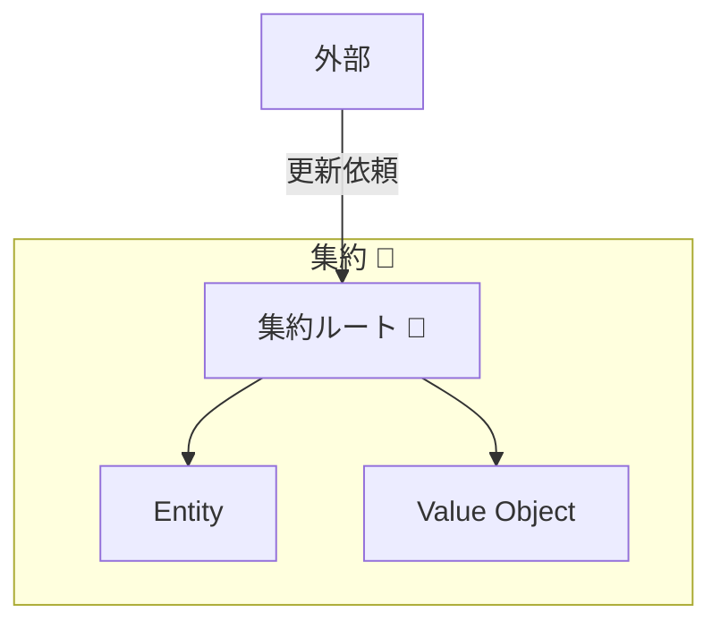
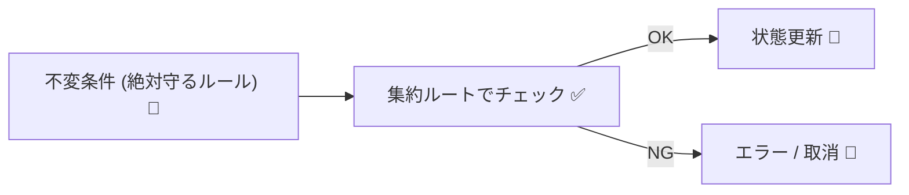
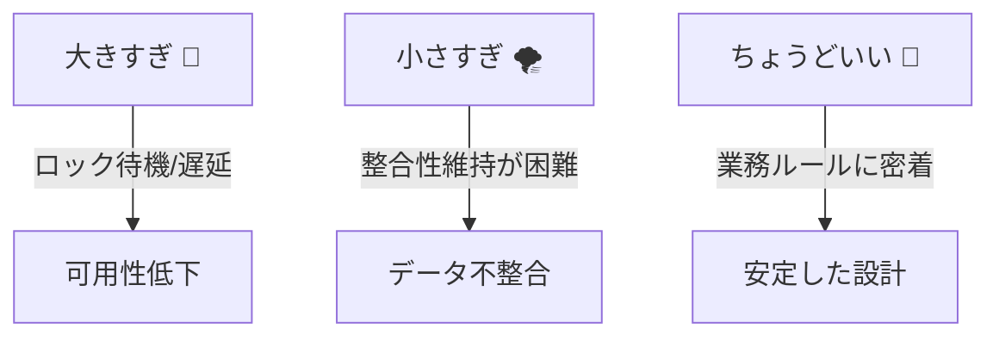

# 第11章：集約（Aggregate）ってなに？🌳

## この章でできるようになること🎯✨

* 「集約＝なにを守る“まとまり”なのか」を説明できる🗣️🌸
* ありがちな“整合性バグ”を、集約の考え方で減らせるイメージが持てる🛡️
* カフェ注文ドメインで「Order集約」の形がざっくり描ける☕️📦

---

## 11.1 集約を一言でいうと？🌳✨


集約（Aggregate）は、**“同時に守りたいルール（不変条件）を、ひとまとめにして守るための単位”**だよ😊🔒

もう少し噛み砕くと…👇

* **集約＝「整合性を守るための、安全なまとまり」**🛡️
* 集約の中には、**EntityやValue Object**が入ってることが多い🧩
* 集約の外からは、基本的に **集約ルート（入口）** を通してしか更新しない（次章で詳しく！）👑🚪



---

## 11.2 なぜ集約が必要なの？🛡️😵‍💫


設計に慣れてないと、こんな事故が起きがち👇💥

## ありがち整合性バグあるある😇💣

* 注文確定後なのに、明細が追加できちゃう🧾➕😱
* 合計金額が、明細の合計とズレる💰≠🧾
* 在庫がマイナスになる📦➡️📉
* 二重クリックで同じ処理が2回走って、二重注文になる👆👆💥

## 集約があると何が嬉しい？🎁✨

* **ルールを守る場所が1つにまとまる**📌（散らからない！）
* 更新の入口が絞られて **“勝手に壊される”** を防げる🔐
* 「どこまでを一回（トランザクション）で守る？」の境界が作れる🧱

---

## 11.3 集約が守るもの：不変条件（Invariants）🔒📌


集約の中心テーマはこれ👇

> **不変条件＝絶対に破ってはいけない業務ルール**✅🔒

たとえばカフェ注文なら…☕️

* 注文が **確定済み** なら、明細を追加できない🧾🚫
* 明細が0件の注文は確定できない🈚️🚫
* 合計金額は **明細の合計から計算される**（手で書き換え禁止）🧮🔒

ここで超大事ポイント👇🌟
**不変条件は「いろんなクラスに散らす」と破綻しやすい**😵‍💫
だから **“集約という箱”** に入れて、入口でまとめて守るのが強いんだ〜📦🛡️



---

## 11.4 「集約＝DBテーブル」じゃないよ！⚠️🗃️


初心者がやりがちな誤解トップ👇😇

## ❌ よくある誤解

* 「Orderテーブルがある」→「じゃあOrder集約だね！」
* 「親子関係がある」→「全部1つの集約に入れよ！」

## ✅ 正しい見方

* 集約は **DB都合じゃなく、業務ルール都合** で決める🧠✨
* 「一回で守りたいルール」が同じ範囲が集約になりやすい🔒
* 親子でも、**同時に守る必要がないなら分ける**ことがある⚖️

---

## 11.5 集約は“大きいほど良い”じゃない⚠️📏


これ、めちゃ大事🫶✨

## 大きすぎ集約の地獄🔥

* 変更が遅い（ロック範囲が広い）🐢💥
* ちょっと更新でも全部読み書きが必要になりがち📚💾
* いろんなルールが混ざって、理解がむずい😵‍💫

## 小さすぎ集約の地獄🌪️

* すぐ「複数集約を同時更新したい！」が発生🙅‍♀️
* トランザクションが巨大化して破綻しやすい💥🔒

だから狙いはこれ👇
**「守るべき不変条件が自然にまとまる、ちょうどいいサイズ」**🎯🌳



---

## 11.6 例：カフェ注文で“集約”を作ってみよう☕️📦


ここでは題材として「Order（注文）」を考えるよ😊

## 登場人物（ざっくり）👀

* **Order**：注文（集約ルート候補）📦
* **OrderItem**：注文明細🧾
* **Money**：金額（VO候補）💰
* **OrderStatus**：状態（Draft / Confirmed など）🚦

## まず「守りたいルール」を並べる📋✨

例としてこんなルールがあるとするね👇

1. Draft（編集中）のときだけ、明細を追加・削除できる🧾➕➖
2. Confirmed（確定）したら、明細を触れない🧾🚫
3. 合計金額は、明細の合計から計算される（直接書換え不可）🧮🔒
4. 明細0件では確定できない🈚️🚫

この「1〜4」を **同時に守る** なら、Order と OrderItem は同じ集約に入りやすい🌳✨

---

## 11.7 C#で“最小の集約”を書いてみる🛠️🌸


ポイントはこれ👇

* **外から勝手に状態を壊せない**ようにする🔐
* **更新はメソッド経由**に閉じ込める✋
* メソッドの中で **不変条件をチェック**する✅

## 例：Money（Value Objectっぽい）💰

```csharp
public readonly record struct Money(decimal Amount)
{
    public static Money Zero => new(0m);

    public Money
    {
        if (Amount < 0m) throw new ArgumentOutOfRangeException(nameof(Amount), "金額はマイナス不可だよ😇");
    }

    public static Money operator +(Money a, Money b) => new(a.Amount + b.Amount);
    public override string ToString() => Amount.ToString("0.##");
}
```

## 例：OrderItem（Entityっぽい）🧾

```csharp
public sealed class OrderItem
{
    public Guid Id { get; }
    public string ProductName { get; private set; }
    public int Quantity { get; private set; }
    public Money UnitPrice { get; private set; }

    public Money LineTotal => new(UnitPrice.Amount * Quantity);

    public OrderItem(Guid id, string productName, int quantity, Money unitPrice)
    {
        if (string.IsNullOrWhiteSpace(productName)) throw new ArgumentException("商品名が空だよ😇", nameof(productName));
        if (quantity <= 0) throw new ArgumentOutOfRangeException(nameof(quantity), "数量は1以上だよ😇");

        Id = id;
        ProductName = productName;
        Quantity = quantity;
        UnitPrice = unitPrice;
    }

    public void ChangeQuantity(int quantity)
    {
        if (quantity <= 0) throw new ArgumentOutOfRangeException(nameof(quantity), "数量は1以上だよ😇");
        Quantity = quantity;
    }
}
```

## 例：Order（集約ルート候補）📦👑

```csharp
public enum OrderStatus
{
    Draft = 0,
    Confirmed = 1
}

public sealed class Order
{
    private readonly List<OrderItem> _items = new();

    public Guid Id { get; }
    public OrderStatus Status { get; private set; } = OrderStatus.Draft;

    // 外から List をいじれないように、読み取り専用で返すよ🔒
    public IReadOnlyList<OrderItem> Items => _items;

    public Money Total => _items.Aggregate(Money.Zero, (acc, item) => acc + item.LineTotal);

    public Order(Guid id)
    {
        Id = id;
    }

    public void AddItem(string productName, int quantity, Money unitPrice)
    {
        EnsureDraft();

        // 例：同じ商品はまとめる、みたいなルールもここに置けるよ😊
        var newItem = new OrderItem(Guid.NewGuid(), productName, quantity, unitPrice);
        _items.Add(newItem);
    }

    public void RemoveItem(Guid orderItemId)
    {
        EnsureDraft();

        var target = _items.SingleOrDefault(x => x.Id == orderItemId);
        if (target is null) throw new InvalidOperationException("その明細は存在しないよ😇");
        _items.Remove(target);
    }

    public void Confirm()
    {
        EnsureDraft();

        if (_items.Count == 0)
            throw new InvalidOperationException("明細0件の注文は確定できないよ😇🧾🚫");

        Status = OrderStatus.Confirmed;
    }

    private void EnsureDraft()
    {
        if (Status != OrderStatus.Draft)
            throw new InvalidOperationException("確定後は変更できないよ😇🔒");
    }
}
```

## ここが「集約っぽさ」ポイントだよ🌳✨

* `Order.Items` は **読み取り専用**（外からAdd/Removeできない）🔒
* 変更は `AddItem` / `RemoveItem` / `Confirm` だけ✋
* その中で `EnsureDraft()` が **不変条件をガード**してる🛡️

---

## 11.8 集約を切るときのミニ判断軸🧠⚖️

この章では、まずこの3つだけ覚えたらOK🙆‍♀️🌸

1. **同時に守る必要があるルールはどれ？**（同一トランザクションで守る？）🔒
2. **外から勝手に壊せない入口がある？**（更新はメソッドに閉じ込めた？）🚪
3. **大きくしすぎてない？**（毎回全部読み書きしてない？）📏

---

## 11.9 AIに手伝わせるコツ🤖✨（丸投げ禁止だよ😇）


AI拡張はめっちゃ便利！でも「設計の判断」を丸投げすると事故るので、使い方を型にしよ〜🧠✨

## ✅ いい聞き方（根拠を出させる）📝

* 「この業務ルールを **不変条件** に分類して、Order集約で守るべきものを理由つきで列挙して」
* 「Order集約に入れるEntity/VO候補を3案出して、メリデメも書いて」
* 「AddItem/Confirm に必要なガード条件を、抜け漏れチェックして」

## ❌ ダメな聞き方（危ない）⚠️

* 「DDDでいい感じに実装して」😇💥
* 「集約設計ぜんぶ決めてコード書いて」😇💥

---

## 11.10 ひとことクイズ🧠🎀

Q1️⃣ 集約は「何のため」にある？

* A) DBのテーブルを整理するため
* B) 同時に守る業務ルール（不変条件）をまとめて守るため

Q2️⃣ 集約が大きすぎると何が起きやすい？

* A) 更新が重くなり、衝突や変更コストが増えやすい
* B) バグがゼロになる

（答え：Q1=B、Q2=A）✅✨

---

## 11.11 ミニ課題（手を動かす）✍️☕️

## 課題A：ルール追加してみよう🧾✨

Orderに次のルールを追加してね👇

* 「1つの注文明細の数量は最大10まで」🔟🚫
* 「確定時、合計が0円なら確定できない」💰0🚫

👉 どのメソッドに、どんなガードを書く？を考えて実装してみよう😊

## 課題B：集約の境界を悩んでみよう🧠

次の要素は、Order集約に入れる？入れない？理由も書いてね👇

* Customer（顧客）👤
* Payment（支払い）💳
* Coupon（クーポン）🎟️

---

## 11.12 2026の“今どきメモ”📌✨（超短く！）

この教材で使う最新世代のC#は **C# 14（.NET 10対応）** が中心だよ📘✨（Visual Studio 2026 で試せるよ） 。([Microsoft Learn][1])
EF Core も **EF Core 10（.NET 10が必要）** が同世代で、LTS扱いとして案内されてるよ🧪📦。([Microsoft Learn][2])
Visual Studio 2026 は 2026年1月のリリースノート更新も出てる（例：2026-01-20の18.2.1）よ🪟🛠️。([Microsoft Learn][3])
.NET は毎年11月にメジャーが出て、LTS/STSのサポート方針が公式に整理されてるよ📅🔧。([Microsoft][4])

---

## まとめ🌳✨

* 集約は **不変条件（絶対守る業務ルール）をまとめて守る単位**🔒
* 入口を絞って、**勝手に壊されない設計**にするのがコツ🔐
* 大きすぎても小さすぎても地獄なので、**「同時に守る必要」**で決める🧠⚖️

---

## 次章予告👑🚪✨

次は **「集約ルート（入口は1つ）」**！
「外からはルート経由でしか更新できない」の意味を、もっとハッキリ形にしていくよ〜😊🌸

[1]: https://learn.microsoft.com/en-us/dotnet/csharp/whats-new/csharp-14?utm_source=chatgpt.com "What's new in C# 14"
[2]: https://learn.microsoft.com/en-us/ef/core/what-is-new/ef-core-10.0/whatsnew?utm_source=chatgpt.com "What's New in EF Core 10"
[3]: https://learn.microsoft.com/en-us/visualstudio/releases/2026/release-notes?utm_source=chatgpt.com "Visual Studio 2026 Release Notes"
[4]: https://dotnet.microsoft.com/en-us/platform/support/policy?utm_source=chatgpt.com "The official .NET support policy"
