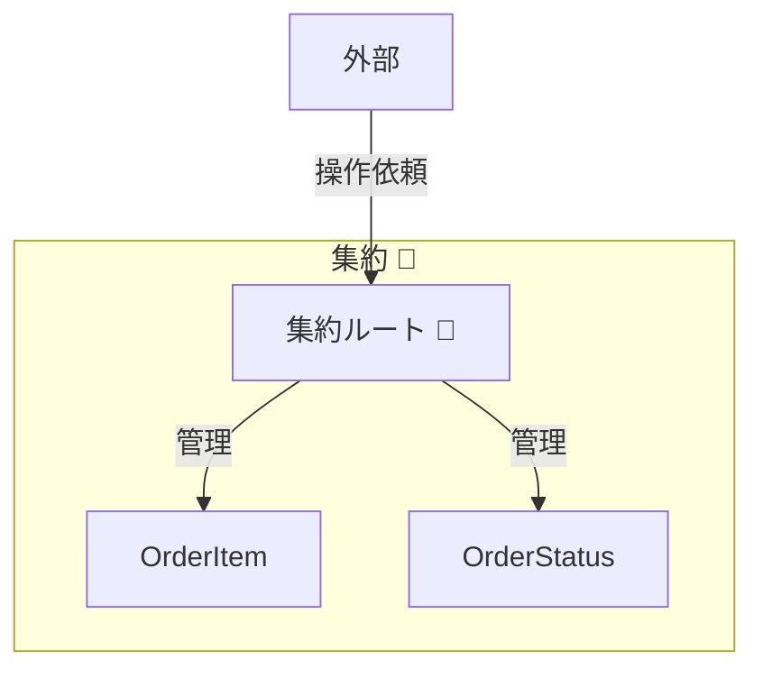
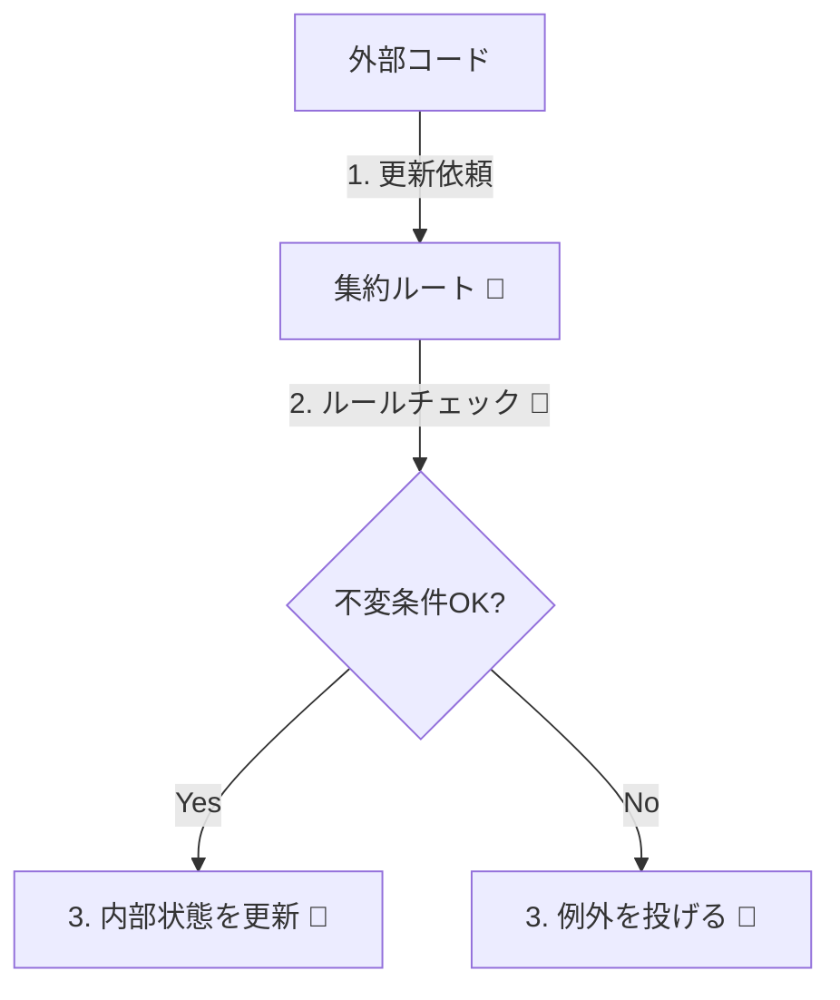
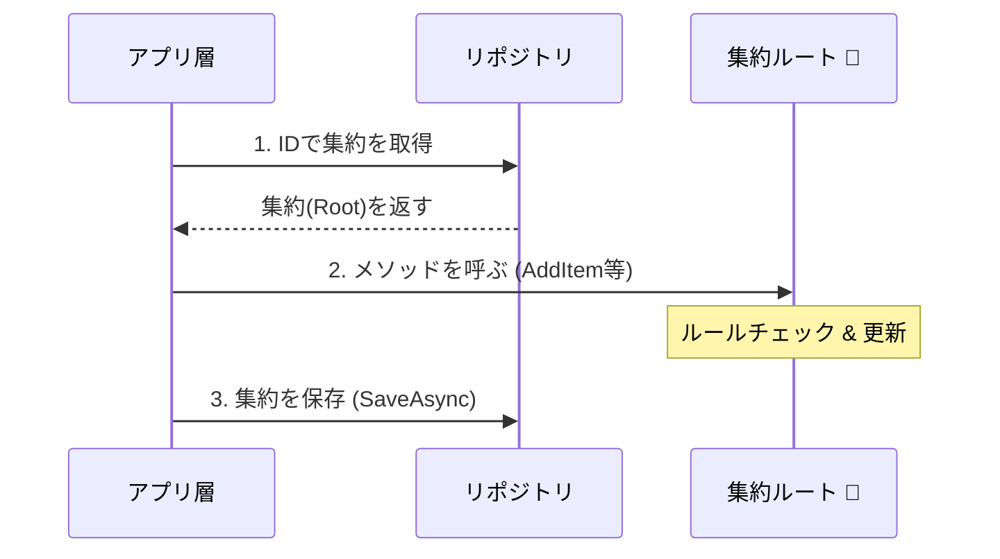

# 第12章：集約ルート（入口は1つ）👑🚪

## 12.1 この章でできるようになること🎯✨

この章のゴールはこれ👇
**「集約は“入口（ルート）を1つ”にして、更新をそこに集める」**を、C#で手を動かしながら体に染み込ませることです💪😊

できるようになること👇

* ✅ 「外から触っていいのはココだけ！」という**入口**を作れる
* ✅ 集約の**ルール（不変条件）**をルートに集めて守れる🔐
* ✅ “勝手に壊されない”安全なモデルになる🛡️✨

---

## 12.2 集約ルートってなに？👑（超やさしく）


**集約（Aggregate）**は「整合性（ルール）を守るためのまとまり」でした🌳
その中で、**集約ルート（Aggregate Root）**は…

> **外部からの“入口”になる代表者** 👑🚪
> 外からの更新は、必ずこの人を通す！

* **Order（注文）** ← これが集約ルート👑



イメージ👇（カフェ注文の例☕️）

* **Order（注文）** ← これが集約ルート👑

  * OrderItem（注文明細）
  * 料金や数量などのルール
  * 状態（未確定／確定…）

外側のコードは **OrderItem を直接いじらない** 🙅‍♀️
**Order のメソッド経由だけ**で更新します✅

---

## 12.3 なぜ「入口は1つ」がそんなに大事？🤔💡


### ① ルールが散らばると、すぐ破綻する😵‍💫

例えば「注文確定後は明細を追加できない」ってルールがあるのに…

* ある場所では `order.Confirm()` を通して守ってる
* 別の場所では `order.Items.Add(...)` で勝手に追加できちゃう

こうなると、**ルールが“たまたま守られる”だけ**になって事故ります🚑💥

不変条件（Invariants）は「必ず守るルール」🔐
**ルートが責任を持つ**と決めると、設計が一気に安定します😊



### ③ 変更点が追いやすくなる👀✨

更新がルートに集まると👇

* バグ調査が楽
* テストが楽
* 将来の仕様変更も楽

「入口は1つ」は、**未来の自分を助ける魔法**です🧙‍♀️✨

---

## 12.4 ルール3つだけ覚えよう📌（集約ルートの鉄板）

### ルールA：外からの更新は “必ずルート経由” 🚪✅

* 外部コードが `OrderItem` を直接 `set` したり `List.Add` したりしない🙅‍♀️
* 代わりに `order.AddItem(...)` みたいな **ルートのメソッド**を呼ぶ✨

### ルールB：子（内部）は外に “丸出し” にしない🫣🚫

* `public List<OrderItem> Items { get; set; }` ← これは危険⚠️
* 外に出すなら `IReadOnlyCollection` など “読めるだけ” にする📖

### ルールC：ルートが “ルールを守らせる” 🔐👑

* ルートのメソッドの中で

  * ガード節（早めに弾く）
  * 状態チェック
  * 数量・金額チェック
    を行って、**壊れない更新だけ通す**✨

---

## 12.5 例題ドメイン（カフェ注文）☕️🍰

### 登場人物🧑‍🍳

* **Order**（注文）👑 ← 集約ルート
* **OrderItem**（注文明細）
* **OrderStatus**（状態：Draft/Confirmed など）🚦
* **Money**（金額）💰（ValueObject）

### この集約で守りたいルール（例）🔐

* ✅ 明細は数量が 1 以上
* ✅ 注文が確定したら、明細の追加・削除は禁止
* ✅ 同じ商品は「明細を増やす」じゃなく「数量を足す」でもOK（方針で決める）

この「守りたいルール」を、**Order（ルート）に集める**のが今日の主役です👑✨

---

## 12.6 C#で実装してみよう🛠️✨（安全な集約ルート）

### 12.6.1 ValueObject（Money）💰

「金額」を `decimal` で直置きすると事故りやすいので、まず包みます📦✨

```csharp
public readonly record struct Money(decimal Amount)
{
    public static Money Zero => new(0m);

    public Money
    {
        if (Amount < 0m)
            throw new ArgumentOutOfRangeException(nameof(Amount), "金額はマイナスにできません。");
    }

    public static Money operator +(Money a, Money b) => new(a.Amount + b.Amount);
    public override string ToString() => $"{Amount:N0}円";
}
```

ポイント😊

* `record struct` にして “値” として扱いやすくする✨
* 生成時にガードして、**不正な状態を作らない**🔐

---

### 12.6.2 子（OrderItem）は外から勝手にいじれないようにする🧾🚫

```csharp
public sealed class OrderItem
{
    public Guid Id { get; }
    public string ProductName { get; }
    public Money UnitPrice { get; }
    public int Quantity { get; private set; }

    internal OrderItem(Guid id, string productName, Money unitPrice, int quantity)
    {
        if (string.IsNullOrWhiteSpace(productName))
            throw new ArgumentException("商品名は必須です。", nameof(productName));
        if (quantity <= 0)
            throw new ArgumentOutOfRangeException(nameof(quantity), "数量は1以上です。");

        Id = id;
        ProductName = productName;
        UnitPrice = unitPrice;
        Quantity = quantity;
    }

    internal void IncreaseQuantity(int add)
    {
        if (add <= 0) throw new ArgumentOutOfRangeException(nameof(add));
        Quantity += add;
    }

    public Money Subtotal => new(UnitPrice.Amount * Quantity);
}
```

ポイント😊

* `internal` コンストラクタ＆メソッドにして、**集約の外から触れない**ようにする🚫
* 「更新はルートからだけ」に寄せやすい✨

---

### 12.6.3 ルート（Order）が入口になる👑🚪

```csharp
public enum OrderStatus
{
    Draft = 0,
    Confirmed = 1
}

public sealed class Order
{
    private readonly List<OrderItem> _items = new();

    public Guid Id { get; }
    public OrderStatus Status { get; private set; } = OrderStatus.Draft;

    // 外には“読めるだけ”で公開📖
    public IReadOnlyCollection<OrderItem> Items => _items.AsReadOnly();

    private Order(Guid id)
    {
        Id = id;
    }

    public static Order CreateNew() => new(Guid.NewGuid());

    public void AddItem(string productName, Money unitPrice, int quantity)
    {
        EnsureDraft(); // ✅ 状態ルールを守る

        if (quantity <= 0)
            throw new ArgumentOutOfRangeException(nameof(quantity), "数量は1以上です。");

        // 例：同じ商品は数量を足す方針にしてみる😊
        var existing = _items.FirstOrDefault(x => x.ProductName == productName && x.UnitPrice == unitPrice);
        if (existing is not null)
        {
            existing.IncreaseQuantity(quantity);
            return;
        }

        var item = new OrderItem(Guid.NewGuid(), productName, unitPrice, quantity);
        _items.Add(item);
    }

    public void RemoveItem(Guid orderItemId)
    {
        EnsureDraft();

        var target = _items.FirstOrDefault(x => x.Id == orderItemId);
        if (target is null) return;

        _items.Remove(target);
    }

    public void Confirm()
    {
        EnsureDraft();

        if (_items.Count == 0)
            throw new InvalidOperationException("明細が0件の注文は確定できません。");

        Status = OrderStatus.Confirmed;
    }

    public Money Total => _items.Aggregate(Money.Zero, (acc, item) => acc + item.Subtotal);

    private void EnsureDraft()
    {
        if (Status != OrderStatus.Draft)
            throw new InvalidOperationException("確定後の注文は変更できません。");
    }
}
```

ここが超重要👑✨

* `Items` は `IReadOnlyCollection` で公開して、**外から Add/Remove できない**📖🚫
* 更新は `AddItem / RemoveItem / Confirm` など **ルートのメソッドに閉じ込める**🔒
* `EnsureDraft()` で **不変条件をガード**してる🛡️

---

## 12.7 “やっちゃダメ”な例（事故るやつ）🚑💥

### ダメ例①：Items を public List にする🙅‍♀️

```csharp
public List<OrderItem> Items { get; set; } = new();
```

これ、外側のコードが👇こうできちゃいます…

```csharp
order.Items.Add(new OrderItem(...)); // ルートを無視して侵入💥
order.Items.Clear();                 // 全消し💥
```

→ ルールが壊れても気づきにくい😱

---

### ダメ例②：OrderItem の setter を public にする🙅‍♀️

```csharp
public int Quantity { get; set; }
```

外側が勝手に👇

* `Quantity = -999;` とか
* 確定後に数量変更とか
  できちゃう…🫠

→ **private set** / **internal** / **ルートのメソッド経由**に寄せよう✅✨

---

## 12.8 “集約ルート経由”でアプリ層がどう書ける？🎬✨

アプリ層（ユースケース）から見ると、理想はこう👇



```csharp
public sealed class OrderAppService
{
    private readonly IOrderRepository _repo;

    public OrderAppService(IOrderRepository repo)
    {
        _repo = repo;
    }

    public async Task AddItemAsync(Guid orderId, string name, decimal price, int qty)
    {
        var order = await _repo.GetAsync(orderId);

        order.AddItem(name, new Money(price), qty);

        await _repo.SaveAsync(order);
    }

    public async Task ConfirmAsync(Guid orderId)
    {
        var order = await _repo.GetAsync(orderId);

        order.Confirm();

        await _repo.SaveAsync(order);
    }
}

public interface IOrderRepository
{
    Task<Order> GetAsync(Guid id);
    Task SaveAsync(Order order);
}
```

いいところ😊

* アプリ層は「何をしたいか」だけ書く🎬
* ルールはドメイン（Order）が守る🔐
* “勝手に壊れる道”がなくなる🛡️

---

## 12.9 Copilot / Codex 活用メモ🤖✨（この章で効く使い方）

### ✅ 目的：ルートのメソッド設計を“会話で固める”

おすすめプロンプト例👇（そのまま貼ってOK）

* 「Order を集約ルートにして、外部から OrderItem を直接変更できない設計にしたい。AddItem/RemoveItem/Confirm を用意して、不変条件（確定後変更禁止、数量1以上、明細0件確定禁止）を守る C# コード案を出して」🤖✨
* 「public setter を避けて、読み取り専用コレクションで公開する実装にして」📖✅
* 「上の Order の振る舞いに対する単体テストを xUnit で3本書いて」🧪✨

### ✅ チェック質問（AIの出力を採点するやつ）📝

* 「外側が `Items.Add` できない？」👀
* 「確定後に変更できない？」🚦
* 「不正な状態を “作れない” ようにしてる？」🔐

---

## 12.10 ミニ演習（3本）✍️🎀

### 演習1：危険な公開を直そう🛠️

次のコード、どこが危ない？どう直す？😵‍💫

```csharp
public class Order
{
    public List<OrderItem> Items { get; set; } = new();
    public void Confirm() { /* 省略 */ }
}
```

✅ 直す方向性

* `Items` を `IReadOnlyCollection` にする
* 内部は `private readonly List<OrderItem> _items` で持つ

---

### 演習2：ルール追加「最大10品まで」🧾🔟

注文は明細が **最大10件まで**、というルールを追加したい！

✅ ヒント

* `AddItem` の中で `if (_items.Count >= 10) throw ...`
* “同一商品は数量加算”方針なら、件数の数え方も考えよう😊

---

### 演習3：確定後に数量変更したくなったら？🤔

「確定後の修正」要件が出たとき、つい `Status` を無視して変更したくなる…😇

✅ ここで大事な考え方

* “確定後変更”は **別ユースケース**として扱うことが多い🎬
* 例：

  * Confirmed をいったん Cancel して作り直す？
  * 変更申請（RequestChange）という別の流れにする？
* ルートに“抜け道”を作らないのが勝ち🏆✨

---

## 12.11 まとめ🌸✨

* 集約ルートは **外部からの入口** 👑🚪
* 更新は **ルートのメソッドに閉じ込める** 🔒
* 子（内部）は **丸出しにしない**（読めるだけ📖）
* ルートが **不変条件を守る責任者** 🛡️🔐

ちなみに、**C# 14 は .NET 10 SDK / Visual Studio 2026 で利用できる**ので、今回みたいな “安全なモデル設計” を最新環境でそのまま試せます😊✨ ([Microsoft Learn][1])
また、**.NET 10 は 2025年11月リリースのLTS**として運用され、2026年1月にも更新が提供されています🧰✨ ([マイクロソフトサポート][2])

[1]: https://learn.microsoft.com/ja-jp/dotnet/csharp/whats-new/csharp-14?utm_source=chatgpt.com "C# 14 の新機能"
[2]: https://support.microsoft.com/en-us/topic/-net-10-0-update-january-13-2026-64f1e2a4-3eb6-499e-b067-e55852885ad5?utm_source=chatgpt.com ".NET 10.0 Update - January 13, 2026"
