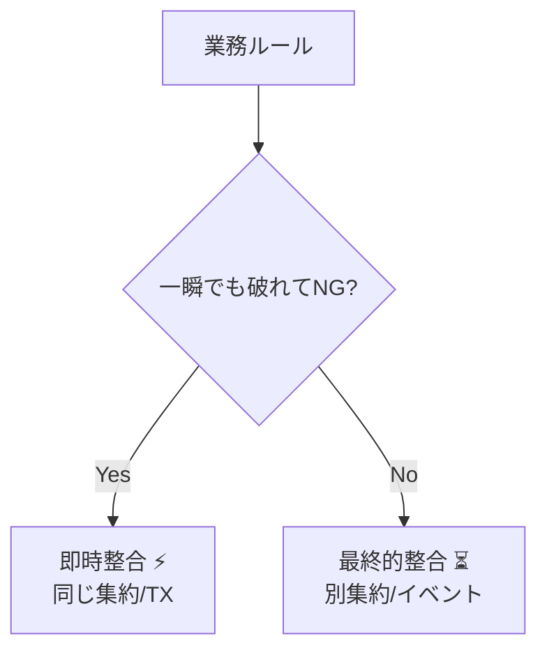
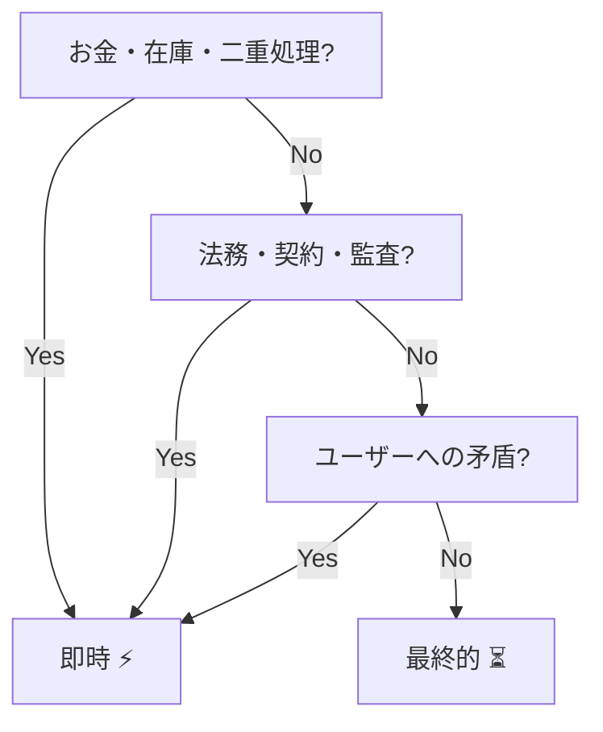
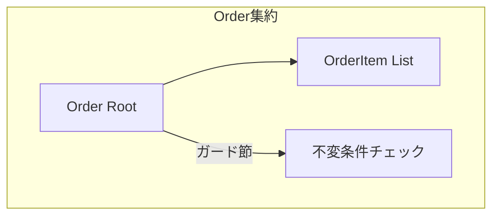

# 第13章：境界の判断軸①「同時に守る必要がある？」🧠⚖️

## この章でできるようになること🎯✨

* 「**同じトランザクションで守るべきルール**」を見分けられる✅
* ルールから逆算して「**集約の境界（どこまでを一体として更新するか）**」を決められる🌳🔒
* 「今は同時じゃなくてOK（最終的整合性でもOK）」を分けて、設計がスッキリする✨🧹

---

## まず結論（超だいじ）📌💡


**集約（Aggregate）＝「同時に守る必要があるルール（不変条件）を、1回の更新で必ず守るためのまとまり」**🌳🔐

つまり境界を決めるときの最重要質問はこれ👇
**「このルール、途中で一瞬でも破れていい？」**⏱️⚖️

* **破れたら即アウト**（お金・在庫・二重処理・法的/契約的にNG）→ **同じトランザクションで守る候補**✅
* **少し遅れて揃ってもOK**（通知・集計・表示更新など）→ **別トランザクションでもOK**⏳📣



---

## 2026年1月時点の“最新前提”メモ📝✨

この教材で触れる周辺技術の「いま」を軽く押さえるよ（細部は章の本筋じゃないのでサラッと）😊

* **C# 14** は **.NET 10 SDK** または **Visual Studio 2026** で試せるよ🧩✨ ([Microsoft Learn][1])
* **.NET 10** は **LTS（長期サポート）**として提供される流れだよ📦🛡️ ([Microsoft][2])
* **EF Core 10** は **.NET 10 が必要**で、LTSとして運用しやすい位置づけだよ🗃️✨ ([Microsoft Learn][3])
* **Visual Studio 2026** は 2026年1月にも更新が出てる（例：18.2.1 が 2026/01/20）🛠️🪟 ([Microsoft Learn][4])

---

## 1) 「同時に守る」ってどういう意味？🔒⏱️


## “同時に守る”＝「1回の更新で、必ず一緒に成立させる」✅

たとえば、こういうやつ👇

* 注文の合計金額 = 明細の合計（ズレたらダメ）🧾💰
* 確定済みの注文には明細追加できない（途中で破れたらダメ）🚫🧾
* 在庫が 0 の商品を注文確定できない（確定の瞬間に守る）📦❌

これらは、**一瞬でも破れた状態がDBに入ったら事故**になりやすい😵💥
だから「同じトランザクション」でまとめて守るのが基本になるよ🔒

---

## 2) 判断のための“仕分け質問”5連発🔍⚖️


ルール（業務ルール）を見たら、次の質問を順番に投げていくよ💬✨

## Q1：破れた瞬間に損が出る？💸😱

* お金（請求、返金、割引、支払い）
* 在庫（引当、出荷、予約枠）
* 二重処理（同じ注文が2回確定、同じクーポンを2回使用）

→ YES なら **同時に守る候補**✅

## Q2：法律・契約・監査的に“一瞬でもNG”？📜👮‍♀️

例：領収書発行済みなのに支払いが未成立、など
→ YES なら **同時に守る候補**✅

## Q3：「ユーザーに見える状態」が一瞬でも矛盾する？👀💥

例：注文が「確定」と表示されてるのに、明細が空っぽ
→ YES なら **同時に守る寄り**（少なくとも“表示する状態”設計を工夫）✅

## Q4：同時更新が起きた時に壊れやすい？👥⚔️

例：残り1個のケーキを2人が同時に買う
→ YES なら **同時に守る寄り**（ロック/競合検出の話にもつながる）✅

## Q5：遅れて揃っても「困らない」？⏳🙂

例：注文確定後の「サンクスメール」送信、売上集計更新
→ YES なら **別でもOK**（イベントで後処理が向く）📣✨



---

## 3) 例でやってみよう：カフェ注文ドメイン☕️🍰


## 登場人物（最低限）👀

* `Order`（注文）🌳
* `OrderItem`（明細）🧾
* `Payment`（支払い情報）💳（※この章では“別集約にする可能性”を残す）

---

## ルール一覧（例）📋✨

1. 注文の合計金額は、明細の合計と一致していないとダメ💰🧾
2. 注文が `Confirmed` になったら、明細は追加できない🚫
3. 明細の数量は 1 以上🍰➕
4. 注文確定時に「明細が1つ以上」必要（空の注文は確定不可）🧾✅
5. 支払い完了メールは“遅れてOK”📧⏳

---

## 仕分けしてみるよ✂️⚖️

* 1〜4 → **確定/追加の瞬間に守れてないと事故**になりやすい
  → **同時に守る**（同じトランザクション候補）✅🔒
* 5 → 遅れて送っても大丈夫
  → **別トランザクションでもOK**（後処理）📣⏳

---

## 4) 「同時に守る」＝ 集約の中に閉じ込める🌳🔐


## 集約のコツ（この章のゴール）🎯

* **同時に守るルール**は、**集約ルートのメソッド**で守る✨
* ルート以外（明細など）を外から勝手に更新できないようにする🚪👑
* ルールを “あちこち” に散らさない📌🧠

---

## 5) C#での実装イメージ（最小）🛠️✨


## Order集約：不変条件を“ここだけで”守る🌳🔐

```csharp
public enum OrderStatus { Draft, Confirmed, Cancelled }

public sealed class Order
{
    private readonly List<OrderItem> _items = new();

    public Guid Id { get; }
    public OrderStatus Status { get; private set; } = OrderStatus.Draft;

    public IReadOnlyList<OrderItem> Items => _items;

    public Money Total => _items.Aggregate(Money.Zero, (acc, x) => acc + x.Subtotal);

    private Order(Guid id) => Id = id;

    public static Order CreateNew(Guid id)
        => new(id);

    public void AddItem(ProductId productId, int quantity, Money unitPrice)
    {
        if (Status != OrderStatus.Draft)
            throw new DomainException("確定後の注文には明細を追加できません🧾🚫");

        if (quantity <= 0)
            throw new DomainException("数量は1以上にしてね🍰➕");

        _items.Add(new OrderItem(productId, quantity, unitPrice));
        // ここで「TotalはItemsから計算」なのでズレにくい✨
    }

    public void Confirm()
    {
        if (Status != OrderStatus.Draft)
            throw new DomainException("この注文は確定できない状態だよ🚫");

        if (_items.Count == 0)
            throw new DomainException("明細が空の注文は確定できません🧾❌");

        Status = OrderStatus.Confirmed;
    }
}

public sealed record ProductId(Guid Value);

public sealed class OrderItem
{
    public ProductId ProductId { get; }
    public int Quantity { get; }
    public Money UnitPrice { get; }

    public Money Subtotal => UnitPrice * Quantity;

    public OrderItem(ProductId productId, int quantity, Money unitPrice)
    {
        ProductId = productId;
        Quantity = quantity;
        UnitPrice = unitPrice;
    }
}

public sealed record Money(decimal Value)
{
    public static Money Zero => new(0m);
    public static Money operator +(Money a, Money b) => new(a.Value + b.Value);
    public static Money operator *(Money a, int n) => new(a.Value * n);
}

public sealed class DomainException : Exception
{
    public DomainException(string message) : base(message) { }
}
```

## ここがポイント🌟

* `Order.AddItem()` と `Order.Confirm()` の中に **同時に守るルール**が集まってる✅
* `Status` で「できる/できない」を表現できて、**途中状態が壊れにくい**🚦✨



* `Total` を “保存値” にせず `Items` から計算にするとズレ事故が減る（まずはこれが強い）🧠🛡️

---

## 6) 「同じトランザクションにする？」の決め方を手順化🧭✨

## 手順A：ルールを“日本語で”1行ずつ並べる📋🖊️

* 例：「確定後は明細追加できない」
* 例：「空の注文は確定できない」

## 手順B：各ルールを2色に塗る🖍️🎨

* 🔴 **即時整合（同時に守る）**：一瞬でも破れたら困る
* 🟡 **最終的整合（遅れてOK）**：後から揃えばいい

## 手順C：🔴が同じ場所に集まるように境界を切る✂️🌳

* 🔴が Order に集中するなら、Order が集約ルートっぽい
* 🔴が Payment に集中するなら、Payment を別集約にする余地もある

---

## 7) ありがち落とし穴（ここ超ハマる）🕳️😵

## 落とし穴1：ルールをDBトリガーやアプリのあちこちに散らす😱


* 「UIでもチェック、APIでもチェック、DBでもチェック…」
  → だんだん “どれが正しいか分からない” 事故が起きる💥
  → **集約ルートに寄せる**のが基本だよ🌳👑

## 落とし穴2：「念のため全部同時に守ろう」で巨大集約にする🐘💦


* なんでも1トランザクションにすると、遅い・壊れやすい・変更しにくい😵
  → “即時に守るべき🔴だけ” を同時にするのがコツ⚖️✨

## 落とし穴3：遅れてOKなものまで同期処理してUXが悪化🐢😢

* メール送信や通知を確定処理の中でやって失敗→全体ロールバック…
  → こういうのは後処理（イベント）向き📣⏳（31〜32章で扱うよ）

---

## 8) ミニ演習（3問）✍️🎀


## 問1：注文確定と「サンクスメール送信」は同じトランザクション？📧🤔

* A：同じにする
* B：別でOK

## 問2：注文確定と「明細のロック（確定後は変更不可）」は同じトランザクション？🔒🧾

* A：同じにする
* B：別でOK

## 問3：注文確定と「売上集計テーブル更新」は同じトランザクション？📈🤔

* A：同じにする
* B：別でOK

---

## 解答（こっそり答え合わせ）👀✨

* 問1：**B**（遅れてOKな後処理になりやすい）📧⏳
* 問2：**A**（確定の瞬間に守りたい不変条件）🔒✅
* 問3：**B**（集計は遅れてOKにしやすい。負荷と障害耐性が上がる）📈⏳

---

## 9) AI（Copilot/Codex）に助けてもらうコツ🤖✨

## ① ルールの仕分けを手伝ってもらうプロンプト🧠🖊️

```text
次の業務ルールを「同時に守るべき（即時整合）」と「遅れてOK（最終的整合）」に分類して。
さらに、即時整合側は「なぜ同時に守る必要があるか」を1行で根拠も書いて。

ルール：
- （ここに箇条書きで貼る）
前提：注文ドメイン（Order/OrderItem/Payment）
```

## ② 集約境界案を3パターン出して比較🤝✨

```text
このドメインの集約境界案を3つ提案して。
各案について：
- 集約ルートは何か
- どの不変条件を同時に守れるか
- どんなデメリット（巨大化/跨ぎ更新/性能/同時更新）を持つか
を表にして。
```

## ③ “同時に守る”チェックリストを作らせる✅🧾

```text
「同時に守る必要がある？」を判断するチェックリストを10項目で作って。
初心者向けに、YES/NOで答えられる質問形式にして。
```

---

## まとめ🌸✨

* 境界を決める最初の軸は **「同時に守る必要がある？」**🧠⚖️
* **一瞬でも破れたら困るルール（不変条件）**は、**集約の中で、1回の更新で守る**🌳🔒
* **遅れてOK**なものは、無理に同時にせず、後処理に逃がすと強い📣⏳

次章（第14章）では、「じゃあ他の集約を参照したいときはどうするの？」っていう超あるある問題を、**“参照はIDで持つ”**でスッキリさせていくよ🆔✨

[1]: https://learn.microsoft.com/ja-jp/dotnet/csharp/whats-new/csharp-14?utm_source=chatgpt.com "C# 14 の新機能"
[2]: https://dotnet.microsoft.com/en-us/platform/support/policy?utm_source=chatgpt.com "The official .NET support policy"
[3]: https://learn.microsoft.com/en-us/ef/core/what-is-new/ef-core-10.0/whatsnew?utm_source=chatgpt.com "What's New in EF Core 10"
[4]: https://learn.microsoft.com/en-us/visualstudio/releases/2026/release-notes?utm_source=chatgpt.com "Visual Studio 2026 Release Notes"
