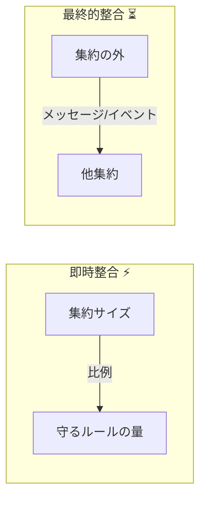
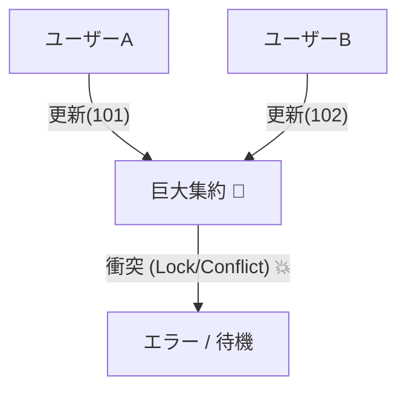
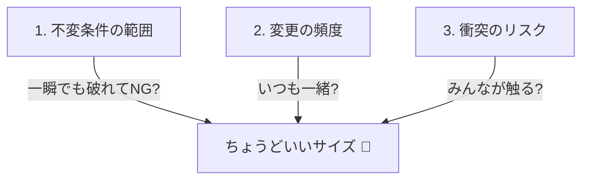

# 第15章：境界の判断軸③「サイズ調整」⚖️😇

## この章でやること🎯✨

集約（Aggregate）の「ちょうどいい大きさ」を決めるコツを身につけます💡
大きすぎても小さすぎても地獄なので😵‍💫、**“守るべき整合性” と “現実の開発運用” のバランス**で調整できるようになろう〜！🌸

---

## 15.1 まず結論📌：「集約サイズ」は “守る整合性の量” で決める🧠⚖️


集約って、ざっくり言うと

* ✅ **この範囲は同じトランザクションで守る（即時整合）**
* ⏳ **この外側は、あとで揃えばOK（最終的整合）**

を分けるための「まとまり」だよね🌳



---
だからサイズ調整の中心はこれ👇

> **「同じ瞬間に絶対守りたいルール（不変条件）が多いほど、集約は大きくなりがち」**
> **「不変条件が少ないなら、集約は小さくしやすい」**

そして、現実にはさらに👇も効いてくるよ😇

* 🚦同時更新（競合）が起きやすい？
* 🐢1回の保存が重くなってない？
* 🧩変更が頻繁な部分まで一緒に抱えてない？
* 🔁跨ぎ更新したくなってない？

---

## 15.2 大きすぎ集約の地獄💥😵（やりがち…！）


## 症状①：変更がしんどい🧷

集約が巨大だと、ちょっとした仕様変更でも影響範囲が広がるよ😱
「注文の表示を少し変えたいだけ」なのに「支払い・会員・在庫」まで巻き込む…みたいな💥

## 症状②：保存が重い＆遅い🐢💾

集約ルートを保存するたびに、ぶら下がってる全部が関係してくると

* DB更新量が増える
* ロックや競合が増える
* パフォーマンスが落ちる
  ってなりがち😵‍💫

## 症状③：同時更新に弱い⚔️

巨大集約は「みんなが触る場所」になりやすいから、衝突が増えるよ🚧
（楽観ロックは第29章でやるけど、根本はサイズも大事！✨）



---

## 15.3 小さすぎ集約の地獄😵‍💫🪡（これもある…！）

## 症状①：跨ぎ更新したくなる病🙅‍♀️

集約が細切れすぎると、ユースケースでこうなる👇

* Order を更新
* OrderItem も更新
* Payment も更新
* Inventory も更新
  → **「え、1回の操作で4集約またぐやん…」** 😇

この瞬間に「じゃあ全部まとめて1トランザクションで！」ってやりたくなるけど、
それをやり続けると **“境界の意味” が消えていく**の💥

## 症状②：整合性が散らかる🧾🌀

本来「注文確定後は明細追加できない」みたいな不変条件は、
集約ルートが責任持って守るのが安全🔐
でも小さすぎると、ルールが複数箇所に散ってバグりやすい😵

---

## 15.4 「ちょうどいいサイズ」の目安📏🌸（現場で効くやつ）


ここからが本題💪✨
次のチェック観点で、集約サイズを調整していくよ〜！

## 観点A：不変条件は “どこまで一緒に守る？” 🔐

* ✅ 同じ瞬間に絶対守りたい → 同じ集約に寄せる候補
* ⏳ あとで揃えばOK → 別集約＋イベント/後処理の候補

## 観点B：「一緒に変わる頻度」は高い？🔁

* 🧩いつも一緒に変更される → 同じ集約の可能性UP
* 🧊ほぼ別々に変わる → 分けるとスッキリしやすい

## 観点C：同時更新の衝突（競合）は増えてない？⚔️

* 多人数・多処理が同じ集約を更新するなら、**小さくした方が衝突が減る**ことが多いよ🚦

## 観点D：1ユースケースで “必要なもの” だけ触れてる？🪶

* 「注文確定」なのに、会員プロフィールまで読み書きしてる…みたいなのは要注意⚠️



---

## 15.5 カフェ注文ドメインでサイズ調整してみる☕️🍰

ここでは題材の登場人物を思い出そう〜👀✨

* Order（注文）
* OrderItem（注文の明細）
* Payment（支払い）
* Customer（顧客）
* Inventory（在庫）

## 例①：巨大すぎるパターン（ありがち）💥

* Order 集約の中に Payment や Customer まで “オブジェクト参照” でぶら下げる😱
  → なんでもかんでも「注文保存」で巻き込まれがち

## 例②：おすすめ寄りの分け方（よくある落とし所）🌸

* ✅ **Order 集約**：注文と明細（OrderItem）を守る
* ✅ **Payment 集約**：支払いの状態と履歴を守る（OrderId を参照）🆔
* ✅ **Customer 集約**：顧客プロフィール（OrderIdは持たない）
* ✅ **Inventory 集約**：在庫は在庫で守る（引当などは後で）📦

ポイントはこれ👇
**「注文の不変条件（例：確定後に明細追加NG）」は Order 集約で完結**させる💪
**支払いは Order と“同時に守る必要がある？”を考えて分離**しやすい💳

---

## 15.6 C#で “サイズ調整後” の形をコードで見る👀✨

## 15.6.1 Order 集約（Order + OrderItem を内包）🌳

* 外からは Order だけ触る（ルート）👑
* OrderItem は外に直接Repositoryを作らない🙅‍♀️

```csharp
public sealed class Order
{
    private readonly List<OrderItem> _items = new();

    public Guid Id { get; private set; } = Guid.NewGuid();
    public OrderStatus Status { get; private set; } = OrderStatus.Draft;

    public IReadOnlyList<OrderItem> Items => _items;

    public Money Total => _items.Aggregate(Money.Zero, (acc, x) => acc + x.LineTotal);

    public void AddItem(MenuItemId menuItemId, int quantity, Money unitPrice)
    {
        GuardAgainstNotDraft();

        if (quantity <= 0) throw new DomainException("数量は1以上にしてね🧁");

        _items.Add(new OrderItem(menuItemId, quantity, unitPrice));
    }

    public void Confirm()
    {
        GuardAgainstNotDraft();

        if (_items.Count == 0) throw new DomainException("明細が空だと確定できないよ☕️");

        Status = OrderStatus.Confirmed;
    }

    private void GuardAgainstNotDraft()
    {
        if (Status != OrderStatus.Draft)
            throw new DomainException("確定後は変更できないよ🔒");
    }
}

public enum OrderStatus
{
    Draft,
    Confirmed,
    Cancelled
}

public sealed class OrderItem
{
    public Guid Id { get; private set; } = Guid.NewGuid();
    public MenuItemId MenuItemId { get; private set; }
    public int Quantity { get; private set; }
    public Money UnitPrice { get; private set; }

    public Money LineTotal => UnitPrice * Quantity;

    internal OrderItem(MenuItemId menuItemId, int quantity, Money unitPrice)
    {
        MenuItemId = menuItemId;
        Quantity = quantity;
        UnitPrice = unitPrice;
    }
}

public readonly record struct MenuItemId(Guid Value);

public readonly record struct Money(decimal Amount)
{
    public static Money Zero => new(0m);

    public static Money operator +(Money a, Money b) => new(a.Amount + b.Amount);
    public static Money operator *(Money a, int k) => new(a.Amount * k);
}

public sealed class DomainException : Exception
{
    public DomainException(string message) : base(message) { }
}
```

💡ここが「サイズ調整」の効きどころ👇

* OrderItem を外に出して別集約にすると、「確定後は追加不可」の守りが散りやすい😵
* 内包しておけば、**Order が一箇所で守れる**🔐✨

---

## 15.6.2 Payment 集約（Order をID参照する）💳🆔

```csharp
public sealed class Payment
{
    public Guid Id { get; private set; } = Guid.NewGuid();
    public Guid OrderId { get; private set; }
    public PaymentStatus Status { get; private set; } = PaymentStatus.Pending;

    public Payment(Guid orderId)
    {
        OrderId = orderId;
    }

    public void MarkSucceeded()
    {
        if (Status != PaymentStatus.Pending)
            throw new DomainException("支払い状態が変だよ😵‍💫");

        Status = PaymentStatus.Succeeded;
    }
}

public enum PaymentStatus
{
    Pending,
    Succeeded,
    Failed
}
```

💡「支払い成功したら注文も更新したい！」ってなるよね？
ここで大事なのが第15章の感覚😇

* ✅ **どうしても同時に守る必要があるなら** → 同じトランザクションで両方更新（ただし慎重に）
* ⏳ **少し遅れてもOKなら** → Payment成功 →（イベント/後処理で）Order側を更新

この “遅れてもOK” は第31章〜32章の世界につながっていくよ📣📮✨

---

## 15.7 “サイズ診断” チェックリスト✅🧠

次の質問に YES が多いほど、その集約は「肥大化」してるかも⚠️

1. 保存するとき、毎回いろんな関連データも一緒に更新してる？💾
2. その関連データは「同じ瞬間に守る必要」ある？🔐
3. 変更頻度が違うものまで一緒に抱えてる？🔁
4. 同時更新の衝突（競合）が多い？⚔️
5. 1ユースケースで “関係ないもの” までロードしてる？🐢
6. その集約、いろんな機能の都合で何でも入ってない？🧳
7. チーム開発で「ここ触ると怖い」になってない？😱
8. 「とりあえずこの集約に追加」で増えてない？📈
9. 参照（表示）のためだけのデータが大量にぶら下がってない？👀
10. 跨ぎ更新が多すぎて “境界が機能してない” 感じある？😵‍💫

YES が 3〜4個以上なら、**分割案を一度作る価値あり**だよ✍️✨

---

## 15.8 ワーク✍️🎀（3本勝負）

## ワーク1：巨大集約を “2つに割る” 🪓🌳

「Order に Payment や Customer 情報まで入ってる」前提で、こう分けてみて👇

* Order：注文と明細だけ
* Payment：支払いだけ（OrderId参照）
* Customer：顧客プロフィールだけ

👉 分けた後、「注文確定」のユースケースに必要なトランザクション境界を説明してみよう🔒✨

---

## ワーク2：小さすぎ集約を “寄せる” 🧷

もし OrderItem を別集約にしてたら、どんな不変条件が散りそう？😵
例：「確定後は明細追加不可」をどこで守る？

👉 “守る責任者” を1人にするなら、どこに寄せる？👑

---

## ワーク3：3パターン出して比較⚖️🌈

同じドメインでも、集約の切り方って複数ありえるよ😊
自分でまず案を3つ書いて、メリデメ比較してみよう✍️✨

---

## 15.9 Copilot / Codex に聞くときの “勝ちプロンプト” 🤖🏆

AIは便利だけど、**結論だけもらうと事故る**ので😇
“根拠付きで比較させる” のがコツだよ💡

## プロンプト例①：境界案を3つ出して比較

```text
カフェ注文ドメインで、Order / OrderItem / Payment / Customer / Inventory がある。
「集約の境界案」を3パターン提示して。
各パターンについて、(1)守れる不変条件 (2)トランザクション境界 (3)競合リスク (4)将来の拡張性 を箇条書きで比較して。
最後に、初心者チームで事故りにくい案を1つ推して、その理由も書いて。
```

## プロンプト例②：今の設計が “大きすぎ/小さすぎ” か診断

```text
この Order 集約設計をレビューして。
「大きすぎる兆候」「小さすぎる兆候」をそれぞれ指摘して、改善案を提案して。
特に、同時更新（競合）と、不変条件の置き場所に注目して。
```

## プロンプト例③：分割したときの整合性の保ち方

```text
Order と Payment を別集約に分けた場合、
「支払い成功→注文ステータス更新」を即時整合にする案と、最終的整合にする案を両方説明して。
それぞれの利点・欠点・障害時の振る舞いも書いて。
```

---

## 15.10 この章のまとめ🌸📘

* 集約サイズは **“不変条件をどこまで一緒に守るか”** が中心🔐✨
* 大きすぎると 💥変更しにくい／遅い／衝突しやすい
* 小さすぎると 😵‍💫跨ぎ更新だらけ／整合性が散る
* サイズ調整は、チェックリストで “症状” を見つけて、分割・統合を試すのが近道📏💡
* 最新の .NET 10 / C# 14 / Visual Studio 2026 環境では、EF Core 10 が .NET 10 前提になっていて、世代としても「集約設計→EF Coreで永続化」がやりやすい流れだよ🧪✨ ([Microsoft Learn][1])

[1]: https://learn.microsoft.com/ja-jp/dotnet/csharp/whats-new/csharp-14?utm_source=chatgpt.com "C# 14 の新機能"
