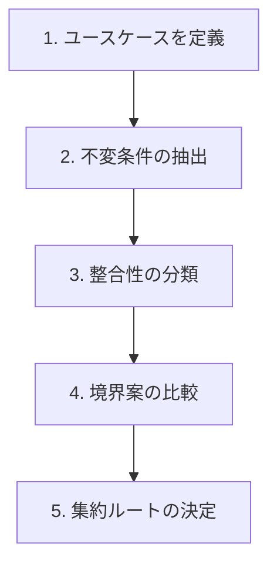
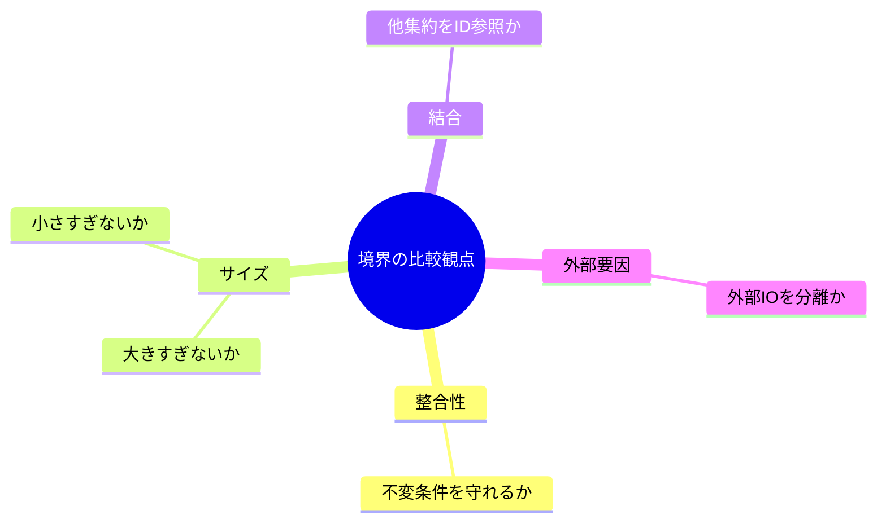
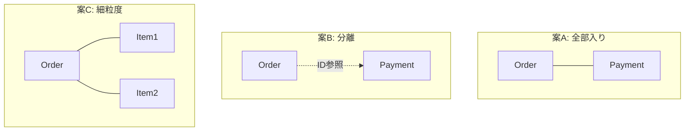

# 第16章：境界を切る練習（ワーク3本）✍️🎀

## この章でできるようになること🎯✨

* 「このルールは同じトランザクションで守る？あとで揃えばOK？」を分けられるようになる⏱️⏳
* 集約（Aggregate）の境界案を **複数出して** 比較できるようになる⚖️👀
* 「跨ぎ更新したくなる誘惑」への対処パターンがわかる🙅‍♀️🧠

---

## 0. 境界を切るための“型”🧁🧠

境界を切るときは、だいたいこの順番でOKだよ👇✨

1. **ユースケース（1回の操作）を1行で書く**✍️
2. **不変条件（絶対守るルール）を箇条書き**🔐
3. **即時整合（いま絶対）/ 最終的整合（あとでOK）を分類**⚖️
4. **集約候補を3案作って比較**（ここが本章の練習！）🌳🌳🌳
5. **“更新の入口”＝集約ルートを決める**👑🚪



---

## 1. まずは共通テンプレ（これを埋めるだけ）🧾✨


## 境界キャンバス（1ケースにつきこれ1枚）📄🌸

* ユースケース（1行）：
* 主要な用語（名詞）：
* 主要な操作（動詞）：
* 不変条件（絶対守る）：
* 最終的整合でもOK：
* 集約案A：
* 集約案B：
* 集約案C：
* 採用案と理由：

## 比較の観点（迷ったらここを見る）👀⚖️

* **同時に守る必要があるルール**が同じ集約に収まってる？✅
* その集約、**大きすぎない？**（変更しづらい/重い）📦💥
* **小さすぎない？**（跨ぎ更新したくなる）🧩😵
* 他集約を **オブジェクト参照してない？（ID参照になってる？）** 🆔✨
* 「外部I/O（決済/メール/在庫APIなど）」を同トランザクションに入れてない？🌐🚫



---

## 2. AIに「境界案を3パターン」出させる型🤖✨

## 使えるプロンプト例（コピペOK）📋💬

（Copilot Chat / Codex系のチャットに投げる想定だよ）

```text
あなたはDDD入門者向けの設計コーチです。
次のドメイン要件に対して、Aggregate（集約）境界の案を3パターン提案してください。

- ユースケース（1行）:
- ルール（不変条件）:
- 即時整合が必要なもの / 最終的整合でよいもの:
- 登場する概念（名詞）:

出力条件:
1) 案A/B/Cそれぞれで「集約ルート」「集約に含めるもの」「ID参照で外に出すもの」を明記
2) それぞれのメリット/デメリット（巨大化/跨ぎ更新/結合度/変更容易性）を書いて
3) 最後に「この条件なら私は案Xを推す」を理由付きで
4) 初心者がやりがちな地雷も書いて
```

## AIの答えを採用する前の“チェック質問”🧠🔍

* 「その不変条件、**どの瞬間に破られる可能性がある**？」
* 「それを守るのに **同じトランザクションが必要**？」
* 「外部I/Oが混ざってない？混ざるなら分離できない？」
* 「他集約参照がオブジェクト参照になってない？ID参照？」

---

## 3. ワーク1：カフェ注文（基本）☕️🍰

## 3-1. お題（超ざっくり要件）📋✨

* お客さんが注文を作る（商品追加・数量変更）🧁➕
* 注文を確定する（確定後は変更不可）✅🔒
* 支払いは外部決済（成功/失敗がある）💳💥
* 支払いが成功したら「支払い済み」になる🧾✅

## 3-2. 不変条件（例）🔐

* 注文確定は **明細が1つ以上** 必要🧾➕
* 確定後は **明細変更できない** 🚫
* 支払い済みの注文を **再度支払いに回さない** 🔁🚫

## 3-3. 即時整合 / 最終的整合の分類⚖️

* 即時で守る（同トランザクションが気持ちいい）✅

  * 「確定後は明細変更できない」
  * 「確定は明細1件以上」
* 最終的整合でもOK（外部I/Oが絡みやすい）⏳

  * 「支払い成功 → 支払い済み反映」
  * 「レシート発行/通知」

## 3-4. 境界案A/B/C（比較練習）🌳⚖️

### 案A：巨大案（Orderの中にPaymentまで入れる）📦💥

* **集約ルート**：Order
* **含める**：OrderItems, Payment情報（状態/結果）
* **外に出す（ID参照）**：CustomerId, MenuItemId
* ✅メリット：見た目は「全部ここで完結」っぽい
* ❌デメリット：外部決済（遅い/失敗/再試行）で **トランザクションが地獄**、変更も怖い😱

### 案B：おすすめ寄り（Order と Payment を分ける）🌿✨

* **集約ルート**：Order / Payment（別集約）
* **Orderに含める**：OrderItems, Status（Draft/Confirmed）
* **Paymentに含める**：OrderId, Status（Pending/Succeeded/Failed）, ProviderRef
* ✅メリット：注文確定の整合性と、決済の不確実さを分離できる🧠
* ✅メリット：決済は再試行・Webhookなどにも対応しやすい🔁
* ❌デメリット：状態が2つに分かれるのでUI設計が必要（「決済処理中」表示など）👀💬

### 案C：細かすぎ案（OrderItemを別集約に分ける）🧩😵

* **集約ルート**：Order / OrderItem
* ✅メリット：個別更新は軽い
* ❌デメリット：確定時に **跨ぎ更新したくなる**（OrderとItemを同時に…）→結局つらい💥

✅このケースの“着地”は **案B** が自然だよ（注文確定は即時、決済は別で扱う）🌸



---

## 3-5. C#ミニ骨格（“集約っぽさ”を手で掴む）🛠️✨

```csharp
public readonly record struct OrderId(Guid Value);
public readonly record struct PaymentId(Guid Value);

public enum OrderStatus { Draft, Confirmed }
public enum PaymentStatus { Pending, Succeeded, Failed }

public sealed class Order
{
    public OrderId Id { get; }
    public OrderStatus Status { get; private set; } = OrderStatus.Draft;

    private readonly List<OrderItem> _items = new();
    public IReadOnlyList<OrderItem> Items => _items;

    public Order(OrderId id) => Id = id;

    public void AddItem(string menuItemCode, int qty)
    {
        if (Status != OrderStatus.Draft) throw new InvalidOperationException("確定後は編集できません");
        if (qty <= 0) throw new ArgumentOutOfRangeException(nameof(qty));
        _items.Add(new OrderItem(menuItemCode, qty));
    }

    public void Confirm()
    {
        if (Status != OrderStatus.Draft) return;
        if (_items.Count == 0) throw new InvalidOperationException("明細が0件では確定できません");
        Status = OrderStatus.Confirmed;
    }
}

public sealed record OrderItem(string MenuItemCode, int Quantity);
```

ポイントはこれだけ👆✨

* **更新はメソッド経由**（勝手に壊されない）🔐
* **同じ集約で守るルールだけ**入れる（決済結果まで抱えない）💳🚫

---

## 4. ワーク2：サブスク課金（更新と参照が分かれやすい）💳📆

## 4-1. お題（要件）📋✨

* ユーザーがプラン契約する（開始日・更新日がある）🗓️
* 毎月請求が発生（請求書/支払い）🧾
* 支払い成功で利用可能、失敗で停止（猶予期間あり）⚠️
* プラン変更・解約がある🔁🚪

## 4-2. 不変条件（例）🔐

* 有効な契約は **開始日 <= 今日**
* 有効な契約は **同時に2つ持てない**（同一サービス）🚫
* 請求書は **同じ月に二重作成しない** 🔁🚫

## 4-3. 境界案（コツ：時間・イベントが絡む）⏳📣

### 案A：Subscription集約にInvoice/Payment全部入り📦💥

* ❌月次処理、Webhook、再試行…で巨大化しやすい😵

### 案B：Subscription / Invoice / Payment を分ける（推し）🌿✨

* **Subscription集約**：契約状態（Active/Suspended/Cancelled）と次回請求日📆
* **Invoice集約**：請求の事実（請求月、金額、ステータス）🧾
* **Payment集約**：外部決済の結果（Succeeded/Failedなど）💳
* ✅「契約のルール」と「お金の不確実さ」を分けられる🧠
* ✅リトライ/監査ログにも強い🔁

### 案C：InvoiceをSubscriptionの内側に入れる（ほどほど）🧩

* ケースによってはOKだけど、請求履歴が多いと重くなりがち📚💦

このワークの学びはこれ👇✨

* サブスクは **時間が勝手に進む**（月次バッチ/スケジューラ/Webhook）⏰
* だから「全部を1トランザクションで」は無理になりやすい🙅‍♀️
* 境界は **“未来の運用”を守るため**に切る🛡️

※C# 14 は .NET 10 SDK と Visual Studio 2026 で試せるよ📌✨ ([Microsoft Learn][1])

---

## 5. ワーク3：在庫引当（跨ぎ更新の誘惑が強い）📦🔥

## 5-1. お題（要件）📋✨

* 注文が入ったら在庫を引き当てたい（確保）🧺
* 在庫が足りなければ保留/キャンセル⏳❌
* 同時に注文が来る（競合）💥
* 引当後に支払い失敗で在庫を戻すこともある↩️

## 5-2. 不変条件（例）🔐

* 在庫の「確保済み + 利用可能」は **総在庫を超えない** 🚫
* 同じ注文に対して **二重引当しない** 🔁🚫

## 5-3. ここが最大の罠⚠️😇

やりがち：

* Order集約で「在庫を減らして、注文を更新して…」を **同トランザクションでやりたくなる**🙈💥
  でもそれをやると👇
* **巨大トランザクション**（重い・遅い・失敗しやすい）
* 同時更新で事故りやすい（後の章で学ぶやつ）🚑

## 5-4. 境界案A/B/C（この章のメイン練習）🌳⚖️

### 案A：OrderがInventoryを直接更新（跨ぎ更新）🙅‍♀️

* ❌境界崩壊コース（結合が強すぎ）🧷💥

### 案B：Inventory集約でReservation（引当）を管理（おすすめ）🌿✨

* **Inventory集約ルート**：InventoryItem（SKU単位）
* **含める**：AvailableQty / ReservedQty / Reservations（OrderId単位）
* **Order集約**：OrderStatus（ReservingStock / StockReserved / StockFailed）みたいに状態を持つ
* ✅「在庫の不変条件」を **Inventory側に集められる**🔐
* ✅Orderは「引当結果を待つ」状態で表現できる👀⏳

### 案C：Reservationを別集約にして分散（高負荷向け）⚙️

* 引当レコード（Reservation）を独立させて競合を下げる
* ✅スケールしやすい
* ❌入門だと概念が増える（まずはBでOK）😊

> 在庫みたいに競合が強い場所は、EF Core では楽観的同時実行（rowversionなど）で衝突検出するやり方が定番だよ📌（詳しくは後半章で！） ([Microsoft Learn][2])

---

## 6. 3ケース共通：採用案の“説明テンプレ”🗣️🌸

発表（説明）するときは、この順で言えば勝ち🏆✨

1. **このユースケースで即時に守りたい不変条件はこれ**🔐
2. **だから同トランザクションで閉じる範囲はここ**🔒
3. **外部I/Oや時間が絡むものは外に出す**⏳🌐
4. **他集約参照はIDで持つ**🆔
5. **巨大化/跨ぎ更新のリスクをこう避けた**🛡️

---

## 7. 仕上げミニ課題（提出物イメージ）📝🎀

## 提出物A：境界キャンバス3枚📄📄📄

* カフェ注文
* サブスク課金
* 在庫引当

## 提出物B：各ケース「案A/B/Cの比較表」1枚ずつ⚖️👀

* メリット
* デメリット
* どの不変条件を守りやすいか
* どこが運用で辛くなりそうか

## 提出物C：C#の超ミニ骨格（1ケースでOK）🛠️✨

* 集約ルートのクラス
* 不変条件を守るメソッド2つ以上
* 他集約はID参照になっていること🆔

---

## 8. よくあるミス集（先に踏み抜き回避）🚧😅

* 「全部まとめたら安心」→ **巨大集約で詰む**📦💥
* 「分ければ正義」→ **跨ぎ更新したくなって詰む**🧩😵
* 「参照が欲しいからオブジェクト参照」→ **密結合で詰む**🧷🚫
* 「決済/外部APIも一緒に確定」→ **失敗と再試行で詰む**💳🔁💥

---

## まとめ🌸✨

* 境界は「DBの都合」じゃなくて **“同時に守るべきルール”の都合**で切る🧠🔒
* **案を3つ出して比較**すると、境界が“説明できる設計”になる✍️⚖️
* 「外部I/O」「時間が勝手に進む」「競合が強い」…ここが分離のサイン👀⏳📦

[1]: https://learn.microsoft.com/en-us/dotnet/csharp/whats-new/csharp-14?utm_source=chatgpt.com "What's new in C# 14"
[2]: https://learn.microsoft.com/en-us/ef/core/saving/concurrency?utm_source=chatgpt.com "Handling Concurrency Conflicts - EF Core"
