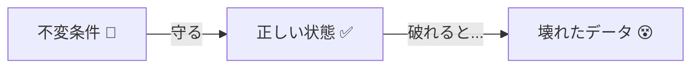
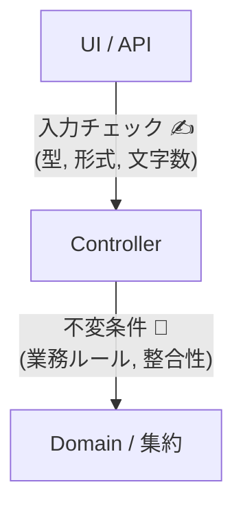
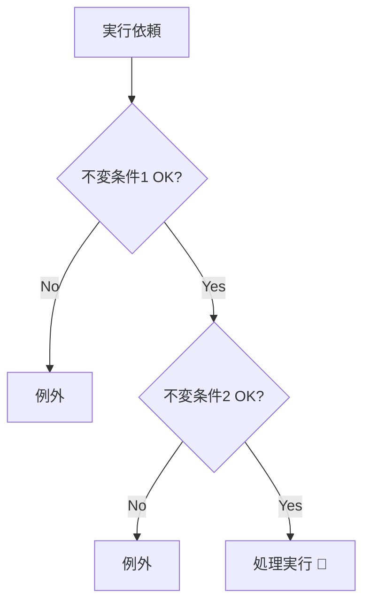

# 第17章：不変条件（Invariants）ってなに？🔐

## この章でできるようになること 🎯✨

* 「絶対に守るべきルール（不変条件）」を見つけられる 👀📌
* そのルールを「散らさず」「壊れにくく」置く場所がわかる 🧱✨
* 集約（Aggregate）と不変条件の関係が腹落ちする 🌳🔒
* “跨ぎ更新したくなる誘惑”を、不変条件で見分けられる 😈➡️🙅‍♀️

---

## 1. 不変条件ってなに？🤔🔐


不変条件（Invariant）は、かんたんに言うと **「どんなときも守られてないと困るルール」** だよ ✅💡
つまり **そのドメイン（業務）にとって“壊れた状態”を作らないための約束** 🌸

たとえばカフェ注文なら…☕️🧾

* 「注文が確定したら、明細は追加できない」🧾🚫
* 「明細が0件の注文は“確定”できない」📭🚫
* 「合計金額は0円以上」💴✅（マイナス注文は変！）

こういう **“守られてないと事故る”やつ** が不変条件だよ 🚑💥



---

## 2. なんで不変条件がそんなに大事？🛡️✨

不変条件が弱いと、こうなるよ👇😵

* UIのチェックは通ったのに、別ルート（API/バッチ/管理画面）から壊れたデータが入る 🧨
* 「たまたま今は動く」けど、後で想像できないバグが出る 👻
* データ修正地獄（手作業SQL）に落ちる 😭🪦

DDDの考え方では、**集約（Aggregate）の主な責任は“不変条件を守ること”** と説明されることが多いよ 📌🌳 ([Microsoft Learn][1])

---

## 3. 不変条件と「入力チェック」の違い 🧁🧠


初心者が混ざりやすいので、分けるね✂️✨

## ✅ 不変条件（Invariant）

* **ドメインのルール**（業務上の正しさ）
* **アプリのどこから呼ばれても守られないとダメ**
* 例：「確定後は明細変更できない」🧾🚫

## ✅ 入力チェック（Validation）

* 画面やAPIの都合のルール
* 例：「名前は30文字以内」✍️
* ドメインに置く場合もあるけど、重要度は不変条件より下になりがち 🌿



---

## 4. “不変条件っぽい”ルールを見つける質問テンプレ 🕵️‍♀️📌

次の質問をすると、不変条件が見つかりやすいよ✨

* 「これが破られたら、お金・信用・在庫が壊れる？」💰📦😱
* 「後から直せる？直せない？」🛠️
* 「“確定/完了”みたいな強い言葉が出てる？」✅
* 「キャンセルできる？できない？」🚫
* 「誰が見ても“それはダメでしょ”ってなる？」🙅‍♀️

---

## 5. 不変条件は“散らさない”のがコツ 🧠🧷


不変条件が散ると、だんだんこうなるよ👇😇

* A画面では禁止、B画面では許可、バッチでは無視…みたいな謎挙動 🎭
* 修正が漏れて事故る 💥

だから基本はこう👇🌟

* **不変条件は、集約ルート（Aggregate Root）のメソッドで守る** 👑🚪
* ルート以外（UI、コントローラ、Repository、DBトリガー）に“本命ルール”を置きすぎない 🧱

---

## 6. 例題：カフェ注文の不変条件を作る ☕️🧾✨

ここから「注文（Order）」を集約ルートとして考えるよ 🌳

## 登場人物（ざっくり）👀

* `Order`（集約ルート）👑
* `OrderItem`（子）🧾
* `OrderStatus`（状態）🚦
* `Money`（値オブジェクト）💴

## 不変条件の候補リスト（例）📌

1. **Draft（下書き）以外は明細追加できない** 🧾🚫
2. **確定（Confirmed）には明細が1件以上必要** 📭🚫
3. **同じ商品を2回入れるのはOK？NG？（業務次第）** 🧁🤝
4. **合計金額は常に0以上** 💴✅
5. **確定後は合計が勝手に変わらない** 🔒

> ここで大事：**“業務次第”はユビキタス言語で決める** 🗣️🌸
> 不変条件は「仕様の核心」なので、曖昧だと設計が揺れるよ 🫨

---

## 7. 不変条件をコードに落とす“基本形” 🧱✨

## 7.1 「壊れた状態を作れない」形にする 🏗️🔒

* いきなり `new Order()` できないようにする（= 無効状態が作られない）🙅‍♀️
* `Create()`（ファクトリ）で必ず初期状態を整える 🌱
* 外から勝手に書き換えられない（`public set;` を避ける）🔐

## 7.2 変更はメソッドに閉じ込める ✋🔁


* `order.Status = Confirmed;` みたいな直書きは禁止 🙅‍♀️
* `order.Confirm()` の中で、ルールを全部チェック ✅

---

## 8. C# で“それっぽく”書く（入門）🧑‍💻🍰

この章は「不変条件の考え方」が主役だけど、雰囲気がわかる最小コードを置くよ✨
（本格実装は次章でやるよ🛠️）

```csharp
public enum OrderStatus
{
    Draft,
    Confirmed
}

public sealed class Order
{
    private readonly List<OrderItem> _items = new();

    public Guid Id { get; }
    public OrderStatus Status { get; private set; } = OrderStatus.Draft;

    public IReadOnlyList<OrderItem> Items => _items;

    private Order(Guid id)
    {
        Id = id;
    }

    public static Order Create()
        => new Order(Guid.NewGuid());

    public void AddItem(string name, int unitPrice, int quantity)
    {
        // 不変条件：Draftの間だけ追加できる
        if (Status != OrderStatus.Draft)
            throw new DomainException("確定後は明細を追加できません🧾🚫");

        // 入力チェック（ドメインに置くこともある）
        if (string.IsNullOrWhiteSpace(name))
            throw new DomainException("商品名が空です🍰💦");

        if (unitPrice <= 0)
            throw new DomainException("単価は1以上です💴");

        if (quantity <= 0)
            throw new DomainException("数量は1以上です🧁");

        _items.Add(new OrderItem(name, unitPrice, quantity));
    }

    public void Confirm()
    {
        // 不変条件：明細0件では確定できない
        if (_items.Count == 0)
            throw new DomainException("明細が0件なので確定できません📭🚫");

        Status = OrderStatus.Confirmed;
    }
}

public sealed record OrderItem(string Name, int UnitPrice, int Quantity);

public sealed class DomainException : Exception
{
    public DomainException(string message) : base(message) { }
}
```

ポイントはこれだよ👇🌟

* **不変条件は“状態変更の瞬間”に必ずチェック** 🔁✅
* **外から自由にいじれない**（`private` / `private set`）🔐
* **例外メッセージはユーザー表示と一致させない**（ログ用と表示用を分けるのは後の章で）🧾✨

---

## 9. ガード節（Guard Clauses）で読みやすくする 🛡️📖


`if` が増えると読みにくくなることがあるよね💦
そこで「ガード節」＝ **先にダメな条件を弾いて、本筋をスッキリさせる** ✨

.NET系だと `CommunityToolkit.Diagnostics.Guard` みたいなガードAPIもあるよ（手書きより簡潔に書ける系）🧰✨ ([Microsoft Learn][2])

（この教材では“手書きif”でも全然OK🙆‍♀️）



---

## 10. 不変条件が「集約の境界」を教えてくれる 🧠🧭


ここ超重要だよ📌✨

## ✅ 1つの集約で守れる不変条件

* 同じ集約の中のデータだけで判断できる
* 例：「注文確定後は明細追加禁止」🧾🚫
  → **同一トランザクションで守れる** 🔒

## ⚠️ 複数集約をまたぐ不変条件っぽいもの

* 例：「在庫があるなら注文確定できる」📦
* 例：「会員ランクによって割引が…」👑
  これを“毎回ガチガチに同期”で守ろうとすると…
* **跨ぎ更新の巨大トランザクション** に引きずられがち 💥😇

このときは、後半の章で出る

* 「最終的整合」⏳
* 「イベント」📣
* 「Outbox」📮
  みたいな世界に繋がっていくよ🌈

---

## 11. ありがち事故パターン集 🚫😅

## ❌ public setter だらけ

* どこからでも壊せる😇
* ルールが散る🌪️

## ❌ 「IsValid() を最後に呼べばいい」

* 呼び忘れたら終わり💥
* “途中状態”が長く存在する👻

## ❌ DB制約だけに頼る

* UI/アプリ側は壊れた状態を作ってしまう
* 例外が遅れて出てデバッグがしんどい 😭

---

## 12. ミニワーク✍️🎀（不変条件を“言葉→コード”にする）

## ワークA：不変条件を10個出す 🧠📌

カフェ注文で、次のイベントを想像して不変条件を書き出してね✨

* 明細追加🧾
* 確定✅
* キャンセル🚫
* 割引🎟️
* 支払い💳

書き方テンプレ👇

* 「〜のとき、〜してはいけない」🚫
* 「〜するには、〜が必要」✅

---

## ワークB：集約ルートの“変更メソッド”を3つ作る 🛠️

* `AddItem()`
* `Confirm()`
* `Cancel()`（キャンセル可否は状態で決める🚦）

それぞれに不変条件を1〜3個ずつ埋めるよ✨

---

## 13. AI（Copilot / Codex）に頼むときの“良い聞き方”🤖✨

## 13.1 不変条件の抽出プロンプト 🧠📌

```text
カフェ注文ドメインです。
Order(集約ルート)の不変条件を10個、重要度順に列挙してください。
各不変条件について「なぜ必要か」「どのメソッドで守るべきか」も書いてください。
```

## 13.2 ガード節の実装プロンプト 🛡️🧑‍💻

```text
以下の不変条件を必ず守るように、Order集約ルートのメソッド(AddItem/Confirm/Cancel)をC#で実装してください。
条件違反時はDomainExceptionを投げ、メッセージは日本語で短くしてください。
また public setter を使わない設計にしてください。
```

## 13.3 “穴”を探させるプロンプト 🕵️‍♀️

```text
このOrder実装の「不変条件が破られる可能性」をレビューしてください。
破り方の具体例（どういう呼び出し順で壊れるか）も3つ挙げてください。
```

---

## まとめ 🎀✨

* 不変条件＝**絶対守る業務ルール** 🔐
* 集約ルートが **不変条件の責任者** になって、状態変更のたびに守る 🌳👑 ([Microsoft Learn][1])
* 守る場所を散らさないのが勝ち筋 🧱
* “跨ぎ不変条件”が出てきたら、境界の見直しサインになりやすい 🚦

次の章では、この不変条件を **C#の作り（生成・ガード節）** で「壊れにくい形」にしていくよ🛠️✨

[1]: https://learn.microsoft.com/en-us/dotnet/architecture/microservices/microservice-ddd-cqrs-patterns/domain-model-layer-validations?utm_source=chatgpt.com "Designing validations in the domain model layer - .NET"
[2]: https://learn.microsoft.com/en-us/dotnet/communitytoolkit/diagnostics/guard?utm_source=chatgpt.com "Guard - Community Toolkits for .NET"
