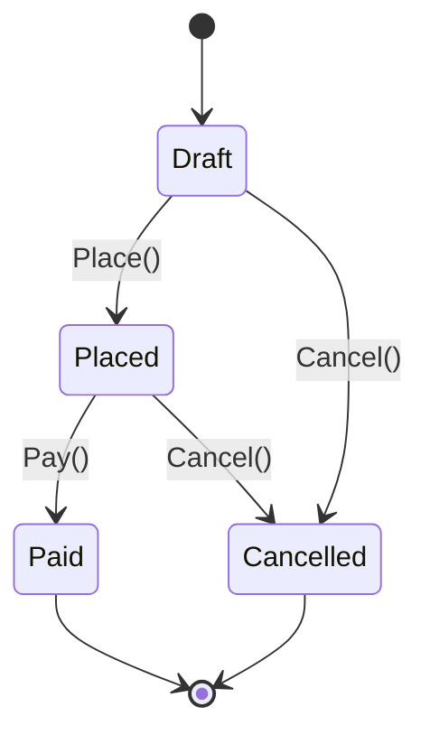
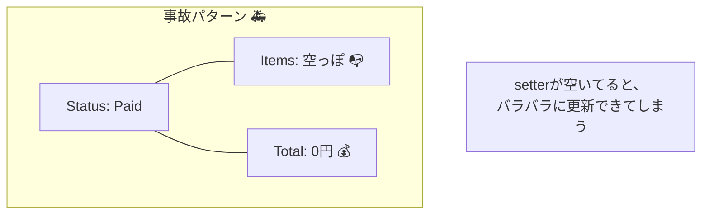
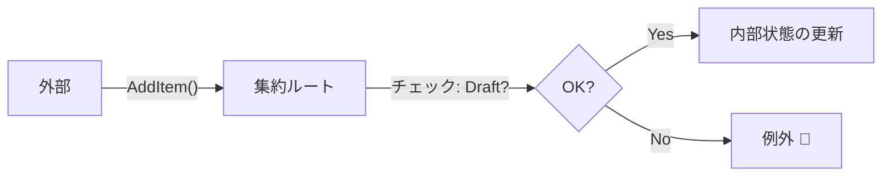

# 第19章：C#で不変条件を守る②（更新メソッドと状態遷移）🔁

## この章でできるようになること🎯💖

* **「変更はメソッドに閉じ込める」**ができるようになる✋✨
* **状態（Status）**で「今やっていい？ダメ？」を表現できる🚦
* **状態遷移＝小さな状態機械**の“入口”を作れる🌈🤖

---

## 1. まず結論：不変条件を守るコツはこの3つ🧠🔐


1. **public setter をやめる**（勝手に壊されるのを防ぐ）🚫
2. **更新は “意図があるメソッド” だけ**にする（AddItem / Place / Pay など）🧾✨
3. **状態（Status）と遷移ルールを “明示”**する（状態遷移表＋チェック）📋🚦



---

## 2. よくある事故：setter直開放で世界が壊れる💥😇

「どこからでも変更できる」って、一見ラクそうだけど…**不変条件が散らばって消える**のが致命傷だよ⚠️

```csharp
public class Order
{
    public OrderStatus Status { get; set; } // ←誰でも変えられる
    public List<OrderItem> Items { get; set; } = new();
    public decimal TotalPrice { get; set; }  // ←整合性がズレやすい
}
```

これだと、たとえば…

* Status を `Paid` にしたのに Items が空🫠
* `Placed` の後に Items を追加できちゃう🫠
* TotalPrice を更新し忘れてズレる🫠

こういう「整合性バグ」は、**“どこで守るの？”が曖昧**なほど増えるよ😵‍💫💦



---

## 3. 題材：カフェ注文（Order）を状態遷移で守ろう☕️🧁

この章の主役は **Order（注文）集約**🌳👑

### 状態（Status）を決める🚦

* `Draft`：カート編集できる📝
* `Placed`：注文確定✅（編集禁止にしたい）
* `Paid`：支払い完了💳
* `Cancelled`：キャンセル🚫

### この集約の不変条件（守りたいルール）🔐

例として、こんなルールを守るよ👇✨

* `Draft` のときだけ **明細追加/削除**できる🧾
* **空の注文は確定できない**（Items 0 はダメ）🚫
* `Placed` になると **明細変更できない**🔒
* `Placed` のときだけ **支払いできる**💳
* `Paid` は **もう一回 Paid にできない**🔁🚫

---

## 4. 状態遷移表を作る📋🚦（ここが設計のキモ！）

まずは「いまの状態 → 次の状態」が**何ならOKか**を表にするよ😊

| いまの状態     | Place（確定）✅ | Pay（支払い）💳 | Cancel（キャンセル）🚫   |
| --------- | ---------- | ---------- | ----------------- |
| Draft     | ✅ Placed   | ❌          | ✅ Cancelled       |
| Placed    | ❌          | ✅ Paid     | ✅ Cancelled（運用次第） |
| Paid      | ❌          | ❌          | ❌（返金など別ユースケースへ）   |
| Cancelled | ❌          | ❌          | ❌                 |

この表があると、コードは超スッキリする✨
そして後で「状態機械（State Machine）」に発展させやすい🌈

---

## 5. 実装方針：変更はメソッドでしか起こさない✋✨

ポイントはこれ👇

* プロパティは **private set**（外から勝手に変えられない）🔒
* Items は **外に List を生で渡さない**（ReadOnlyにする）🧷
* 状態変更は **ChangeStatus(次の状態)** に寄せる🚦



---

## 6. C#実装：更新メソッド＋状態遷移で守る🛠️💖

### 6.1 例外（いったんシンプル版）💥➡️💬

この章では、ルール違反は例外で止める形にするよ（次章で “見せ方” を整える）✨

```csharp
public sealed class DomainException : Exception
{
    public DomainException(string message) : base(message) { }
}
```

### 6.2 Order（集約ルート）🌳👑

```csharp
public enum OrderStatus
{
    Draft,
    Placed,
    Paid,
    Cancelled
}

public sealed class Order
{
    private readonly List<OrderItem> _items = new();

    public Guid Id { get; private set; } = Guid.NewGuid();
    public OrderStatus Status { get; private set; } = OrderStatus.Draft;

    // 外に List を渡さない（勝手に Add されるの防止）
    public IReadOnlyList<OrderItem> Items => _items;

    public decimal TotalPrice => _items.Sum(x => x.LineTotal);

    // EF Core 用（必要なら）: private ctor
    private Order() { }

    public static Order Create() => new();

    // ✅ Draft のときだけ明細追加OK
    public void AddItem(string menuId, string name, decimal unitPrice, int quantity)
    {
        EnsureStatusIs(OrderStatus.Draft, "注文確定後は明細を追加できないよ🙅‍♀️");

        if (quantity <= 0) throw new DomainException("数量は1以上にしてね🍰");
        if (unitPrice < 0) throw new DomainException("金額が変だよ💰😵");

        // 同じメニューがあれば加算、なければ追加（例）
        var existing = _items.FirstOrDefault(x => x.MenuId == menuId);
        if (existing is null)
        {
            _items.Add(OrderItem.Create(menuId, name, unitPrice, quantity));
        }
        else
        {
            existing.Increase(quantity);
        }
    }

    public void RemoveItem(string menuId)
    {
        EnsureStatusIs(OrderStatus.Draft, "注文確定後は明細を削除できないよ🙅‍♀️");

        var target = _items.FirstOrDefault(x => x.MenuId == menuId)
            ?? throw new DomainException("そのメニューは入ってないよ☕️");

        _items.Remove(target);
    }

    // ✅ 空の注文は確定できない
    public void Place()
    {
        EnsureStatusIs(OrderStatus.Draft, "この操作はいま出来ないよ🚦");

        if (_items.Count == 0)
            throw new DomainException("空の注文は確定できないよ🧾💦");

        ChangeStatus(OrderStatus.Placed);
    }

    // ✅ Placed のときだけ支払いOK
    public void Pay()
    {
        EnsureStatusIs(OrderStatus.Placed, "支払いは「注文確定のあと」だよ💳");

        ChangeStatus(OrderStatus.Paid);
    }

    public void Cancel()
    {
        // Draft / Placed だけ許可（Paid は別ユースケース：返金へ）
        if (Status is OrderStatus.Paid)
            throw new DomainException("支払い後キャンセルは返金手続きへ🙏💦");

        if (Status is OrderStatus.Cancelled)
            throw new DomainException("すでにキャンセル済みだよ🫠");

        ChangeStatus(OrderStatus.Cancelled);
    }

    // -------------------------
    // ここから「守る仕組み」👇✨
    // -------------------------

    private void EnsureStatusIs(OrderStatus expected, string messageIfNg)
    {
        if (Status != expected) throw new DomainException(messageIfNg);
    }

    private void ChangeStatus(OrderStatus next)
    {
        if (!IsValidTransition(Status, next))
            throw new DomainException($"状態遷移できないよ: {Status} → {next} 🚫");

        Status = next;
    }

    private static bool IsValidTransition(OrderStatus from, OrderStatus to) =>
        (from, to) switch
        {
            (OrderStatus.Draft, OrderStatus.Placed) => true,
            (OrderStatus.Draft, OrderStatus.Cancelled) => true,

            (OrderStatus.Placed, OrderStatus.Paid) => true,
            (OrderStatus.Placed, OrderStatus.Cancelled) => true,

            _ => false
        };
}
```

### 6.3 OrderItem（明細）🧾✨

「明細の中にも小さい不変条件」があるよ（数量マイナス禁止など）🔐

```csharp
public sealed class OrderItem
{
    public string MenuId { get; private set; } = default!;
    public string Name { get; private set; } = default!;
    public decimal UnitPrice { get; private set; }
    public int Quantity { get; private set; }

    public decimal LineTotal => UnitPrice * Quantity;

    private OrderItem() { }

    public static OrderItem Create(string menuId, string name, decimal unitPrice, int quantity)
    {
        if (string.IsNullOrWhiteSpace(menuId)) throw new DomainException("menuId が空だよ🥺");
        if (quantity <= 0) throw new DomainException("数量は1以上にしてね🍰");
        if (unitPrice < 0) throw new DomainException("金額が変だよ💰😵");

        return new OrderItem
        {
            MenuId = menuId,
            Name = name,
            UnitPrice = unitPrice,
            Quantity = quantity
        };
    }

    public void Increase(int add)
    {
        if (add <= 0) throw new DomainException("増やす数は1以上にしてね➕");
        Quantity += add;
    }
}
```

---

## 7. これで何が嬉しいの？（設計初心者に超重要）🌟

* **どこでルールを守るかが1箇所に集まる**（Order のメソッド）📌
* **状態遷移が表とコードで一致**する（ズレに気づける）🚦
* 「更新できる/できない」が **Status とガード節で説明できる**💬✨
* 後から「状態機械」「ドメインイベント」に自然に接続できる🌈📣

---

## 8. EF Core と“カプセル化”は両立できるよ🧪🧷

「private set にしたら EF が保存できないんじゃ…？」って不安、あるよね😅
でも EF Core には **Backing Field（バッキングフィールド）** など、カプセル化と相性の良い仕組みがあるよ✨
EF がプロパティじゃなく **フィールドへ読み書き**できるので、ドメイン側の“勝手にいじれない設計”を崩しにくいんだ🛡️ ([Microsoft Learn][1])

さらに、**EF Core 10 は .NET 10 上で動く**ので、スタックを揃えると迷いが減るよ🧭✨ ([Microsoft Learn][2])

---

## 9. 最新事情メモ（2026/01 時点）🆕🗞️

* **C# 14 が最新**で、**.NET 10**でサポートされてるよ✨ ([Microsoft Learn][3])
* **Visual Studio 2026** は .NET 10 SDK を含む案内になってるよ🧰✨ ([Microsoft Learn][3])
* **EF Core 10** は **2025年11月リリースのLTS**で、.NET 10 が必須だよ🧪🛡️ ([Microsoft Learn][2])

---

## 10. ミニ演習（手を動かすと一気に身につく）✍️🎀

### 演習1：状態遷移表を拡張しよう📋✨

`Refunded`（返金済み）を追加したいとき、

* `Paid → Refunded` を許可
* `Refunded → Cancelled` は不要（もう終わってる）
  みたいに「表→コード」の順で更新してみてね🚦🛠️

### 演習2：ユースケースで“禁止”を確認しよう🚫😇

次を呼ぶと例外になるのを確認してみよう👇

* `Pay()` を `Draft` のまま呼ぶ
* `Place()` を Items 0 のまま呼ぶ
* `Placed` の後に `AddItem()` を呼ぶ

### 演習3：テストで守れるようにしよう🧪✅

「不変条件はテストで固定」が超つよい💪✨
（xUnit などで）

* `Draft` で AddItem はOK
* `Placed` で AddItem はNG
* `Draft` で Place（Items 0）はNG
  をテストにしてみてね🧁

---

## 11. AI活用（Copilot / Codex）で爆速チェック🤖✨

AIは「実装の下書き」より、**“抜け漏れ検出”**に使うのが強いよ🕵️‍♀️💡

### 使えるプロンプト例🪄

* 「この Order の状態遷移、穴がないかチェックして。禁止すべき遷移も列挙して」🚦
* 「不変条件をテスト観点に落として、xUnit のテストケース案を10個出して」🧪
* 「Items を外部から変更できない設計になってる？抜け道があれば指摘して」🔒
* 「Cancel の仕様（Paid 以降）を返金ユースケースに分ける設計案を比較して」💳

---

## まとめ🌸✨

* **不変条件は “メソッド” に閉じ込める**と壊れにくい🔐
* **状態（Status）**で「いま何ができるか」を表現すると説明できる🚦
* **状態遷移表 → コード**の順にすると、設計がブレない📋✨
* EF Core でもカプセル化を守りやすい仕組みがある🧪🧷 ([Microsoft Learn][1])

[1]: https://learn.microsoft.com/en-us/ef/core/modeling/backing-field?utm_source=chatgpt.com "Backing Fields - EF Core"
[2]: https://learn.microsoft.com/en-us/ef/core/what-is-new/ef-core-10.0/whatsnew?utm_source=chatgpt.com "What's New in EF Core 10"
[3]: https://learn.microsoft.com/en-us/dotnet/csharp/whats-new/csharp-14?utm_source=chatgpt.com "What's new in C# 14"
