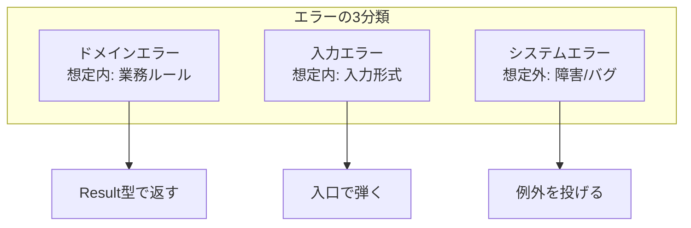
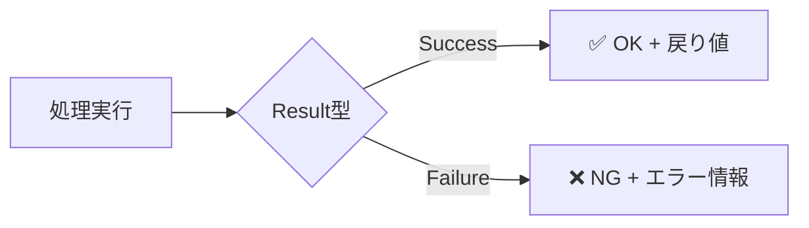
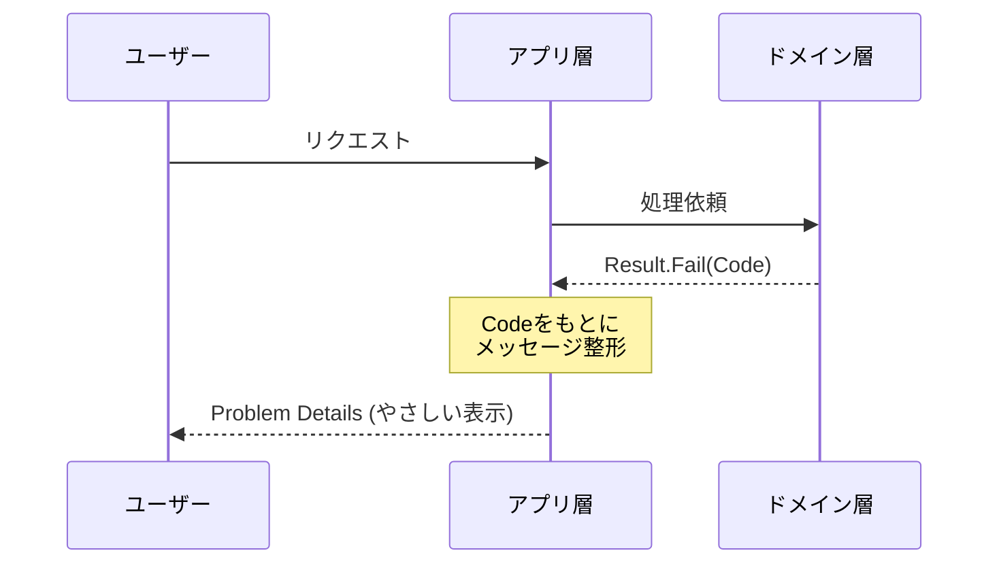

# 第20章：ドメインエラーの設計（初心者向け）💬⚠️

---

## 20.1 この章でできるようになること🎯✨

* 「失敗の種類」を整理して、**バグりにくいエラー設計**ができるようになる😊
* **ユーザーに見せる文言**と、**ログに残す詳細**を分けられる🧾🔍
* 集約のルール違反（例：確定後の変更など）を、**きれいに扱える**ようになる🌳🔒

---

## 20.2 いきなり結論：エラーは“混ぜるな危険”🚫🧪

初心者がやりがちなのがこれ👇

* 何でも `throw new Exception("なんかダメ")` 💥
* 例外メッセージをそのまま画面に表示😱
* 失敗の理由がバラバラで、UI側が対応できない😵

これを直すには、まず **「失敗の種類」を分ける**のが最強です💪✨

---

## 20.3 失敗は3種類に分ける（超重要）🧠⚖️


### A) ドメインエラー（想定内の失敗）🧾✅

業務ルール的に「それはダメだよね」ってやつ。

* 例：注文が確定済みなのに明細追加しようとした🧾🚫
* 例：在庫が足りない📦❌
* 例：クーポン期限切れ🎫⌛

👉 **Result型で返す**のが相性◎（後で詳しく）✨

### B) 入力エラー（Validation）📝⚠️

値が変・不足など。

* 例：個数が0、金額がマイナス、必須項目が空😵‍💫

👉 これは UI / API の入口で早めに弾くのが◎👮‍♀️✨

### C) システムエラー（想定外・障害）🔥🧯

アプリの都合で起きるやつ。

* DB接続が落ちた💾💥
* ネットワーク障害🌐⚡
* バグで NullReferenceException 🤕

👉 これは **例外（Exception）**でOK。
ただし、**ユーザーに詳細を見せない**のが鉄則🫶🧾



---

## 20.4 「例外」ってどこまで投げていいの？🤔💥

### 例外を投げていいケース✅

* “本来ありえない状態”＝**プログラムのバグ**を示すとき🐛
* インフラ障害（DB・外部API・ファイルなど）🚧

### 例外を投げない方がいいケース🚫

* 業務ルール違反（＝ユーザー操作で普通に起きうる）🙅‍♀️
  → 例外で止めると、制御がギクシャクしがち😵

---

## 20.5 Result型ってなに？（超やさしく）🍬


Result型は、ざっくり言うと👇

* 成功なら ✅「OK」
* 失敗なら ❌「この理由でダメ」

を **型で表す**やり方です✨



---

## 20.6 “ユーザー向けメッセージ”と“ログの詳細”を分ける🧾🔐


### ユーザー向け💬🌸

* やさしい
* 短い
* 次にどうすればいいかが分かる

例：

* 「注文はすでに確定済みです。内容を変更するにはキャンセルしてください。」🙏

### ログ向け🔍🧑‍💻

* 具体的
* 解析できる
* トレースIDや例外情報つき

例：

* `OrderId=..., Status=Confirmed, Command=AddItem, UserId=...` 🧩

---

## 20.7 実装してみよう：DomainError + Result（最小セット）🛠️✨

まずは「エラーはコードで識別」できるようにするのがコツ🆔💡
（文言だけだと後で崩壊しやすい…！😇）

```csharp
// ドメイン層：業務ルール違反を表す「エラー」
public sealed record DomainError(string Code, string Message);

// 成功/失敗だけの Result
public readonly record struct Result(bool IsSuccess, DomainError? Error)
{
    public static Result Ok() => new(true, null);
    public static Result Fail(DomainError error) => new(false, error);
}

// 値を返したい版
public readonly record struct Result<T>(bool IsSuccess, T? Value, DomainError? Error)
{
    public static Result<T> Ok(T value) => new(true, value, null);
    public static Result<T> Fail(DomainError error) => new(false, default, error);
}
```

---

## 20.8 例：注文（Order）集約でドメインエラーを返す🌳☕️

「確定済みなら変更できない」みたいなルールを、集約が守るんだったよね🔐✨
そのとき、例外じゃなく Result で返してみる👇

```csharp
public enum OrderStatus { Draft, Confirmed, Cancelled }

public static class OrderErrors
{
    public static DomainError AlreadyConfirmed(Guid orderId)
        => new("order.already_confirmed", $"注文は確定済みです (OrderId={orderId})");

    public static DomainError InvalidQuantity(int quantity)
        => new("order.invalid_quantity", $"数量が不正です (Quantity={quantity})");
}

public sealed class Order
{
    public Guid Id { get; }
    public OrderStatus Status { get; private set; } = OrderStatus.Draft;

    private readonly List<(string ItemName, int Quantity)> _items = new();

    public Order(Guid id) => Id = id;

    public Result AddItem(string itemName, int quantity)
    {
        if (Status != OrderStatus.Draft)
            return Result.Fail(OrderErrors.AlreadyConfirmed(Id));

        if (quantity <= 0)
            return Result.Fail(OrderErrors.InvalidQuantity(quantity));

        _items.Add((itemName, quantity));
        return Result.Ok();
    }

    public Result Confirm()
    {
        if (Status != OrderStatus.Draft)
            return Result.Fail(OrderErrors.AlreadyConfirmed(Id));

        Status = OrderStatus.Confirmed;
        return Result.Ok();
    }
}
```

ポイント🎀

* ドメインは「失敗理由」を返すだけ（UIの見せ方は知らない）🧠
* エラーの **Code** があるから、UI側で分岐しやすい🆔✨

---

## 20.9 境界（アプリ層）でエラーを“整形”する✨🧁

ここがこの章のメインテーマ！🎬🔒
**ドメインの失敗**を、アプリ層で「ユーザー向けの形」に整えるよ💬✨

---

### 20.9.1 Web APIなら Problem Details が便利（標準フォーマット）📦🌐


ASP.NET Core には Problem Details（問題詳細）を扱う仕組みがあり、`AddProblemDetails` などで統一しやすいよ🧩✨ ([Microsoft Learn][1])
なお、Problem Details の元仕様は RFC 7807 ベースとして説明されていて([Microsoft Learn][2])、新しい RFC 9457 が RFC 7807 を置き換えた（obsoletes）形だよ📜✨ ([RFC エディタ][3])

---

### 20.9.2 Result → HTTP応答に変換する（最小API例）🚀

```csharp
using Microsoft.AspNetCore.Mvc;

var builder = WebApplication.CreateBuilder(args);

// ProblemDetails サービス登録（統一したエラー出力に役立つ）
builder.Services.AddProblemDetails(); // :contentReference[oaicite:3]{index=3}

var app = builder.Build();

app.MapPost("/orders/{id:guid}/items", (Guid id, AddItemRequest req) =>
{
    // ここでは説明のため直呼び（本番はApplication Serviceに寄せる）
    var order = new Order(id);

    var result = order.AddItem(req.ItemName, req.Quantity);

    if (result.IsSuccess) return Results.Ok();

    // ユーザー向けは「やさしく短く」💬
    // 詳細は extensions に寄せてログやクライアント側で使えるように🧾
    return Results.Problem(
        title: "注文を更新できませんでした",
        statusCode: 400,
        extensions: new Dictionary<string, object?>
        {
            ["code"] = result.Error!.Code,
            ["message"] = "入力内容を確認して、もう一度お試しください 🙏"
        });
});

app.Run();

public sealed record AddItemRequest(string ItemName, int Quantity);
```

コツ🪄

* `title` はユーザー向け（短く）💬
* `code` は機械向け（UI分岐・翻訳キー）🆔
* ドメインの `Message` をそのまま出すのは避けがち（内部情報になりやすい）🔐



---

## 20.10 “ドメインのエラーメッセージ”はどこまで書く？🤔🧾


おすすめの考え方👇✨

* ドメインの `Message` は「開発者が理解できる情報」寄り🧑‍💻
* UI表示は、アプリ層で **Code→表示文言** に変換💬🌸

  * 将来、文言を変えてもコードは同じでOK🪄
  * 多言語化もしやすい🌍

---

## 20.11 「最新のC#/.NET」前提として押さえる小ネタ📌✨

* .NET の最新LTSは **.NET 10（2025-11-11リリース、2026-01-13時点で 10.0.2 などの更新）** ([Microsoft][4])
* C# の最新は **C# 14（.NET 10 上でサポート）** ([Microsoft Learn][5])
* EF Core も **EF Core 10** が .NET 10 世代でLTS（.NET 10 が必須） ([Microsoft Learn][6])

この章のコードは、こういう“今どき前提”でスムーズに通る感じだよ😊✨

---

## 20.12 よくある設計ミスあるある（先に潰す）💥😇


* ❌ エラー文言で `if (message.Contains("確定済み"))` みたいな分岐
  → 文字が変わった瞬間に死ぬ😇
* ❌ 例外を握りつぶして `return null;`
  → 原因が消えて、後で地獄👻
* ❌ ドメイン層でログを書きまくる
  → 依存が増えて、ドメインが汚れがち🧼

---

## 20.13 ミニ演習（手を動かす）✍️🎀

### 演習A：エラー一覧を作る🗒️✨

カフェ注文で、最低これだけ Code を作ってみよう👇☕️

* `order.already_confirmed`（確定済みで変更不可）
* `order.invalid_quantity`（数量不正）
* `payment.method_not_allowed`（支払い方法NG）
* `inventory.not_enough`（在庫不足）

### 演習B：Code→表示文言の辞書を作る📖💬

アプリ層に「表示メッセージ辞書」を置いてみよう🌸

* 例：`order.already_confirmed` → 「注文は確定済みです。変更できません🙏」

### 演習C：Problem Details に `code` を必ず入れる🧩

失敗時レスポンスに `extensions["code"]` を常に入れるルールにしてみよう🆔✨ ([Microsoft Learn][1])

---

## 20.14 Copilot / Codex を使うコツ（丸投げ禁止の型）🤖✨

使いどころはここが強いよ👇

* エラーコード案をまとめてもらう🆔🧠
* 表示メッセージ案を“やさしい日本語”で作ってもらう💬🌸
* Result→HTTP変換のボイラープレートを生成してもらう🧩

プロンプト例（そのまま使える）🪄

* 「カフェ注文ドメインで起こりうる業務ルール違反を10個挙げて、`code` を `snake.case` で提案して」
* 「`order.already_confirmed` をユーザー向けに、責めない・短い・次の行動が分かる文にして（候補5つ）」
* 「Result型の失敗を ProblemDetails に変換する拡張メソッドを書いて。`extensions.code` を必ず入れて」

⚠️最後に必ずやること

* 生成物の `code` がブレてないか確認🧾
* UI表示文言が“内部情報”を漏らしてないか確認🔐
* 例外にすべきケース（障害・バグ）まで Result にしてないか確認💥

---

## 20.15 まとめ🏁✨

* ドメインエラー（想定内）＝ **Resultで返す**のが扱いやすい✅
* システムエラー（想定外）＝ **例外でOK、でも表示はやさしく**🧯
* **ユーザー向け**と**ログ向け**は分ける🧾🔍
* 境界（アプリ層）でエラーを整形して、返す形を統一する✨
* Web APIなら Problem Details が便利で、今は RFC 7807 ベースの説明が多いけど、新しい RFC 9457 が RFC 7807 を置き換えた流れも押さえると安心📜🌸 ([Microsoft Learn][2])

[1]: https://learn.microsoft.com/en-us/aspnet/core/fundamentals/error-handling-api?view=aspnetcore-10.0&utm_source=chatgpt.com "Handle errors in ASP.NET Core APIs"
[2]: https://learn.microsoft.com/en-us/dotnet/api/microsoft.aspnetcore.mvc.problemdetails?view=aspnetcore-10.0&utm_source=chatgpt.com "ProblemDetails Class (Microsoft.AspNetCore.Mvc)"
[3]: https://www.rfc-editor.org/rfc/rfc9457.html?utm_source=chatgpt.com "RFC 9457: Problem Details for HTTP APIs"
[4]: https://dotnet.microsoft.com/en-us/platform/support/policy/dotnet-core?utm_source=chatgpt.com "NET and .NET Core official support policy"
[5]: https://learn.microsoft.com/en-us/dotnet/csharp/whats-new/csharp-14?utm_source=chatgpt.com "What's new in C# 14"
[6]: https://learn.microsoft.com/en-us/ef/core/what-is-new/ef-core-10.0/whatsnew?utm_source=chatgpt.com "What's New in EF Core 10"
