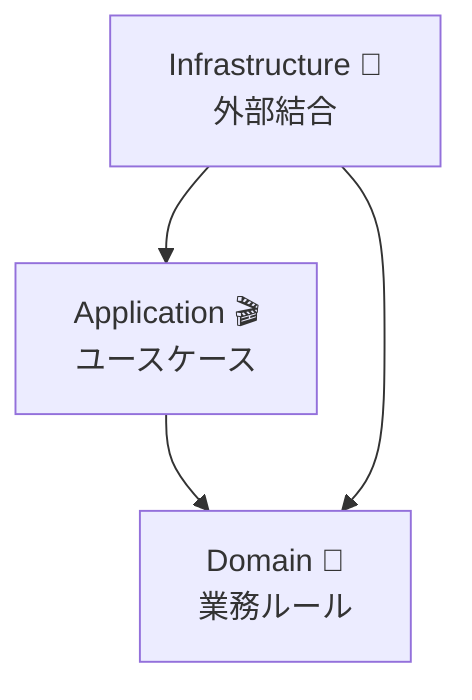
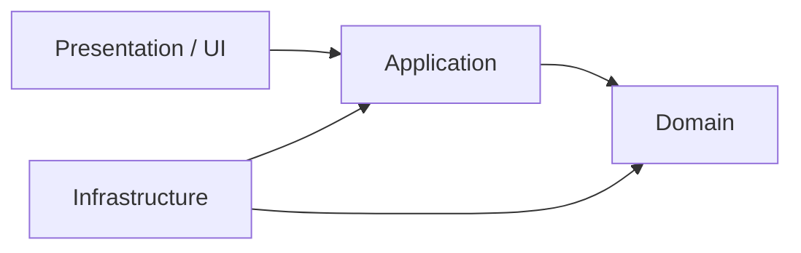
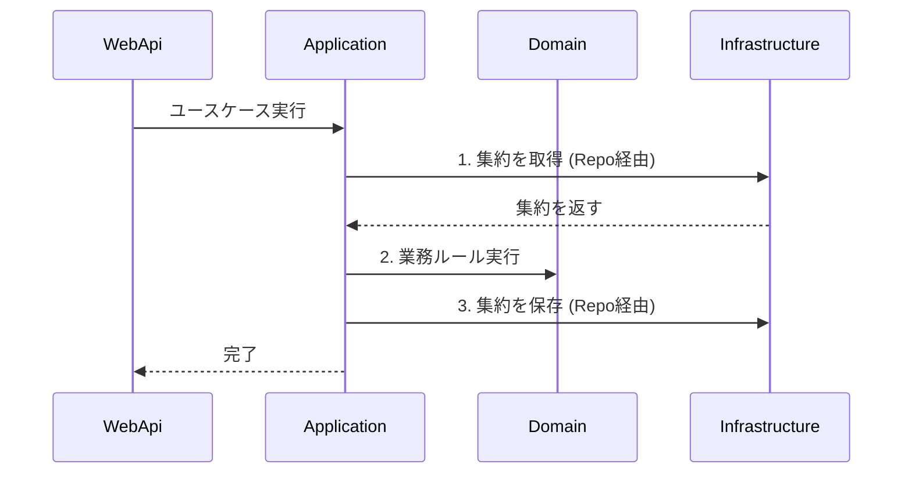

# 第21章：レイヤード構成（置き場所で迷子にならない）🗂️

## この章でできるようになること 🎯🌸

* 「Domain / Application / Infrastructure」それぞれの役割がわかる📚✨
* クラスの置き場所で迷わなくなる（迷った時の判断軸を持つ）🧭💡
* Visual Studio のプロジェクト構成で “依存関係ルール” を強制できるようになる🔒🧱
* “集約（Aggregate）とトランザクション境界” がブレにくい構成になる🌳🔒

---

## 1) レイヤードって、何のため？🤔🗂️

目的はシンプルで、だいたいこの3つだよ👇✨

* **迷子防止**：どこに何を書けばいいか決める📍
* **変更に強く**：DBや外部APIが変わっても、ドメイン（業務ルール）を守る🛡️
* **テストしやすく**：ドメインを単体でサクサク検証できる🧪💕

---

## 2) 3レイヤーの役割（超ざっくり）🧁📚


## 🟩 Domain（ドメイン層）＝「業務ルールの本体」🌳👑

* Entity / ValueObject / 集約ルート / 不変条件（Invariants）
* 「こうあるべき！」というルールを守る担当✨
* **DB・HTTP・ファイル・時刻取得ライブラリ**など “外の都合” は知らない🙅‍♀️

---

## 🟦 Application（アプリ層）＝「ユースケース進行役」🎬🔒

* 例：`PlaceOrder`（注文確定）みたいな **1ユースケース** を進める
* **トランザクション境界**を置くことが多い（この教材の主役に近い）🔒✨
* Domainを呼び出して、保存して、結果を返す…の “段取り” をする📦➡️

---

## 🟧 Infrastructure（インフラ層）＝「外部とつなぐ実装」🔌🗄️

* DB（EF Core）、外部API、メッセージング、ファイル、メール送信など
* Application が求める `IOrderRepository` を **実装**する🏗️
* “差し替え可能” にするのが大事（Domainが汚れない）🧼✨



EF Core 10 は .NET 10 向けのリリースだよ（LTS・2025年11月リリース）。([Microsoft Learn][1])

---

## 3) いちばん大事：依存関係ルール（矢印は内側へ）🧱➡️💖

レイヤードの最重要ルールはこれ👇

* **Domain は誰にも依存しない（外側を参照しない）**👑
* **Application は Domain に依存してOK**🎬➡️🌳
* **Infrastructure は Domain / Application に依存してOK**🔌➡️🎬🌳
* **逆方向はNG**🙅‍♀️（DomainがEF Coreを参照、とか）

イメージ👇（矢印が “参照していい方向”）✨



---

## 4) Visual Studio の “プロジェクト分割” で強制する📁🔒✨

フォルダ分けだけだと、うっかり参照できちゃう😇
**プロジェクトを分ける**と、参照ミスをコンパイルで止められるよ💪✨

## 例：カフェ注文（Cafe）ソリューション構成 ☕️📦

* `Cafe.Domain`（クラス ライブラリ）
* `Cafe.Application`（クラス ライブラリ）
* `Cafe.Infrastructure`（クラス ライブラリ）
* `Cafe.WebApi`（ASP.NET Core Web API とか。UI枠）🌐✨

## 参照関係（これだけ覚えてOK）🧠💡

* `Cafe.Domain` → （参照なし）✅
* `Cafe.Application` → `Cafe.Domain` ✅
* `Cafe.Infrastructure` → `Cafe.Application` と `Cafe.Domain` ✅
* `Cafe.WebApi` → `Cafe.Application` と `Cafe.Infrastructure` ✅
* `Cafe.Domain` → `Cafe.Infrastructure` ❌（絶対ダメ）🙅‍♀️

ちなみに、C# 14 が最新で .NET 10 上でサポートされてるよ。([Microsoft Learn][2])
Visual Studio 2026 は .NET 10 SDK を含むよ。([Microsoft Learn][2])
.NET 10 は LTS で、サポート期限も公開されてるよ。([Microsoft][3])

---

## 5) 「どこに置く？」早見表 🗺️✨

| 置きたいもの                                       | 置き場所                      | 理由（超短く）      |
| -------------------------------------------- | ------------------------- | ------------ |
| 集約ルート（Order など）🌳                            | Domain                    | ルールの本体だから    |
| 不変条件チェック🔐                                   | Domain                    | ここが壊れると全部壊れる |
| ドメインエラー（例：`OrderAlreadyPaid`）⚠️              | Domain（または Domain.Shared） | ルール違反の表現     |
| ユースケース（PlaceOrder）🎬                         | Application               | 進行役だから       |
| DTO / ViewModel（画面に返す形）📦                    | Application（または WebApi）   | ドメインを汚さない    |
| Repository の interface（`IOrderRepository`）🏪 | Application（または Domain）   | “必要” を内側で定義  |
| EF Core DbContext / Migration 🧪🗄️          | Infrastructure            | 外部都合だから      |
| Repository 実装（`EfOrderRepository`）🏗️        | Infrastructure            | 外部つなぎ担当      |
| DI設定（AddDbContext など）🧷                      | WebApi（Program.cs）        | 組み立ては一番外側    |

> Repository interface を Domain に置くか Application に置くかは流派があるけど、初心者は **「ユースケースが必要とする保存」を Application に置く** が迷いにくいよ😊🏪✨

---

## 6) ミニ実例：注文確定ユースケースの “置き場所” を見る 👀☕️

ここは「コードの完成」より、**配置感**を掴むのが目的だよ🌸

## 🟩 Domain：集約ルート（Order）🌳

```csharp
namespace Cafe.Domain.Orders;

public sealed class Order
{
    public OrderId Id { get; }
    public OrderStatus Status { get; private set; }

    private readonly List<OrderItem> _items = new();
    public IReadOnlyList<OrderItem> Items => _items;

    private Order(OrderId id)
    {
        Id = id;
        Status = OrderStatus.Draft;
    }

    public static Order CreateNew(OrderId id) => new(id);

    public void AddItem(MenuItemId menuItemId, int quantity)
    {
        if (Status != OrderStatus.Draft)
            throw new InvalidOperationException("確定後は明細を追加できません🥲");

        if (quantity <= 0)
            throw new ArgumentOutOfRangeException(nameof(quantity));

        _items.Add(new OrderItem(menuItemId, quantity));
    }

    public void Place()
    {
        if (_items.Count == 0)
            throw new InvalidOperationException("明細が0件の注文は確定できません🥲");

        if (Status != OrderStatus.Draft)
            throw new InvalidOperationException("注文は一度だけ確定できます🥲");

        Status = OrderStatus.Placed;
    }
}

public enum OrderStatus { Draft, Placed, Paid }
```

ポイント💡

* **ルール（不変条件）を Domain のメソッドに閉じ込める**🔒✨
* 外から `Status` を勝手に変えられないようにしてる（`private set`）🚫

---

## 🟦 Application：ユースケース（PlaceOrder）🎬🔒

```csharp
namespace Cafe.Application.Orders;

public sealed class PlaceOrderUseCase
{
    private readonly IOrderRepository _orders;

    public PlaceOrderUseCase(IOrderRepository orders)
    {
        _orders = orders;
    }

    public async Task ExecuteAsync(Guid orderId, CancellationToken ct)
    {
        var order = await _orders.GetAsync(orderId, ct)
                    ?? throw new InvalidOperationException("注文が見つかりません🥲");

        order.Place(); // ルールはDomainにある🌳

        await _orders.SaveAsync(order, ct); // 保存はRepositoryへ🏪
    }
}

public interface IOrderRepository
{
    Task<Domain.Orders.Order?> GetAsync(Guid id, CancellationToken ct);
    Task SaveAsync(Domain.Orders.Order order, CancellationToken ct);
}
```

ポイント💡

* “DBの詳細” は知らない（Repository に任せる）🙆‍♀️✨



---

## 🟧 Infrastructure：EF Core 実装（例）🗄️🧪

```csharp
namespace Cafe.Infrastructure;

public sealed class CafeDbContext : DbContext
{
    public DbSet<Cafe.Domain.Orders.Order> Orders => Set<Cafe.Domain.Orders.Order>();

    public CafeDbContext(DbContextOptions<CafeDbContext> options) : base(options) { }
}

public sealed class EfOrderRepository : Cafe.Application.Orders.IOrderRepository
{
    private readonly CafeDbContext _db;

    public EfOrderRepository(CafeDbContext db) => _db = db;

    public Task<Cafe.Domain.Orders.Order?> GetAsync(Guid id, CancellationToken ct)
        => _db.Orders.FirstOrDefaultAsync(x => x.Id.Value == id, ct);

    public async Task SaveAsync(Cafe.Domain.Orders.Order order, CancellationToken ct)
    {
        _db.Update(order);
        await _db.SaveChangesAsync(ct);
    }
}
```

ここは “外部都合ゾーン” だから、EF Core がいてOKだよ🧪✨

---

## 7) 迷子になりがちなパターン集 🧟‍♀️📌（あるある救急箱🚑）

## ❌ Domain に DbContext が出てくる

* “ドメインがインフラを知ってしまう” ので事故のもと💥
* ✅ 対策：Domain からは Repository interface だけ見えるように

## ❌ Application が EF の IQueryable を返す

* UI側でクエリが伸びて、境界がグチャグチャになる😵
* ✅ 対策：Application は DTO で返す、Query は専用クラスにする🔎

## ❌ “便利だから” でどこでも static Util

* 依存が増えて、テストがつらくなる🥲
* ✅ 対策：値オブジェクト化、または Application の小さなサービスに寄せる🧩

## ❌ 置き場所に悩んで止まる

* ✅ 対策：次の質問で決める👇

  1. それは **業務ルール**？ → Domain 🌳
  2. それは **ユースケースの段取り**？ → Application 🎬
  3. それは **外部の詳細**？ → Infrastructure 🔌

---

## 8) AI（Copilot / Codex）活用：この章のおすすめプロンプト集 🤖✨

“丸投げ禁止” で、**判断材料を出させる**のがコツだよ🧠💕

## ① 置き場所判定を手伝わせる🧭

* 「このクラス（責務は○○）は Domain/Application/Infrastructure のどこに置くべき？理由を3つ、逆に置いちゃダメな場所も教えて」

## ② 依存関係チェック🧱

* 「この参照関係（A→B→C…）はレイヤードの依存ルールに違反してない？違反なら直し方を2案」

## ③ Visual Studio のプロジェクト参照設計📁

* 「この4プロジェクト構成で、参照設定を一覧にして。NGな参照も明記して」

## ④ サンプル骨組み生成（最小）🧩

* 「Order 集約（AddItem/Place の不変条件つき）と PlaceOrderUseCase、IOrderRepository、EfOrderRepository の骨組みを作って。DomainはEF参照禁止で」

---

## 9) ミニ演習（10〜20分）✍️🌸

## 演習A：置き場所クイズ🗂️

次の5つ、どの層に置く？（理由も1行で）✨

* `Order.Place()`
* `PlaceOrderUseCase.ExecuteAsync()`
* `EfOrderRepository`
* `OrderPlacedDto`
* `CafeDbContext`

## 演習B：参照の矢印を直す➡️

「Domain → Infrastructure を参照してしまってる」状態を想像して、どう直す？
ヒント：**interface を内側に置いて、実装を外側に逃がす**🏪✨

## 演習C：フォルダ整理ビフォーアフター📁✨

ぐちゃぐちゃな `Models/Services/Utils` を
`Domain/ Application/ Infrastructure` に振り分けるルールを自分の言葉で3つ書く📝💕

---

## まとめ 🧁✨

* レイヤードは「置き場所のルール」で迷子を防ぐ🗂️
* 依存は **外→内**（Domain は最強の純粋ゾーン）👑🌳
* プロジェクト分割で、ルール違反をコンパイルで止められる🔒
* 集約とトランザクション境界が “自然に” きれいに保てるようになる☕️🔒✨

[1]: https://learn.microsoft.com/en-us/ef/core/what-is-new/ef-core-10.0/whatsnew?utm_source=chatgpt.com "What's New in EF Core 10"
[2]: https://learn.microsoft.com/en-us/dotnet/csharp/whats-new/csharp-14?utm_source=chatgpt.com "What's new in C# 14"
[3]: https://dotnet.microsoft.com/ja-jp/platform/support/policy/dotnet-core?utm_source=chatgpt.com ".NET および .NET Core の公式サポート ポリシー"
