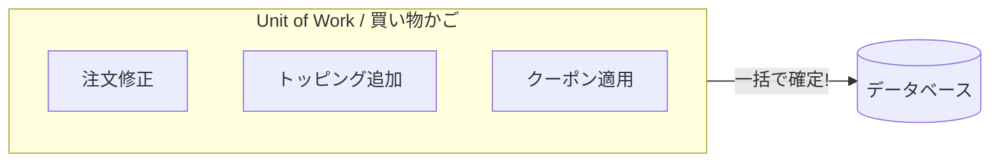
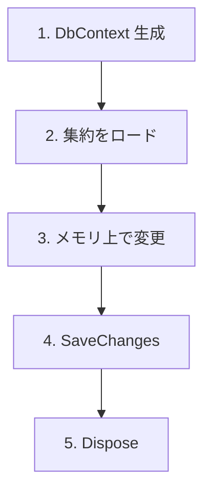
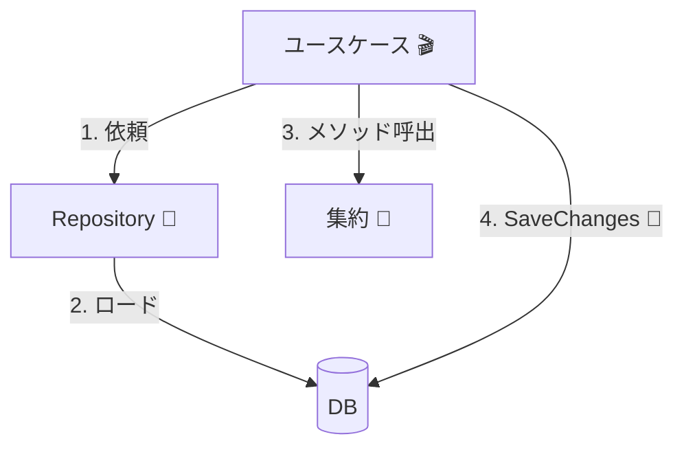

# 第23章：Unit of Workの感覚（DbContextの立ち位置）🧠

## この章でわかること🎯✨

* **Unit of Work（UoW）**って結局なに？（難語じゃなく感覚で）🧁
* **DbContextが“何をまとめてるのか”**がスッとわかる👀
* **SaveChangesの置き場所＝トランザクション境界**ってどういうこと？🔒
* ありがちな事故（SaveChanges乱発・DbContext乱立）を回避できる🚧💥
* AI（Copilot/Codex等）を使って、正しい置き場所をサクッと確認できる🤖✅

---

## 1) Unit of Workって、超ざっくり言うと？🧁🧠


Unit of Work（UoW）は、ひとことで言うと…

✅ **「いま行った変更を“ひとまとまり”として記録して、最後にまとめて確定する仕組み」**だよ💾✨

たとえば、カフェで注文を直す場面を想像してね☕️

* ドリンクを変更する🥤➡️🍵
* トッピングを追加する🧁
* クーポンを適用する🎟️
* 最後に「この内容で確定！」を押す✅

この「確定」までの一連が、**1つのUnit of Work**って感じ🌸



---

## 2) DbContextは “Unit of Workそのもの” 🧠🏷️


EF Coreでは、**DbContextが「1つのUnit of Workのために使う想定」**で設計されてるよ。([Microsoft Learn][1])

つまり…

* DbContextを作る＝**この作業（UoW）を始めます**🧑‍💻
* エンティティを読み取る＝**作業対象を机に広げる**🗂️
* 値を変える＝**机の上で手直しする**✍️
* SaveChanges＝**机の上の変更をまとめて提出（確定）**📮✅
* DbContextを捨てる（Dispose）＝**この作業は終わり**掃除



---

## 3) SaveChangesは「確定ボタン」🎯✅（しかも基本はトランザクション付き）


超重要ポイント💡

✅ **SaveChanges 1回の中の変更は、基本的に“1つのトランザクション”で適用される**（DBが対応していれば）([Microsoft Learn][2])

つまり…

* 成功したら全部反映✅
* 途中で失敗したら全部なかったことになる💥（ロールバック）

だから、初心者のうちはまずこの感覚でOK🙆‍♀️✨
**「SaveChanges 1回 = 1回の確定 = 1つの安全な塊」**🔒

---

## 4) 図でつかむ：DbContextの立ち位置🗺️✨


```text
[Application Service（ユースケース）]
   ├─ DbContext を使って
   ├─ 集約をロードして
   ├─ 集約のメソッドで状態変更して
   └─ SaveChanges（ここが確定＝境界）✅🔒

[Domain（集約）]
   └─ 不変条件を守りながら状態遷移だけ担当 🌳
      （SaveChanges や Transaction は知らない）
```

この章の結論はこれ👇
✅ **「DbContext/SaveChangesはアプリ層（ユースケース側）に寄せる」**
→ だから **“いつ確定するか”をユースケースが握れる**🔒🎬



---

## 5) 例：カフェ注文（Order集約）でUnit of Workを体感☕️📦

ここでは「注文確定（PlaceOrder）」を例にするよ😊
やりたいことはシンプル：

* 注文（Order）を取り出す📦
* 明細を追加する🧾
* 不変条件チェックを通す🔐
* 最後に SaveChanges で確定✅

---

## 6) 最小サンプル：Repositoryあり（おすすめの形）🏪✨

ポイントはこれ👇

* Repositoryは **集約を出し入れ**するだけ🚪
* **SaveChangesはRepositoryで呼ばない**🙅‍♀️
* **ユースケースで最後に1回だけ**呼ぶ✅

## Domain（集約：Order）🌳

```csharp
public sealed class Order
{
    public Guid Id { get; private set; }
    public OrderStatus Status { get; private set; } = OrderStatus.Draft;

    private readonly List<OrderItem> _items = new();
    public IReadOnlyList<OrderItem> Items => _items;

    private Order() { } // EF用

    public Order(Guid id)
    {
        Id = id;
    }

    public void AddItem(string menuCode, int quantity)
    {
        if (Status != OrderStatus.Draft)
            throw new InvalidOperationException("確定後は明細を追加できません🙅‍♀️");

        if (quantity <= 0)
            throw new ArgumentOutOfRangeException(nameof(quantity));

        _items.Add(new OrderItem(menuCode, quantity));
    }

    public void Confirm()
    {
        if (_items.Count == 0)
            throw new InvalidOperationException("明細が0件の注文は確定できません🧾🚫");

        Status = OrderStatus.Confirmed;
    }
}

public enum OrderStatus
{
    Draft,
    Confirmed
}

public sealed class OrderItem
{
    public string MenuCode { get; private set; }
    public int Quantity { get; private set; }

    private OrderItem() { } // EF用

    public OrderItem(string menuCode, int quantity)
    {
        MenuCode = menuCode;
        Quantity = quantity;
    }
}
```

## Repository（集約単位）🏪

```csharp
using Microsoft.EntityFrameworkCore;

public sealed class OrderRepository
{
    private readonly AppDbContext _db;

    public OrderRepository(AppDbContext db) => _db = db;

    public Task<Order?> FindAsync(Guid orderId, CancellationToken ct)
        => _db.Orders
              .Include(o => o.Items)
              .FirstOrDefaultAsync(o => o.Id == orderId, ct);

    public void Add(Order order) => _db.Orders.Add(order);
}
```

## Application Service（ユースケース：ここがUoWの司令塔）🎬🔒

```csharp
public sealed class PlaceOrderService
{
    private readonly AppDbContext _db;
    private readonly OrderRepository _orders;

    public PlaceOrderService(AppDbContext db, OrderRepository orders)
    {
        _db = db;
        _orders = orders;
    }

    public async Task PlaceOrderAsync(Guid orderId, CancellationToken ct)
    {
        // 1) 取る（同じDbContextで取るのが基本）👀
        var order = await _orders.FindAsync(orderId, ct);
        if (order is null) throw new InvalidOperationException("注文が見つかりません😢");

        // 2) いじる（不変条件は集約が守る）🔐
        order.AddItem("LATTE", 1);
        order.Confirm();

        // 3) 確定（ここが境界）✅🔒
        await _db.SaveChangesAsync(ct);
    }
}
```

---

## 7) 「同じDbContextで取って、同じDbContextで保存」が強い理由💪✨


EF Coreは、基本的に **DbContextがエンティティの変更を追跡（Change Tracking）**して、SaveChangesのときに差分を反映するのが得意だよ。([Microsoft Learn][3])

だから初心者のうちは、まずこの型でOK👇
✅ **同一ユースケース内では “同じDbContext” を使い続ける**

---

## 8) よくある事故あるある🚑💥（そして回避法）

## 事故①：SaveChangesを何回も呼ぶ（境界がグチャる）😵


* 明細追加ごとにSaveChanges
* ステータス変更ごとにSaveChanges

💥 こうなると「途中だけ確定」みたいな状態が増えて、整合性が壊れやすい…

✅ 回避：**原則「ユースケースの最後に1回」**🎯

---

## 事故②：Repositoryの中でSaveChangesしちゃう🙅‍♀️


* Repositoryが勝手に確定する
  → アプリ層が境界をコントロールできない

✅ 回避：Repositoryは「出し入れだけ」🚪
確定（SaveChanges）はユースケース🎬

---

## 事故③：同じユースケースでDbContextを作り直す（追跡が切れる）✂️


* AのDbContextで取ったOrderを
* BのDbContextで更新しようとして混乱

✅ 回避：**1ユースケース＝1DbContextの寿命**🧠
DbContextは「短命」設計だよ。([Microsoft Learn][1])

---

## 事故④：DbContextを長生きさせすぎる（巨大UoW）🧟‍♀️

* 画面をまたいで同じDbContextを保持
* ずっと追跡し続けて重くなる🐘

✅ 回避：**操作（ユースケース）ごとに作って捨てる**🧹

---

## 9) 明示トランザクションって必要？🔒🤔（ここは“使う時だけ”）

基本はこう👇
✅ **SaveChanges 1回なら、暗黙トランザクションでOK**([Microsoft Learn][2])

じゃあ明示トランザクションが必要になりやすいのは？

* **SaveChangesを2回以上に分けたい事情がある**（できれば設計を見直したい）
* DB操作＋外部I/O（本当は避けたい）
* 生SQLや複数コンテキストなど、特殊事情

このへんは次の章・次々章で扱う内容にも繋がるよ🌈

---

## 10) AI（Copilot/Codex）に聞くときの“良い聞き方”🤖✨

## ✅ 置き場所を確認するプロンプト例

```text
いまのユースケースは「注文確定」です。
Order集約を更新してDBに反映したいです。
EF Coreで、SaveChangesをどこに置くのが自然ですか？
Repositoryに置く案とApplication Serviceに置く案の違いも説明して。
（前提：集約の不変条件はOrderが守る）
```

## ✅ 「明示トランザクション要る？」確認プロンプト例

```text
このユースケースはSaveChangesを1回だけ呼びます。
EF CoreではSaveChangesは暗黙トランザクションになりますか？
例外時にDBはどうなりますか？根拠（公式ドキュメント）も添えて。
```

AIの答えは便利だけど、最後はここだけ確認すると安心だよ👇

* **SaveChangesは基本トランザクション**([Microsoft Learn][2])
* **DbContextは1 UoWのために短命**([Microsoft Learn][1])

---

## 11) ミニ演習✍️🎀（手を動かすと一気に定着）

## 演習A：SaveChangesの回数を固定しよう✅

* PlaceOrderで SaveChanges を**最後に1回**だけにする
* 途中で SaveChanges を呼んでいたら全部外す✂️

## 演習B：事故らせて理解する😅

* わざと Repository の中で SaveChanges を呼ぶ
* 「複数のRepositoryを呼ぶユースケース」で境界が崩れるのを体感する💥
* すぐ元に戻す🧯

---

## 12) 理解チェッククイズ🧠💡

**Q1. Unit of Workって何？**
A. 変更をまとめて、最後に確定する「1まとまり」💾✅

**Q2. EF CoreでUoWに近い役は？**
A. DbContext 🧠([Microsoft Learn][1])

**Q3. SaveChanges 1回の中は安全？**
A. DBが対応していればトランザクションで安全（失敗したらロールバック）🔒([Microsoft Learn][2])

**Q4. SaveChangesはどこに置くのが基本？**
A. ユースケース（Application Service）側🎬🔒

---

## まとめ🌸📌

* **DbContext＝Unit of Workの器**🧠([Microsoft Learn][1])
* **SaveChanges＝確定ボタン（基本トランザクション付き）**✅🔒([Microsoft Learn][2])
* **境界はアプリ層で握る**＝「いつ確定するか」をユースケースが決める🎬
* 事故を避ける最強ルールはこれ👇
  ✅ **“1ユースケース＝1DbContext＝SaveChangesは最後に1回”** 🎯✨

---

## （豆知識）2026年1月時点のアップデート状況📦✨

* .NET は **10.0.2 / 9.0.12 / 8.0.23** などが配布されていて、EF Coreも同世代が更新されてるよ。([devblogs.microsoft.com][4])

[1]: https://learn.microsoft.com/en-us/ef/core/dbcontext-configuration/?utm_source=chatgpt.com "DbContext Lifetime, Configuration, and Initialization"
[2]: https://learn.microsoft.com/en-us/ef/core/saving/transactions?utm_source=chatgpt.com "Transactions - EF Core"
[3]: https://learn.microsoft.com/en-us/ef/core/change-tracking/?utm_source=chatgpt.com "Change Tracking - EF Core"
[4]: https://devblogs.microsoft.com/dotnet/dotnet-and-dotnet-framework-january-2026-servicing-updates/?utm_source=chatgpt.com ".NET and .NET Framework January 2026 servicing ..."
