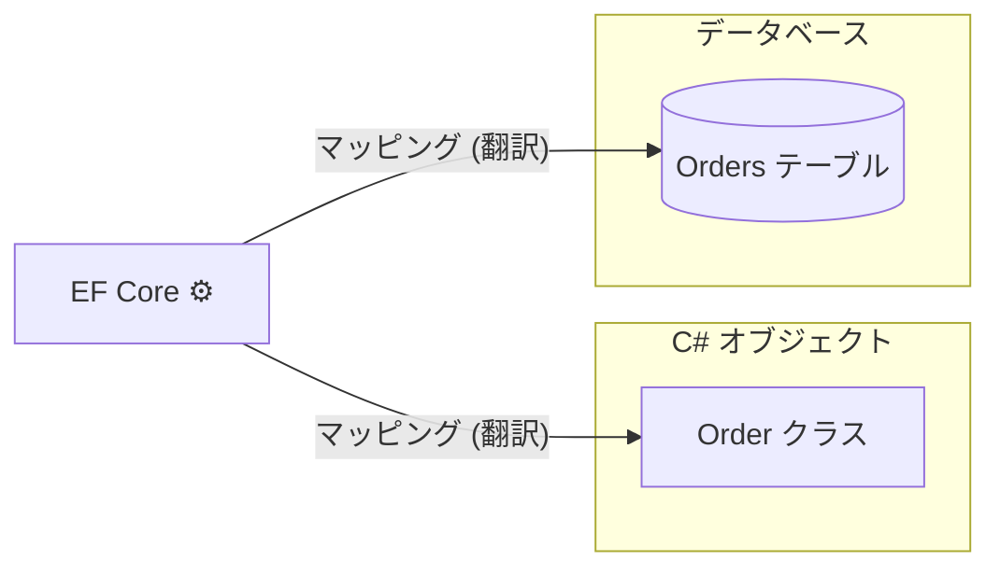
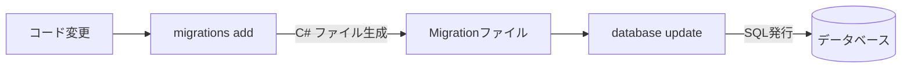
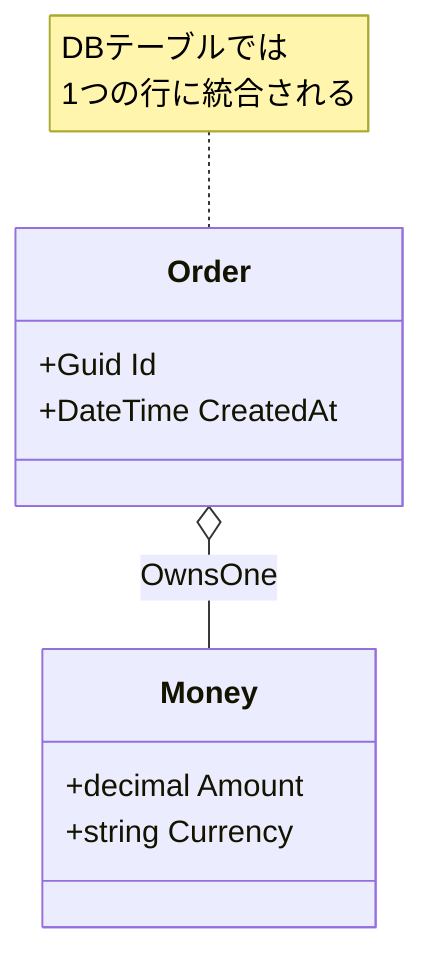

# 第24章：EF Core導入（最小セット）🧪

## この章でできるようになること🎯✨

* EF Coreの「最小3点セット」＝ **DbContext / DbSet / マイグレーション** がわかる📦
* ローカルDB（SQLite）で、集約（Order）を **保存→読み込み** できるようになる💾🔁
* Entity / Value Object の **“マッピング入口”** を体験できる🚪🧩

---

## 1) EF Coreってなに？（ざっくりでOK）🧁


EF Coreは **C#のオブジェクト（Entityなど）** を、**DBのテーブル** にいい感じに対応づけてくれる仕組み（ORM）だよ😊
SQLを一切書かないで済む…というより、最初は **「保存・取得の骨組みを素早く作れる」** のが強い💪✨ ([Microsoft Learn][1])



> この教材では「集約と境界」が主役だから、EF Coreは **“永続化の道具”** として最小だけ押さえるよ🧰🌸

---

## 2) 最小3点セットを覚えよう📦✨

## 2-1. DbContext（DBへの入口）🚪

* DB接続＋変更追跡＋保存（SaveChanges）をまとめて面倒みる子👩‍🏫
* 「このアプリは、どのテーブル（DbSet）を持つの？」もここで管理するよ🗂️

## 2-2. DbSet（テーブルっぽいやつ）🗃️

* `DbSet<Order>` はだいたい「Ordersテーブル」に対応する感じ😊
* **注意⚠️：DbSetは“Repositoryそのもの”ではない**（でも見た目が似てるから勘違いしやすい）

## 2-3. マイグレーション（スキーマ変更の履歴）🧾

* クラス設計の変化を、DBの変更として **履歴化** する仕組み📌
* `dotnet ef migrations add ...` → `dotnet ef database update` が基本の流れ🔁 ([Microsoft Learn][2])



---

## 3) 今回の題材（ミニでいくよ）☕️🍰

この章では「注文Orderを保存できる」だけでOK🙆‍♀️✨

* 集約ルート：`Order`
* まずは **Orderだけ保存**（Itemsなどは後で育てられる🌱）

---

## 4) 導入：入れるNuGet（最小）📦🪄

SQLiteでローカルDBを動かすよ🪶
入れるのはだいたいこれ👇（プロジェクト構成は「InfrastructureにDbContext」が王道）

* `Microsoft.EntityFrameworkCore.Sqlite`（SQLiteプロバイダー） ([Microsoft Learn][3])
* `Microsoft.EntityFrameworkCore.Design`（マイグレーション等の設計時サポート。`dotnet ef`でよく要る） ([Microsoft Learn][2])

EF Core 10系を使うなら **.NET 10が必要** だよ（ここ大事！）🧷✨ ([Microsoft Learn][4])

---

## 5) まずは“動く”最小モデル（Orderだけ）🏃‍♀️💨

## 5-1. Domain：Order（超ミニ）🌳

※「不変条件」とかは前章たちで学んだやつを、ここでは薄味にしておくよ🍵

```csharp
namespace Cafe.Domain.Orders;

public sealed class Order
{
    public Guid Id { get; private set; }
    public DateTime CreatedAt { get; private set; }

    private Order() { } // EF用（privateでもOKな設定にできるけど、まずは素直に🙏）

    public Order(Guid id, DateTime createdAt)
    {
        Id = id;
        CreatedAt = createdAt;
    }
}
```

> ここで `OrderId` みたいな強い型にしたくなるけど、まずは **Guidで通す** のが一番ラク😊
> そのあとで Value Object マッピングに進もう🧩✨

---

## 6) Infrastructure：DbContextを作る🧪🧠

## 6-1. DbContext（最小）🧫

```csharp
using Microsoft.EntityFrameworkCore;
using Cafe.Domain.Orders;

namespace Cafe.Infrastructure.Persistence;

public sealed class CafeDbContext : DbContext
{
    public DbSet<Order> Orders => Set<Order>();

    public CafeDbContext(DbContextOptions<CafeDbContext> options) : base(options)
    {
    }

    protected override void OnModelCreating(ModelBuilder modelBuilder)
    {
        var order = modelBuilder.Entity<Order>();

        order.ToTable("Orders");
        order.HasKey(x => x.Id);

        order.Property(x => x.CreatedAt)
             .IsRequired();
    }
}
```

---

## 7) 接続設定：SQLiteを使う🪶🗃️

## 7-1. いちばん単純な接続文字列（まずこれ）🔌

SQLiteは “ファイル1個” でDBになるから、学習にピッタリ🥰
EF Core側は `UseSqlite("Data Source=...")` を使うよ✨ ([Microsoft Learn][3])

たとえば、アプリ側（起動プロジェクト）でDI登録👇

```csharp
using Microsoft.EntityFrameworkCore;
using Microsoft.Extensions.DependencyInjection;
using Cafe.Infrastructure.Persistence;

var services = new ServiceCollection();

services.AddDbContext<CafeDbContext>(options =>
{
    options.UseSqlite("Data Source=cafe-dev.db");
});

var provider = services.BuildServiceProvider();
```

> **よくある罠⚠️**
> `cafe-dev.db` は “実行時のカレントフォルダ” に作られるよ！
> だいたい `bin\Debug\net10.0\` とかに出るので、「どこにできた!?😵」ってなりやすい💥

---

## 8) マイグレーション：テーブルを作る🧾✨

## 8-1. `dotnet ef` を使えるようにする🔧

EF CoreのCLIツールで、マイグレーション作るよ〜💪
（CLIツールは `dotnet` の拡張として動くよ） ([Microsoft Learn][2])

```bash
dotnet tool install --global dotnet-ef
```

## 8-2. マイグレーション作成 → DB更新🔁

DbContextがInfrastructureにある想定で、こんな感じ👇

```bash
dotnet ef migrations add InitialCreate --project Cafe.Infrastructure --startup-project Cafe.App
dotnet ef database update --project Cafe.Infrastructure --startup-project Cafe.App
```

* `--project`：DbContextがあるプロジェクト
* `--startup-project`：実行側（設定や参照が揃ってる側）

> **ここも詰まりポイント⚠️**
> `--startup-project` を間違えると「DbContext作れません😢」系エラーが出がち！

---

## 9) 保存してみよう（成功体験タイム）🎉💾

```csharp
using Microsoft.Extensions.DependencyInjection;
using Cafe.Domain.Orders;
using Cafe.Infrastructure.Persistence;

using var scope = provider.CreateScope();
var db = scope.ServiceProvider.GetRequiredService<CafeDbContext>();

var order = new Order(Guid.NewGuid(), DateTime.UtcNow);
db.Orders.Add(order);
await db.SaveChangesAsync();

var loaded = await db.Orders.FindAsync(order.Id);
Console.WriteLine(loaded is null ? "見つからない😢" : $"見つけた🎉 {loaded.Id}");
```

---

## 10) マッピング入門：Value Objectの入口だけ触る🧩🚪

ここからは「VOをDBにどう入れるの？」の入口🌸
一番やりやすいのは **Owned Entity Types**（所有型）だよ✨
「親の一部として埋め込まれる」イメージで、VOと相性がいい😊 ([Microsoft Learn][5])

## 10-1. 例：Money（VO）をOwnedで埋める💰

Domain（例）👇

```csharp
namespace Cafe.Domain.Shared;

public readonly record struct Money(decimal Amount, string Currency);
```

Orderに持たせる👇

```csharp
using Cafe.Domain.Shared;

namespace Cafe.Domain.Orders;

public sealed class Order
{
    public Guid Id { get; private set; }
    public DateTime CreatedAt { get; private set; }
    public Money Total { get; private set; }

    private Order() { }

    public Order(Guid id, DateTime createdAt)
    {
        Id = id;
        CreatedAt = createdAt;
        Total = new Money(0m, "JPY");
    }
}
```

DbContextのマッピング👇（Ownedで2列にする）

```csharp
protected override void OnModelCreating(ModelBuilder modelBuilder)
{
    var order = modelBuilder.Entity<Order>();
    order.ToTable("Orders");
    order.HasKey(x => x.Id);

    order.OwnsOne(x => x.Total, money =>
    {
        money.Property(x => x.Amount).HasColumnName("TotalAmount");
        money.Property(x => x.Currency).HasColumnName("TotalCurrency");
    });
}
```

こうするとDB側は、Ordersテーブルに `TotalAmount` と `TotalCurrency` ができる感じになるよ〜🧁✨



---

## 11) Copilot / Codex に頼むなら（丸投げ禁止の型）🤖🧠✨

“手で理解したうえで” 便利に使う用のプロンプト例👇

* 「EF CoreのDbContextを作りたい。`Order(Id, CreatedAt)` をSQLiteで保存したい。`OnModelCreating` で `Orders` テーブルにマッピングするコードを最小で作って」
* 「`dotnet ef migrations add` が失敗する。DbContextはInfrastructure、起動はApp。想定される原因を“チェックリスト形式”で出して」

👉 出てきた答えは **そのままコピペせず**、
「プロジェクト指定（--project/--startup-project）」と「参照関係」を必ず目視チェック✅✨

---

## 12) よくある詰まりポイント集（ここだけ見ても助かるやつ）🚑😅

## 12-1. EF Coreのバージョンが揃ってない📦💥

* `Microsoft.EntityFrameworkCore.*` のバージョンが混ざると事故りやすい😵
* EF Coreは .NETと足並みが揃うので、EF Core 10なら **.NET 10** を使うのが前提だよ🧷 ([Microsoft Learn][4])

## 12-2. マイグレーションでDbContextが見つからない🔍

* `--startup-project` が違う
* 起動プロジェクトがInfrastructureを参照してない
* Design系が不足（環境によって出方は違う） ([Microsoft Learn][2])

## 12-3. DBファイルがどこにあるかわからない🗃️🌀

* SQLiteの `Data Source=cafe-dev.db` は **実行フォルダ基準** になりやすい
* 見つからない時は「出力フォルダ」を見に行くのが早い👀✨

---

## 13) この章のミニ課題（10〜20分）📝🌸

1. `Order` に `Total (Money)` を追加して、Ownedマッピングまで通す💰✨
2. マイグレーションを作り直して、DBに `TotalAmount / TotalCurrency` ができたか確認👀
3. `TotalAmount` を 500 にして保存して、読み込んで表示🎉

---

## 14) まとめ（この章で持ち帰る感覚）🎁✨

* **DbContext = DBの入口**、**DbSet = テーブルの窓口**、**Migration = 変更履歴**🧠
* まずは **「保存できる」** を最短で作るのが勝ち🏁
* VOはOwnedで “親の一部” として埋め込むのが入口としてやさしい🧩✨ ([Microsoft Learn][5])

EF Core 10はLTSで、サポートも長めだから学習の土台にちょうどいいよ😊🌸 ([Microsoft Learn][4])

[1]: https://learn.microsoft.com/en-us/ef/core/get-started/overview/first-app?utm_source=chatgpt.com "Getting Started - EF Core"
[2]: https://learn.microsoft.com/en-us/ef/core/cli/dotnet?utm_source=chatgpt.com "EF Core tools reference (.NET CLI)"
[3]: https://learn.microsoft.com/en-us/ef/core/providers/sqlite/?utm_source=chatgpt.com "SQLite EF Core Database Provider"
[4]: https://learn.microsoft.com/en-us/ef/core/what-is-new/ef-core-10.0/whatsnew?utm_source=chatgpt.com "What's New in EF Core 10"
[5]: https://learn.microsoft.com/en-us/ef/core/modeling/owned-entities?utm_source=chatgpt.com "Owned Entity Types - EF Core"
