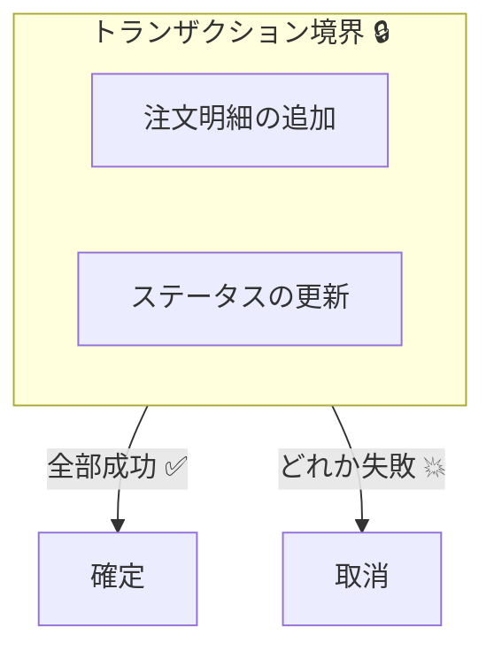
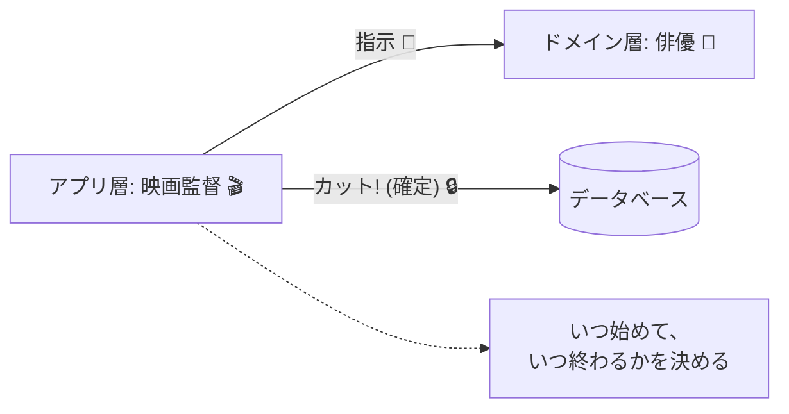
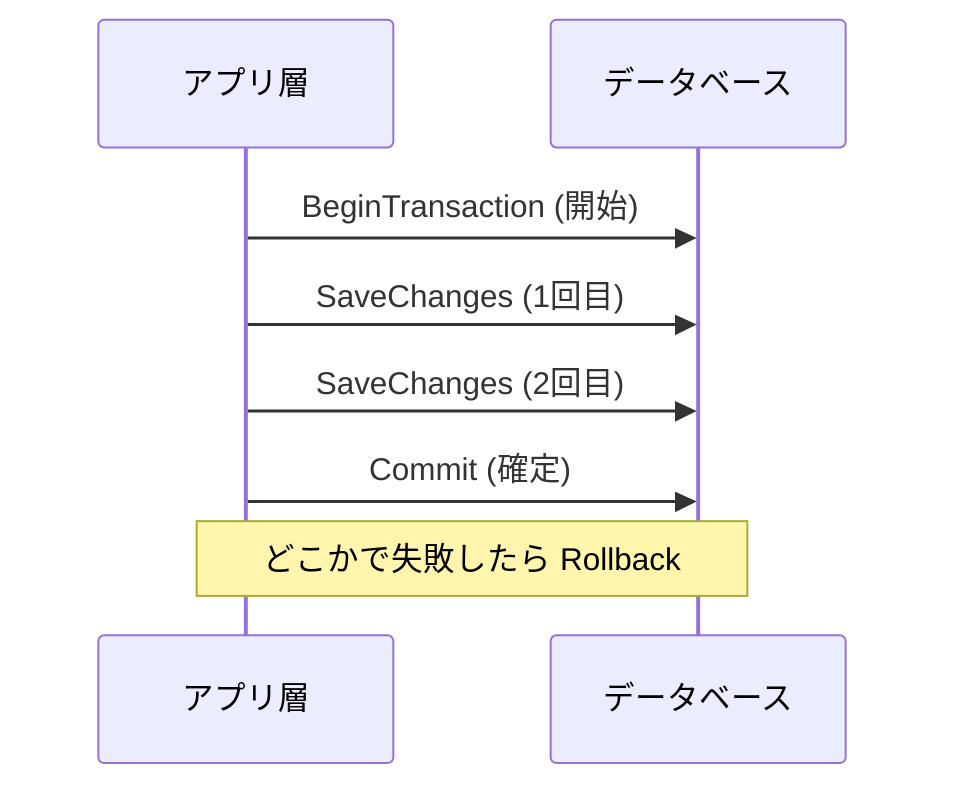

# 第25章：トランザクション境界の置き場所（結論：アプリ層）🎬🔒

## 1. 今日のゴール🎯✨

この章が終わると、こんなことができるようになります👇💡

* 「どこでトランザクションを開始・確定（コミット）するか」を迷わなくなる🔒
* **SaveChanges の置き場所＝境界の置き場所**だと腹落ちする😆
* Domain（ドメイン）をキレイに保ったまま、アプリ層で安全に完結できる✅

---

## 2. まず超ざっくり：トランザクション境界って何？🧱


**トランザクション境界**は、ひとことで言うと👇

* 「このユースケース（1回の操作）で、**全部成功か全部失敗か**を保証する線」🔒✨

たとえば「注文確定」って操作で…

* 注文明細は増えたけど、注文ステータスが変わってない
  みたいな “半端な状態” が残ると事故です💥😵

だから境界が必要なんだよね、という話です🫶

---

## 3. 結論：境界は “アプリ層（ユースケース）” に置く🎬🔒




---
### なぜアプリ層がベスト？🤔✨

**アプリ層（Application Service / UseCase）**は、ユースケースの進行役🎬
だから、ここに境界を置くときれいにまとまります👇

* その操作（ユースケース）で「何をやるか」を知っている🧠
* Domain を呼び出して、必要な保存をまとめられる📦
* 「ここで確定（コミット）！」を決められる✅

* Domain が DB やトランザクションを知りはじめて汚れやすい（依存が逆流）🧽🚫
* テストがやりにくくなる（DB前提の設計になりがち）🧪💦



---

## 4. 最新の前提（超大事な事実だけ）🧠✨


ここだけは「今の最新事情」として押さえると設計がラクになります👇

### ✅ SaveChanges は “それ単体で” 原則トランザクションになる

EF Core は、基本的に **1回の SaveChanges** をトランザクションで包んでくれます（失敗したらロールバック）🔒✅
つまり、**ユースケース内で SaveChanges を1回にできるなら**、明示トランザクションなしで安全にいける場面が多いです✨
([Microsoft Learn][1])

### ✅ いまの主流は .NET 10 + EF Core 10（LTS）

最新の安定（LTS）として .NET 10 と EF Core 10 が提供されています📦🚀
（どちらも 2025年11月リリース、サポートは 2028年11月までの案内）
([Microsoft][2])

---

## 5. “置き場所”を一発で決める合言葉📌✨

迷ったらこれだけ覚えてください👇

### **「SaveChanges はユースケースの最後に1回」** 💾✅

* 置き場所：**Application Service（UseCase）** 🎬
* 理由：それが「1ユースケース＝1境界」を形にする最短ルート🌈

---

## 6. 正しい形：アプリ層に境界を置いた実装例（最小）☕️📦

ここでは「注文確定 PlaceOrder」を例にします☕️🧁
ポイントは **Domain はトランザクションを知らない**、アプリ層が締める、です🔒✨

### 6-1. Domain（トランザクションを知らない）🌳

```csharp
// Domain: 値オブジェクト例（雑に見えても「不正値を作らせない」が大事）
public readonly record struct OrderId(Guid Value);

public sealed class Order
{
    public OrderId Id { get; }
    public string Status { get; private set; } = "Draft";

    private readonly List<OrderItem> _items = new();
    public IReadOnlyList<OrderItem> Items => _items;

    public Order(OrderId id)
    {
        Id = id;
    }

    public void AddItem(string name, int quantity)
    {
        if (Status != "Draft") throw new InvalidOperationException("確定後は追加できません");
        if (string.IsNullOrWhiteSpace(name)) throw new ArgumentException("商品名が空です");
        if (quantity <= 0) throw new ArgumentException("数量が不正です");

        _items.Add(new OrderItem(name, quantity));
    }

    public void Confirm()
    {
        if (_items.Count == 0) throw new InvalidOperationException("明細が空の注文は確定できません");
        Status = "Confirmed";
    }
}

public sealed class OrderItem
{
    public string Name { get; }
    public int Quantity { get; }

    public OrderItem(string name, int quantity)
    {
        Name = name;
        Quantity = quantity;
    }
}
```

### 6-2. アプリ層（ここが境界🎬🔒）

```csharp
public sealed class PlaceOrderUseCase
{
    private readonly OrderDbContext _db;

    public PlaceOrderUseCase(OrderDbContext db)
    {
        _db = db;
    }

    public async Task<Guid> HandleAsync(string itemName, int quantity, CancellationToken ct = default)
    {
        // 1) ドメインを組み立てる（ここは純粋に業務ルール）
        var order = new Order(new OrderId(Guid.NewGuid()));
        order.AddItem(itemName, quantity);
        order.Confirm();

        // 2) 追加する（Repositoryを挟んでもOK。ここでは最小で DbContext 直）
        _db.Orders.Add(order);

        // 3) ここで「確定」＝このユースケースのトランザクション境界💾✅
        await _db.SaveChangesAsync(ct);

        return order.Id.Value;
    }
}
```

🔎 **ここでの重要ポイント**

* 「確定」は最後に1回だけ（SaveChanges 1回）💾✅
* だから **暗黙トランザクションに任せても安全** な場面が多いよ、という話です🔒
  ([Microsoft Learn][1])

---

## 7. 「明示トランザクション」が必要になるのはどんな時？🔒🧠

基本は SaveChanges 1回でOKなんだけど、例外もあります👇

### ✅ 明示トランザクションを切る代表例

* **SaveChanges が2回以上必要**（途中でDBの都合で確定しないといけない等）💾💾
* **同じトランザクション内で、DBコマンド＋SaveChanges を混ぜたい**（生SQLも含む）🧩
* **分離レベル（IsolationLevel）を変えたい**⚖️
* “ここは絶対まとめたい” という強い理由がある🔥

EF Core 公式でも「複数の SaveChanges を同一トランザクションで」みたいな例が出ています📘
([Microsoft Learn][3])

### 7-1. 明示トランザクション例（複数 SaveChanges をまとめる）🔒


```csharp
public async Task<Guid> HandleWithExplicitTxAsync(string itemName, int quantity, CancellationToken ct = default)
{
    await using var tx = await _db.Database.BeginTransactionAsync(ct);

    try
    {
        var order = new Order(new OrderId(Guid.NewGuid()));
        order.AddItem(itemName, quantity);
        _db.Orders.Add(order);

        await _db.SaveChangesAsync(ct); // ①

        order.Confirm();
        await _db.SaveChangesAsync(ct); // ②

        await tx.CommitAsync(ct);
        return order.Id.Value;
    }
    catch
    {
        await tx.RollbackAsync(ct);
        throw;
    }
}
```



この形は “やっていい” けど、初心者のうちはまず👇を優先してOKです😊

* **SaveChanges を1回に寄せられない？** を先に考える💡

---

## 8. やりがち事故💥😵（これだけは回避！）

### 🚫 事故①：Domain の中で SaveChanges しはじめる


* 「Domainメソッド内で DbContext を触る」みたいな状態は、設計が崩れやすいです🧨
* 理由：Domain がインフラ依存になって、保守もテストもキツくなる😇💦

### 🚫 事故②：Repository が勝手に SaveChanges する

* Repository が毎回 SaveChanges すると、**ユースケース単位でまとめられない**💔
* 結果：「注文追加は成功したけど、確定は失敗」みたいな半端が出る💥

👉 だから基本は👇

* Repository：出し入れ（Add / Get）まで🏪
* SaveChanges：UseCase の最後に1回💾✅

### 🚫 事故③：トランザクション中に外部I/O（API呼び出し）をする


* 決済API、メール送信、外部HTTP…をトランザクションの中でやると
  **遅い／詰まる／リトライで二重実行** など地獄になりがち😱🌪️

このへんは後半の「イベント／Outbox」に繋がります📮✨（第31-32章へ）

---

## 9. TransactionScope はどうなの？🌀

TransactionScope（アンビエントトランザクション）は便利だけど、初心者のうちは **EF Core の BeginTransaction を基本**にすると安全です😊

* EF Core は System.Transactions をプロバイダが対応していないと効かないことがある、など注意点あり⚠️
  ([Microsoft Learn][1])

「複数コンテキストをまたぐ」「複数箇所の呼び出しをまとめたい」みたいな強い理由が出たら検討でOKです👌

---

## 10. AI（Copilot / Codex）に手伝ってもらうコツ🤖✨

“丸投げ”じゃなくて、**レビュー相手として使う**のが超おすすめです🫶

### ✅ そのまま使えるプロンプト例（コピペOK）✍️

* 「このユースケースの SaveChanges の位置は正しい？トランザクション境界の観点で指摘して」🔎
* 「Repository に SaveChanges が混ざってないかチェックして、修正案を出して」🧹
* 「SaveChanges を1回に寄せるリファクタ案を3つ（メリデメ付き）で」📌
* 「明示トランザクションが本当に必要か、根拠付きで判定して」⚖️

---

## 11. ミニ演習（10分）⏱️🎀

### 演習A：SaveChanges を “最後に1回” に直そう💾✅


次の “ダメ例” を、UseCaseの最後に1回へ直してみてね👇

```csharp
public sealed class BadOrderRepository
{
    private readonly OrderDbContext _db;
    public BadOrderRepository(OrderDbContext db) => _db = db;

    public async Task AddAsync(Order order, CancellationToken ct)
    {
        _db.Orders.Add(order);
        await _db.SaveChangesAsync(ct); // 🚫 ここで確定しちゃう
    }
}
```

ゴール🎯

* Repository から SaveChanges を消す🧹
* UseCase が最後にまとめて SaveChanges 💾✅

---

## 12. まとめ（この章の合言葉）📌✨

* **トランザクション境界はアプリ層（UseCase）に置く**🎬🔒
* **SaveChanges はユースケースの最後に1回**💾✅
* EF Core は **SaveChanges 1回なら暗黙トランザクション**で守ってくれる（失敗はロールバック）🔒
  ([Microsoft Learn][1])
* 明示トランザクションは「複数 SaveChanges」など **理由がある時だけ**👌
  ([Microsoft Learn][3])

---

[1]: https://learn.microsoft.com/en-us/ef/core/saving/transactions?utm_source=chatgpt.com "Transactions - EF Core"
[2]: https://dotnet.microsoft.com/en-us/platform/support/policy?utm_source=chatgpt.com "The official .NET support policy"
[3]: https://learn.microsoft.com/ja-jp/ef/core/saving/transactions?utm_source=chatgpt.com "EF Core - トランザクションの使用"
