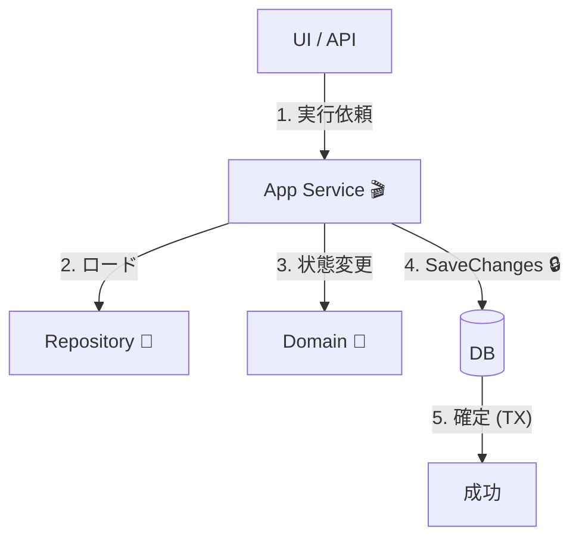
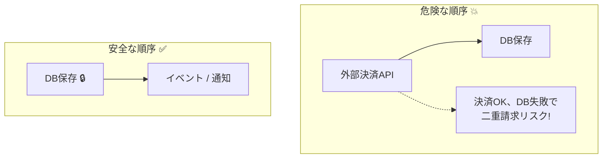

# 第26章：「1ユースケース＝1トランザクション」実装💾✅

## 26.1 この章のゴール🎯✨

この章を終えると、こんな状態になれます😊💡

* ✅ **「PlaceOrder（注文確定）」を“1回で完結”**できる（＝整合性が壊れにくい）
* ✅ **SaveChanges の位置がブレない**（毎回ここ！って言える）🎯
* ✅ 「途中で外部I/Oしない」の意味が、コードの形でわかる🧷

---

## 26.2 今日の「最新」メモ🗓️✨（2026/01/27時点）

* .NET：**.NET 10（LTS）**（最新パッチ 10.0.2）([Microsoft][1])
* EF Core：**EF Core 10（LTS）**（例：10.0.2）([Microsoft Learn][2])
* Visual Studio：**Visual Studio 2026 18.2.1**（2026/01/20 リリース）([Microsoft Learn][3])

---

## 26.3 いきなり結論：これが「1ユースケース＝1トランザクション」✅🔒


**“1ユースケース＝DbContext 1個＝SaveChanges 1回”** が基本形だよ😊✨

そして、EF Core は **SaveChanges 1回の中身を（可能なら）自動でトランザクションに包む**よ💾
つまり、SaveChanges が成功すれば全部反映、失敗すれば全部ロールバック✅💥 ([Microsoft Learn][4])

---

## 26.4 「トランザクション境界」はどこに置く？🧱

**答え：Application Service（ユースケース）** に置くのがいちばん安定するよ🎬✨

なぜなら…

* ユースケースは「ユーザーの1行動」👆
* その1行動で「守りたい整合性」をまとめて守る🔒
* “いつ確定するか（SaveChanges）”を決めるのは、ユースケース側が自然🎯

ちなみに DbContext 自体が **Unit of Work（短命で、1まとまりの作業）** として設計されてるよ🧠✨ ([Microsoft Learn][5])

---

## 26.5 まずは完成図（ざっくり）を見よう👀📦


「PlaceOrder」ユースケースの流れはこう👇

```text
[UI/API]
   |
   v
[Application Service]  ← ここが境界🎬🔒
   |  (Domainを呼ぶ)
   v
[Domain: Order Aggregate] ← ルールを守る🌳🔐
   |
   v
[Infrastructure: EF Core(DbContext)]
   |
   v
SaveChangesAsync() ← ここで確定💾✅
```



---

---

## 26.6 PlaceOrder（注文確定）を実装してみよう☕️🧾✨

### 26.6.1 今回の最低限ルール（カフェ注文）📋🍰

* 注文には **1つ以上の明細**が必要🧾
* 数量は **1以上**🍰
* 注文確定したら **後から明細を追加できない**（不変条件の例）🔐🚫

---

## 26.7 コード：Domain（集約側）🌳✨

## 26.7.1 Value Object（例：お金）💰


```csharp
public readonly record struct Money(decimal Amount, string Currency)
{
    public static Money Jpy(decimal amount)
        => amount >= 0 ? new Money(amount, "JPY")
                       : throw new ArgumentOutOfRangeException(nameof(amount), "金額は0以上だよ💦");

    public static Money operator +(Money a, Money b)
    {
        if (a.Currency != b.Currency) throw new InvalidOperationException("通貨が違うよ💦");
        return new Money(a.Amount + b.Amount, a.Currency);
    }

    public static Money operator *(Money a, int qty)
        => qty >= 0 ? new Money(a.Amount * qty, a.Currency)
                    : throw new ArgumentOutOfRangeException(nameof(qty));
}
```

## 26.7.2 Entity（OrderItem）🧾

```csharp
public sealed class OrderItem
{
    public Guid MenuItemId { get; private set; }
    public string Name { get; private set; } = "";
    public Money UnitPrice { get; private set; }
    public int Quantity { get; private set; }

    private OrderItem() { } // EF用

    internal OrderItem(Guid menuItemId, string name, Money unitPrice, int quantity)
    {
        if (quantity <= 0) throw new ArgumentOutOfRangeException(nameof(quantity), "数量は1以上だよ💦");
        MenuItemId = menuItemId;
        Name = string.IsNullOrWhiteSpace(name) ? throw new ArgumentException("名前が空だよ💦") : name;
        UnitPrice = unitPrice;
        Quantity = quantity;
    }

    public Money LineTotal() => UnitPrice * Quantity;
}
```

## 26.7.3 Aggregate Root（Order）👑🌳


```csharp
public enum OrderStatus
{
    Draft = 0,
    Placed = 1
}

public sealed class Order
{
    public Guid Id { get; private set; }
    public Guid CustomerId { get; private set; }
    public OrderStatus Status { get; private set; }

    private readonly List<OrderItem> _items = new();
    public IReadOnlyList<OrderItem> Items => _items;

    private Order() { } // EF用

    private Order(Guid id, Guid customerId)
    {
        Id = id;
        CustomerId = customerId;
        Status = OrderStatus.Draft;
    }

    public static Order Create(Guid customerId)
        => new Order(Guid.NewGuid(), customerId);

    public void AddItem(Guid menuItemId, string name, Money unitPrice, int quantity)
    {
        EnsureDraft();

        // 例：同一メニューは合算したい、などのルールはここに寄せる🧠✨
        _items.Add(new OrderItem(menuItemId, name, unitPrice, quantity));
    }

    public void Place()
    {
        EnsureDraft();

        if (_items.Count == 0)
            throw new InvalidOperationException("明細が0件の注文は確定できないよ💦");

        Status = OrderStatus.Placed;
    }

    public Money Total()
        => _items.Aggregate(Money.Jpy(0), (acc, x) => acc + x.LineTotal());

    private void EnsureDraft()
    {
        if (Status != OrderStatus.Draft)
            throw new InvalidOperationException("確定後の注文は変更できないよ💦");
    }
}
```

ポイント🌟

* **「整合性ルール」は集約に閉じ込める**（AddItem / Place の中で守る）🔐
* DB確定（SaveChanges）やトランザクションは **Domainは知らない**🙅‍♀️✨

---

## 26.8 コード：Infrastructure（EF Core）🧪💾

## 26.8.1 DbContext（Unit of Work）🧠


DbContext は **“1まとまりの作業”向けに短命で使う設計**だよ🪄 ([Microsoft Learn][5])

```csharp
using Microsoft.EntityFrameworkCore;

public sealed class AppDbContext : DbContext
{
    public DbSet<Order> Orders => Set<Order>();

    public AppDbContext(DbContextOptions<AppDbContext> options) : base(options) { }

    protected override void OnModelCreating(ModelBuilder modelBuilder)
    {
        var order = modelBuilder.Entity<Order>();
        order.HasKey(x => x.Id);

        // Items は private field をマッピング（Field-backed）✨
        order.Metadata.FindNavigation(nameof(Order.Items))!
            .SetPropertyAccessMode(PropertyAccessMode.Field);

        order.OwnsMany<OrderItem>("_items", item =>
        {
            item.WithOwner().HasForeignKey("OrderId");
            item.Property<Guid>("Id"); // shadow key でもOK
            item.HasKey("Id");

            item.Property(x => x.Name).HasMaxLength(200);

            // Money を Owned として扱う例（UnitPrice）
            item.OwnsOne(x => x.UnitPrice, money =>
            {
                money.Property(m => m.Amount).HasColumnName("UnitPriceAmount");
                money.Property(m => m.Currency).HasColumnName("UnitPriceCurrency").HasMaxLength(3);
            });
        });
    }
}
```

## 26.8.2 Repository（SaveChangesしないのがコツ）🏪🙅‍♀️

```csharp
using Microsoft.EntityFrameworkCore;

public interface IOrderRepository
{
    Task AddAsync(Order order, CancellationToken ct);
    Task<Order?> FindAsync(Guid orderId, CancellationToken ct);
}

public sealed class EfOrderRepository : IOrderRepository
{
    private readonly AppDbContext _db;

    public EfOrderRepository(AppDbContext db) => _db = db;

    public Task AddAsync(Order order, CancellationToken ct)
    {
        _db.Orders.Add(order);
        return Task.CompletedTask;
    }

    public Task<Order?> FindAsync(Guid orderId, CancellationToken ct)
        => _db.Orders.FirstOrDefaultAsync(x => x.Id == orderId, ct);
}
```

✅ **重要：Repository の中で SaveChanges しない！**
SaveChanges は **ユースケース（アプリ層）の最後に1回**🎯✨

---

## 26.9 コード：Application（ユースケース）🎬🔒

## 26.9.1 Command（入力）🧾

```csharp
public sealed record PlaceOrderCommand(
    Guid CustomerId,
    IReadOnlyList<PlaceOrderItem> Items
);

public sealed record PlaceOrderItem(
    Guid MenuItemId,
    string Name,
    decimal UnitPriceJpy,
    int Quantity
);
```

## 26.9.2 Application Service（境界はここ！）🎯


```csharp
public sealed class PlaceOrderService
{
    private readonly AppDbContext _db;              // UoW（= DbContext）
    private readonly IOrderRepository _orders;

    public PlaceOrderService(AppDbContext db, IOrderRepository orders)
    {
        _db = db;
        _orders = orders;
    }

    public async Task<Guid> HandleAsync(PlaceOrderCommand cmd, CancellationToken ct)
    {
        if (cmd.Items.Count == 0)
            throw new InvalidOperationException("明細が0件だよ💦");

        // 1) Domain（集約）を作る🌳
        var order = Order.Create(cmd.CustomerId);

        foreach (var i in cmd.Items)
        {
            order.AddItem(
                i.MenuItemId,
                i.Name,
                Money.Jpy(i.UnitPriceJpy),
                i.Quantity
            );
        }

        order.Place(); // 不変条件チェック込み🔐✨

        // 2) 追加（まだDB確定しない）🧺
        await _orders.AddAsync(order, ct);

        // 3) ここで一発確定！💾✅
        // SaveChanges 1回が “1ユースケース＝1トランザクション” の中心
        // SaveChanges は既定でトランザクションを張ってくれる（可能なプロバイダの場合）🔒
        await _db.SaveChangesAsync(ct); :contentReference[oaicite:6]{index=6}

        return order.Id;
    }
}
```

ここが“型”だよ〜😊✨

* Domain：ルールを守る🌳🔐
* Repository：追加/取得だけ🏪
* Application：**SaveChangesの位置を固定**🎯

---

## 26.10 「途中で外部I/Oしない」ってどういうこと？🧷⚠️


### 26.10.1 なぜダメになりやすいの？😵‍💫

外部I/O（決済API、メール送信、外部HTTP、メッセージブローカー…）を **トランザクションの途中**でやると👇

* 外部は成功したのに、DBが失敗 → **二重請求/二重送信**の事故💥
* 外部が遅くてトランザクションが長い → **ロックが伸びる**😱
* リトライ地獄 → どっちが正しい状態かわからなくなる🌀

だから基本はこう👇

* ✅ **DBの更新を先に1回で確定（SaveChanges）**
* ✅ 外部連携は「確定後」に（または Outbox で後処理）📮✨
  ※後半の章（イベント/Outbox）で強化するやつだよ〜📣

### 26.10.2 NG例（やりがち）🙅‍♀️

```csharp
// ❌ 途中で決済APIを叩く → 失敗時に整合性が崩れやすい
await paymentGateway.ChargeAsync(...); // 外部I/O
await _db.SaveChangesAsync(ct);
```

### 26.10.3 まずの基本（この章の範囲）✅

この章では **「PlaceOrderは注文確定だけ」**にして、外部I/Oは入れない方針でOK🙆‍♀️✨
（決済や通知は、後の章で安全にやる）



---

## 26.11 よくある事故集（これだけ避けて！）🚑😅

### 事故①：Repository の中で SaveChanges しちゃう💥

* 呼ぶ側が「いつ確定したか」見えなくなる😵
* ユースケースが複数操作すると **SaveChangesが分散**しやすい🌀

### 事故②：SaveChanges を何回も呼ぶ🧨

* 「一部だけ保存された」状態が生まれやすい（明示トランザクション無しだと特に）💥
* 基本は **最後に1回**でまとめる🎯✨
  （SaveChanges 1回が安全に“全部成功/全部失敗”になりやすいのが強み）([Microsoft Learn][4])

### 事故③：DbContext を使い回しすぎる🧟‍♀️

DbContext は **1ユースケース単位で短く使う前提**の設計だよ🧠✨ ([Microsoft Learn][5])

---

## 26.12 動作確認のコツ🧪🔍

* PlaceOrder を呼んで、Orders に1件できてる？☕️
* Items がちゃんと紐づいてる？🧾
* 明細0件で Place すると例外になる？💦（＝不変条件が守れてる）🔐

---

## 26.13 ミニ演習✍️🎀（手を動かすと一気に定着するよ✨）

## 演習A：SaveChanges を「絶対に1回」に固定して守る🎯

* `PlaceOrderService.HandleAsync` の中だけで SaveChanges を呼ぶ
* Repository には SaveChanges を絶対置かない🙅‍♀️

## 演習B：ルール追加（不変条件）🔐

* 「合計金額が0円の注文は禁止」💰🚫
* どこに書く？→ **Order.Place()** に入れるとキレイ✨

## 演習C：失敗ケースを作ってロールバック確認💥

* Place の直前でわざと例外を投げる
* DBに何も残らないことを確認（SaveChanges前だから）✅

---

## 26.14 AI（Copilot/Codex）活用プロンプト例🤖✨

そのまま貼って使えるやつだよ〜🪄

## プロンプト①：ユースケースの骨組みを作る🦴

```text
C# / .NET 10 / EF Core 10 を想定。
「PlaceOrderService」を実装して。
条件：
- 1ユースケース=DbContext1つ=SaveChangesAsync1回
- Repository内ではSaveChangesしない
- DomainのOrder集約に AddItem と Place を用意し、不変条件はDomain側で守る
- 例外メッセージはユーザー向けに短く
```

## プロンプト②：NG例レビュー（地雷除去）💣

```text
このコードで「1ユースケース=1トランザクション」が崩れている箇所を指摘して、
修正案を出して。特に SaveChanges の位置と回数に注目して。
```

## プロンプト③：テスト観点を出す🧪

```text
PlaceOrder のユースケースに対して、最低限必要なテストケースを10個出して。
不変条件違反・境界の責務・SaveChangesの呼び方（1回）を必ず含めて。
```

---

## 26.15 まとめ🌸✨（この章の合言葉）

* ✅ **1ユースケース＝DbContext 1個＝SaveChanges 1回**🎯
* ✅ SaveChanges は（可能なら）**自動でトランザクション**を張ってくれる🔒([Microsoft Learn][4])
* ✅ DbContext は **短命＝1まとまり作業向け**🧠([Microsoft Learn][5])
* ✅ 外部I/Oは **途中に入れない**（安全にやる方法は後で📮📣）

次の章では、「じゃあ明示トランザクションっていつ必要なの？」を、理由つきでスパッと判断できるようにするよ🔒🧠✨

[1]: https://dotnet.microsoft.com/en-us/platform/support/policy?utm_source=chatgpt.com "The official .NET support policy"
[2]: https://learn.microsoft.com/en-us/ef/core/what-is-new/ef-core-10.0/whatsnew?utm_source=chatgpt.com "What's New in EF Core 10"
[3]: https://learn.microsoft.com/ja-jp/visualstudio/releases/2026/release-notes?utm_source=chatgpt.com "Visual Studio 2026 リリース ノート"
[4]: https://learn.microsoft.com/en-us/ef/core/saving/transactions?utm_source=chatgpt.com "Transactions - EF Core"
[5]: https://learn.microsoft.com/en-us/ef/core/dbcontext-configuration/?utm_source=chatgpt.com "DbContext Lifetime, Configuration, and Initialization"
