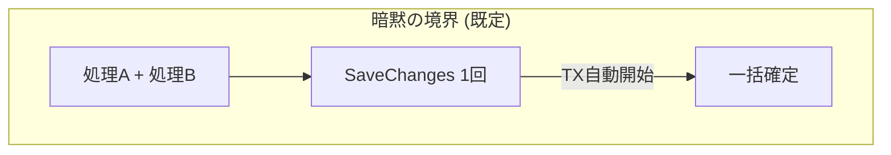
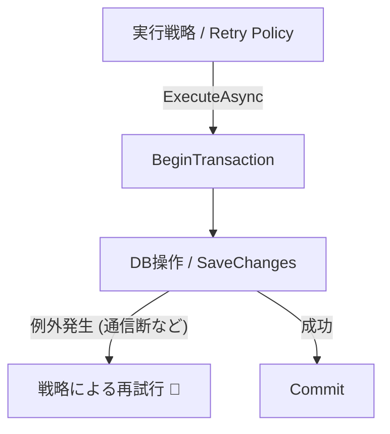
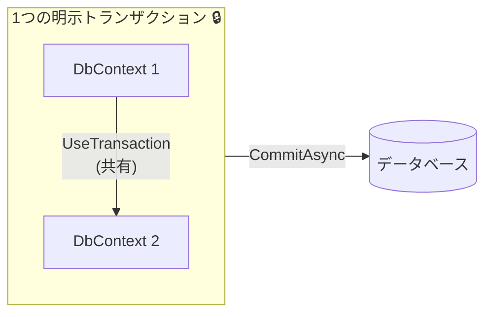

# 第27章：明示トランザクションが必要な場面だけ🔒🧠

## この章のゴール🎯✨

* 「明示トランザクション、いつ要るの？」を **理由つきで判断**できるようになる🙆‍♀️
* EF Coreでの **安全な書き方テンプレ**を持ち帰る📦✨
* “貼りすぎ事故” を避けるコツも覚える🚑💦

---

## まず結論💡


**ほとんどのユースケースは、明示トランザクション不要**です👌✨
EF Core は基本、**`SaveChanges()` 1回ぶんを自動でトランザクションに包む**ので、1回の保存なら「全部成功 or 全部失敗」になりやすいです。([Microsoft Learn][1])

だからこの教材の型（第26章）みたいに👇

* 1ユースケース（1メソッド）
* `SaveChangesAsync()` は最後に1回
  ができていれば、だいたい勝ち🏆✨



---

## EF Coreの「暗黙トランザクション」って何？🧠🔍


* DBプロバイダーがトランザクション対応なら、**`SaveChanges()` 1回の変更はトランザクションで適用**されます✅
* 途中で失敗したら **ロールバックされて反映されない**（＝半端な状態を残しにくい）🧹✨
* なので「ほとんどのアプリでは既定で十分」で、**必要なときだけ手動制御**しようね、というスタンスです。([Microsoft Learn][1])

---

## 明示トランザクションが必要になる典型パターン5つ🧩🔒

## パターン1：`SaveChanges` を2回以上やる必要があり、まとめて原子的にしたい📦✅


たとえば👇

* 途中で一度保存してID確定が必要
* その後の保存も含めて「全部まとめて成功/失敗」にしたい

このときは `BeginTransactionAsync()` が素直です。([Microsoft Learn][1])

---

## パターン2：EF Core以外のDB操作（ADO.NET/生SQL）も同じトランザクションでやりたい🧪🔗

たとえば👇

* 生SQLでロックを取りたい
* 特殊なSQL（ストアド・ヒント付き）を叩きたい
* EFの操作と “同じTx” にまとめたい

EF Core は **外部 `DbTransaction` を共有**する例も公式にあります。([Microsoft Learn][2])

---

## パターン3：DbContextが2つ（例：Outbox用など）で、同じDBの同じTxに参加させたい🧷🧠


「同じ接続＋同じトランザクションを共有」して、両方の `DbContext` を同じTxに参加させるやつです。
EF Core には `UseTransaction(DbTransaction)` があり、**クロスコンテキストのトランザクション共有**ができます。([Microsoft Learn][1])

---

## パターン4：接続回復（リトライ）を有効にしているのに、明示Txが要る🔥🔁


SQL Server で `EnableRetryOnFailure()` みたいな “自動リトライ” を有効にしていると、**ユーザー開始トランザクションがそのままだと例外**になりがちです。([Microsoft Learn][3])

この場合は👇

* `CreateExecutionStrategy()` で実行戦略を取り出して
* **「Txを含む処理全体」をその戦略で包む**
  が必要になります。([Microsoft Learn][3])

が必要になります。([Microsoft Learn][3])

さらに安全寄りにしたい場合、EF Core には **`ExecuteInTransaction` / `ExecuteInTransactionAsync`** の拡張メソッドも用意されています。([Microsoft Learn][4])



---

## パターン5：`TransactionScope` が必要（複数接続/複数リソースをまたぐ）🧨🧷


これは “強めの武器” です⚔️
`TransactionScope` を `async/await` と一緒に使うなら、**非同期フローを有効化**しないと事故りやすいです（`TransactionScopeAsyncFlowOption.Enabled`）。([Microsoft Learn][5])

※ 複数DBや複数リソースにまたがると、環境によっては分散トランザクション寄りの話になって重くなりがちなので、基本は「最後の手段」くらいの気持ちで🙈💦

---

## 逆に「明示Txを貼らない方がいい」代表例🙅‍♀️💥

## 1) 外部I/O（決済API・メール・メッセージ送信）をTxの中に入れる📡💳✉️


* トランザクションが長引く
* ロックが伸びる
* タイムアウトやデッドロックが起きやすい

外部I/Oは **Txの外へ**出して、必要なら Outbox（第32章）みたいな形で “後で確実に” を狙うのが現実的です📮✨

## 2) 「跨ぎ更新したくなる病」をTxでねじ伏せる😇💣

* 集約をまたいだ整合性を「1Txで全部守る」は、スケールしにくい＆壊れやすい
* まずは “境界” を見直すほうが効きます🧠✨

---

## 実装テンプレ集（コピペしてOK）📦✨

## テンプレA：`BeginTransactionAsync()`（複数SaveChangesをまとめる）🔒

```csharp
await using var tx = await db.Database.BeginTransactionAsync();

try
{
    // ① 先に保存が必要な処理
    db.Orders.Add(order);
    await db.SaveChangesAsync();

    // ② 続きの保存
    payment.MarkCaptured(...);
    await db.SaveChangesAsync();

    await tx.CommitAsync();
}
catch
{
    // tx.Dispose() 時にロールバックされる（明示RollbackしてもOK）
    throw;
}
```

ポイント💡

* **「なぜSaveChangesが2回必要か」**をコメントで残すと未来の自分が助かる📝✨
* できるなら “SaveChangesは1回に寄せる” が基本（第26章の型）😊

---

## テンプレB：2つのDbContextを同じTxに参加させる（同一DB想定）🧷🔗

公式の「クロスコンテキスト トランザクション」の発想そのままです。([Microsoft Learn][1])

```csharp
await using var tx = await db1.Database.BeginTransactionAsync();

try
{
    // db1 の変更
    db1.Orders.Add(order);
    await db1.SaveChangesAsync();

    // db2 を同じトランザクションに参加させる
    db2.Database.UseTransaction(tx.GetDbTransaction());

    db2.OutboxMessages.Add(outbox);
    await db2.SaveChangesAsync();

    await tx.CommitAsync();
}
catch
{
    throw;
}
```

ポイント💡

* 「同じDBで同じ接続/Txを共有する」発想が大事🧠✨
* これが必要になる代表例が Outbox です📮（第32章へつながる！）



---

## テンプレC：リトライ有効（接続回復性）＋明示Tx を両立する🔁🔒

リトライが有効だと、**Txを自分で開始しただけで例外**になることがあるので、**実行戦略で全体を包む**のが基本です。([Microsoft Learn][3])

```csharp
var strategy = db.Database.CreateExecutionStrategy();

await strategy.ExecuteAsync(async () =>
{
    await using var tx = await db.Database.BeginTransactionAsync();

    db.Orders.Add(order);
    await db.SaveChangesAsync();

    // 他の更新もここにまとめる
    order.Confirm();
    await db.SaveChangesAsync();

    await tx.CommitAsync();
});
```

さらに「コミット中に通信が切れて結果が不明」みたいな厄介ケースに寄せるなら、`ExecuteInTransactionAsync`（状態検証つき）も選択肢になります。([Microsoft Learn][4])

---

## テンプレD：TransactionScope（async対応）🧨🌪️

```csharp
using var scope = new TransactionScope(
    TransactionScopeOption.Required,
    TransactionScopeAsyncFlowOption.Enabled);

await DoSomethingAsync();
await db.SaveChangesAsync();

scope.Complete();
```

ポイント💡

* `async/await` と一緒なら **AsyncFlowOption.Enabled** が大事です。([Microsoft Learn][5])
* 強力だけど、運用が重くなりやすいので “必要な理由” が言えるときだけ🏋️‍♀️💦

---

## 「明示Txいる？」判定チェックリスト✅✨


## まずこれにYESなら、だいたい要らない🙂

* `SaveChangesAsync()` が **1回**で済む
* DB操作は **EF Coreだけ**
* 外部I/O（API/メール等）をTxに入れてない

## ここにYESが混ざると、要検討🤔

* `SaveChangesAsync()` が **2回以上**（しかも一体で成功/失敗にしたい）([Microsoft Learn][1])
* 別のDBアクセス（ADO.NET/生SQL）と同じTxにしたい([Microsoft Learn][2])
* DbContextが複数で、同じTxに参加させたい([Microsoft Learn][1])
* リトライ有効で、明示Txを使いたい（＝実行戦略で包む必要）([Microsoft Learn][3])

---

## ミニ演習（3問）✍️🌸

## Q1：注文確定（Order保存）だけ☕️

* 変更はOrder集約だけ
* SaveChangesは1回
  👉 明示Txいる？
  → **いらない**（暗黙Txで足りる）([Microsoft Learn][1])

## Q2：注文確定＋Outboxメッセージも同時に保存📮

* OrderDbContext と OutboxDbContext がある
* 両方保存が “同時成功/失敗” 必須
  👉 明示Txいる？
  → **いる可能性大**（クロスコンテキスト共有）([Microsoft Learn][1])

## Q3：SQL Serverでリトライ有効＋2回SaveChanges🔁

* `EnableRetryOnFailure()` を使ってる
* 明示Txでまとめたい
  👉 そのまま `BeginTransactionAsync()` だけ書くと？
  → **例外になりがち**なので、`CreateExecutionStrategy()` で全体を包む([Microsoft Learn][3])

---

## AIに「このケースTx必要？」を聞くときの型🤖✨

そのまま貼れる質問テンプレ👇

* 「このユースケースで明示トランザクションが必要か、**要否**と**根拠**を箇条書きで。`SaveChanges`回数、DbContext数、外部I/O、リトライ設定（EnableRetryOnFailure）の観点で判定して」
* 「必要なら、EF Coreの推奨テンプレ（`CreateExecutionStrategy` を使う版も含む）でC#コード例を出して」([Microsoft Learn][3])

---

## おまけ：2026世代の“前提になる最新ライン”🧷✨

* .NET 10 は LTS として提供され、サポート表も公開されています。([Microsoft][6])
* EF Core 10 も .NET 10 前提で、LTSとして案内されています。([Microsoft Learn][7])
* C# 14 は .NET 10 でサポートされます。([Microsoft Learn][8])

[1]: https://learn.microsoft.com/ja-jp/ef/core/saving/transactions "トランザクション - EF Core | Microsoft Learn"
[2]: https://learn.microsoft.com/en-us/ef/core/saving/transactions?utm_source=chatgpt.com "Transactions - EF Core"
[3]: https://learn.microsoft.com/ja-jp/ef/core/miscellaneous/connection-resiliency "接続の回復性 - EF Core | Microsoft Learn"
[4]: https://learn.microsoft.com/ja-jp/dotnet/api/microsoft.entityframeworkcore.executionstrategyextensions.executeintransactionasync?view=efcore-9.0&utm_source=chatgpt.com "ExecutionStrategyExtensions.ExecuteInTransactionAsync ..."
[5]: https://learn.microsoft.com/en-us/dotnet/api/system.transactions.transactionscopeasyncflowoption?view=net-10.0&utm_source=chatgpt.com "TransactionScopeAsyncFlowOpti..."
[6]: https://dotnet.microsoft.com/en-us/platform/support/policy/dotnet-core?utm_source=chatgpt.com "NET and .NET Core official support policy"
[7]: https://learn.microsoft.com/en-us/ef/core/what-is-new/ef-core-10.0/whatsnew?utm_source=chatgpt.com "What's New in EF Core 10"
[8]: https://learn.microsoft.com/en-us/dotnet/csharp/whats-new/csharp-14?utm_source=chatgpt.com "What's new in C# 14"
