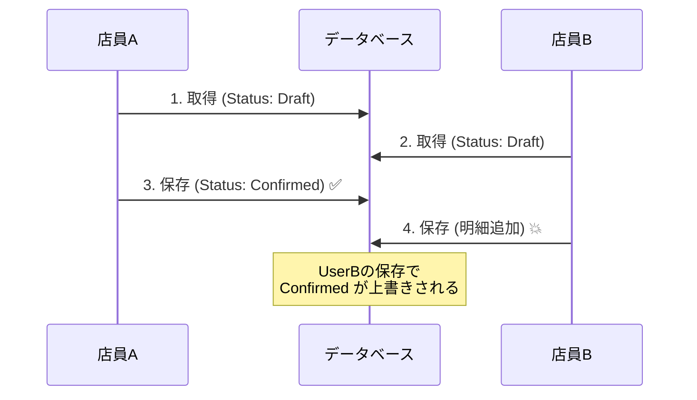
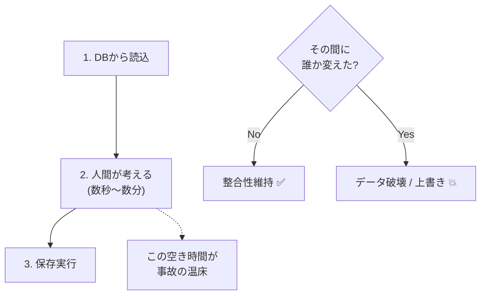
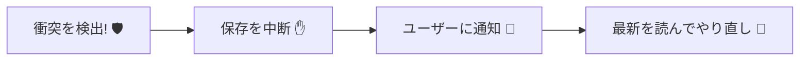

# 第28章：同時更新って何が起きる？（事故から入る）🚑😅

## 1. この章のゴール🎯✨

* 「同時更新（コンカレンシー）」で起きがちな事故を、**具体例でイメージできる**ようになる👀💥
* 「壊れ方」を知って、**“検出できるだけでも価値がある”**を腹落ちさせる🧠✨
* 次章（楽観ロック）でやることが、「何のためなのか」がハッキリする📌🌸

---

## 2. まずは事故のストーリー☕️📦💥


カフェ注文アプリで、**同じ注文（Order）**を2人が同時に編集する状況を想像してね👩‍💻👨‍💻

* 店員A：注文の備考に「ミルク多め🥛」を追加
* 店員B：同じ注文の明細を「ケーキ🍰」追加

2人とも「保存✅」を押したら……

### 事故パターンA：上書き（Lost Update）🫠

後から保存した人の内容が勝って、**先に保存した人の変更が消える**ことがある💥
例：「ミルク多め🥛」が消えて、ケーキだけ残る…みたいな😱

### 事故パターンB：二重処理（Double Submit / Duplicate）🔁

「保存」が2回走ったり（連打、通信リトライ、二重クリック）、
同じ明細が2回追加されて**二重計上**になることがある💸💸

### 事故パターンC：禁止状態への更新（状態のねじれ）🚦💥

* 注文が「確定済み✅」なのに、別の人が古い画面のまま「明細追加」を保存してしまう
  → 本当は **確定後は編集禁止** のはずなのに、すり抜ける😵‍💫



---

## 3. なんでこうなるの？（超ざっくり仕組み）🧠🔍

多くの更新は、ざっくりこう進むよ👇

1. DBからOrderを読む📥
2. 画面で編集する（人間が数秒〜数分考える）🤔
3. 変更をDBへ保存する📤

この間に、**別の人（別のアプリ/別のプロセス）**も同じOrderを読んで編集すると、
「読んだ時点の情報が古い」まま保存が走ることがある⏳💥

そして怖いのがこれ👇

> **“保存が成功した” = “正しく反映された” とは限らない**😇💣

衝突に気づかないと、**静かにデータが壊れる**ことがある…（これが一番イヤ）🙅‍♀️



---

## 4. 「検出できるだけでも価値」ってどういうこと？✨🛡️

同時更新の対策には大きく2つあるよ👇

* **衝突を“起こさない”**（ロックして順番待ち）🔒
* **衝突を“起きる前提で検出して止める”**（楽観ロック）⚔️

この教材では基本、後者の考え方（楽観）に寄せるよ😊
EF Core でも、**コンカレンシートークン**（後でRowVersionなど）を使って、
保存時に「読んだ時から変わってない？」を比較して、変わってたら例外にできる⚔️✨
（EF Core は更新/削除時にトークン値を比較し、違っていれば `DbUpdateConcurrencyException` を投げる仕組みだよ）([Microsoft Learn][1])

検出できると何が嬉しい？👇

* “壊れたデータ”を残さずに、**安全にやり直し**へ誘導できる🧯✨
* 「誰かが先に更新した」事実が分かるので、**UIで説明できる**💬🌸



---

## 5. 集約（Aggregate）視点だと、同時更新はどこが痛い？🌳💥

集約は「一貫性（不変条件）を守るまとまり」だったよね🔐
同時更新が起きると、集約の中でこういう破壊が起きがち👇

* 合計金額（Total）が、明細（Items）と一致しない💸↔️🧾
* 「確定済み」のはずなのに編集が入る✅→✍️（状態遷移が壊れる）
* 二重追加で在庫・課金・ポイントがズレる📦💳🎁

つまり同時更新は、**集約が守るはずの“不変条件”を事故らせる**トリガーになりやすい😵‍💫💣

---

## 6. まずは「事故」を手元で再現してみよう🧪💥（最小のデモ）

ここでは **“衝突を検出しない場合、普通に壊れる”** を体験するよ😅
（次章で「検出して止める」を入れる⚔️）

### 6.1 ドメイン（集約ルート）例🌳

* Order（集約ルート）
* OrderItem（子）
* 「確定後は明細追加できない」などのルールをメソッドで守る🔐

```csharp
public enum OrderStatus { Draft, Confirmed }

public sealed class Order
{
    public Guid Id { get; private set; }
    public OrderStatus Status { get; private set; } = OrderStatus.Draft;

    private readonly List<OrderItem> _items = new();
    public IReadOnlyList<OrderItem> Items => _items;

    private Order() { } // EF用

    public Order(Guid id) => Id = id;

    public void AddItem(string name, int price)
    {
        if (Status == OrderStatus.Confirmed)
            throw new InvalidOperationException("確定後は明細を追加できません");

        _items.Add(new OrderItem(name, price));
    }

    public void Confirm()
    {
        if (_items.Count == 0)
            throw new InvalidOperationException("明細が空の注文は確定できません");

        Status = OrderStatus.Confirmed;
    }
}

public sealed class OrderItem
{
    public int Id { get; private set; } // EF用のキーでもOK
    public string Name { get; private set; }
    public int Price { get; private set; }

    private OrderItem() { }
    public OrderItem(string name, int price)
    {
        Name = name;
        Price = price;
    }
}
```

### 6.2 “2人が同時に編集”をコードで再現👩‍💻👨‍💻

ポイントは **DbContextを2つ作って、同じOrderを別々に読む**ことだよ🔁

```csharp
// 擬似的に「店員A」「店員B」を作る
await using var ctxA = new AppDbContext();
await using var ctxB = new AppDbContext();

var id = new Guid("11111111-1111-1111-1111-111111111111");

// 同じ注文をそれぞれが読む（この時点で“別々のスナップショット”）
var orderA = await ctxA.Orders.Include(o => o.Items).SingleAsync(o => o.Id == id);
var orderB = await ctxB.Orders.Include(o => o.Items).SingleAsync(o => o.Id == id);

// Aは明細を追加
orderA.AddItem("Coffee", 500);

// Bも明細を追加（Aの変更は知らない）
orderB.AddItem("Cake", 600);

// Aが先に保存
await ctxA.SaveChangesAsync();

// Bが後で保存（ここが事故の入口💥）
await ctxB.SaveChangesAsync();
```

### 6.3 何が起きる？😵‍💫

* **“保存は成功する”**ことが多い（ここが罠）🪤
* でも結果はDBや更新の形によって、

  * Aの変更が消える（上書き）🫠
  * 二重に増える（重複）🔁
  * 状態がねじれる（確定後編集が混入）🚦💥
    …みたいな “地味に痛い壊れ方” が起きる可能性がある💣

---

## 7. 事故を減らす「設計のコツ」5つ🧠🛠️（今すぐ効く✨）

### コツ1：更新を「メソッド」に閉じ込める✋🔒

public setter で好き放題変更できると、ルールが破られやすい🙅‍♀️
→ すでにやってる「変更はメソッド」は超えらい👏✨

### コツ2：状態遷移で“古い画面の保存”を弾きやすくする🚦

例：`Confirmed` なら `AddItem` できない、を**集約で必ず守る**🔐
これだけでも事故が減る😊

### コツ3：トランザクションは短くする⏱️

人が編集している時間は長いけど、DB更新の時間は短くしたい
→ “読む→考える→保存” のうち、DB側の処理はなるべく一瞬で終える⚡

### コツ4：同時編集が起きる場所を把握する👀

* 管理画面の編集フォーム
* 店員が触る注文編集
* バッチと人間が同じデータを触る
  ここが **コンカレンシー対策の優先エリア**🏁

### コツ5：衝突を「検出」できる形にしておく⚔️✨

EF Core は、コンカレンシートークンを使った**楽観的コンカレンシー**で、
更新時に「DBの値」と「読んだときの値」を比較して衝突を検出できるよ([Microsoft Learn][1])
→ 次章で RowVersion を入れて、これを実装する⚔️🌸

---

## 8. UIでの見せ方（“怒らない”メッセージ）💬🌸

衝突はユーザーが悪いわけじゃないので、責めない文言が大事🙏✨
例👇

* 「他の人が先に更新しました。最新の内容を読み込み直してください🙂」
* 「あなたの変更はまだ保存されていません。もう一度確認して保存してください📝」

“衝突は起こりうる前提”で、**やさしくリカバリ**させるのが勝ち🏆💕

---

## 9. Copilot / Codexに聞くときのコツ🤖✨（丸投げ禁止版）

### そのまま使える質問例💡

* 「EF Coreで同時更新が起きる“失敗例”を、DbContextを2つ使うConsoleアプリで再現して」
* 「このOrder集約で “確定後にAddItem不可” を守るテストを書いて」
* 「衝突したときにユーザーへ返すメッセージ案を3つ出して（丁寧／カジュアル／短文）」

出てきたコードは、**“どこが事故ポイント？”**を必ずコメントで説明させると学びが増えるよ🧠📌

---

## 10. まとめ🧾✨

* 同時更新は「たまに」じゃなくて、**普通に起こる前提**で考えるのが安全🚑
* 一番怖いのは、衝突に気づかず **静かにデータが壊れる**こと🫠💥
* EF Core は、楽観的コンカレンシー（コンカレンシートークン）で衝突を検出して止められる⚔️✨([Microsoft Learn][2])

---

## 次章予告：楽観ロック（RowVersion）⚔️🌟

SQL Server の `rowversion` は **更新のたびに自動で変わる8バイト値**で、行のバージョン管理に使えるよ🧱✨
しかも **日時ではない**（ただの増加する番号みたいなもの）なので勘違い注意！([Microsoft Learn][3])
次章では、これをEF Coreで扱って、`DbUpdateConcurrencyException` をちゃんと起こして安全に扱うところまで行くよ😊⚔️

[1]: https://learn.microsoft.com/en-us/ef/core/saving/concurrency?utm_source=chatgpt.com "Handling Concurrency Conflicts - EF Core"
[2]: https://learn.microsoft.com/ja-jp/ef/core/saving/concurrency?utm_source=chatgpt.com "コンカレンシーの競合の処理 - EF Core"
[3]: https://learn.microsoft.com/en-us/sql/t-sql/data-types/rowversion-transact-sql?view=sql-server-ver17&utm_source=chatgpt.com "rowversion (Transact-SQL) - SQL Server"
