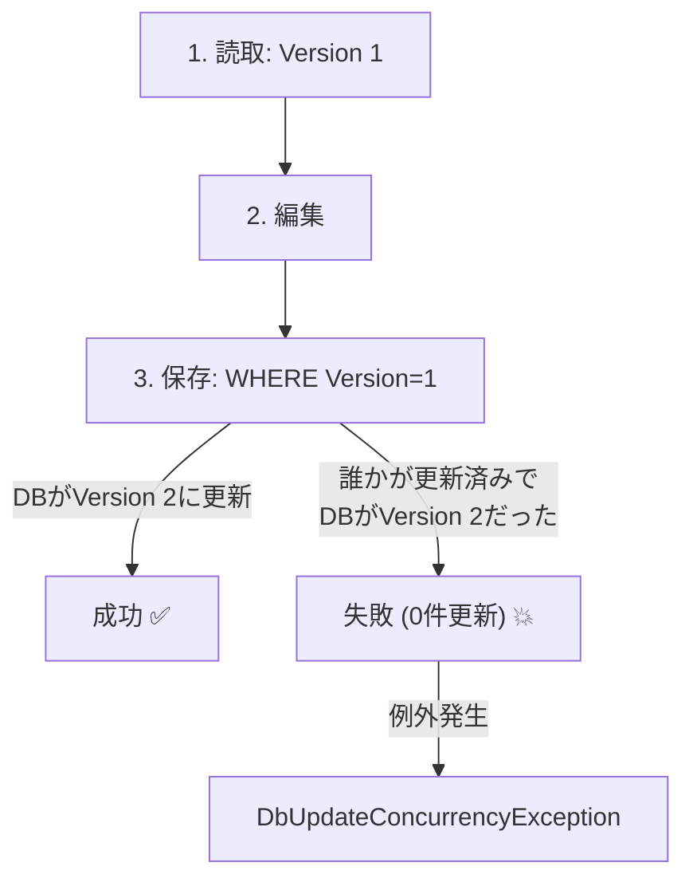
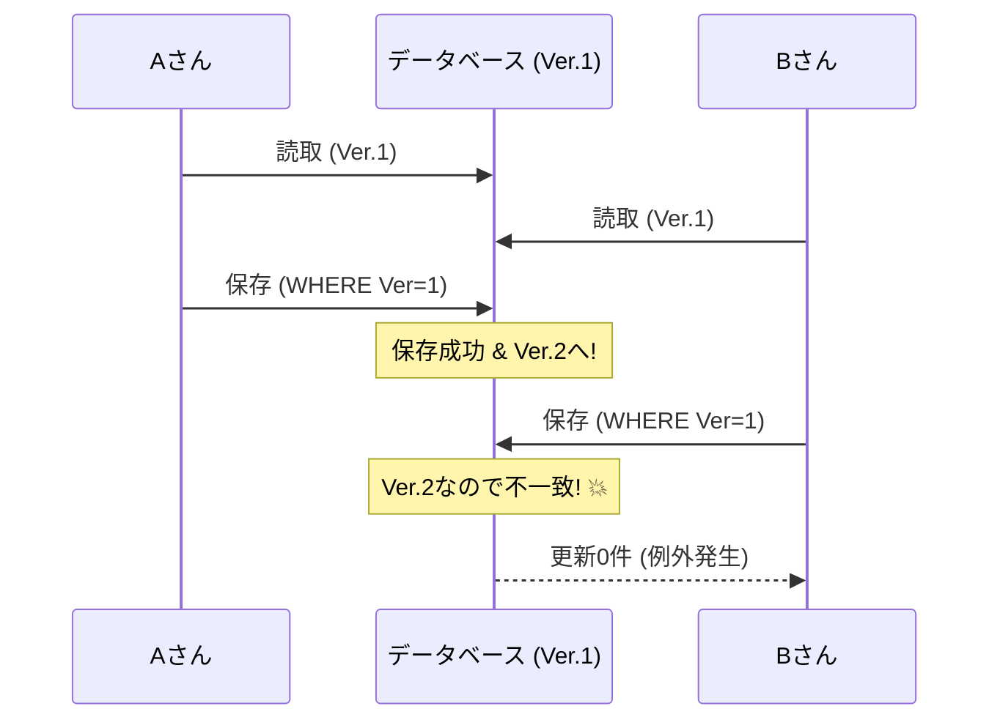

# 第29章：楽観ロック（RowVersion）を入れてみる⚔️

## この章でできるようになること🎯✨

* 「同時更新で上書きされる事故💥」を**検出**できるようになる😊
* EF Core の **RowVersion（rowversion）** を使って、**楽観ロック**を入れられる🔒
* ぶつかったときに **やさしい画面表示💬🌸** と **再試行方針🔁** を用意できるようになる

---

## 29.1 まず、どんな事故が起きるの？🚑😵

たとえば「注文 Order」を、AさんとBさんが同時に編集したとするね👇

1. Aさんが Order を開く（Status = Draft）👀
2. Bさんも同じ Order を開く（Status = Draft）👀
3. Aさんが「確定」にして保存（Status = Confirmed）✅
4. その直後、Bさんが「明細を追加」して保存…
   → **Bさんの保存がAさんの変更を上書き**してしまう可能性がある😱

このタイプの事故は **Lost Update（更新の消失）** と呼ばれることが多いよ💥

---

## 29.2 楽観ロックってなに？🧠🔒


## 楽観ロック（Optimistic Concurrency）とは😊

「ぶつかるのはレアだよね？」を前提にして、

* ふだんはロックしない🪶
* でも保存の瞬間に「読んだ時点から変わってない？」をチェックする✅
* 変わってたら **保存を失敗させて**、アプリ側で対処する💬

EF Core では、**コンカレンシートークン（Concurrency Token）** を設定すると、更新時に「トークンが一致するときだけUPDATEする」SQLが出るよ🧾✨
一致しなくて更新行数が 0 行だと、EF Core は `DbUpdateConcurrencyException` を投げる仕組み🙏 ([Microsoft Learn][1])



---

## 29.3 RowVersion（rowversion）を使う理由🧱✨

SQL Server の `rowversion` は、行が更新されるたびにDB側で自動的に変わる「版（バージョン）」みたいなもの📌
EF Core では `byte[]` で扱うよ😊 ([Microsoft Learn][2])

> 重要ポイント🌟
>
> * `rowversion` は **SQL Server にある仕組み**だよ🧠
> * SQLite には同等の仕組みがないので、同じノリでは動かない（トリガー等で近いことはできる）⚠️ ([Brice’s Blog][3])

---

## 29.4 実装：Order に RowVersion を追加しよう🛠️✨

ここでは「カフェ注文ドメイン☕️🍰」の `Order`（集約ルート🌳）に追加するよ！

## ① エンティティ（集約ルート）に RowVersion を足す🧩

`Order` に `RowVersion` プロパティを追加するよ👇
（**Domainを属性まみれにしたくない派**も多いので、ここでは “属性なし” で行くね😊）

```csharp
public class Order
{
    public Guid Id { get; private set; }
    public OrderStatus Status { get; private set; }

    // 👇 楽観ロック用（DBが自動更新する）
    public byte[] RowVersion { get; private set; } = Array.Empty<byte>();

    // 例：状態遷移
    public void Confirm()
    {
        if (Status != OrderStatus.Draft)
            throw new InvalidOperationException("下書きの注文だけ確定できます🥺");
        Status = OrderStatus.Confirmed;
    }
}

public enum OrderStatus
{
    Draft,
    Confirmed
}
```

> `private set;` でもOK👌（EF Core が設定できるようにしておく感じ！）

---

## ② DbContext 側で「このプロパティが rowversion です」を設定🔧

Fluent API で `IsRowVersion()` を付けると、SQL Server の `rowversion` を使う設定になるよ✨ ([Microsoft Learn][2])

```csharp
using Microsoft.EntityFrameworkCore;

public class CafeDbContext : DbContext
{
    public DbSet<Order> Orders => Set<Order>();

    public CafeDbContext(DbContextOptions<CafeDbContext> options) : base(options) {}

    protected override void OnModelCreating(ModelBuilder modelBuilder)
    {
        modelBuilder.Entity<Order>()
            .Property(o => o.RowVersion)
            .IsRowVersion(); // 👈 ここ！
    }
}
```

---

## ③ マイグレーションしてDBに列を追加🧳💾

RowVersion を足したので、DBにも列が増えるよね😊
CLIならこう👇（`dotnet ef migrations add ...` → `dotnet ef database update`） ([Microsoft Learn][2])

```bash
dotnet ef migrations add AddOrderRowVersion
dotnet ef database update
```

Visual Studio の場合は Package Manager Console で👇

```powershell
Add-Migration AddOrderRowVersion
Update-Database
```

---

## 29.5 ぶつかる瞬間をわざと作る実験🔬💥

「2人が同時編集」を **2つのDbContext** で再現してみるよ😆

## Console で最短実験（イメージ）🧪

```csharp
using Microsoft.EntityFrameworkCore;

var options = new DbContextOptionsBuilder<CafeDbContext>()
    .UseSqlServer("Server=(localdb)\\MSSQLLocalDB;Database=Cafe;Trusted_Connection=True;")
    .Options;

// 事前：注文を1つ作る
await using (var init = new CafeDbContext(options))
{
    var order = new Order();
    init.Add(order);
    await init.SaveChangesAsync();
}

Guid orderId;
await using (var read = new CafeDbContext(options))
{
    orderId = await read.Orders.Select(o => o.Id).FirstAsync();
}

// Aさんのコンテキスト
await using var ctxA = new CafeDbContext(options);
var orderA = await ctxA.Orders.SingleAsync(o => o.Id == orderId);

// Bさんのコンテキスト
await using var ctxB = new CafeDbContext(options);
var orderB = await ctxB.Orders.SingleAsync(o => o.Id == orderId);

// Aさんが先に確定して保存✅
orderA.Confirm();
await ctxA.SaveChangesAsync();

// Bさんも編集して保存しようとする…💥
try
{
    // 例：Bさんも確定しようとした（または別の変更）
    orderB.Confirm();
    await ctxB.SaveChangesAsync(); // 👈 ここでぶつかる！
}
catch (DbUpdateConcurrencyException)
{
    Console.WriteLine("同時更新が検出されたよ！やり直してね😊⚔️");
}
```

EF Core は更新時に「RowVersion が一致してるときだけ更新する」SQLを投げるので、後から保存した側が弾かれるんだ〜！🧱✨ ([Microsoft Learn][1])



---

## 29.6 衝突したらどうする？（実務で使う3パターン）🔁💡

ここ、設計のセンスが出るところだよ〜！🌸

## パターンA：ユーザーに “やり直し” してもらう（初心者に一番おすすめ）😊👍

* 競合したら保存をやめる✋
* 最新を読み直して、もう一回入力してもらう🔄
* UIメッセージをやさしくする💬🌸（後述！）

実装はシンプルに👇

```csharp
try
{
    await db.SaveChangesAsync();
}
catch (DbUpdateConcurrencyException)
{
    throw new InvalidOperationException("他の人が先に更新しました。画面を更新してもう一度お願いします😊");
}
```

---

## パターンB：自動リトライ（条件つき）🔁⚠️

「同じ操作をもう一回やっても安全」なときだけね！

* 例：カウントを +1 する、在庫を引く…は危ないことが多い😵
* 例：ステータスを “Draft→Confirmed” にするのは、条件を満たせば再試行できる場合がある✅

EF Core の典型例としては、`DbUpdateConcurrencyException` の `Entries` から **DB側の最新値**を取りに行って判断するよ👀
（`GetDatabaseValues` と `OriginalValues.SetValues` がよく出てくる！） ([Microsoft Learn][1])

```csharp
try
{
    await db.SaveChangesAsync();
}
catch (DbUpdateConcurrencyException ex)
{
    foreach (var entry in ex.Entries)
    {
        // Orderだけ扱う（それ以外は別途）
        if (entry.Entity is Order)
        {
            var databaseValues = await entry.GetDatabaseValuesAsync();
            if (databaseValues is null)
                throw new InvalidOperationException("注文が削除されていました🥺");

            // ✅ ここで「どっちを採用する？」を決める（超大事！）
            // まずは “DBが正” として読み直す（Store Wins）例：
            entry.OriginalValues.SetValues(databaseValues);

            // この後、必要なら変更を作り直して再SaveChangesする
        }
    }

    throw new InvalidOperationException("他の人が先に更新しました。内容を最新にして再試行してください😊");
}
```

> 「自動で直して保存し直す」は、やりすぎると事故るので、最初は “やり直し” が無難だよ😉✨

---

## パターンC：マージ（上級）🧠🧩

「Aさんは住所を変更」「Bさんは電話番号を変更」みたいに、**別の項目**なら統合できそうだよね😊
ただし業務ルール次第で、マージが危険なこともある⚠️
（最初はAかBでOK！）

---

## 29.7 画面表示をやさしくするコツ💬🌸

衝突はエラーだけど、**ユーザーのせいじゃない**ことが多いよね🥺
だから表示はこうするのが優しい✨

## おすすめ文言例📝

* 「他の人が先に更新しました。最新の内容を表示しました。もう一度お願いします😊」
* 「変更が競合したため保存できませんでした。更新してやり直してください🔄」

## UIの工夫🎀

* 「最新に更新」ボタンを出す🔄
* 入力途中の内容はできるだけ保持する🧸
* 何が変わったか（差分）が分かると最高👀✨（上級）

---

## 29.8 よくある落とし穴⚠️😵

## 落とし穴1：RowVersion を “集約ルート以外” に付けちゃう🙅‍♀️

基本は **集約ルート（Order）** につけるのがわかりやすいよ🌳
（OrderItem に付けると、境界がぐちゃぐちゃになりがち😵）

## 落とし穴2：例外を握りつぶす🫥

`DbUpdateConcurrencyException` を catch したのに何もせず成功扱い…は事故の元💥
「検出できた」ことが価値だから、必ず対処方針を決めようね😊

## 落とし穴3：SQLite で rowversion があると思い込む😇

SQLite には `rowversion` がないので、同じ方式はそのままは無理だよ⚠️
（やるなら **アプリ管理のトークン** や **トリガー** で近づける感じ！） ([Brice’s Blog][3])

---

## 29.9 章末クイズ🎓✨

1. 楽観ロックは「いつ」競合を検出する？⏱️
2. EF Core が RowVersion を使うと、UPDATE の WHERE 句に何が追加される？🧾
3. 競合時に投げられる例外の名前は？💥
4. 初心者におすすめの衝突対処パターンはどれ？A/B/C 😊

---

## 29.10 ミニ課題（手を動かす）✍️🔥

## 課題1：Order に RowVersion を導入して、競合を再現しよう⚔️

* 2つの DbContext で同じ Order を読み込む
* 片方が先に保存
* もう片方が `DbUpdateConcurrencyException` になることを確認✅

## 課題2：衝突メッセージを “やさしい文言” にする💬🌸

* 例外を catch して、ユーザー向けの文言に変換する
* ログには詳細（例外そのもの）を残す📝

---

## 29.11 Copilot / Codex に頼むときのプロンプト例🤖✨

* 「EF Core で Order に rowversion を追加したい。`byte[] RowVersion` を追加して Fluent API で `IsRowVersion()` 設定し、migration コマンドも含めて手順を書いて」
* 「`DbUpdateConcurrencyException` を catch して、Order の競合時に最新DB値を取得して再表示する実装例を C# で」

> コツ👉：生成されたコードをそのまま採用せず、
> 「どのパターン（A/B/C）で扱う前提か？」を必ず文章で確認すると事故が減るよ😊🧠

---

## まとめ🎀

RowVersion を入れると、「同時更新でこっそり上書きされる事故」を **ちゃんと検出**できるようになる⚔️✨
そして大事なのは、**衝突が起きたときの体験（UX）** をやさしくしてあげることだよ💬🌸

（次章では「跨ぎ更新したくなる病🙅‍♀️」に突入するよ〜！🚀）

[1]: https://learn.microsoft.com/en-us/ef/core/saving/concurrency "Handling Concurrency Conflicts - EF Core | Microsoft Learn"
[2]: https://learn.microsoft.com/en-us/aspnet/core/data/ef-mvc/concurrency?view=aspnetcore-10.0 "Tutorial: Handle concurrency - ASP.NET MVC with EF Core | Microsoft Learn"
[3]: https://www.bricelam.net/2020/08/07/sqlite-and-efcore-concurrency-tokens.html?utm_source=chatgpt.com "SQLite and EF Core Concurrency Tokens - Brice's Blog"
