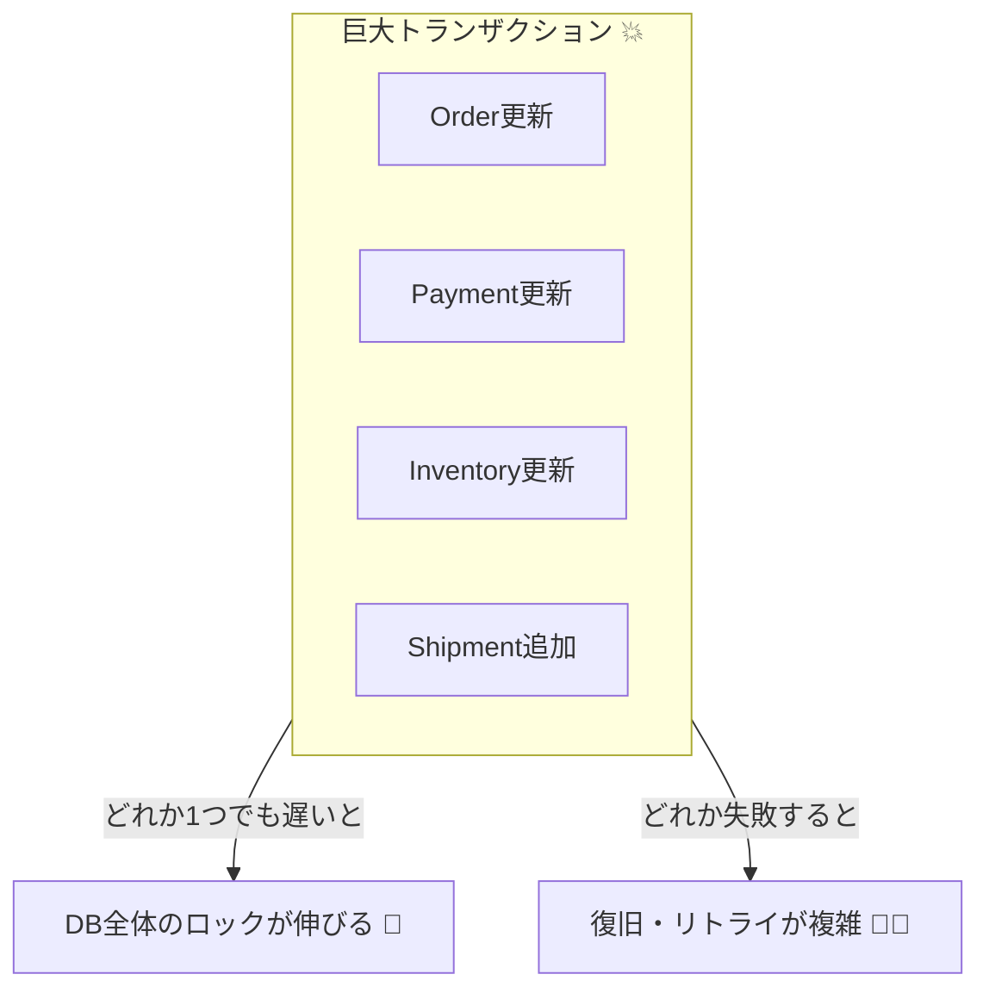
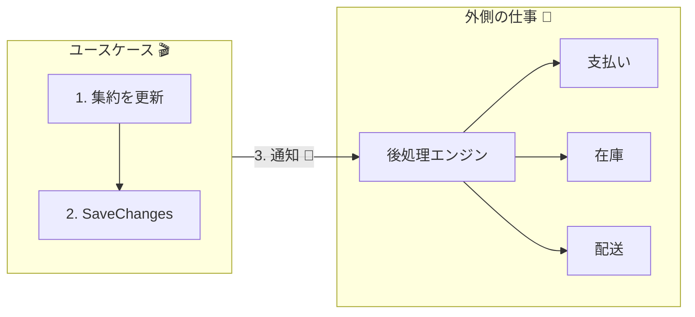

# 第30章：跨ぎ更新がしたくなる病（でも基本NG）🙅‍♀️😇

---

## この章でできるようになること🎯✨

* 「なんか複数の集約を一気に更新したくなる…」って場面で、**それが危ない理由**を説明できる🧠💡
* 跨ぎ更新（複数集約を1トランザクションで更新）を見つけて、**設計で回避する手順**がわかる🔍🧯
* 「じゃあ代わりにどうするの？」の入り口として、**状態（ステータス）＋後処理**の考え方を使える🚦🌉

---

## 30.1 まず結論：跨ぎ更新は“気持ちいい”けど、地獄の入口💥😇


アプリを作ってると、こう思いがち👇

* 注文を確定したら
  **注文(Order)も更新**して、
  **支払い(Payment)も更新**して、
  **在庫(Inventory)も更新**して、
  **配送(Shipment)も作って**…
  「ぜんぶ1回のトランザクションでやれば安全じゃん！」🎉

…これが「跨ぎ更新したくなる病」🦠💭

でも、これをやると **“巨大トランザクション地獄”** に入りやすいです🔥
（遅い・詰まる・壊れる・直せない…）



---

## 30.2 何がそんなにヤバいの？巨大トランザクションの症状リスト🚑😵

## 症状1：ロックが長くなって詰まる🔒🚧

トランザクションが大きいほど、DBのロック保持時間が伸びます。
すると、別ユーザーの操作が待たされて **体感がモッサリ**…🐢💦

## 症状2：デッドロックが増える☠️🔁

複数のテーブル・集約をまたいで更新すると、取り合うロックが増えて
「お互い待ち」でコケる確率が上がります😇

## 症状3：失敗の原因が“複合事故”になる🧩💥

支払いAPI・在庫更新・配送登録…
どれかが失敗したときに「どこまで成功した？」が分かりにくい😵‍💫
ログも複雑になって、復旧がつらいです🪦

## 症状4：外部I/Oをトランザクションに混ぜた瞬間、沼🕳️📡

「支払いAPI呼ぶ→待つ→タイムアウト」みたいなことが起きると
その待ち時間、DBロックも握りっぱなし…やばいです😱

---

## 30.3 そもそも“集約”って、何を守る単位だっけ？🌳🔒

集約（Aggregate）はざっくり言うと👇

* **「このまとまりの中だけは、1回で整合性を守る！」**って決める単位🌳✨
* そして、**外からの更新は集約ルートだけ**に通す🚪👑

つまり「跨ぎ更新したい」って気持ちは、裏を返すと👇

* **“本当は同時に守るべきルールが混ざってる”**
* もしくは
* **“今のモデルの切り方が、ユースケースに合ってない”**

のサインだったりします🔍💡

---

## 30.4 「跨ぎ更新」ありがちパターン集😇（見つけたら赤信号🚨）

## 🚨 パターンA：1つのユースケースで複数集約を同時に書き換える

* Order を更新して
* Payment を更新して
* Inventory を更新して
* Shipment を作って…
* 最後に SaveChanges 1回でドーン💥

## 🚨 パターンB：集約が他集約の“中身”を直接参照してる🧷

* `Order.Customer.Name` みたいに、他集約をオブジェクト参照して更新しがち
  → 密結合で壊れやすい🧨

## 🚨 パターンC：集約の中からDBや外部APIを呼びに行く🏃‍♀️💨

* ドメインがRepositoryやHTTPを触りだすと、境界が崩れます🧱💥

## 🚨 パターンD：「分散トランザクションで全部まとめればOKでしょ？」になる😇

`.System.Transactions` は MSDTC などを使ったトランザクションも扱えますが、運用・制約が重くなりがちです。([Microsoft Learn][1])
（“できる”と“やるべき”は別、の代表例⚠️）

---

## 30.5 悪い例（気持ちはわかる）😇💥

「注文確定」ユースケースで、全部いっぺんにやろうとすると…

```csharp
public async Task ConfirmOrderAsync(Guid orderId)
{
    using var tx = await _db.Database.BeginTransactionAsync();

    var order = await _orderRepo.GetAsync(orderId);
    var inventory = await _inventoryRepo.GetAsync(order.ItemId);
    var customer = await _customerRepo.GetAsync(order.CustomerId);

    inventory.Decrease(order.Quantity);            // 在庫も更新
    order.Confirm();                               // 注文も更新

    await _paymentGateway.ChargeAsync(customer, order.TotalPrice); // 外部I/O

    var payment = Payment.Succeeded(orderId, order.TotalPrice);
    _paymentRepo.Add(payment);                     // 支払いも保存

    await _db.SaveChangesAsync();
    await tx.CommitAsync();
}
```

## これの問題点😵‍💫

* **外部I/O（支払い）をトランザクションに混ぜてる**📡⚠️
* **複数集約を同時に更新**してる🌳🌳🌳💥
* 失敗時に「在庫減ったけど支払い失敗」みたいな復旧が地獄になりやすい🪦

---

## 30.6 じゃあどうするの？✅ “守るものだけ守って、残りは後でやる”戦略🌈

ポイントはこれ👇

## ✅ 1) その場で絶対守るのは「集約内の不変条件」だけ🔐

例：Order集約なら

* 確定済みの注文をもう一回確定できない
* 明細が0件なら確定できない
* 合計金額は明細から計算される（勝手に壊さない）

こういう「注文そのものの整合性」は、**Order集約だけで完結**できます🌳✨

## ✅ 2) “外側の仕事”は「状態＋後処理」に分ける🚦🌉

支払い・在庫・配送は、別集約＆別処理でOKにするために👇

* Orderの状態を `Placed`（受付済み）にする
* 「支払いしてね」「在庫引いてね」みたいな **後処理**へ渡す

ここで効くのが **状態（ステータス）** です🚦✨
（次章で「イベント」として綺麗に運ぶ話に入ります📣）



---

## 30.7 良い形の例：OrderはOrderだけ更新する🌳✅

## ① Order集約は「確定」を自分の中だけで完結させる

```csharp
public enum OrderStatus
{
    Draft,
    Placed,      // 注文受付（支払い待ちでもOK）
    Paid,
    Cancelled
}

public sealed class Order
{
    public Guid Id { get; private set; }
    public OrderStatus Status { get; private set; } = OrderStatus.Draft;

    private readonly List<OrderItem> _items = new();
    public IReadOnlyList<OrderItem> Items => _items;

    public void Place()
    {
        if (Status != OrderStatus.Draft) throw new InvalidOperationException("すでに受付済みです😇");
        if (_items.Count == 0) throw new InvalidOperationException("明細が空だよ🥺");

        Status = OrderStatus.Placed;

        // 次章でやる「イベント」につながる：今は“メモ”として置くイメージでOK📌
        // AddDomainEvent(new OrderPlaced(Id));
    }
}
```

## ② アプリ層（ユースケース）は「Orderだけ保存して終わる」🎬✅

```csharp
public async Task PlaceOrderAsync(Guid orderId)
{
    var order = await _orderRepo.GetAsync(orderId);

    order.Place();                 // Orderの不変条件だけ守る🌳🔐
    await _uow.SaveChangesAsync(); // ここが境界（コミット）🔒✨
}
```

ここまでで、**巨大トランザクションが消えます**🎉
支払い・在庫・配送は「別の処理で順番に」やればOKになる土台ができました🌈

---

## 30.8 「でも支払い失敗したら？」→ だから状態が必要！🚦🥺

ユーザー体験はこう作れます👇

* 注文確定ボタン押す 👉 `Placed`（受付）になる
* 画面には「支払い処理中です…」みたいに出す💬✨
* 支払い成功 👉 `Paid` になる
* 支払い失敗 👉 `Cancelled` か、`PaymentFailed` 的な状態にする（設計次第）😵‍💫

この考え方は、のちに
**イベント（第31章）** 📣⏳ と
**Outbox＋冪等性（第32章）** 📮🔁
に繋がって「現実運用で壊れにくい」になります💪✨

---

## 30.9 分散トランザクションで解決したくなる気持ちへの注意⚠️😇

`TransactionScope` などを使うと、状況次第で MSDTC を使った分散トランザクションに関わる話になります。([Microsoft Learn][1])
ただ、これを“設計の基本解”として選ぶと👇

* 環境・設定・監視が重くなる🧰😵
* 失敗時の復旧が難しくなる🪦
* そもそも現代的な構成（クラウド/サービス分割）と相性が悪くなりやすい☁️⚡

だからこの教材では、まず **「境界を守って、後処理へ渡す」** を正攻法として扱います🌸

---

## 30.10 ミニ演習（手を動かすやつ）✍️🎀

## 演習A：跨ぎ更新を“発見”して直す🔍🧯

次の条件を満たすように、ユースケースを整理してみよう👇

* `PlaceOrder` は **Orderだけ更新**する🌳✅
* 支払い・在庫・配送は **今は触らない**（触りたくなるのを我慢😇）

**チェックリスト**✅

* 1回のSaveChangesで複数集約を更新してない？
* 外部API呼び出しがトランザクション内に入ってない？
* 他集約をオブジェクト参照して更新してない？

---

## 30.11 AI（Copilot/Codex）に頼るときの質問テンプレ🤖✨

## ① 跨ぎ更新レビュー用🔍

* 「このユースケース、複数集約を同時更新してない？“更新している集約の一覧”を出して、危ない点を指摘して」

## ② 不変条件の抽出用🔐

* 「Order集約が“その場で絶対守るべき不変条件”を箇条書きで提案して。即時整合と最終的整合も分けて」

## ③ 状態設計のたたき台🚦

* 「注文処理を“状態遷移（ステータス）”で表にして。ユーザーに見せる表示文言も一緒に提案して」

AIの答えはそのまま採用せず、**“更新単位が集約を跨いでないか”**だけは必ず目視チェックしようね👀⚠️

---

## 30.12 理解チェック（テスト前の1分）📝🌸

1. なぜ「複数集約を1トランザクションで更新」は危険になりやすい？（3つ言えたら勝ち🏆）
2. その場で守るべきものは何？（ヒント：不変条件🔐）
3. 後処理が必要なとき、何を用意すると設計が安定する？（ヒント：状態🚦）

---

## 30.13 まとめ📦✨

* 跨ぎ更新は、巨大トランザクションを呼んで **遅い・壊れる・直せない** に繋がりやすい💥😵
* **その場で守るのは集約内の不変条件だけ**に絞る🔐🌳
* 残りは **状態（ステータス）＋後処理** に分ける🚦🌉
* これが次章の **ドメインイベント** 📣⏳ と、次々章の **Outbox＋冪等性** 📮🔁 の入口になるよ

[1]: https://learn.microsoft.com/en-us/dotnet/api/system.transactions?view=net-10.0&utm_source=chatgpt.com "System.Transactions Namespace"
