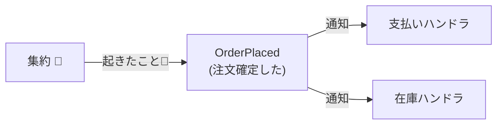
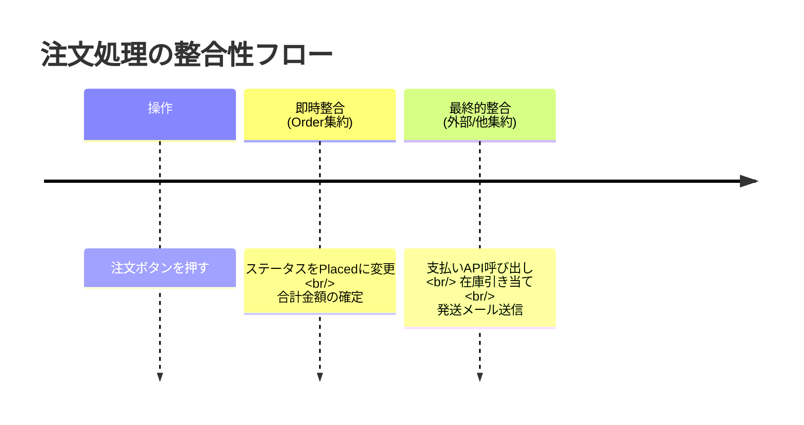
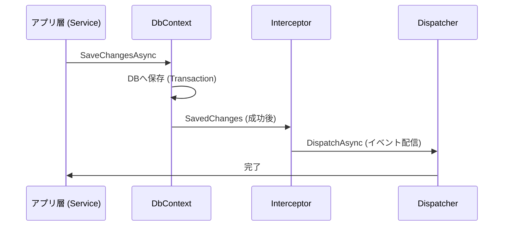

# 第31章：ドメインイベントと最終的整合性（入門）📣⏳

## この章でできるようになること🎯✨

* 「跨ぎ更新したい…😵」を **ドメインイベント** で安全にほどく方法がわかる🔓
* **即時整合（すぐ一致）** と **最終的整合（あとで一致）** を分けて考えられる⏱️⏳
* C#で「集約の中でイベント発行 → 外で処理」を最小コードで体験できる🧩
* 画面/UXで「いま何中？」をステータスで見せるコツがわかる👀🚦

---

## 1. まず結論：跨ぎ更新は「イベント」で分離しよう🌉✨

第30章で出た「跨ぎ更新したくなる病」🙅‍♀️
これ、やりたくなる気持ちは超わかるんだけど、**1トランザクションに全部詰める** と

* DBロック長い😱
* 失敗時の巻き戻し地獄💥
* 将来の変更が激ムズ🧱

になりがち。

そこで登場するのが **ドメインイベント** です📣
MicrosoftのDDDガイドでも、**集約をまたぐ副作用（side effects）** はドメインイベントで明示し、必要に応じて **集約間は最終的整合** にするとスケーラブルでロック影響も小さくできる、と整理されています。([Microsoft Learn][1])

---

## 2. ドメインイベントってなに？（超やさしく）🧁📣


### ドメインイベント＝「起きた事実」✅（過去形がコツ！）

* ❌ `DoPayment`（やれ！）みたいな命令形じゃなくて
* ✅ `OrderPlaced`（注文が確定した）みたいな **過去形** にする

例（カフェ注文☕️）：

* `OrderPlaced`（注文確定した）
* `PaymentAuthorized`（決済OKになった）
* `OrderCanceled`（注文キャンセルされた）

> 「イベント」は *いま起きた事実* を表すので、名前が過去形だと超キレイ✨



---

## 3. 最終的整合（Eventual Consistency）ってなに？⏳

### 即時整合（Strong / Immediate）⏱️

「操作が終わった瞬間に、関連するデータが全部一致してる」状態✨
例：注文確定と同時に、明細と合計金額が矛盾ゼロ✅

### 最終的整合（Eventual）⏳

「操作直後は一部まだ揃ってなくてもOK。少し遅れて揃えばOK」状態✨
例：注文確定した直後は `支払い処理中` だけど、数秒後に `支払い完了` になる💳✅

ポイントはこれ👇
**「どれを即時で守るべきか？」** と **「どれは遅れてOKか？」** を分けること⚖️



---

## 4. カフェ注文で考える：どこまで即時？どこから最終？☕️📦

### 例：注文確定 → 支払い → 発送準備（っぽいもの）

* 注文確定（Order集約）✅ … **即時整合**

  * 注文が成立してる
  * 明細や合計が正しい
* 支払い確定（Payment側の何か）💳 … **最終的整合でもOK**（多くの現実では）

  * 決済APIは外部で遅いことがある
  * 失敗/再試行もある

だから、Order集約の中で「Payment集約を直接更新」しない🙅‍♀️
代わりに、Order集約がこう言う👇

> 「注文が確定したよ📣（OrderPlaced）」
> あとは外側がよろしく処理してね〜✨

---

## 5. “いま何中？”をステータスで見せる🚦👀（UXの命！）

最終的整合は「遅れ」が前提になるので、画面ではこう見せるのが超大事💬✨

### 小さな状態機械っぽい表（ミニ）🚦

| 状態（OrderStatus）  | 意味        | 次に起きるイベント例                            |
| ---------------- | --------- | ------------------------------------- |
| `Draft`          | まだ編集中     | `OrderPlaced`                         |
| `PendingPayment` | 支払い待ち/処理中 | `PaymentAuthorized` / `PaymentFailed` |
| `Paid`           | 支払い完了     | （次工程へ）                                |
| `Canceled`       | キャンセル済み   | （終了）                                  |

**コツ**💡

* 画面に「処理中です…☕️⏳」を出せると、ユーザーの不安が減る✨
* 「遅れて揃う」前提なら、状態があるだけで世界が平和になる🕊️

---

## 6. 実装方針：集約内で発行 → SaveChanges成功後に外で処理📣💾

### なぜ「SaveChanges成功後」？

イベントを先に飛ばすと、DB保存が失敗したのにイベントだけ飛んだ😱
みたいな事故が起きがち。

EF Coreには **SaveChangesを横取りできる Interceptor** があり、SaveChanges前後に処理を差し込めます。([Microsoft Learn][2])
その中でも `SaveChangesInterceptor` が用意されています。([Microsoft Learn][3])

---

## 7. ミニ実装（最小セット）🧩✨

> ここでは「仕組みがわかる最小」に絞るよ😊
> （取りこぼし対策のOutboxは第32章📮🔁）

### 7.1 ドメインイベント基盤（集約がイベントをためる）📣🧺

```csharp
public interface IDomainEvent
{
    DateTime OccurredAt { get; }
}

public abstract record DomainEventBase(DateTime OccurredAt) : IDomainEvent;

public interface IHasDomainEvents
{
    IReadOnlyCollection<IDomainEvent> DomainEvents { get; }
    void ClearDomainEvents();
}
```

### 7.2 Order集約：注文確定でイベントを積む☕️✅

```csharp
public enum OrderStatus
{
    Draft,
    PendingPayment,
    Paid,
    Canceled
}

public sealed class Order : IHasDomainEvents
{
    private readonly List<IDomainEvent> _domainEvents = new();
    private readonly List<OrderItem> _items = new();

    public Guid Id { get; private set; } = Guid.NewGuid();
    public OrderStatus Status { get; private set; } = OrderStatus.Draft;

    public IReadOnlyCollection<OrderItem> Items => _items;
    public IReadOnlyCollection<IDomainEvent> DomainEvents => _domainEvents;

    public void AddItem(string name, int price, int qty)
    {
        if (Status != OrderStatus.Draft) throw new InvalidOperationException("確定後は変更できません😇");
        if (string.IsNullOrWhiteSpace(name)) throw new ArgumentException(nameof(name));
        if (price <= 0) throw new ArgumentOutOfRangeException(nameof(price));
        if (qty <= 0) throw new ArgumentOutOfRangeException(nameof(qty));

        _items.Add(new OrderItem(name, price, qty));
    }

    public void Place()
    {
        if (Status != OrderStatus.Draft) throw new InvalidOperationException("すでに確定済みです😇");
        if (_items.Count == 0) throw new InvalidOperationException("商品が空だよ〜🧁");

        Status = OrderStatus.PendingPayment;

        // ✅ ここが主役：イベント発行（ためるだけ）
        _domainEvents.Add(new OrderPlaced(Id, DateTime.UtcNow));
    }

    public void ClearDomainEvents() => _domainEvents.Clear();
}

public sealed record OrderItem(string Name, int Price, int Quantity);

public sealed record OrderPlaced(Guid OrderId, DateTime OccurredAt) : DomainEventBase(OccurredAt);
```

ここで大事なのは👇

* `Order.Place()` は **Orderの整合性だけ** を守る✅
* Paymentを直接触らない🙅‍♀️
* “起きた事実” `OrderPlaced` を **ためる** 📣🧺

---

## 8. イベントを配る人（Dispatcher）🤖📣

外側でイベントを処理するために、超シンプルな仕組みを作ります✨

```csharp
public interface IDomainEventHandler<in TEvent> where TEvent : IDomainEvent
{
    Task Handle(TEvent ev, CancellationToken ct);
}

public interface IDomainEventDispatcher
{
    Task DispatchAsync(IEnumerable<IDomainEvent> events, CancellationToken ct);
}

public sealed class DomainEventDispatcher(IServiceProvider services) : IDomainEventDispatcher
{
    public async Task DispatchAsync(IEnumerable<IDomainEvent> events, CancellationToken ct)
    {
        foreach (var ev in events)
        {
            // 型ごとのハンドラを全部呼ぶ（複数OK）
            var handlerType = typeof(IDomainEventHandler<>).MakeGenericType(ev.GetType());
            var handlers = services.GetServices(handlerType);

            foreach (var handler in handlers)
            {
                var method = handlerType.GetMethod("Handle")!;
                var task = (Task)method.Invoke(handler, new object[] { ev, ct })!;
                await task.ConfigureAwait(false);
            }
        }
    }
}
```

---

## 9. SaveChangesInterceptorで「保存成功後」にイベント配信💾📣

EF Core InterceptorsはSaveChangesのような高レベル操作にも介入できます。([Microsoft Learn][2])
なので、ここで **SaveChangesが成功した後に** ドメインイベントを配ります✨

```csharp
using Microsoft.EntityFrameworkCore;
using Microsoft.EntityFrameworkCore.Diagnostics;

public sealed class PublishDomainEventsInterceptor(IDomainEventDispatcher dispatcher)
    : SaveChangesInterceptor
{
    public override int SavedChanges(SaveChangesCompletedEventData eventData, int result)
    {
        DispatchAsync(eventData.Context!).GetAwaiter().GetResult();
        return result;
    }

    public override async ValueTask<int> SavedChangesAsync(
        SaveChangesCompletedEventData eventData,
        int result,
        CancellationToken cancellationToken = default)
    {
        await DispatchAsync(eventData.Context!, cancellationToken);
        return result;
    }

    private async Task DispatchAsync(DbContext db, CancellationToken ct = default)
    {
        var entities = db.ChangeTracker
            .Entries()
            .Select(e => e.Entity)
            .OfType<IHasDomainEvents>()
            .Where(e => e.DomainEvents.Count > 0)
            .ToList();

        var events = entities.SelectMany(e => e.DomainEvents).ToList();

        // 先にクリア（同じイベントを二重に飛ばさないため）
        foreach (var e in entities) e.ClearDomainEvents();

        await dispatcher.DispatchAsync(events, ct);
    }
}
```

> `SaveChangesInterceptor` 自体がEF Coreに用意されている仕組みだよ〜🛠️([Microsoft Learn][3])



---

## 10. ハンドラ例：注文確定を受けて「支払い要求」を作る💳📣

ここでは簡単に、「Payment要求レコードを作る」みたいな処理にします😊
（実際の外部決済APIはもっと複雑＆リトライ必要。そこは次章のOutboxへ📮🔁）

```csharp
public sealed class PaymentRequest
{
    public Guid Id { get; private set; } = Guid.NewGuid();
    public Guid OrderId { get; private set; }
    public DateTime CreatedAt { get; private set; } = DateTime.UtcNow;

    private PaymentRequest() { }
    public PaymentRequest(Guid orderId) => OrderId = orderId;
}

public sealed class OrderPlaced_CreatePaymentRequestHandler(AppDbContext db)
    : IDomainEventHandler<OrderPlaced>
{
    public async Task Handle(OrderPlaced ev, CancellationToken ct)
    {
        // ✅ ここは別の“副作用”として処理
        db.PaymentRequests.Add(new PaymentRequest(ev.OrderId));
        await db.SaveChangesAsync(ct);
    }
}
```

### ⚠️ここで感じてほしいポイント

* Order集約の中では Payment を更新しない🙅‍♀️
* “注文確定”という事実を受けて、外が副作用を起こす📣✨
* これで跨ぎ更新の誘惑が減る😇

---

## 11. DI登録の例（超ミニ）🧷✨

```csharp
using Microsoft.EntityFrameworkCore;

var builder = WebApplication.CreateBuilder(args);

builder.Services.AddScoped<IDomainEventDispatcher, DomainEventDispatcher>();
builder.Services.AddScoped<PublishDomainEventsInterceptor>();

builder.Services.AddDbContext<AppDbContext>((sp, opt) =>
{
    opt.UseSqlite("Data Source=app.db");

    // ✅ SaveChangesInterceptor を登録
    opt.AddInterceptors(sp.GetRequiredService<PublishDomainEventsInterceptor>());
});

builder.Services.AddScoped<IDomainEventHandler<OrderPlaced>, OrderPlaced_CreatePaymentRequestHandler>();

var app = builder.Build();
app.Run();
```

---

## 12. “最終的整合あるある”注意点（入門版）⚠️😅

### ① ハンドラが失敗したら？😱

SaveChangesは成功したのに、ハンドラ側で失敗することがある。
→ だから「確実に届ける仕組み」が必要になる（次章：Outbox📮🔁）

### ② 二重処理が起きるかも？🔁

リトライしたら同じイベントを2回処理しちゃうかも。
→ だから「冪等性キー」が必要（次章でやるよ🗝️）

### ③ 画面は“いま何中？”を必ず出す👀🚦

最終的整合は「遅れ」を前提にする。
→ 「支払い処理中です⏳」があるだけでクレームが激減しやすい✨

---

## 13. AI（Copilot/Codex）に手伝わせるプロンプト例🤖✨

### 13.1 イベント名の候補を出してもらう📣

```text
カフェ注文ドメインで、Order集約から発行する「過去形」のドメインイベント名を10個提案して。
各イベントに「いつ発行されるか」と「含めるべき最小データ（ID中心）」も書いて。
```

### 13.2 状態遷移表を作ってもらう🚦

```text
OrderStatus の状態遷移表を作って。
Draft / PendingPayment / Paid / Canceled を含めて、遷移のトリガー（イベント名）も添えて。
初心者向けにわかりやすく。
```

### 13.3 Interceptorのテスト観点を出してもらう🧪

```text
PublishDomainEventsInterceptor のテスト観点を列挙して。
「イベントが飛ぶ/飛ばない」「二重送信しない」「SaveChanges失敗時に飛ばない」など、重要ケースを中心に。
```

---

## 14. ミニ演習（3本）✍️🎀

### 演習1：イベントを「過去形」に直す📣

次の名前、過去形にしてみてね😊

* `PayPayment` → ✅ `PaymentAuthorized`（例）
* `CancelOrder` → ✅ `OrderCanceled`
* `ShipOrder` → ✅ `OrderShipped`

### 演習2：Orderに `Cancel()` を追加してイベント発行🚫📣

* `OrderCanceled` を作る
* `Status` を `Canceled` にする
* 条件（例：`Paid` ならキャンセル不可😇）を入れる

### 演習3：「処理中」をUIに出す文章を考える💬⏳

`PendingPayment` のとき、画面に出す文言を3つ考えてみよう🌸
例：

* 「お支払いを確認中です…💳⏳」
* 「ただいま処理中です。少しだけお待ちください☕️」

---

## 15. この章のまとめ🎁✨

* ドメインイベントは「起きた事実（過去形）」📣✅
* 集約の中は **整合性を守るだけ**、副作用は **外で処理** 🧠✨
* 集約間は **最終的整合** を選べる（ロック影響を減らしやすい）([Microsoft Learn][1])
* EF CoreのInterceptorで SaveChanges 後に配信できる💾📣([Microsoft Learn][2])
* ただし「取りこぼし/二重処理」など運用の現実があるので、次章で **Outbox + 冪等性** に進む📮🔁

---

## （参考：この教材で扱うバージョン感）🧭✨

* .NET 10 は LTS として 2025-11-11 リリース、サポートは 2028年まで（公式）([Microsoft for Developers][4])
* EF Core 10.0 は .NET 10 に対応し、サポート期限も 2028年まで（公式）([Microsoft Learn][5])

[1]: https://learn.microsoft.com/en-us/dotnet/architecture/microservices/microservice-ddd-cqrs-patterns/domain-events-design-implementation?utm_source=chatgpt.com "Domain events: Design and implementation - .NET"
[2]: https://learn.microsoft.com/en-us/ef/core/logging-events-diagnostics/interceptors?utm_source=chatgpt.com "Interceptors - EF Core"
[3]: https://learn.microsoft.com/en-us/dotnet/api/microsoft.entityframeworkcore.diagnostics.savechangesinterceptor?view=efcore-10.0&utm_source=chatgpt.com "SaveChangesInterceptor Class"
[4]: https://devblogs.microsoft.com/dotnet/announcing-dotnet-10/?utm_source=chatgpt.com "Announcing .NET 10"
[5]: https://learn.microsoft.com/en-us/ef/core/what-is-new/?utm_source=chatgpt.com "EF Core releases and planning"
