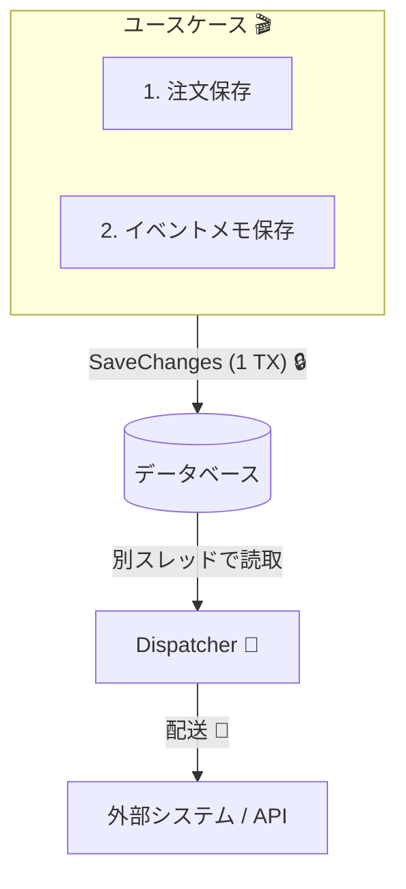
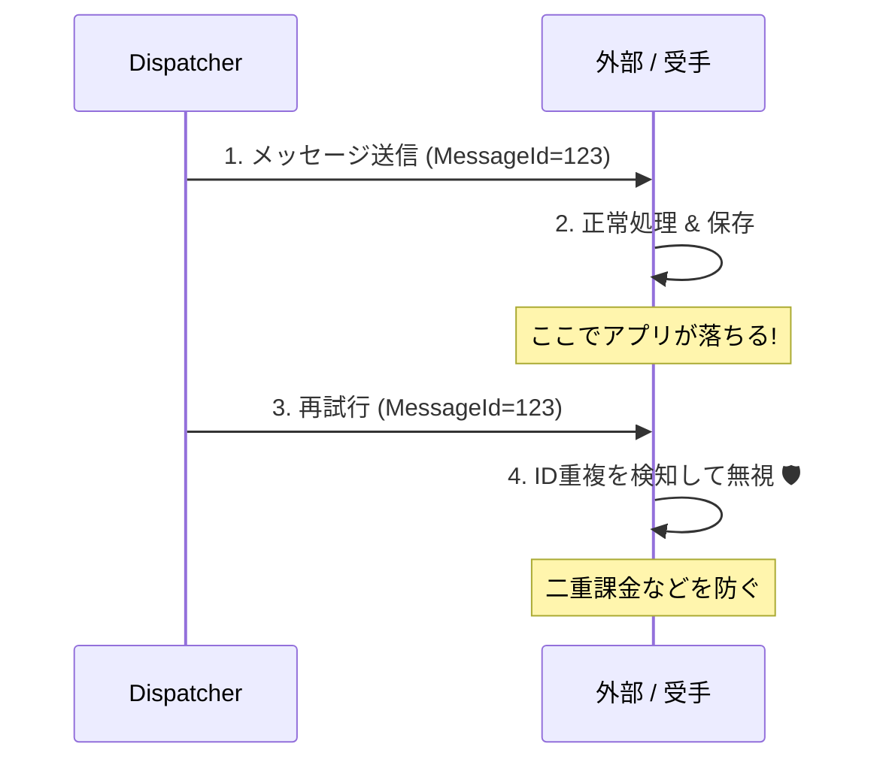
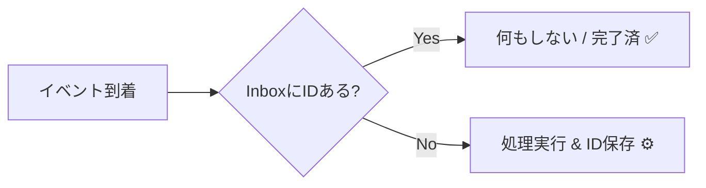

# 第32章：Outboxと冪等性（現実運用の最低ライン）📮🔁

## 32.1 この章でわかること 🎯✨

* 「イベント取りこぼし」「二重処理」がどうやって起きるかを説明できる 😱💥
* Outboxパターンの“考え方”と、最小のテーブル設計ができる 📮🧠
* 「少なくとも1回（at-least-once）」前提で、冪等にして事故を止められる 🔁🛡️
* EF Coreで “業務データ + Outbox” を同じ保存で確定するイメージが掴める 💾✨

---

## 32.2 まず怖い話：取りこぼし＆二重送信 😱📨

### 取りこぼし（送れてないのに、DBは確定してる）🕳️💔

たとえば「注文確定 → ‘支払い依頼イベント’ を送る」って流れで…

1. DBに注文は保存できた ✅
2. その直後、アプリが落ちた 💥
3. “イベント送信” が実行されなかった ❌

👉 すると「支払い依頼が飛ばないのに注文だけある」みたいな、地味にヤバい状態になります…😇

### 二重送信（二回送っちゃった）👯‍♀️📨

逆に…

1. イベント送信は成功した ✅
2. “送信済みフラグ更新” の前にアプリが落ちた 💥
3. 再起動後、同じイベントをまた送る 🔁

👉 受け手が同じ処理を2回やると「二重課金」「二重引当」「二重発送準備」みたいな事故に直結します 💸📦🔥

---

## 32.3 Outboxパターン：発想はめちゃシンプル 📮✨


**ポイントはこれだけ👇**

* **業務データを保存するのと同じタイミングで**
* **「あとで送るイベント」もDBに一緒に保存する**

つまり「送信」じゃなくて「送信予約のメモをDBに残す」感じ📮📝

イメージ図（ざっくり）👇

* 1回の保存（同じトランザクション）で

  * Orders（注文）✅
  * OutboxMessages（送る予定のイベント）✅
    を同時に確定する💾

そのあとで（別プロセス/別スレッドで）

* OutboxDispatcher が OutboxMessages を読んで
* メッセージブローカーや外部APIに配送する📨🚚

こうすれば「注文は確定したのにイベントが消えた」が起きにくくなるよ、って仕組みです😊



---

## 32.4 “なぜ効くの？”の根っこ：SaveChangesの性質 🧠💡

EF Coreは基本的に **1回の `SaveChanges` が “全部成功 or 全部失敗”** になるように、DBが対応していればトランザクションで包みます。([Microsoft Learn][1])

👉 だから「注文の保存」と「Outbox行の保存」を**同じSaveChanges**でやれば、

* 注文だけ成功、Outboxだけ失敗
  みたいな中途半端が減ります ✨

---

## 32.5 Outboxテーブル：最小の現実ライン 📮🧱

最低限これがあると強い💪

* `Id`（GUID）… Outbox行の主キー 🆔
* `OccurredOn`（日時）… いつ起きたイベント？ ⏰
* `Type`（文字列）… イベント型名（例：`OrderPlaced`）🏷️
* `PayloadJson`（文字列）… イベントの中身（JSON）📦
* `ProcessedOn`（日時 nullable）… 送信完了したら埋める ✅
* `AttemptCount`（int）… 何回失敗した？ 🔁
* `LastError`（文字列 nullable）… 最後のエラー 🧯

さらに実運用っぽくするなら👇

* `NextRetryAt`（次に再試行する時刻）⏳
* `LockId` / `LockedUntil`（複数ワーカー対策）🔒

---

## 32.6 実装パターンは2つあるよ（初心者向けに整理）🧩✨

### A) 手動でOutboxに入れる（理解しやすい）🖐️📮

アプリ層（ユースケース）で
「注文を保存する前にOutbox行も追加」する方式。

### B) SaveChangesInterceptorで半自動（スッキリ）🪄📮

EF Coreの Interceptor を使って
「SaveChangesされる直前に、ドメインイベント→Outbox行」を自動で追加する方式。
EF Coreは SaveChanges を含む処理を Interceptor で横取りできるよ、って公式の仕組みがあるよ([Microsoft Learn][2])

---

## 32.7 ミニ実装：Outbox（半自動版）📮🪄（EF Core）

### ① ドメインイベントを溜める（集約側）📣🌳

```csharp
public interface IDomainEvent
{
    Guid EventId { get; }
    DateTimeOffset OccurredOn { get; }
}

public abstract class AggregateRoot
{
    private readonly List<IDomainEvent> _events = new();
    public IReadOnlyList<IDomainEvent> DomainEvents => _events;

    protected void AddEvent(IDomainEvent ev) => _events.Add(ev);
    public void ClearEvents() => _events.Clear();
}
```

### ② Outboxエンティティ（DBに残す“発送予定メモ”）📮📝

```csharp
public sealed class OutboxMessage
{
    public Guid Id { get; init; } = Guid.NewGuid();
    public Guid EventId { get; init; }
    public DateTimeOffset OccurredOn { get; init; }
    public string Type { get; init; } = "";
    public string PayloadJson { get; init; } = "";

    public DateTimeOffset? ProcessedOn { get; set; }
    public int AttemptCount { get; set; }
    public string? LastError { get; set; }
}
```

### ③ SaveChangesInterceptorで「イベント→Outbox」を自動追加 🪄📮

```csharp
using System.Text.Json;
using Microsoft.EntityFrameworkCore;
using Microsoft.EntityFrameworkCore.Diagnostics;

public sealed class OutboxInterceptor : SaveChangesInterceptor
{
    public override ValueTask<InterceptionResult<int>> SavingChangesAsync(
        DbContextEventData eventData,
        InterceptionResult<int> result,
        CancellationToken cancellationToken = default)
    {
        var db = eventData.Context;
        if (db is null) return base.SavingChangesAsync(eventData, result, cancellationToken);

        // AggregateRoot を拾って、ドメインイベントを集める
        var aggregates = db.ChangeTracker.Entries()
            .Select(e => e.Entity)
            .OfType<AggregateRoot>()
            .ToList();

        var events = aggregates.SelectMany(a => a.DomainEvents).ToList();
        if (events.Count == 0) return base.SavingChangesAsync(eventData, result, cancellationToken);

        // Outboxに詰める
        foreach (var ev in events)
        {
            db.Set<OutboxMessage>().Add(new OutboxMessage
            {
                EventId = ev.EventId,
                OccurredOn = ev.OccurredOn,
                Type = ev.GetType().FullName ?? ev.GetType().Name,
                PayloadJson = JsonSerializer.Serialize(ev, ev.GetType())
            });
        }

        // 重要：イベントはここでクリア（同じSaveChangesで二重登録しない）
        foreach (var a in aggregates) a.ClearEvents();

        return base.SavingChangesAsync(eventData, result, cancellationToken);
    }
}
```

Interceptorは DbContext 設定で登録できます（`AddInterceptors`）([Microsoft Learn][2])

---

## 32.8 OutboxDispatcher：DBから拾って送る係 🚚📨（超ミニ）

やることはこの3つだけ👇

1. 未処理（`ProcessedOn is null`）を少し取る
2. 送る（Publish/HTTP/何でも）
3. 成功なら `ProcessedOn` を埋める。失敗なら `AttemptCount` + エラー保存

```csharp
using Microsoft.EntityFrameworkCore;

public sealed class OutboxDispatcher : BackgroundService
{
    private readonly IServiceScopeFactory _scopeFactory;

    public OutboxDispatcher(IServiceScopeFactory scopeFactory) => _scopeFactory = scopeFactory;

    protected override async Task ExecuteAsync(CancellationToken stoppingToken)
    {
        var timer = new PeriodicTimer(TimeSpan.FromSeconds(1));

        while (await timer.WaitForNextTickAsync(stoppingToken))
        {
            using var scope = _scopeFactory.CreateScope();
            var db = scope.ServiceProvider.GetRequiredService<AppDbContext>();

            var batch = await db.OutboxMessages
                .Where(x => x.ProcessedOn == null)
                .OrderBy(x => x.OccurredOn)
                .Take(20)
                .ToListAsync(stoppingToken);

            foreach (var msg in batch)
            {
                try
                {
                    // ここで実際の送信（例：メッセージブローカー or 外部API）
                    // await _bus.PublishAsync(msg.Type, msg.PayloadJson, msg.EventId);

                    msg.ProcessedOn = DateTimeOffset.UtcNow;
                    msg.LastError = null;
                }
                catch (Exception ex)
                {
                    msg.AttemptCount++;
                    msg.LastError = ex.Message;
                }
            }

            await db.SaveChangesAsync(stoppingToken);
        }
    }
}
```

※このDispatcherは「同じメッセージを2回送る可能性」が普通にあります（落ちるタイミング次第）😇
だから次が超重要👇



---

## 32.9 冪等性（Idempotency）：Outboxの相棒 🧡🔁

### 結論：イベント処理は「少なくとも1回」前提で考える 🧠

イベント駆動は **at-least-once（重複があり得る）** を前提にするのが責任ある設計だよ、ってMicrosoftのガイダンスでも明言されています([Microsoft Learn][3])
👉 だから **受け手は冪等** にするのが“最低ライン”✨



---

## 32.10 受け手を冪等にする：Inboxテーブル（最小）📥✅

### 仕組み（超シンプル）📌

* 受け手DBに `ProcessedMessages(MessageId)` を作る
* 何か来たら、まず `MessageId` を INSERT してみる

  * 成功 → 初回だから処理してOK ✅
  * 失敗（ユニーク違反）→ 既に処理済みなので即return 🏃‍♀️💨

### ミニコード（雰囲気）📥

```csharp
public sealed class ProcessedMessage
{
    public Guid MessageId { get; init; }
    public DateTimeOffset ProcessedOn { get; init; } = DateTimeOffset.UtcNow;
}
```

```csharp
public async Task HandlePaymentSucceededAsync(Guid messageId, CancellationToken ct)
{
    // 1) まず Inbox に登録（ユニーク制約で重複を弾く）
    _db.ProcessedMessages.Add(new ProcessedMessage { MessageId = messageId });

    try
    {
        await _db.SaveChangesAsync(ct);
    }
    catch (DbUpdateException)
    {
        // 既に処理済み → 何もしない（冪等！）
        return;
    }

    // 2) ここから “副作用あり” の本処理
    // - 注文を Paid にする
    // - 発送準備をキックする
    // など…

    await _db.SaveChangesAsync(ct);
}
```

これで「同じイベントが2回来ても、1回分だけ効く」💪✨

---

## 32.11 さらに現実っぽく：フレームワークのOutbox（例：MassTransit）🧰📮

「自作が大変〜😭」ってときは、Outbox/Inboxを仕組みとして提供してるライブラリもあります。
MassTransitのEF Core Outboxは、**InboxState / OutboxMessage / OutboxState** みたいなテーブルを使って配送と重複検出を支援します([masstransit.io][4])

設定例の雰囲気（最小イメージ）👇（概念だけね！）

* `AddEntityFrameworkOutbox<DbContext>(...)`
* `AddInboxStateEntity()` / `AddOutboxMessageEntity()` / `AddOutboxStateEntity()` など([masstransit.io][4])

---

## 32.12 実運用チェックリスト（最低ライン）✅📋✨

### Outbox側 📮

* [ ] 業務データとOutbox行を **同じSaveChanges** で確定する（同一トランザクション）([Microsoft Learn][1])
* [ ] Outboxに `ProcessedOn` / `AttemptCount` / `LastError` を持つ
* [ ] OutboxDispatcherは **リトライ前提**（落ちてもまた拾える）🔁

### 受け手側（冪等）📥

* [ ] “少なくとも1回” が前提。重複が来ても壊れない設計にする([Microsoft Learn][3])
* [ ] Inbox（ProcessedMessages）で **MessageId重複を弾く**
* [ ] ドメイン的にも「同じ状態なら何もしない」ができると最強（状態機械の発想🚦）

---

## 32.13 総合ミニ課題：注文→支払い→（遅れて）発送準備 ☕️💳📦

### お題 🎀

「注文確定→支払い→（遅れて）発送準備」を、**即時整合と最終的整合を分けて**設計しよう✨

#### ① 即時整合にする部分（同一トランザクションで守る）🔒

例：

* 注文作成（明細・合計・注文状態）
* 「注文は確定した」まで

#### ② 最終的整合でOKな部分（イベント + Outbox）⏳

例：

* 支払い処理（外部決済）
* 発送準備の開始（別集約/別サービスでもOK）

### 設計してほしいアウトプット ✍️✨

* どのタイミングで何のイベントを出す？（過去形で命名📣）

  * `OrderPlaced`
  * `PaymentSucceeded` など
* Outboxに何が入る？（Type/Payload/Id）📮
* 受け手はどう冪等にする？（Inbox or ユニーク制約）📥🔁
* 状態遷移はどうなる？（例：Placed → Paying → Paid → ShippingReady）🚦

### 勝利条件🏆✨

* 「どこが即時整合で、どこが最終的整合か」を言葉で説明できる
* 「二重イベントが来ても壊れない」対策が入ってる（冪等！）
* 「イベント取りこぼし」をOutboxで塞いでる📮🛡️

---

## 32.14 今の“最新世代”メモ（2026-01-27時点）🗓️✨

* EF Core 10 は **2025年11月リリースのLTS**で、**.NET 10が必要**だよ([Microsoft Learn][5])
* 2026年1月の更新として **.NET 10.0.2** が案内されてるよ([Microsoft サポート][6])
* EF Core も NuGet上で **10.0.2** が配布されてる（例：`Microsoft.EntityFrameworkCore`）([nuget.org][7])

---

## 32.15 AI（Copilot/Codex）に頼ると速いポイント 🤖✨

* 「OutboxMessageの設計（列とインデックス）」を3案出してもらう📮
* 「OutboxDispatcherの失敗時リトライ戦略」を箇条書きで出してもらう🔁
* 「Inbox方式の冪等ハンドラ」を、ユニーク制約前提で作ってもらう📥
* そのまま採用せず、**“重複が来たらどうなる？”**を必ず質問して確認するのがコツ🙆‍♀️✅

[1]: https://learn.microsoft.com/en-us/ef/core/saving/transactions "Transactions - EF Core | Microsoft Learn"
[2]: https://learn.microsoft.com/en-us/ef/core/logging-events-diagnostics/interceptors "Interceptors - EF Core | Microsoft Learn"
[3]: https://learn.microsoft.com/en-us/azure/architecture/serverless/event-hubs-functions/resilient-design?utm_source=chatgpt.com "Resilient design guidance for Event Hubs and Functions"
[4]: https://masstransit.io/documentation/configuration/middleware/outbox "Transactional Outbox Configuration · MassTransit"
[5]: https://learn.microsoft.com/en-us/ef/core/what-is-new/ef-core-10.0/whatsnew "What's New in EF Core 10 | Microsoft Learn"
[6]: https://support.microsoft.com/en-us/topic/-net-10-0-update-january-13-2026-64f1e2a4-3eb6-499e-b067-e55852885ad5?utm_source=chatgpt.com ".NET 10.0 Update - January 13, 2026"
[7]: https://www.nuget.org/packages/microsoft.entityframeworkcore?utm_source=chatgpt.com "Microsoft.EntityFrameworkCore 10.0.2"
