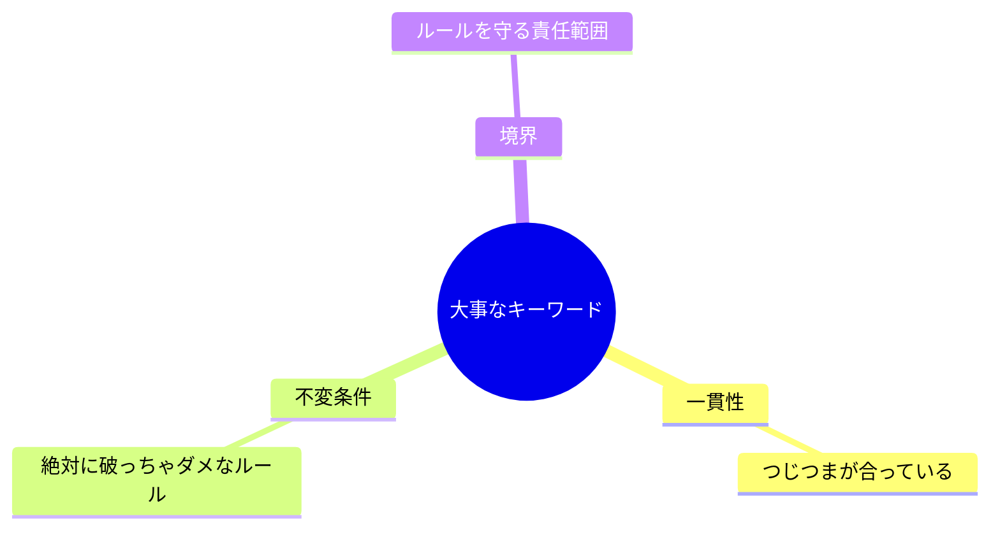
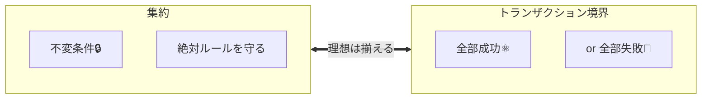

# 第01章：この教材のゴール（まず安心する回）😊🎯

## 1. この章で「できるようになること」🌟

この章のゴールはたったこれだけ👇

* **集約（Aggregate）**と**トランザクション境界**が、
  **「何を守るための道具なのか」**をふわっとでも掴む😊✨
* 「設計ってムズそう…」を一旦おいといて、
  **“事故を防ぐための考え方”**として見れるようになる🧯💕

---

## 2. まずは“事故”から入ろう（ミニECのあるある）😱🛒


題材はミニEC（注文🧾・在庫📦・支払い💳）だよ〜！

たとえば、こんな事故が起きがち👇💥

* 在庫が **-3** になった📦➡️📦💨（在庫マイナス地獄）
* 支払いが **二重に通った**💳💳（お客様ブチギレ案件）
* 支払い失敗したのに「注文確定」になった🧾✅（整合してない！）
* 注文キャンセルしたのに、出荷が進んだ📦🚚（取り返しが面倒）
* 合計金額がマイナスになった💰⬇️（どういう世界観…）

ここで大事なのは👇
**「事故の原因は“コードが下手”じゃなくて、“守るべきルールが散ってる/抜けてる”ことが多い」**ってこと😌✨

---

## 3. キーワード3つだけ覚えればOK✅🧠


この教材でよく出る言葉、まずは3つだけで十分！

### ✅ 一貫性（Consistency）

データが**つじつま合ってる状態**のこと😊
例：

* 注文が「支払い完了」なら、支払い履歴も「成功」になってる💳✅
* 在庫を引いたなら、在庫数は減ってる📦⬇️

### 🔒 不変条件（Invariants）


**絶対に破っちゃダメなルール**のこと🔥
例：

* 在庫はマイナス禁止📦🚫
* 合計金額はマイナス禁止💰🚫
* 「支払い完了」なのに支払い記録が無いの禁止💳🚫

### 🧱 境界（Boundary）

**「ここからここまでは、ルール守るよ！」って責任範囲**のこと😊
境界があると👇

* どこでチェックするか迷いにくい🧭
* テストもしやすい🧪
* “事故の温床”が減る🧯✨



---

## 4. 集約（Aggregate）って、超ざっくり何？🧺✨


集約を一言でいうと👇

**「不変条件（絶対ルール🔒）を守るための“まとまり”」**🧺✨

* 集約の中では、**ルールを壊した状態を作らない**のが最優先💪
* 外から集約の中身をベタベタ触らせず、**入口（集約ルート）を通して操作**するのが基本🚪👑

いまはこの理解でOK😊
（詳しい作り方は後の章でじっくりやるよ〜！）

---

## 5. トランザクション境界って、超ざっくり何？⚛️🧪


トランザクション境界は一言でいうと👇

**「全部成功か、全部なかったことにする範囲」**⚛️

たとえば「注文確定」って操作があるとして👇

* ✅ 注文作成🧾
* ✅ 在庫引当📦
* ✅ 支払い登録💳

この3つが“セットで成功してほしい”なら、
**途中で失敗したら全部戻す**のがトランザクションの考え方だよ😊🔁

---

## 6. 2つの関係（この教材の超重要ポイント）🧠🧱


ここが今日いちばん大事💡

* **集約**：ルール（不変条件🔒）を守る“設計のまとまり”🧺
* **トランザクション境界**：成功/失敗をまとめる“処理のまとまり”⚛️

そして基本の感覚は👇
**「ルールを守りたいまとまり（集約）と、まとめて成功させたい範囲（トランザクション境界）を、できるだけ揃える」**🧱🤝⚛️



（揃えられないケースもあるけど、それは後半で“安全な逃がし方”をやるよ😉）

---

## 7. 手を動かす：事故例を「あるあるメモ」化しよう📝✨


ここから実践！難しいコードはまだ要らないよ😊

### 📝 あるあるメモ（テンプレ）

下みたいにメモを作っていくよ👇

| 事故😱    | どうして起きた？🧩      | 困ること😵    | 守りたいルール候補🔒 | どこで守る？🧱 |
| ------- | --------------- | --------- | ----------- | -------- |
| 在庫が-1📦 | 同時注文で在庫チェックがズレた | 売れないのに売った | 在庫は0未満禁止    | 在庫のまとまり  |

### ✅ まずは3件でOK！

最初から10件はしんどいので、**まず3件**で十分👏😊
（慣れたら増やせばOK）

---

## 8. AI活用🤖✨：事故パターン10個 → ルール候補を抜き出す


AIはこの章だと「ネタ出し係」になってもらうのが最強💪😆
（出てきた内容は**そのまま信じず**、人間がチェックするのがコツ👀✅）

### 💬 プロンプト例①：事故パターンを出してもらう

```text
ミニEC（注文・在庫・支払い）で起きがちな事故を10個、短い説明つきで列挙して。
初心者向けに、具体例（例：在庫-1、二重決済など）でお願い。
```

### 💬 プロンプト例②：事故から「守るべきルール」を抽出

```text
さっきの事故リストそれぞれについて、
「守るべき不変条件（絶対に破っちゃダメなルール）」を1〜2個ずつ提案して。
```

### 💬 プロンプト例③：あるあるメモに整形

```text
次の事故について、あるあるメモ形式（事故/原因/困ること/守りたいルール/どこで守る）で1行にまとめて：
【ここに事故を書く】
```

※ VS Code の Copilot でも「Edit mode」みたいに、編集の提案を段階的に受け取れる機能が用意されてるので、メモ整形はかなり楽になるよ🧹✨ ([GitHub Docs][1])

---

## 9. 最新のTypeScript/VS Code “ちょい知識”📌✨（2026時点）

この教材で触れるTypeScriptは、最近の流れ的に「設定や補助機能がかなり親切」になってるよ😊

* TypeScript 5.9 では `tsc --init` が**よりミニマルで実用寄り**になって、最初から `strict` などが含まれる構成が提案されてるよ🧩✨ ([Microsoft for Developers][2])
* TypeScript 5.9 は `--module node20` みたいに、Node.js の挙動に合わせた安定オプションも増えてるよ🧠🔧 ([Microsoft for Developers][2])
* TypeScript の最新版（5.9.x系）は GitHub のリリースで「Latest」として提供されてるよ📦✨ ([GitHub][3])
* VS Code は 2026年1月時点で 1.108 系のアップデートが出てる（リリース日：2026-01-08）よ🗓️💻 ([Visual Studio Code][4])

（この章では「へぇ〜」でOK！設定は後の章でちゃんと触るよ😉）

---

## 10. 章末チェック（3分クイズ）🎓✅

当てはまるほうを選んでね😊

1. 「不変条件」ってなに？

* A: 気分で変えるルール
* B: 絶対に破っちゃダメなルール🔒

2. 「集約」って何を守る単位？

* A: UIの見た目
* B: ルール（不変条件）✅

3. 「トランザクション境界」ってどんな範囲？

* A: 全部成功か全部失敗にしたい範囲⚛️
* B: かわいい命名を付ける範囲

4. 在庫がマイナスになる事故は、まず何を疑う？

* A: 守るべきルールが散ってる/抜けてる🧱
* B: フォントが悪い

5. この章で最初に作るのは？

* A: 完璧なDDD設計
* B: 事故の「あるあるメモ」📝✨

答え：1B / 2B / 3A / 4A / 5B 🎉

---

## まとめ（この章で持ち帰る1行）🧡

**集約＝ルールを守るまとまり🧺、トランザクション境界＝成功/失敗をまとめる範囲⚛️。まずは事故から“守るべきルール”を見つける📝✨**

[1]: https://docs.github.com/en/copilot/get-started/features "GitHub Copilot features - GitHub Docs"
[2]: https://devblogs.microsoft.com/typescript/announcing-typescript-5-9/ "Announcing TypeScript 5.9 - TypeScript"
[3]: https://github.com/microsoft/typescript/releases "Releases · microsoft/TypeScript · GitHub"
[4]: https://code.visualstudio.com/updates "December 2025 (version 1.108)"
