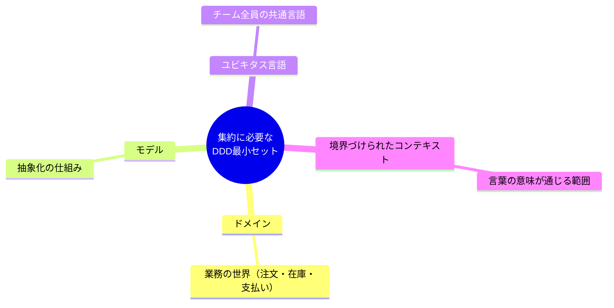
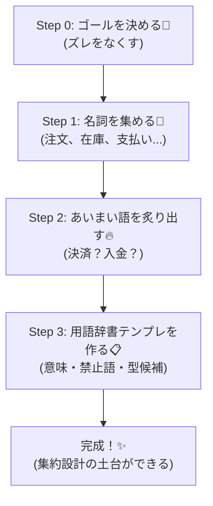

# 第02章：DDD超ミニ入門（集約に必要な分だけ）🧠✨

## この章でできるようになること 🎯

* 「DDDって結局なに？」を、集約に必要な分だけスパッと理解する ✂️✨
* **ドメインモデル**と**ユビキタス言語**が、なぜ集約の土台になるか分かる 🧩
* ミニECの**用語辞書（言葉の定義表）**を作って、チームの会話とコードのブレを減らせる 📘✅

---

## まずは30秒でDDD 🏃‍♀️💨


DDD（Domain-Driven Design）は、ざっくり言うと
**「業務の世界（ドメイン）をちゃんと理解して、その言葉でモデルを作り、コードもその言葉に寄せる」**アプローチだよ〜🗣️💻✨ ([martinfowler.com][1])

DDDの中心にあるのが **ドメインモデル**。
ドメインモデルは「業務の意味のあるモノ」を、**データだけじゃなく振る舞いも含めて表す**考え方だよ〜🧠🧩 ([martinfowler.com][2])

---

## 集約に必要なDDDの最小セット 🧺✨

集約（Aggregate）を理解するために、この章で使うDDD用語はこれだけ👇


### 1) ドメイン 🌍

「ソフトが扱う業務の世界」のこと。たとえばミニECなら「注文・在庫・支払い」だね 🛒📦💳 ([Domain Language][3])

### 2) モデル 🧩

ドメインの一部を切り取って、問題を解けるようにした「抽象化の仕組み」だよ〜🧠✨ ([Domain Language][3])

### 3) ユビキタス言語 🗣️

**モデルを中心にした共通言語**で、チーム全員が同じ意味で同じ言葉を使うこと！
「会話・文章・図・コード」で用語が揃ってる状態を目指すよ〜📘✅ ([martinfowler.com][4])


### 4) 境界づけられたコンテキスト 🧱

同じ単語でも、場所が変わると意味が変わることがあるよね？（例：「在庫」って、倉庫視点と販売視点で違う…とか）
だから **「この範囲ではこの意味！」** って境界を明示する考え方が大事だよ〜🧱✨ ([Domain Language][3])

> この「境界」が、のちの **集約の境界** や **トランザクション境界** を考える土台になるよ！🧠🔗



---

## 実践：ミニECの用語辞書を作ろう 📘✨

ここがこの章のメイン！🎉
集約って「不変条件を守るまとまり」なんだけど、**そもそも言葉がブレてると、不変条件もブレる**んだよね😇💥


## ステップ0：用語辞書のゴールを決める 🎯

用語辞書は「辞書」だけど、目的はこれ👇

* 会話がズレない ✅
* 仕様がズレない ✅
* コードの命名がズレない ✅

---

## ステップ1：まず“名詞”を集める 🧺

ミニECでよく出る名詞を、思いつくまま書き出すよ〜✍️✨
（最初は雑でOK！あとで磨く💅）

例）

* 注文 / 注文明細 / 注文合計 🧾
* 在庫 / 引当 / 予約 / 出荷 📦
* 支払い / 決済 / 返金 💳
* カート / 商品 / 価格 🛒

---


## ステップ2：あいまい語を炙り出す 🔥

次のタイプの言葉は、**高確率で事故る**😱⚠️

* 似た言葉が多い：支払い / 決済 / 入金
* 状態っぽい：確定 / 完了 / 受付
* 人によって意味が違う：在庫 / 引当 / 予約

ここは辞書で“固定”しようね🔒✨

---


## ステップ3：用語辞書テンプレを作る 📋✨

この形で作るとめっちゃ運用しやすいよ〜😊🫶

| 用語   | 意味（1行）          | 同義語/禁止語   | 例文（会話で使う形） | データ候補               | メモ         |
| ---- | --------------- | --------- | ---------- | ------------------- | ---------- |
| 注文   | 購入の意思を確定した取引の単位 | 禁止：購入（曖昧） | 「注文を作成する」  | OrderId, Items      | “確定”の定義が必要 |
| 注文明細 | 注文に含まれる商品行      | 同義：注文行    | 「明細を追加する」  | ProductId, Quantity | 価格はいつ確定？   |
| 在庫   | 販売可能な数量         | 禁止：残数（曖昧） | 「在庫が不足」    | Sku, AvailableQty   | “引当”と区別    |
| 引当   | 注文のために在庫を確保すること | 同義：予約     | 「在庫を引当する」  | ReservationId       | “期限”ある？    |
| 決済   | 支払い手段の認可・確定の処理  | 同義：支払い処理  | 「決済が完了」    | PaymentId, Status   | “入金”と違う    |
| 返金   | 取り消しでお金を戻すこと    | 同義：払い戻し   | 「返金を実行」    | RefundId            | いつ可能？      |

> ポイント：**禁止語**を入れるの超おすすめ！🚫
> 例えば「購入」は人によって“カート投入”にも“決済完了”にも見えるので、禁止にして「注文」「決済」みたいに分けるとスッキリするよ〜✨



---


## AI活用：用語辞書の叩き台を一気に作る 🤖💨

AIに「最初のたたき台」を作らせて、人間がズレを直すのが最速だよ〜🛠️✨
（AIは速いけど、意味の最終決定は人間がやるのが安全✅）

## プロンプト例：用語辞書の初稿を作る 🪄

```text
あなたはDDDの実務経験者です。ミニEC（注文・在庫・支払い）を題材に、
ユビキタス言語の用語辞書を作りたいです。

次の列を持つ表を、最低15行で出してください：
- 用語
- 意味（1行）
- 同義語/禁止語
- 例文（会話で使う形）
- データ候補（TSの型名っぽく）
- メモ（論点）

注意：
- 「注文」「決済」「入金」「引当」「在庫」「出荷」など、混同しやすい語は必ず区別
- 禁止語も提案する
```

## AIの出力を直すときのコツ ✨

* **一文で言える？**（長い定義はだいたい曖昧）
* **例文が自然？**（自然じゃない用語は現場で使われない😇）
* **状態語が混ざってない？**（例：「決済」＝状態/処理が混ざりがち）

---

## 仕上げ：ズレを見つけるチェックリスト ✅🔍

用語辞書を作ったら、次の質問にYES/NOしてみてね！🎯

1. 「注文」と「購入」は同じ意味になってない？
2. 「決済」と「入金」は区別できてる？
3. 「在庫」と「引当」がごっちゃになってない？
4. 「確定」「完了」が“何の完了か”明確？
5. 例文がコードのメソッド名にできそう？
6. 同じ言葉が別の意味で使われてない？（コンテキスト違い）🧱
7. 禁止語がある？（曖昧語の封じ込め）🚫
8. 例外ケース用の言葉がある？（キャンセル、失敗、期限切れ）😵
9. “誰が”その用語を使うか想像できる？（CS/倉庫/決済）👥
10. その用語が変わったら、コード名も変える覚悟ある？（言語＝モデル）🔁 ([Domain Language][3])

---

## よくある事故パターン 😱💥

## 事故1：「在庫がある」の意味が人によって違う

* 倉庫：「物理的にある」
* EC：「販売可能」
* 注文：「引当済みは除く」
  ➡️ こういうのは辞書で **販売可能在庫 / 物理在庫 / 引当在庫** みたいに分けると強い💪📦

## 事故2：「注文確定」がイベントなのか状態なのか曖昧

* “確定”が「ボタン押した瞬間」なのか
* “確定”が「決済OKになった状態」なのか
  ➡️ まず辞書で「注文作成」「注文確定」「決済完了」みたいに分離すると事故が減る🧾✨

---

## ミニまとめ 🧠✨

* DDDは「業務の言葉でモデルを作って、会話もコードも揃える」設計アプローチ🗣️💻 ([martinfowler.com][1])
* **用語辞書**は、集約の前にやると最強の“事故防止シート”になる📘✅
* 境界（コンテキスト）を意識すると、のちの「集約の境界」「トランザクション境界」が決めやすくなる🧱🔗 ([Domain Language][3])

---

## ちょい最新メモ：TypeScriptの今 📌✨

本日時点の安定版 TypeScript は **5.9.3**（npmの “Latest” 表示）だよ〜🧷 ([npmjs.com][5])
TypeScript 5.9 では `import defer` などの新機能も入ってるよ🧠⚡ ([devblogs.microsoft.com][6])

[1]: https://martinfowler.com/bliki/DomainDrivenDesign.html?utm_source=chatgpt.com "Domain Driven Design"
[2]: https://martinfowler.com/eaaCatalog/domainModel.html?utm_source=chatgpt.com "Domain Model"
[3]: https://www.domainlanguage.com/wp-content/uploads/2016/05/DDD_Reference_2015-03.pdf "Microsoft Word - pdf version of final doc - Mar 2015.docx"
[4]: https://martinfowler.com/bliki/UbiquitousLanguage.html?utm_source=chatgpt.com "Ubiquitous Language"
[5]: https://www.npmjs.com/package/typescript?utm_source=chatgpt.com "TypeScript"
[6]: https://devblogs.microsoft.com/typescript/announcing-typescript-5-9/?utm_source=chatgpt.com "Announcing TypeScript 5.9"
