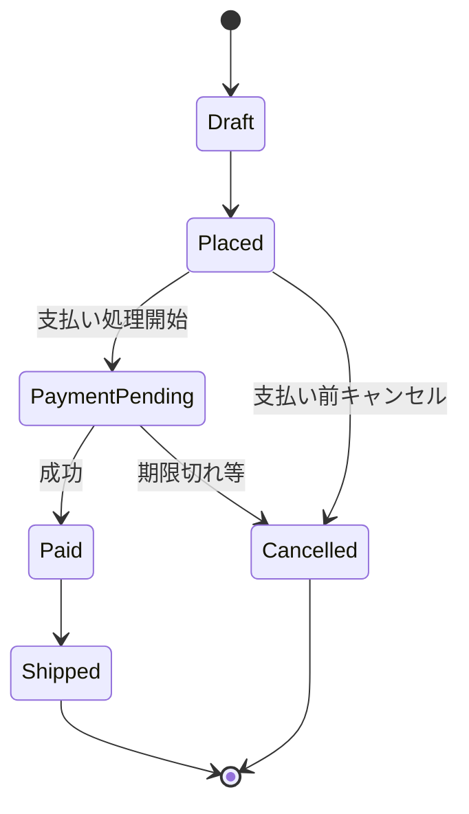
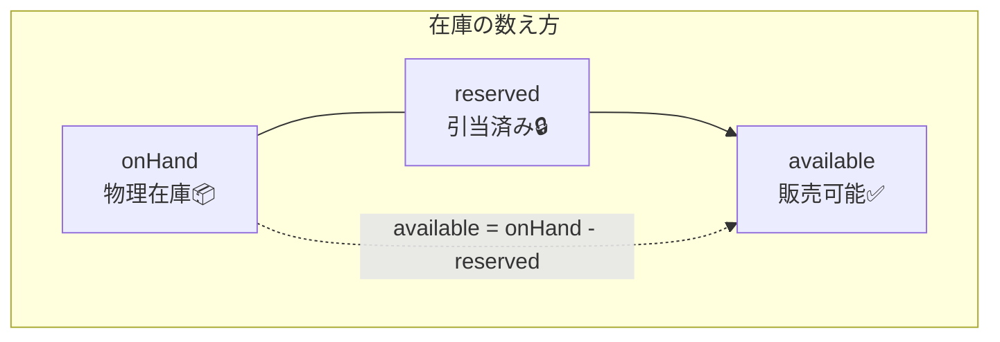
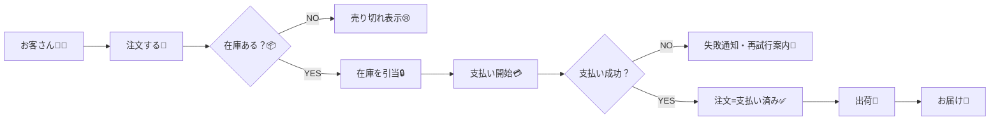

# 第03章：題材ドメイン（ミニEC）の全体像🛒📦💳

## この章でできるようになること🎯✨

* ミニECで「誰が・何を・どんな順番で」やってるか説明できる📣
* 注文🧾／在庫📦／支払い💳の“流れ”を図にできる🖊️
* 「どこで失敗しうるか（例外ケース）」を先に洗い出せる🧯

---

## 3-1. まずは“1つの注文の旅”を物語でつかむ📚🚚


ミニECは、ざっくり言うとこの3つの話だよ😊

* 注文🧾：買う！を確定する（何を・いくつ・いくらで）
* 在庫📦：それ、ちゃんと確保できる？（残りある？取り置きできる？）
* 支払い💳：お金は払えた？失敗した？二重になってない？

## いちばん基本の流れ（ハッピーパス）🌈

1. お客さんが商品を選ぶ🛍️
2. 「注文する！」を押す🧾✨
3. 在庫を“引当（取り置き）”する📦🔒
4. 支払いをする💳✅
5. 出荷してお届け🚚📮

ここで大事なのは…
**「注文・在庫・支払いは、それぞれ失敗する可能性がある」**ってこと😇
だから、次の章以降で「どこまでを一気に成功/失敗にする？（境界）」を考えるよ🧱✨

---

## 3-2. 登場人物（アクター）を整理しよう👩‍💻🧑‍💼🏭

## 人（ユーザー）👤

* お客さん🧑‍🛒：購入する人
* 店員/運営🧑‍💼：在庫補充・注文キャンセル対応など

## システム（外部サービス）🔌

* 決済サービス💳（例：カード決済・コンビニ決済など）
* 倉庫/配送🚚（発送・追跡番号の発行など）

この教材のミニECでは、外部サービスは「あるもの」として扱ってOK👌
ただし **“外部は失敗する”** 前提で考えるのが超大事🧯

---

## 3-3. 大事な“もの”（データ/概念）を並べる🧺✨

ここは「図が描けるようになるための材料集め」だよ🧩

## 注文まわり🧾

* Order（注文）🧾：注文全体（状態も持つ）
* OrderItem（注文明細）🧾➕：商品と数量の行
* Customer（顧客）👤：購入者（今回はID程度でもOK）

## 在庫まわり📦

* Stock（在庫）📦：商品ごとの在庫数
* Reservation（引当/取り置き）🔒：この注文のために“確保した分”

## 支払いまわり💳

* Payment（支払い）💳：支払いの結果や状態
* PaymentAttempt（試行）🔁：失敗→再試行、が起きるなら欲しくなる

---

## 3-4. 注文の状態（OrderStatus）を決めよう🧾🚦

状態っていうのは「いま注文がどの段階か」だよ😊
先に状態を決めると、後で事故が減る🧯✨

## まずは最小セット（おすすめ）✅

* `Draft`：作成中（カート状態）🛒
* `Placed`：注文確定（在庫引当はこれ以降が多い）🧾
* `PaymentPending`：支払い待ち（外部決済の結果待ち）⏳
* `Paid`：支払い成功✅💳
* `Cancelled`：キャンセル🚫
* `Shipped`：出荷済み🚚

## 状態遷移のざっくり表📋

* `Draft` → `Placed`
* `Placed` → `PaymentPending`（支払い処理開始）
* `PaymentPending` → `Paid`（成功） / → `Cancelled`（期限切れ等）
* `Paid` → `Shipped`
* `Placed` → `Cancelled`（支払い前キャンセル）

> ポイント💡
> “どこからキャンセルできる？”みたいな仕様が、状態でスッキリ決まるよ😊



---

## 3-5. 在庫の状態（引当の考え方）📦🔒

在庫は「数が合ってればOK」じゃなくて、注文の途中でこういう現象が起きる😇

* いま残りが5個ある📦
* 注文Aが2個ほしい🧾
* 注文Aのために2個を取り置き（引当）🔒
* “残り”は3個に見えるようにする（または、引当分を別管理）

## 最小の見方（2つの数で考える）🧠✨

* `onHand`：物理的にある数📦
* `reserved`：取り置き中の数🔒
* `available = onHand - reserved`：いま売っていい数✅

> ポイント💡
> 引当がないと「同時に注文されて在庫マイナス😱」が起きやすい…！



---

## 3-6. 支払いの状態（PaymentStatus）💳🚦

支払いは外部サービスが絡むので、**成功/失敗が遅れて返る**ことがあるよ⏳
だから状態を持つと安心😊

## 最小セット（おすすめ）✅

* `Pending`：処理中/結果待ち⏳
* `Succeeded`：成功✅
* `Failed`：失敗❌
* `Refunded`：返金済み↩️（必要なら）

> ここで“二重決済”みたいな世界も出てくるけど、そこは後半でしっかりやるよ🔂🧷

---

## 3-7. フロー図を書こう🖊️（MermaidでOK）🧜‍♀️✨

## フロー図（まずはこれで十分！）🗺️

下のコードを `.md` に貼ってプレビューすると図になるよ（Mermaid対応）😊
VS Codeなら Mermaid を表示できる拡張機能が有名だよ🧩 ([Visual Studio Marketplace][1])



## Mermaidコード例（これを参考にしてみてね！）


> 目標🎯
> この図を“自分の言葉”で説明できたら、もうこの章は勝ち😊🏆

---

## 3-8. 例外ケース（失敗ルート）を先に増やそう🧯💥

「例外を洗い出す」＝あとで事故らない最強の準備💪✨
よくあるのはこのへん👇

## 在庫まわり📦

* 途中で在庫がなくなる（同時購入）😱
* 引当したのに期限切れで戻す⌛↩️
* 引当解除し忘れて“ずっと売れない”状態になる🫠

## 支払いまわり💳

* 残高不足・認証失敗❌
* 決済が遅延して、結果が後から返ってくる⏳
* お客さんが連打して二重送信🔂（後半で冪等性やるよ）

## 注文まわり🧾

* 支払い前キャンセル🚫
* 支払い成功したのに出荷できない（配送不可）🚚💦
* 返金が必要になる↩️

---

## 3-9. 手を動かす（ワーク）📝✨

## ワーク1：用語を“ひとことで”書く📘

次を1行で説明してみよう😊

* 注文（Order）🧾
* 引当（Reservation）🔒
* 支払い（Payment）💳
* 状態（Status）🚦

## ワーク2：状態遷移に「禁止ルート」を入れる🚫

例：`Paid` → `Draft` は絶対ダメ🙅‍♀️
「ダメな遷移」を3つ書いてみよう🧯

## ワーク3：例外ケースを10個に増やす🔟✨

さっきの例外リストを、あなたのミニEC仕様に合わせて10個にしてみよう📋

---

## 3-10. AI活用（例外ケース増殖プロンプト）🤖💡

## 例外ケースを増やす🧯

そのままコピペOK👇

```text
ミニEC（注文・在庫・支払い）のフローがある。
「注文→在庫引当→支払い→出荷」の各段階で起きうる例外ケースを20個出して。
各ケースについて、(1)何が起きる？(2)ユーザーに何を表示する？(3)システムは何を記録する？ の3点で整理して。
```

## “状態”の抜けチェックをしてもらう🔍

```text
注文状態を Draft / Placed / PaymentPending / Paid / Cancelled / Shipped とする。
この状態設計の抜け・矛盾・追加した方が良い状態があれば指摘して。
ただし、最小構成を崩さずに、必要最小限の提案にして。
```

---

## （おまけ）いまのTypeScript/Node周りの動き（把握だけ）🧰✨

* TypeScript は 5.9 系のリリースノートが公開されてるよ（言語サービス改善など）([typescriptlang.org][2])
* Microsoft は TypeScript のネイティブ化（Go実装）プレビューも案内していて、ビルド高速化の方向性がはっきりしてるよ🚀([Microsoft Developer][3])
* Node.js は v24 が Active LTS、v25 が Current になってる（用途に応じて LTS を選ぶのが基本）([nodejs.org][4])

[1]: https://marketplace.visualstudio.com/items?itemName=bierner.markdown-mermaid&utm_source=chatgpt.com "Markdown Preview Mermaid Support"
[2]: https://www.typescriptlang.org/docs/handbook/release-notes/typescript-5-9.html?utm_source=chatgpt.com "Documentation - TypeScript 5.9"
[3]: https://developer.microsoft.com/blog/typescript-7-native-preview-in-visual-studio-2026?utm_source=chatgpt.com "TypeScript 7 native preview in Visual Studio 2026"
[4]: https://nodejs.org/en/about/previous-releases?utm_source=chatgpt.com "Node.js Releases"
