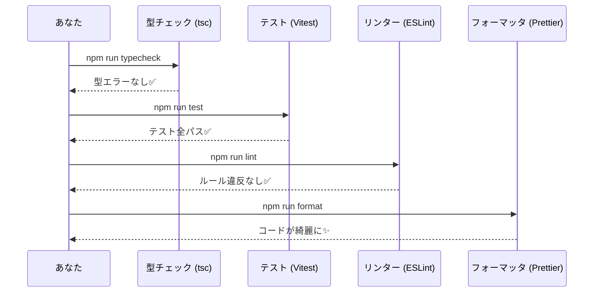
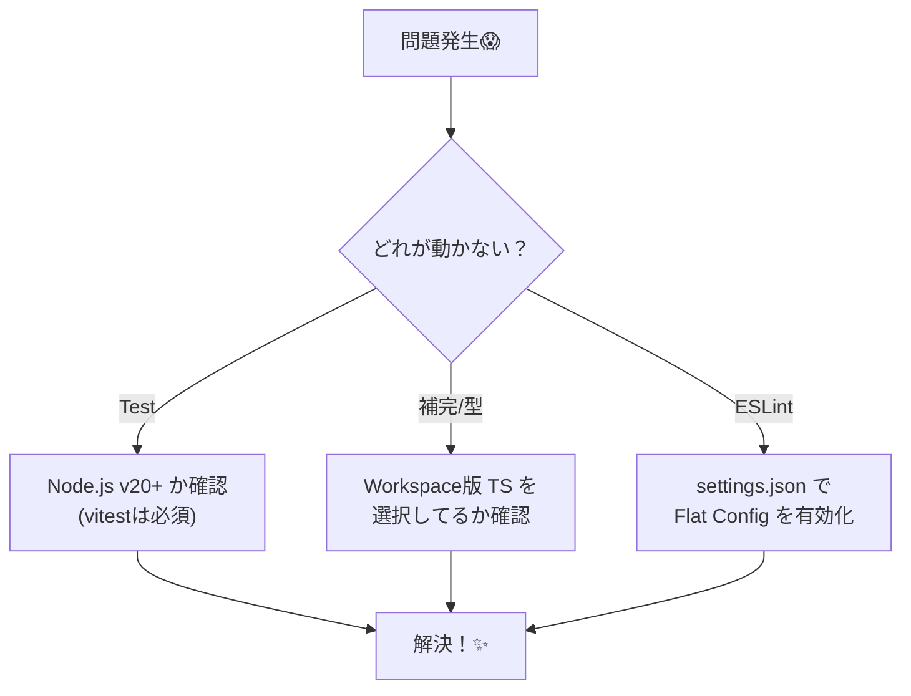

# 第04章：VS Code + TypeScript（2026）環境準備🔧💻

## この章のゴール🎯

この章が終わると、次が「迷わず」できるようになります😊✨

* TypeScript をプロジェクトに入れて、VS Code がちゃんと補完してくれる🧠💡
* テスト🧪が 1 本通る（＝環境が “動く”）✅
* フォーマット🧼＆Lint🧹＆型チェック🛡️ がワンコマンドで回る🎮

---

## 1) まず “最新の土台” を決める📌


## Node.js は LTS を選ぶ🍀

新規プロジェクトは **Active LTS** が無難です（2026-01 時点では **v24 が Active LTS** として案内されています）([nodejs.org][1])
※ Vitest も **Node 20+** を前提にしています🧪([vitest.dev][2])

## TypeScript はプロジェクト内に入れる📦

TypeScript は VS Code に言語サポートがあっても、`tsc` 自体は別途（npm で）入れる流れです🧩([Visual Studio Code][3])
2026-01 時点の npm “latest” は **TypeScript 5.9.3** です([npmjs.com][4])

---

## 2) プロジェクト作成（コピペでOK）📁✨

ターミナル（PowerShell）で👇

```powershell
mkdir mini-ec
cd mini-ec
npm init -y
```

---


## 3) 依存関係を入れる（最低セット）⬇️📦

```powershell
npm i -D typescript tsx vitest @types/node
npm i -D eslint @eslint/js typescript-eslint
npm i -D prettier eslint-config-prettier
```

* ESLint は v9 系で **flat config（`eslint.config.*`）が標準**になっています🧹([eslint.org][5])
* TypeScript ESLint の “推奨の始め方” は公式がまとまってます（この章の設定もここに寄せます）🧭([typescript-eslint.io][6])

---

## 4) 設定ファイルを置く⚙️🧷


## 4-1) `package.json` を整える📜

`package.json` の `scripts` をこうしておくと超ラク🎮✨
（すでにある `scripts` は上書きでOK）

```json
{
  "name": "mini-ec",
  "version": "0.1.0",
  "private": true,
  "type": "module",
  "scripts": {
    "dev": "tsx watch src/main.ts",
    "typecheck": "tsc --noEmit",
    "test": "vitest",
    "test:run": "vitest run",
    "lint": "eslint .",
    "format": "prettier . -w"
  }
}
```

> ここで `"type": "module"` を入れるのは、2026 の Node まわりで ESM が基本になってきていて、ツール同士の噛み合わせがラクだからだよ〜🧩✨

---


## 4-2) `tsconfig.json`（迷わない最新寄り）🛡️

TypeScript 5.9 では **`module: node20`** みたいな “安定した Node 向け設定” が整理されています（この章ではそれに寄せる）([typescriptlang.org][7])

```json
{
  "compilerOptions": {
    "target": "es2023",
    "module": "node20",
    "moduleResolution": "node20",
    "strict": true,

    "skipLibCheck": true,
    "noUncheckedIndexedAccess": true,
    "exactOptionalPropertyTypes": true,

    "types": ["node", "vitest/globals"]
  },
  "include": ["src", "tests"]
}
```

---

## 4-3) `vitest.config.ts`（テストの置き場を固定）🧪

Vitest は公式がこういう形で案内しています🧾([vitest.dev][2])

```ts
import { defineConfig } from "vitest/config";

export default defineConfig({
  test: {
    environment: "node",
    include: ["tests/**/*.test.ts"],
  },
});
```

---


## 4-4) `eslint.config.mjs`（flat config）🧹✨

TypeScript ESLint の推奨スタート形に寄せた版です🧭([typescript-eslint.io][6])
最後に `eslint-config-prettier` を足して「整形は Prettier に任せる」形にします🧼

```js
import js from "@eslint/js";
import tseslint from "typescript-eslint";
import eslintConfigPrettier from "eslint-config-prettier";

export default tseslint.config(
  js.configs.recommended,
  ...tseslint.configs.recommended,
  {
    ignores: ["dist/**", "node_modules/**"],
    rules: {
      // まずは増やしすぎないのがコツ🙂
      // 例: "no-console": "warn",
    },
  },
  eslintConfigPrettier
);
```

---

## 4-5) `prettier.config.cjs`（整形ルール）🧼✨

```js
/** @type {import("prettier").Config} */
module.exports = {
  printWidth: 100,
  semi: true,
  singleQuote: false,
  trailingComma: "all"
};
```

---

## 4-6) `.editorconfig`（改行やインデント事故を防ぐ）🧷

```ini
root = true

[*]
charset = utf-8
end_of_line = lf
insert_final_newline = true
indent_style = space
indent_size = 2
trim_trailing_whitespace = true

[*.md]
trim_trailing_whitespace = false
```

---


## 5) “動く確認” のための最小コードを書く✍️✨

## 5-1) `src/main.ts`

```ts
export function add(a: number, b: number): number {
  return a + b;
}
```

## 5-2) `tests/smoke.test.ts`

※ ESM + `node20` 設定だと、相対 import に `.js` 拡張子を付けるのがポイントだよ🔎✨（TypeScript がいい感じに解決してくれる）

```ts
import { describe, it, expect } from "vitest";
import { add } from "../src/main.js";

describe("smoke", () => {
  it("add works", () => {
    expect(add(1, 2)).toBe(3);
  });
});
```

---

## 6) コマンドで一気にチェック✅🎮

```powershell
npx tsc -v
npm run typecheck
npm run test:run
npm run lint
npm run format
```

* `npx tsc -v` で TypeScript のバージョン確認できるよ👀（2026-01 時点の latest は 5.9.3）([npmjs.com][4])



---

## 7) VS Code 側の “気持ちいい” 設定🧠💡


## 7-1) VS Code がプロジェクトの TypeScript を使うようにする🧩

VS Code は TypeScript 言語サポートがあるけど、**プロジェクトに入れた TypeScript を IntelliSense で使うには選択が必要**なことがあるよ🛠️([Visual Studio Code][8])

* コマンドパレット（Ctrl+Shift+P）→ **TypeScript: Select TypeScript Version** → **Use Workspace Version**（があればそれ）([Visual Studio Code][8])

## 7-2) 拡張機能（最低限）🧩✨

* ESLint（`dbaeumer.vscode-eslint`）
  flat config を使うとき、環境によっては設定が必要な場合があります（拡張側の案内）([Visual Studio Marketplace][9])
* Prettier（`esbenp.prettier-vscode`）

### `.vscode/settings.json`（あれば快適）💖

```json
{
  "editor.formatOnSave": true,
  "editor.defaultFormatter": "esbenp.prettier-vscode",
  "editor.codeActionsOnSave": {
    "source.fixAll.eslint": "explicit"
  },

  // ESLint 拡張が flat config を拾わないとき用（どちらかが効く環境が多い）
  "eslint.useFlatConfig": true,
  "eslint.experimental.useFlatConfig": true
}
```

---


## 8) つまずきやすい所だけ救急箱🧰😇

## 🔸 `npm run test` が動かない

* Node のバージョンが古い可能性大⚠️（Vitest は Node 20+）([vitest.dev][2])

## 🔸 VS Code の補完が変／型が合わないって言われる

* “ワークスペースの TypeScript” を使ってるか確認（7-1）🧠([Visual Studio Code][8])

## 🔸 ESLint が VS Code 上で効かない

* ESLint 拡張が flat config を拾っているか（7-2 の設定）🧹([Visual Studio Marketplace][9])



---

## 9) AI活用🤖✨「雛形生成 → 目視チェック」セット

## 9-1) 生成に使えるプロンプト例🪄

* 「TypeScript(ESM) + vitest + eslint(flat config) + prettier の最小構成ファイルを出して。ファイル名ごとに貼って」
* 「`tsconfig.json` を strict で、Node 向け（module/node20）にして、初心者が混乱しにくい説明もつけて」

## 9-2) 目視チェックリスト✅👀

* `package.json` に `typecheck / test / lint / format` がある🎮
* `tsconfig.json` が `strict: true` 🛡️
* `eslint.config.mjs` に **recommended** が入ってる🧹([typescript-eslint.io][6])
* 整形は Prettier に寄せてる（`eslint-config-prettier` が最後に入ってる）🧼

---

## 10) ちょい大事：依存パッケージの安全メモ🔐⚠️

過去に `eslint-config-prettier` などで **Windows を狙う悪性コード混入（CVE-2025-54313）** がありました（特定バージョンが対象）([nvd.nist.gov][10])
この章みたいに `npm i` をする時は、最低これだけ意識すると安心度UP🆙😊

* `package-lock.json` をコミットして、依存のズレを減らす📌
* 変な挙動があったら `npm ls eslint-config-prettier` でバージョン確認👀([nvd.nist.gov][10])
* `npm audit` でざっくり健康診断🩺

---

[1]: https://nodejs.org/en/about/previous-releases?utm_source=chatgpt.com "Node.js Releases"
[2]: https://vitest.dev/guide/?utm_source=chatgpt.com "Getting Started | Guide"
[3]: https://code.visualstudio.com/docs/languages/typescript "https://code.visualstudio.com/docs/languages/typescript"
[4]: https://www.npmjs.com/~typescript "https://www.npmjs.com/~typescript"
[5]: https://eslint.org/docs/latest/use/configure/migration-guide?utm_source=chatgpt.com "Configuration Migration Guide"
[6]: https://typescript-eslint.io/getting-started/?utm_source=chatgpt.com "Getting Started"
[7]: https://www.typescriptlang.org/docs/handbook/release-notes/typescript-5-9.html?utm_source=chatgpt.com "Documentation - TypeScript 5.9"
[8]: https://code.visualstudio.com/docs/typescript/typescript-compiling "https://code.visualstudio.com/docs/typescript/typescript-compiling"
[9]: https://marketplace.visualstudio.com/items?itemName=dbaeumer.vscode-eslint "https://marketplace.visualstudio.com/items?itemName=dbaeumer.vscode-eslint"
[10]: https://nvd.nist.gov/vuln/detail/CVE-2025-54313 "https://nvd.nist.gov/vuln/detail/CVE-2025-54313"
