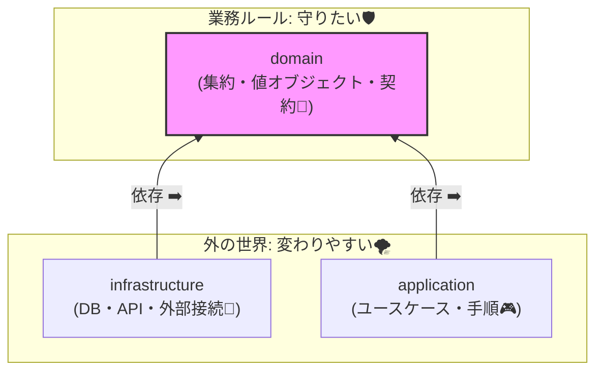
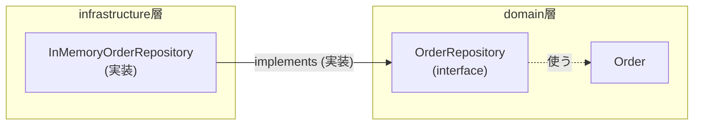

# 第05章：フォルダ構成と“依存の向き”ルール🧱➡️

## 0. この章でできるようになること🎯✨

* 「どこに何を書くか」を迷わないフォルダの“住所”が決まる🏠📁
* **依存の向き（内向きルール）**が説明できる🧭➡️
* 「DBやAPIの都合」がドメインを汚さない形にできる🧼✨
* ルール違反を **ESLintで機械的に止める**ところまでいける🚦🤖

---

## 1. なんでフォルダ構成を先に決めるの？🤔📁

最初にフォルダ構成を決めるのは、「未来の自分が泣かない」ためです😭➡️😂
とくに集約（Aggregate）を学ぶときは、**ドメイン（業務ルール）を守る“箱”**が先に必要になります📦🔒

よくある事故💥

* 画面やAPIの都合でドメインの型がぐちゃぐちゃになる🫠
* DBの都合（カラム・JOIN）でドメインのクラスが歪む😵‍💫
* 「どこで何してるの？」が分からなくなって改修が怖い😱

そこでこの章は、先に **“片付く部屋”** を作ります🧹✨

---

## 2. まずは結論：この4つに分ける📦📦📦📦

この教材では、最初は迷わないように **4分割** でいきます😊

* `domain/`：業務ルールの中心（集約・値オブジェクト・不変条件）👑🔒
* `application/`：ユースケースの手順（取得→変更→保存の指揮）🎮🧩
* `infrastructure/`：DB・外部API・メールなど「外の世界」🌍🔌
* `tests/`：テスト（壊れてない保証）🧪✅

---

## 3. フォルダの中身（住所表）📘🗺️


### 3.1 ざっくり全体図🧱

* ドメインが中心🟣
* 外側（DBやAPI）は後から差し替えOK🔁✨
* 依存は **外→内** に向かう🧭➡️

```text
外側（変わりやすい）🌪️
  infrastructure  ─────┐
                        │  depends on
  application    ───────┤   (外から内へ)
                        │
  domain         <──────┘
内側（守りたい）🛡️
```



この「内側を守る」考え方は、いわゆるクリーン/オニオン的な発想です🧅✨（ドメインが他に依存しないのが肝！）

### 3.2 具体的なフォルダ例（ミニEC）🛒📦💳

```text
src/
  domain/
    order/
      Order.ts              // 集約ルート（例）
      OrderItem.ts
      Money.ts              // Value Object（例）
      OrderId.ts
      errors.ts             // ドメインエラー（例）
      OrderRepository.ts    // “契約”だけ（interface）
  application/
    order/
      PlaceOrder.ts         // ユースケース
      PayOrder.ts
      dtos.ts               // 外へ出す形（DTO）
  infrastructure/
    order/
      InMemoryOrderRepository.ts   // 実装（後でDB版に差し替え）
      PrismaOrderRepository.ts     // 例：DB実装（将来）
  tests/
    domain/
      Order.test.ts
    application/
      PlaceOrder.test.ts
```

---

## 4. “依存の向き”ルール（超だいじ）🧭🚦

### 4.1 ルールはこれだけ覚えてOK✅

**内側（domain）は、外側を知らない** 🙈🔒
つまり…

* `domain` は `application` や `infrastructure` を **importしない**🚫
* `application` は `infrastructure` を **importしない**🚫
* `infrastructure` は `domain` と `application` を **importしてOK**✅

表にするとこう👇📊

| from \ to          | domain | application | infrastructure |
| ------------------ | -----: | ----------: | -------------: |
| **domain**         |      ✅ |          🚫 |             🚫 |
| **application**    |      ✅ |           ✅ |             🚫 |
| **infrastructure** |      ✅ |           ✅ |              ✅ |

---

## 5. “契約は内側、実装は外側”テクニック🪄📦

ここが気持ちよく効きます😆✨

### 5.1 Repositoryは「domainにinterface」「infraに実装」🧩🔌

**domain側（契約）**：

```ts
// src/domain/order/OrderRepository.ts
import { Order } from "./Order.js";
import { OrderId } from "./OrderId.js";

export interface OrderRepository {
  findById(id: OrderId): Promise<Order | null>;
  save(order: Order): Promise<void>;
}
```

**infrastructure側（実装）**：

```ts
// src/infrastructure/order/InMemoryOrderRepository.ts
import { OrderRepository } from "../../domain/order/OrderRepository.js";
import { Order } from "../../domain/order/Order.js";
import { OrderId } from "../../domain/order/OrderId.js";

export class InMemoryOrderRepository implements OrderRepository {
  private store = new Map<string, Order>();

  async findById(id: OrderId): Promise<Order | null> {
    return this.store.get(id.value) ?? null;
  }

  async save(order: Order): Promise<void> {
    this.store.set(order.id.value, order);
  }
}
```

ポイント💡

* domainは **「保存できる」という契約**だけ知ってればいい😊
* DBがPrismaでもSQLでも、あとから差し替えできる🔁✨



---

## 6. TypeScript（2026）で迷いがちな“モジュール設定”のコツ🧠⚙️

2026年のTypeScriptは、Nodeのモジュール事情に合わせた設定がどんどん整っています📦✨
TypeScriptは `moduleResolution` に `nodenext` を使う説明も公式にあります📘✨ ([typescriptlang.org][1])

さらに TypeScript 5.6 では `.mts` / `.cts` の扱い（ESM/CJSの出し分け）がより明確になっています🧩 ([typescriptlang.org][2])

この教材では、まずは混乱しにくい“無難セット”でOKです😊

例：`tsconfig.json`（一例）

```json
{
  "compilerOptions": {
    "target": "ES2022",
    "module": "NodeNext",
    "moduleResolution": "NodeNext",
    "strict": true,
    "outDir": "dist",
    "rootDir": "src",
    "esModuleInterop": true,
    "skipLibCheck": true
  },
  "include": ["src", "tests"]
}
```

※Nodeは 2026年1月時点で **v24がActive LTS**、v25がCurrentとして案内されています📌 ([nodejs.org][3])
（セキュリティ更新も継続的に出ています🛡️） ([nodejs.org][4])

---

## 7. 手を動かす：骨組みを一気に作る🛠️💨

### 7.1 フォルダ作成（PowerShell）🪟✨

```powershell
mkdir src, tests
mkdir src\domain, src\application, src\infrastructure
mkdir src\domain\order, src\application\order, src\infrastructure\order
mkdir tests\domain, tests\application
```

### 7.2 “依存の向き”が守れてるか一発で確認する方法👀✅

**チェック質問（これだけ！）**

* domainの中で `infrastructure` って単語を検索して出たらアウト🚫😇
* applicationの中で `infrastructure` をimportしてたらアウト🚫😇

（VS Code の検索でOK🔍✨）

---

## 8. 依存ルールを“機械で止める”🚦🤖（ESLint）

目視チェックは疲れるし漏れます😵‍💫
だから **ESLintで強制** が強い💪✨

### 8.1 まずはESLint標準ルールで止める（シンプル版）🧼

ESLintには `no-restricted-imports` という「このimport禁止ね🚫」ができます🛑 ([eslint.org][5])

例：applicationからinfrastructureを禁止

```js
// eslint.config.js（例：フラット設定の一部イメージ）
export default [
  {
    files: ["src/application/**/*.ts"],
    rules: {
      "no-restricted-imports": [
        "error",
        {
          patterns: ["../infrastructure/*", "../../infrastructure/*", "**/infrastructure/*"]
        }
      ]
    }
  },
  {
    files: ["src/domain/**/*.ts"],
    rules: {
      "no-restricted-imports": [
        "error",
        {
          patterns: ["**/application/*", "**/infrastructure/*"]
        }
      ]
    }
  }
];
```

### 8.2 境界チェック専用プラグインを使う（しっかり版）🧱✨

`@boundaries/eslint-plugin` は「層の境界を守る」目的のESLintプラグインです📏✨ ([npmjs.com][6])
大きくなってきたらこっちが便利になりやすいです😊

---

## 9. 小テスト：このimport、どこに置く？クイズ🎮🧠

次のコードがあったとして…どの層が正解？👇✨

1. `Order.pay()` の中で `fetch("https://pay.example.com")` を呼んでる💳🌍
   → **正解：domainじゃない！** 🚫（外部I/Oは外側へ🔌）

2. `PlaceOrder` が `PrismaClient` を直接触ってる🗄️
   → **正解：applicationじゃない！** 🚫（DB都合はinfrastructureへ🏃‍♀️）

3. `InMemoryOrderRepository` が `OrderRepository` を実装してる📦
   → **正解：infrastructure✅**（外側が内側の契約を満たすのはOK✨）

---

## 10. AI活用🤖✨（コピペで使えるプロンプト集）

### 10.1 「層の仕分けクイズ」を作ってもらう🎮

* 「ミニECの機能を10個出して、domain/application/infrastructureのどこに置くべきかクイズにして。解答と理由もつけて😊」

### 10.2 既存コードの“住所間違い”を指摘してもらう🧯

* 「このファイルはどの層に置くべき？理由は“依存の向き”で説明して。違反importがあれば候補修正案も出して🧠✨」

### 10.3 “契約（interface）”抽出を手伝ってもらう🧩

* 「domainが知っていいのは“契約”だけ。外部I/Oを分離するために必要なinterface候補を列挙して😊」

---

## 11. まとめ🧷✨

* フォルダは **domain / application / infrastructure / tests** の4つ📁
* 依存の向きは **外→内** 🧭➡️
* domainは “外部都合” を知らない🙈🔒
* ルールはESLintで止めると強い🚦✨ ([eslint.org][5])

次章からは、この骨組みの上で「型で守る」「不変条件」「集約」の中身を気持ちよく作っていきます🛒📦💳✨

[1]: https://www.typescriptlang.org/docs/handbook/modules/guides/choosing-compiler-options.html?utm_source=chatgpt.com "Documentation - Modules - Choosing Compiler Options"
[2]: https://www.typescriptlang.org/docs/handbook/release-notes/typescript-5-6.html?utm_source=chatgpt.com "Documentation - TypeScript 5.6"
[3]: https://nodejs.org/en/about/previous-releases?utm_source=chatgpt.com "Node.js Releases"
[4]: https://nodejs.org/en/blog/vulnerability/december-2025-security-releases?utm_source=chatgpt.com "Tuesday, January 13, 2026 Security Releases"
[5]: https://eslint.org/docs/latest/rules/no-restricted-imports?utm_source=chatgpt.com "no-restricted-imports - ESLint - Pluggable JavaScript Linter"
[6]: https://www.npmjs.com/package/%40boundaries%2Feslint-plugin?utm_source=chatgpt.com "boundaries/eslint-plugin"
