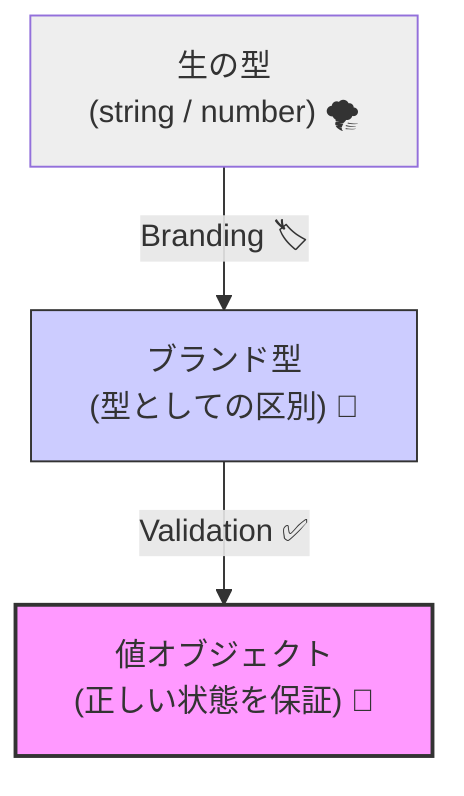
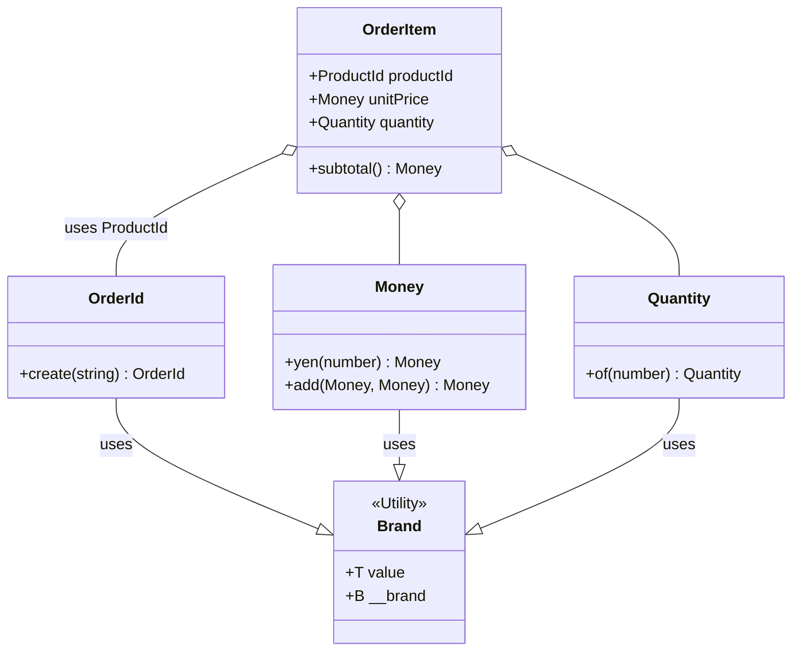

# 第06章：型で守る①（ID・金額・数量）🧱🔒

## 0. この章でできるようになること 🎯✨

* 「ただの string / number」を卒業して、**取り違え事故**を型で止められるようになる🙅‍♀️💥
* **OrderId / Money / Quantity** を “薄い型（薄いValue Object）” として作れる🧩💎
* 「負の金額」「小数の数量」「別IDの混入」みたいな事故を、**なるべく早く（コンパイル時 or 生成時）** に叩ける🔨⚡

---

## 1. まず、事故のイメージをつかむ 😱🧨


### 1-1. string地獄：IDの取り違え🙃


* OrderId も ProductId も UserId も、全部 string のままだと…

  * 「注文IDのつもりで商品IDを渡す」みたいな事故が起きる💥
  * 動いてしまって、**気づくのが遅い**のが一番こわい🫠

### 1-2. number地獄：金額と数量のやらかし💸📦

* Money（お金）も Quantity（数量）も、number のままだと…

  * `-100` 円が入る😱
  * `0.1` 個みたいな “ありえない数量” が入る😵‍💫（商品によってはNG）
  * 「金額」と「個数」を足し算しちゃう…とか（泣）😭

だから、この章では **「意味の違い」を型で分ける**よ！🛡️✨

---

## 2. 方針：TypeScriptで “薄いValue Object” を作る 💎🪶


### 2-1. 2つの守り方（どっちも使う）🧠✨

1. **ブランド型（Branded Type）**

   * 中身は string / number のままだけど、**型だけ別物**にする🪪
   * TypeScriptで「擬似的に名前的型（nominalっぽく）」を作る定番パターンだよ📌 ([GitHub][1])

2. **生成関数（Factory）でバリデーション**

   * 「空文字は禁止」「金額は0以上」「数量は整数」などを **生成時にチェック** ✅
   * これで “不正な状態を作らない” に近づく🔒✨



---


## 3. 実装：まずは共通の Brand 型を作る 🧩🪪

`src/domain/shared/brand.ts` を作ろう📁✨

```ts
// src/domain/shared/brand.ts

// いわゆる「ブランド型」用の共通ユーティリティ 🪪✨
// T = 元の型（string/numberなど）
// B = 目印（ブランド）
// これで「見た目が同じでも別の型」にできるよ！
export type Brand<T, B> = T & { readonly __brand: B };
```

> 💡 ここでは分かりやすさ優先で `__brand` を使うよ！
> より厳密に「ブランド名衝突を避けたい」なら `unique symbol` を使うやり方も定番🧠✨ ([DEV Community][2])

---

## 4. 実装：OrderId（IDは “ただの文字列” じゃない）🆔🧱

`src/domain/order/orderId.ts` を作ろう📁✨

```ts
// src/domain/order/orderId.ts
import { Brand } from "../shared/brand";

type OrderIdBrand = "OrderId";
export type OrderId = Brand<string, OrderIdBrand>;

export const OrderId = {
  create(raw: string): OrderId {
    const trimmed = raw.trim();

    // ✅ 生成時にルールで守る
    if (trimmed.length === 0) {
      throw new Error("OrderId は空にできません");
    }

    // 例：見分けやすいprefixを付ける（任意）
    // ord_ から始まる、など
    if (!trimmed.startsWith("ord_")) {
      throw new Error("OrderId は 'ord_' で始めてね");
    }

    return trimmed as OrderId;
  },

  // 「これ OrderId っぽい？」を判定したい時のガード（任意）👀✨
  is(raw: string): raw is OrderId {
    return raw.startsWith("ord_") && raw.trim().length > 4;
  },
} as const;
```


### 4-1. これで何が嬉しいの？🎁✨

* `OrderId` と `ProductId` を **同じ string として扱えなくなる**
* 「引数を間違えた」だけで **コンパイル時に止まる**（理想）🛑💕

---


## 5. 実装：Money（金額は “事故りやすい” 代表）💴💥

お金は **小数が混ざると地獄**なので、まずは教材として「円＝整数」として扱うよ🧾✨
`src/domain/shared/money.ts` を作ろう📁

```ts
// src/domain/shared/money.ts
import { Brand } from "./brand";

type MoneyBrand = "Money";
export type Money = Brand<number, MoneyBrand>;

export const Money = {
  yen(amount: number): Money {
    // ✅ ルール（必要最低限）
    if (!Number.isFinite(amount)) throw new Error("金額が数値じゃないよ");
    if (!Number.isInteger(amount)) throw new Error("円は整数で扱おう（小数NG）");
    if (amount < 0) throw new Error("金額はマイナス禁止だよ");

    return amount as Money;
  },

  add(a: Money, b: Money): Money {
    return (a + b) as Money;
  },

  mul(a: Money, n: number): Money {
    if (!Number.isInteger(n)) throw new Error("個数は整数でね");
    if (n < 0) throw new Error("個数はマイナス禁止");
    return (a * n) as Money;
  },

  toNumber(m: Money): number {
    return m as number;
  },
} as const;
```

### 5-1. “型で守る” と “生成で守る” の合わせ技 🧠🛡️

* 型だけだと、`-100 as Money` みたいな **雑な型アサーション**で突破できちゃう😇
* だから **基本は Money.yen(...) を通して作る**、が大事✅✨
  （「不正な値の入口」を狭めるのがコツだよ🚪🔒）

---

## 6. 実装：Quantity（数量は “0以上の整数” にしたい）📦🔢

`src/domain/shared/quantity.ts` を作ろう📁✨

```ts
// src/domain/shared/quantity.ts
import { Brand } from "./brand";

type QuantityBrand = "Quantity";
export type Quantity = Brand<number, QuantityBrand>;

export const Quantity = {
  of(n: number): Quantity {
    if (!Number.isFinite(n)) throw new Error("数量が数値じゃないよ");
    if (!Number.isInteger(n)) throw new Error("数量は整数でね");
    if (n <= 0) throw new Error("数量は1以上にしてね");

    return n as Quantity;
  },

  toNumber(q: Quantity): number {
    return q as number;
  },
} as const;
```

> 😊 商品によっては「0個OK（カートに入れない）」とかもあるから、ここはドメインに合わせて調整してOK！

---

## 7. 使ってみる：OrderItemで “金額×数量＝小計” を安全にする 🧾✨

`src/domain/order/orderItem.ts`

```ts
// src/domain/order/orderItem.ts
import { Money } from "../shared/money";
import { Quantity } from "../shared/quantity";

type ProductIdBrand = "ProductId";
type ProductId = string & { readonly __brand: ProductIdBrand };

const ProductId = {
  create(raw: string): ProductId {
    const t = raw.trim();
    if (t.length === 0) throw new Error("ProductId は空にできません");
    if (!t.startsWith("prd_")) throw new Error("ProductId は 'prd_' で始めてね");
    return t as ProductId;
  },
} as const;

export type OrderItem = {
  productId: ProductId;
  unitPrice: ReturnType<typeof Money.yen>;
  quantity: ReturnType<typeof Quantity.of>;
};

export const OrderItem = {
  create(productId: ProductId, unitPrice: ReturnType<typeof Money.yen>, quantity: ReturnType<typeof Quantity.of>): OrderItem {
    return { productId, unitPrice, quantity };
  },

  subtotal(item: OrderItem) {
    return Money.mul(item.unitPrice, Quantity.toNumber(item.quantity));
  },
} as const;
```


### 7-1. “間違った計算” を型で止めるイメージ🛑🧠

* `Money.add(単価, 数量)` みたいな変な計算をしにくくなる🙅‍♀️
* 「全部 number の世界」より、意図がハッキリして読みやすい📖✨



---


## 8. `satisfies` で “表（テーブル）” を安全にする 📋✅

たとえば「商品コード → 単価」の表を作るとき、**値が Money になってるか**をチェックしたいよね👀✨
`satisfies` は「型に合ってるかチェックするけど、推論は潰さない」便利な演算子だよ🪄 ([typescriptlang.org][3])

```ts
import { Money } from "../shared/money";

const priceTable = {
  coffee: Money.yen(480),
  tea: Money.yen(420),
  // cola: 200, // ← これは Money じゃないから弾けるようにしたい！😤
} satisfies Record<string, ReturnType<typeof Money.yen>>;
```

---

## 9. “型が効かない” ときのチェック（VS Codeあるある）🧯💻

「なんか補完やエラー表示が変…？」って時は、VS Code が **ワークスペースの TypeScript** を使ってないことがあるよ🌀
VS Code では “ワークスペースのTypeScriptを使う” に切り替えできる（コマンドで選ぶ）って公式ドキュメントにもあるよ📌 ([Visual Studio Code][4])

---

## 10. 練習問題（手を動かすターン）📝🔥

### 練習1：VO候補を増やす💎

次の候補を、Brand＋create で作ってみよう🎮✨

* Address（住所）🏠
* Email（メール）📧
* Percent（割引率 0〜100）🏷️
* DateRange（開始〜終了）📅

### 練習2：コンパイルで止めたい事故を書いてみる🧨

「これは本当はダメ」をわざと書いて、TypeScriptに怒らせよう😈⚡

* OrderId と ProductId を入れ替える
* Money に小数を入れる
* Quantity に 0 や -1 を入れる

---

## 11. AI活用（この章向け）🤖✨

### 11-1. VO候補を洗い出すプロンプト例🧠💡

* 「ミニECのドメインで、string/numberのままだと事故りそうな値を Value Object 候補として20個出して。理由も一言で。」
* 「Money/Quantity/Id系でよくあるバリデーションルールを、実務っぽい観点で10個出して。」

### 11-2. “やりすぎ” を止めるプロンプト例🛑🧸

* 「このValue Object設計、初心者教材として複雑すぎる点ある？削れるなら削って提案して。」

---

## 12. まとめ 🌸🏁

* **ID・金額・数量**は、いちばん事故りやすいから、まず型で守るのがコスパ最強🛡️✨
* **ブランド型＋生成関数**で、「意味の違い」と「不正な値」を早めに止められる🙅‍♀️✅
* これは後で出てくる **集約の不変条件🔒** を守る土台にもなるよ🧱💕

---

## 参考（本章で使った “最新” のよりどころ）📌🗓️

* 2026年1月下旬時点、公式ドキュメントの最新リリースノートは TypeScript 5.9。 ([typescriptlang.org][5])
* `satisfies` は「型チェックしつつ推論を保つ」ための機能として公式リリースノートに説明があるよ。 ([typescriptlang.org][3])
* ブランド型（Branded Types）はTypeScriptで“取り違え”を防ぐ定番パターン。 ([GitHub][1])

[1]: https://github.com/kourge/ts-brand?utm_source=chatgpt.com "kourge/ts-brand: Reusable type branding in TypeScript"
[2]: https://dev.to/silentwatcher_95/preventing-accidental-interchangeability-in-typescript-branding-the-unique-property-pattern-hda?utm_source=chatgpt.com "typescript - Branding & the Unique Property Pattern"
[3]: https://www.typescriptlang.org/docs/handbook/release-notes/typescript-4-9.html?utm_source=chatgpt.com "Documentation - TypeScript 4.9"
[4]: https://code.visualstudio.com/docs/typescript/typescript-compiling?utm_source=chatgpt.com "Compiling TypeScript"
[5]: https://www.typescriptlang.org/docs/handbook/release-notes/typescript-5-9.html?utm_source=chatgpt.com "Documentation - TypeScript 5.9"
