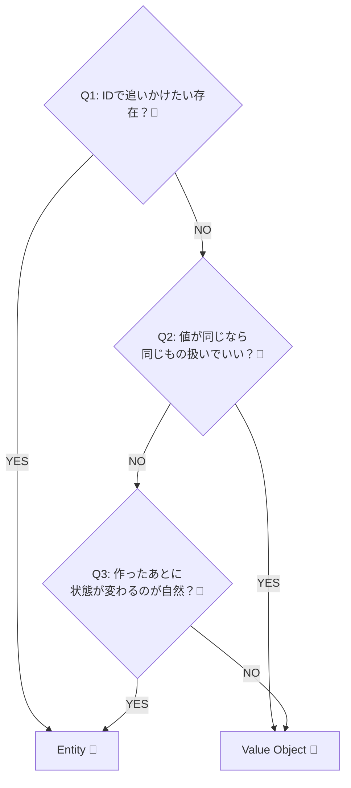
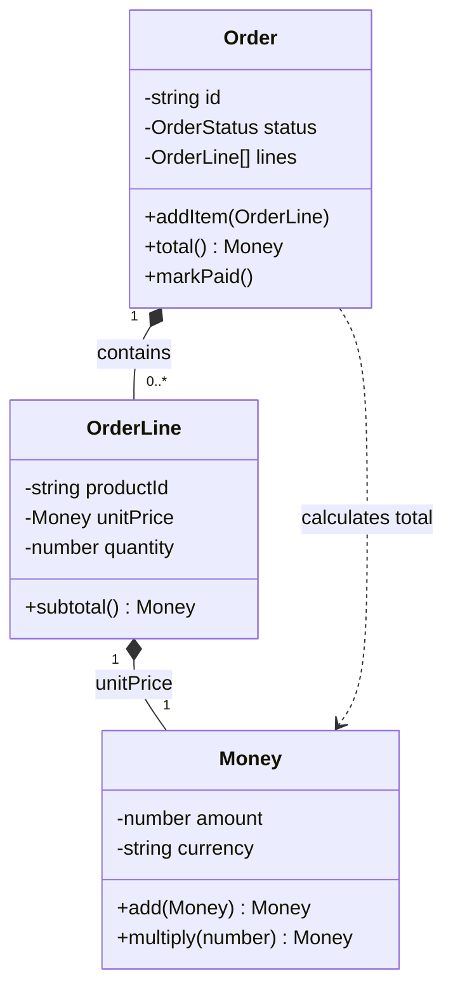

# 第07章：型で守る②（Entity と Value Object）👤💎

## この章でできるようになること 🎯✨

* **Entity（エンティティ）**と**Value Object（値オブジェクト／VO）**の違いが説明できる📣
* ミニECの登場人物・データを「Entity？VO？」って分類できる📋✅
* TypeScriptで「それっぽく安全」に実装できる（ムダに難しくしない）🧱🔒

---

## 7.1 Entity と Value Object、まず超ざっくり 🧠🍀


## Entity（エンティティ）👤

* **“同一性（ID）”が本体**
* 中身の値が多少変わっても「同じ人／同じ注文」って言える
* 例：注文（Order）、会員（Customer）、商品（Product）など

👉 イメージ：**名前や住所が変わっても、会員IDが同じなら同一人物**🪪✨

## Value Object（値オブジェクト）💎

* **“値そのもの”が本体**（同一性よりも中身の一致が大事）
* 基本は**不変（immutable）**に作るのがコツ🔒
* 例：金額（Money）、数量（Quantity）、住所（Address）、期間（DateRange）など

👉 イメージ：**1000円は誰が持ってても1000円**💴✨（同じ値なら同じ扱い）

---


## 7.2 なんで分けるの？（分けると世界が平和になる）🌈🕊️

分けないと、こんな事故が起きがち😱💥

* **「金額」をただのnumberで扱って**、マイナスや通貨混在が混ざる💸🌀
* **「住所」をstringで持って**、フォーマット崩壊＆比較が地獄🏚️🧨
* **「同じ注文か？」の判断がブレて**、更新や比較がグダる😵‍💫

Entity/VOを分けると…

* 「同じか？」の基準が明確になる✅
* VOを不変にすると、**途中で壊れにくい**🔒
* ドメインの言葉がそのまま型になる（読みやすい）📘✨

---


## 7.3 迷ったらこの3問！EntityかVOか判定クイズ 🧩🎮

## Q1：それは“IDで追いかけたい存在”？🪪

* YES → **Entity候補**👤
* NO → 次へ➡️

## Q2：値が同じなら“同じもの扱い”でいい？💎

* YES → **VO候補**💎
* NO → 次へ➡️

## Q3：作ったあとに“状態が変わる”のが自然？🔁

* YES → Entity寄り👤
* NO（不変でいたい）→ VO寄り💎



---


## 7.4 ミニECでの分類（いったん王道パターン）🛒📦💳

> ここは「絶対の正解」じゃなくて、**理由が説明できる**のが大事だよ〜😊✨

## Entityになりやすいもの 👤

* **Order（注文）**：注文IDで追いかける🧾
* **Customer（顧客）**：顧客IDで追いかける🙋‍♀️
* **Product（商品）**：商品IDで追いかける🏷️
* **Payment（支払い）**：決済IDで追いかける💳

## VOになりやすいもの 💎

* **Money（金額）**：値が同じなら同じ💴
* **Quantity（数量）**：値が同じなら同じ📦
* **Address（住所）**：値として扱うと整理しやすい🏠
* **Email（メール）**：値＆ルール（形式）を持てる📧
* **OrderStatus（注文状態）**：状態の値（列挙）🟢🟡🔴

## ちょい迷いゾーン（設計で変わる）🤔

* **OrderLine（注文明細）**

  * 「明細にLineIdを振って追いかけたい」→ Entity寄り👤
  * 「(productId, price, qty) の“値の塊”」→ VO寄り💎
  * ミニECではまず **VO扱い**が楽で学びやすいことが多い😊

---


## 7.5 TypeScriptでの実装方針（“難しすぎないDDD”）🧱✨

## VOの基本ルール（おすすめ）💎🔒

* `readonly` でフィールドを固定
* **生成時にバリデーション**して、不正な値を作らない🚫
* `equals()` を用意して、値で比較できるようにする🤝

## Entityの基本ルール（おすすめ）👤🔑

* `id` を必ず持つ
* `equals()` は **idで比較**（中身全部を比較しない）🪪✅
* 状態変更は「それっぽいメソッド名」で行う（例：`addItem`, `markPaid`）🛠️

---

## 7.6 ハンズオン：VOとEntityを実装してみよう 🛠️💓

## ① ValueObjectの共通クラスを作る 💎

```ts
// src/domain/shared/ValueObject.ts
export abstract class ValueObject<TProps> {
  protected constructor(protected readonly props: Readonly<TProps>) {
    // うっかり変更を防ぐ（浅いfreeze）
    Object.freeze(this.props);
    Object.freeze(this);
  }

  /** 値として等しいか？（VOは“値の一致”が大事） */
  public equals(other: ValueObject<TProps>): boolean {
    return JSON.stringify(this.props) === JSON.stringify(other.props);
  }
}
```

> JSON比較は“学習用の簡易版”だよ😊
> 実務ではプロパティを明示比較にしたり、順序がある配列は丁寧に扱ったりするよ🧠✨

---

## ② Money（VO）を作る 💴💎

```ts
// src/domain/order/Money.ts
import { ValueObject } from "../shared/ValueObject";

type MoneyProps = {
  readonly amount: number;   // 例：JPYの整数運用
  readonly currency: "JPY";
};

export class Money extends ValueObject<MoneyProps> {
  private constructor(props: MoneyProps) {
    super(props);
  }

  get amount(): number {
    return this.props.amount;
  }

  get currency(): "JPY" {
    return this.props.currency;
  }

  /** 工場メソッド：不正なMoneyを作らせない */
  static jpy(amount: number): Money {
    if (!Number.isInteger(amount)) throw new Error("金額は整数でお願い🙏");
    if (amount < 0) throw new Error("金額はマイナス不可だよ🚫💸");
    return new Money({ amount, currency: "JPY" });
  }

  add(other: Money): Money {
    if (this.currency !== other.currency) throw new Error("通貨が違うよ😵‍💫");
    return Money.jpy(this.amount + other.amount);
  }

  multiply(times: number): Money {
    if (!Number.isInteger(times) || times < 0) throw new Error("回数が変だよ🚫");
    return Money.jpy(this.amount * times);
  }
}
```

---

## ③ Entityの共通クラスを作る 👤

```ts
// src/domain/shared/Entity.ts
export abstract class Entity<TId> {
  protected constructor(public readonly id: TId) {}

  /** Entityは“同一性（ID）”で比較する */
  public equals(other: Entity<TId>): boolean {
    return this.id === other.id;
  }
}
```

---


## ④ Order（Entity）＋ OrderLine（VO）を作る 🧾🛒

まず OrderLine（VO）💎

```ts
// src/domain/order/OrderLine.ts
import { ValueObject } from "../shared/ValueObject";
import { Money } from "./Money";

type OrderLineProps = {
  readonly productId: string;
  readonly unitPrice: Money;
  readonly quantity: number;
};

export class OrderLine extends ValueObject<OrderLineProps> {
  private constructor(props: OrderLineProps) {
    super(props);
  }

  static create(productId: string, unitPrice: Money, quantity: number): OrderLine {
    if (!productId) throw new Error("productIdが空だよ🚫");
    if (!Number.isInteger(quantity) || quantity <= 0) throw new Error("数量は1以上だよ📦");
    return new OrderLine({ productId, unitPrice, quantity });
  }

  get productId(): string {
    return this.props.productId;
  }

  get quantity(): number {
    return this.props.quantity;
  }

  subtotal(): Money {
    return this.props.unitPrice.multiply(this.props.quantity);
  }

  /** VOなので“新しい値”を返す（自分は変えない）🔒 */
  withAddedQuantity(additional: number): OrderLine {
    if (!Number.isInteger(additional) || additional <= 0) throw new Error("追加数量が変だよ🚫");
    return OrderLine.create(this.productId, this.props.unitPrice, this.props.quantity + additional);
  }
}
```

つぎに Order（Entity）👤

```ts
// src/domain/order/Order.ts
import { Entity } from "../shared/Entity";
import { Money } from "./Money";
import { OrderLine } from "./OrderLine";

export type OrderStatus = "Draft" | "Paid" | "Cancelled";

export class Order extends Entity<string> {
  private status: OrderStatus = "Draft";
  private lines: OrderLine[] = [];

  constructor(orderId: string) {
    if (!orderId) throw new Error("orderIdが空だよ🚫");
    super(orderId);
  }

  addItem(line: OrderLine): void {
    if (this.status !== "Draft") throw new Error("支払い後は追加できないよ🚫💳");

    const idx = this.lines.findIndex(x => x.productId === line.productId);
    if (idx >= 0) {
      this.lines[idx] = this.lines[idx].withAddedQuantity(line.quantity);
    } else {
      this.lines.push(line);
    }
  }

  total(): Money {
    return this.lines.reduce((acc, line) => acc.add(line.subtotal()), Money.jpy(0));
  }

  markPaid(): void {
    if (this.status !== "Draft") throw new Error("状態が変だよ😵‍💫");
    if (this.lines.length === 0) throw new Error("明細ゼロで支払いはできないよ🚫");
    this.status = "Paid";
  }

  getStatus(): OrderStatus {
    return this.status;
  }

  snapshotLines(): readonly OrderLine[] {
    return this.lines; // readonlyで返す（外からpushさせない意識）🧱
  }
}
```



---

---

## 7.7 ちょこっとテスト：VOとEntityの“比較ルール”を確認 🧪✨

> テストランナーはVitestの最新版（v4系）が出てるよ〜🧪⚡ ([Vitest][1])

```ts
// src/domain/order/Order.spec.ts
import { describe, it, expect } from "vitest";
import { Money } from "./Money";
import { Order } from "./Order";
import { OrderLine } from "./OrderLine";

describe("Value Object / Entity", () => {
  it("Money（VO）は値が同じなら equals がtrue", () => {
    const a = Money.jpy(1000);
    const b = Money.jpy(1000);
    expect(a.equals(b)).toBe(true);
  });

  it("Order（Entity）はIDが同じなら equals がtrue", () => {
    const a = new Order("order-1");
    const b = new Order("order-1");
    expect(a.equals(b)).toBe(true);
  });

  it("Orderの合計が計算できる", () => {
    const order = new Order("order-9");
    order.addItem(OrderLine.create("p-1", Money.jpy(300), 2)); // 600
    order.addItem(OrderLine.create("p-2", Money.jpy(500), 1)); // 500
    expect(order.total().amount).toBe(1100);
  });
});
```

---


## 7.8 よくあるミス集（ここ踏むと沼りがち）🕳️😵‍💫

## ❌ ミス1：VOをミュータブルにしちゃう

* `money.amount += 100` みたいなのは危険⚠️
* **VOは基本“作り直す”**が安心💎🔒

## ❌ ミス2：Entityの同一性を“中身全部比較”にする

* 住所が変わったら別人扱い…みたいな変なことが起きる😇
* Entityは基本 **IDで比較**🪪✅

## ❌ ミス3：IDが必要ないのにEntityにする

* ただの値の塊をEntityにすると、管理コストが増える💸
* 迷ったらVOから始めるのが安全なこと多い💎✨

---

## 7.9 ミニ演習（手を動かすやつ）✍️🎀

## 演習A：分類してみよう（Entity？VO？）📋

次を「Entity / VO」で分けて、理由を1行で書いてみよう😊

1. Order
2. Money
3. Address
4. Product
5. Email
6. OrderStatus
7. OrderLine（明細）

**例の答え（1つの案）**✅

* Order：Entity（注文IDで追いかけたい）
* Money：VO（値が同じなら同じ）
* Address：VO（住所は値の塊として扱いやすい）
* Product：Entity（商品IDで追いかける）
* Email：VO（値＋形式ルールを持てる）
* OrderStatus：VO（状態という“値”）
* OrderLine：VO（学習用は値の塊として扱うと簡単）

---

## 演習B：VO化してみよう（Email）📧💎

* `Email.create("a@b.com")` みたいに作れて
* 不正な形式なら作れないようにする🚫
* `equals()` が値で比較できるようにする🤝

---

## 7.10 AI活用プロンプト例（丸投げじゃなく“相棒”にする）🤖✨

## ① 分類の壁打ち（理由つきで出してもらう）🧠

```text
ミニEC（注文・在庫・支払い）で、次の候補を Entity / Value Object に分類して。
各項目について「なぜそう言えるか」を1〜2文で。
候補: Order, OrderLine, Money, Quantity, Address, Product, Payment, OrderStatus
```

## ② VOのバリデーション案を出してもらう🔒

```text
Value ObjectとしてEmailを作りたい。バリデーション観点を箇条書きで10個出して。
「厳しすぎて現実に合わない」可能性がある観点には注意書きも付けて。
```

## ③ テストケースの抜け探し🧪

```text
Order / Money / OrderLine のテストケースを増やしたい。
境界値や例外系（失敗ケース）中心に、優先度つきで提案して。
```

---

## 7.11 2026年のTypeScript小ネタ（ほんの少しだけ）🧁✨

* TypeScriptは **5.9系（5.9.3がLatest表記）**が出てるよ📌 ([GitHub][2])
* Node向けの設定では、`--module node20` みたいな“安定オプション”も用意されてるよ🧩 ([typescriptlang.org][3])

> でもこの章は「Entity/VOの考え方」が主役だから、設定は深追いしなくてOKだよ〜😊🌟

---

## まとめ 🎁✨

* **EntityはIDで同一性を守る**👤🪪
* **VOは値で同一性を守る＆不変にする**💎🔒
* 迷ったら「IDで追う？ 値が同じなら同じ？ 変化するのが自然？」で判断🧭✨
* TypeScriptでは `readonly`＋生成時チェック＋`equals()` で“事故りにくい型”が作れる🛡️🎉

[1]: https://vitest.dev/blog/vitest-4?utm_source=chatgpt.com "Vitest 4.0 is out!"
[2]: https://github.com/microsoft/typescript/releases "Releases · microsoft/TypeScript · GitHub"
[3]: https://www.typescriptlang.org/docs/handbook/release-notes/typescript-5-9.html "TypeScript: Documentation - TypeScript 5.9"
