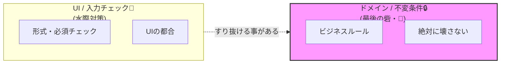
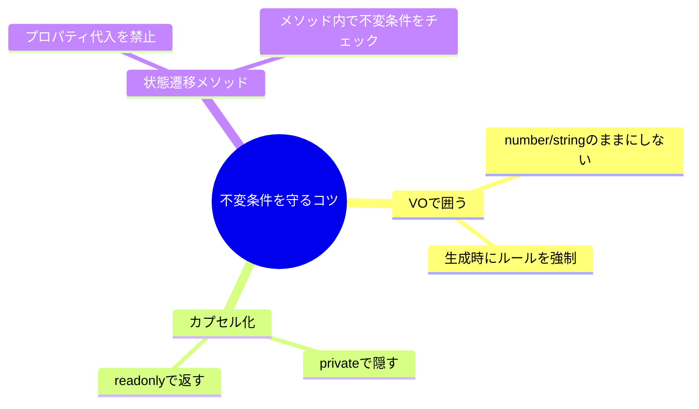

# 第08章：不変条件（Invariants）って結局なに？🔒🧠


## 8.1 不変条件って、ひとことで言うと？✨


不変条件（Invariant）は、**「どんな操作の前後でも、絶対に成り立っていてほしいルール」**だよ📏💡
イメージは「校則」みたいなもの👮‍♀️✨

* 破ったら“ちょっと困る”じゃなくて、**世界が壊れる**やつ💥
* だから **“守れる形”でコードを書く**のが目的だよ🧱🔒

---


## 8.2 不変条件が必要になる“事故”あるある😱🧨

ミニEC（注文🛒・在庫📦・支払い💳）で、こんな事故が起きがち👇

* 在庫がマイナスになった📉😱
* 合計金額がズレた（明細合計と請求が違う）💸💥
* まだ支払ってないのに出荷された🚚💨
* 二重決済された💳💳😇
* 「キャンセル済み」なのに支払い完了になった🌀

こういうのって、**“データが一瞬でも変な状態になった”**のが原因になりやすいのね🚫🧠
だから「変な状態を作らせない」が超大事💪🔒

---


## 8.3 不変条件と“入力チェック”は別モノだよ🧼🆚🔒

混ざりやすいから、ここでスッキリ分けちゃおう😊✨

### 入力チェック（UIバリデーション）🧼

* 文字数、必須、形式（メールの形📧とか）
* 画面ごとに都合が違うこともある
* すり抜けることがある（API直叩き、バッチ処理、移行データなど）🕳️

### 不変条件（ドメインの最後の砦）🔒👑

* **ドメインとして絶対におかしくならないルール**
* どこから操作されても、**必ず守られる**必要がある
* 破るくらいなら、**操作を失敗させる**（例外 or Result）🚫



---


## 8.4 ミニEC「注文🛒」で不変条件を見つける3ステップ🧩✨

不変条件って、センスじゃなくて手順で出せるよ😊📝

1. **「おかしい状態」を日本語で言う**🗣️
2. **「それが起きると誰が困る？」を言う**😵‍💫
3. **「だから絶対に起きない」をルール化する**🔒

---


## 8.5 注文（Order）の不変条件リスト例📝🔒

ここでは「注文集約」を想定して、よくある不変条件を並べるよ🧺✨
（※この“守る単位”の話は次章でガッツリやるよ🧠🧱）

### お金・数量まわり💰📦

* 金額はマイナス禁止🚫💸
* 数量は1以上（0個や-1個はナシ）🚫🔢
* 小計＝単価×数量（ズレたら事故）🧮💥
* 合計＝明細小計の合計（勝手に改ざん不可）🧾🔒

### 状態遷移まわり🧾➡️💳➡️🚚

* **支払い（Paid）は、注文確定（Placed）後だけ**✅
* **出荷（Shipped）は、支払い完了後だけ**✅
* **出荷後はキャンセル不可**🚫
* キャンセル済みは支払い不可🚫💳

### 明細（Items）まわり🛒

* 注文確定後に明細を勝手にいじらない（請求がズレる）🧾💥
* 注文確定時点で明細が空はダメ（“何も買ってない注文”）🌀🚫

---


## 8.6 “無効状態を作らない”コードのコツ3つ🧱🔒

ここからが本番だよ〜💪✨
不変条件は「書いた」だけじゃ守れないので、**守れる形**にする！

### コツ①：プリミティブ直置きしない（VOで囲う）🎁💎

`number` や `string` をそのまま使うと、マイナス金額も0個も通っちゃう😇
なので、**Money / Quantity** みたいな小さな型で守る🛡️

```ts
// domain/shared/DomainError.ts
export class DomainError extends Error {
  constructor(message: string) {
    super(message);
    this.name = "DomainError";
  }
}

// domain/shared/invariant.ts
export function invariant(condition: unknown, message: string): asserts condition {
  if (!condition) throw new DomainError(message);
}
```

```ts
// domain/valueObjects/Money.ts
import { invariant } from "../shared/invariant";

export class Money {
  private constructor(private readonly yen: number) {}

  static ofYen(yen: number): Money {
    invariant(Number.isInteger(yen), "金額は整数（円）でね🪙");
    invariant(yen >= 0, "金額はマイナス不可だよ🚫💸");
    return new Money(yen);
  }

  value(): number {
    return this.yen;
  }

  add(other: Money): Money {
    return Money.ofYen(this.yen + other.yen);
  }

  multiply(times: number): Money {
    invariant(Number.isInteger(times), "掛け算の回数は整数でね🔢");
    invariant(times >= 0, "回数がマイナスはおかしいよ🚫");
    return Money.ofYen(this.yen * times);
  }
}
```

```ts
// domain/valueObjects/Quantity.ts
import { invariant } from "../shared/invariant";

export class Quantity {
  private constructor(private readonly n: number) {}

  static of(n: number): Quantity {
    invariant(Number.isInteger(n), "数量は整数でね🔢");
    invariant(n >= 1, "数量は1以上だよ🚫");
    return new Quantity(n);
  }

  value(): number {
    return this.n;
  }
}
```

---

### コツ②：勝手にいじれないようにする（カプセル化📦）

「items配列を外に渡して、外でpushされた」みたいなのが事故の入口😇
なので、**外から直接いじれない**ようにするよ🔒

* フィールドは `private`
* 外に出すときは `readonly`（＆必要ならコピー）🧊

---

### コツ③：操作は“状態遷移メソッド”だけにする🚪✨

「支払い」「出荷」みたいな操作は、プロパティ代入じゃなくて、**メソッドにする**👍
メソッドの中で不変条件を守れるからね🔒💪

```ts
// domain/order/Order.ts
import { Money } from "../valueObjects/Money";
import { Quantity } from "../valueObjects/Quantity";
import { invariant } from "../shared/invariant";

export type OrderStatus = "Draft" | "Placed" | "Paid" | "Shipped" | "Cancelled";

export type OrderItem = Readonly<{
  productId: string;
  unitPrice: Money;
  quantity: Quantity;
}>;

export class Order {
  private status: OrderStatus = "Draft";
  private items: OrderItem[] = [];

  private constructor(private readonly id: string) {}

  static create(id: string): Order {
    invariant(id.trim().length > 0, "注文IDが空だよ🚫");
    return new Order(id);
  }

  getId(): string {
    return this.id;
  }

  getStatus(): OrderStatus {
    return this.status;
  }

  getItems(): ReadonlyArray<OrderItem> {
    return this.items; // 外からpushできない（readonly返し）
  }

  getTotal(): Money {
    return this.items.reduce((sum, item) => {
      const line = item.unitPrice.multiply(item.quantity.value());
      return sum.add(line);
    }, Money.ofYen(0));
  }

  addItem(productId: string, unitPrice: Money, quantity: Quantity): void {
    invariant(this.status === "Draft", "確定後に明細はいじれないよ🚫🧾");
    invariant(productId.trim().length > 0, "商品IDが空だよ🚫");
    this.items.push({ productId, unitPrice, quantity });
    this.assertInvariants();
  }

  place(): void {
    invariant(this.status === "Draft", "今の状態だと確定できないよ🚫");
    invariant(this.items.length >= 1, "明細が空の注文は確定できないよ🚫🛒");
    this.status = "Placed";
    this.assertInvariants();
  }

  markPaid(): void {
    invariant(this.status === "Placed", "支払いは注文確定の後だよ💳➡️🧾");
    this.status = "Paid";
    this.assertInvariants();
  }

  ship(): void {
    invariant(this.status === "Paid", "出荷は支払い完了の後だよ🚚💨");
    this.status = "Shipped";
    this.assertInvariants();
  }

  cancel(): void {
    invariant(this.status !== "Shipped", "出荷後はキャンセルできないよ🚫🚚");
    invariant(this.status !== "Cancelled", "すでにキャンセル済みだよ🌀");
    this.status = "Cancelled";
    this.assertInvariants();
  }

  private assertInvariants(): void {
    // ✅ 状態に応じて守るルールをまとめてチェック（散らばり防止）
    if (this.status === "Placed" || this.status === "Paid" || this.status === "Shipped") {
      invariant(this.items.length >= 1, "確定系の状態なのに明細が空はダメ🚫");
    }

    // ✅ 合計金額がマイナスにならない（Moneyが守ってるけど一応の例）
    invariant(this.getTotal().value() >= 0, "合計がマイナスはありえない🚫💸");
  }
}
```

---


## 8.7 テストで“不変条件が壊れない”を固定する🧪🔒

不変条件は **テストと相性が最高**だよ😊✨
「壊れたら即わかる」＝未来の自分が助かる🥹🫶

最近は Vitest 4.0 が出ていて、Vite系と相性よくサクサク回せるよ🧪⚡ ([Vitest][1])

```ts
// tests/order.invariants.test.ts
import { describe, it, expect } from "vitest";
import { Order } from "../src/domain/order/Order";
import { Money } from "../src/domain/valueObjects/Money";
import { Quantity } from "../src/domain/valueObjects/Quantity";

describe("Order invariants 🔒", () => {
  it("明細が空だと確定できない🛒🚫", () => {
    const order = Order.create("o-1");
    expect(() => order.place()).toThrowError();
  });

  it("確定後は明細を追加できない🧾🚫", () => {
    const order = Order.create("o-2");
    order.addItem("p-1", Money.ofYen(1200), Quantity.of(1));
    order.place();
    expect(() => order.addItem("p-2", Money.ofYen(500), Quantity.of(1))).toThrowError();
  });

  it("支払い前に出荷できない🚚🚫", () => {
    const order = Order.create("o-3");
    order.addItem("p-1", Money.ofYen(1000), Quantity.of(2));
    order.place();
    expect(() => order.ship()).toThrowError();
  });

  it("合計が明細の合計になる💰✅", () => {
    const order = Order.create("o-4");
    order.addItem("p-1", Money.ofYen(1000), Quantity.of(2)); // 2000
    order.addItem("p-2", Money.ofYen(500), Quantity.of(1));  // 500
    expect(order.getTotal().value()).toBe(2500);
  });
});
```

---

## 8.8 AI活用🤖✨：不変条件を“漏れなく・具体的に”するプロンプト例

AIは「候補出し」と「事故の具体化」が超得意だよ🧠⚡
（最後に決めるのは人間ね😉🫶）

### 候補を増やす📝

* 「ミニECの注文ドメインで、不変条件候補を15個。破れた時の事故例も1行ずつつけて」

### ルールの粒度を整える📏

* 「この不変条件は“ドメイン不変条件”？それとも“入力チェック”？理由も」

### コードレビュー風に点検👀

* 「このOrderクラスの不変条件が抜けてるところを指摘して、`assertInvariants()`に追加案を出して」

---

## 8.9 ミニコラム：2026年のTypeScript/Nodeまわりの“いま”📰✨

* TypeScript は公式サイト上で **“latest は 5.9”** と案内されているよ🧷 ([typescriptlang.org][2])
* Node.js は **v24 が Active LTS**、v25 が Current として更新が続いてるよ🟩🆙 ([nodejs.org][3])
* TypeScript のツール群をネイティブ移植する動き（TypeScript 7 Native Preview）も進んでいて、大規模プロジェクトの体験が良くなりそうって話題だよ🚀 ([Microsoft Developer][4])

（この章の“不変条件”自体は、ツールのバージョンが変わっても一生モノの考え方だよ🔒✨）

---

## 8.10 まとめ📦✨

* 不変条件は **「絶対に壊れちゃダメなルール」**🔒
* 事故は **“一瞬でも変な状態になった”** ところから起きやすい😱
* 守り方の基本はこれ👇

  * **VOで型に閉じ込める**💎
  * **勝手に触れないようにカプセル化**📦
  * **状態遷移メソッドでチェック**🚪
  * **テストで固定**🧪✅



次章は「じゃあ、その不変条件を守る“まとまり”って何？」＝ **集約（Aggregate）** に入っていくよ🧺✨

[1]: https://vitest.dev/blog/vitest-4?utm_source=chatgpt.com "Vitest 4.0 is out!"
[2]: https://www.typescriptlang.org/download/?utm_source=chatgpt.com "How to set up TypeScript"
[3]: https://nodejs.org/en/about/previous-releases?utm_source=chatgpt.com "Node.js Releases"
[4]: https://developer.microsoft.com/blog/typescript-7-native-preview-in-visual-studio-2026?utm_source=chatgpt.com "TypeScript 7 native preview in Visual Studio 2026"
