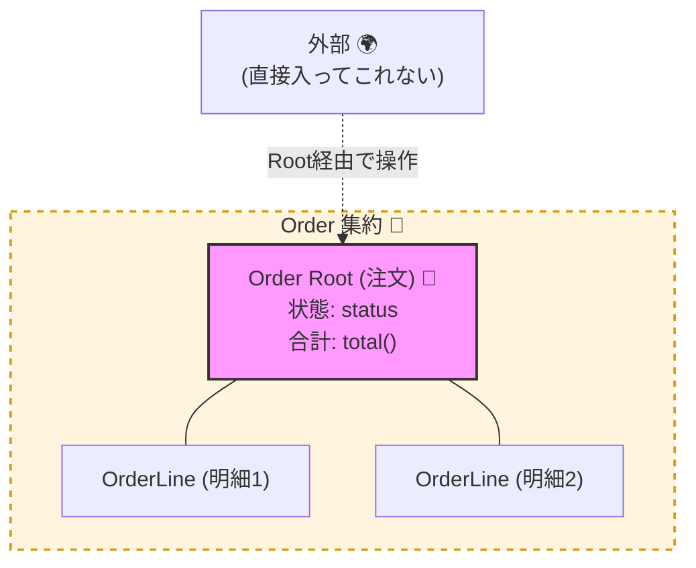
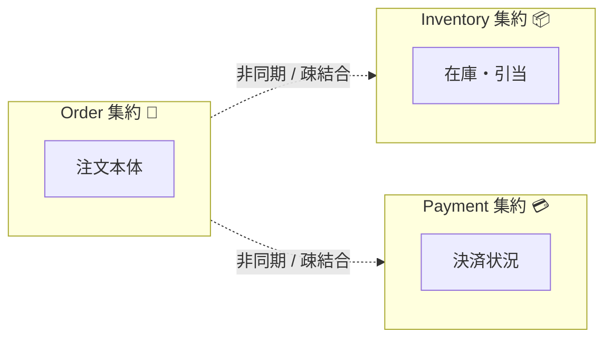

# 第09章：集約（Aggregate）とは？“まとまり”の正体🧺✨

## 9.0 この章のゴール🎯

集約（Aggregate）を「オブジェクトをまとめる技」じゃなくて、**不変条件🔒を守るための“境界🧱”**として説明できるようになること😊
ミニEC（注文🛒・在庫📦・支払い💳）で、**Order集約**を題材に「何を中に入れて、何を外に出すのか」を体感します✨

---

## 9.1 集約って、ひとことで言うと？🧠✨


**集約＝ドメインのオブジェクト群を「1つの単位」として扱うための“まとまり”**です。
ただしポイントは「見た目のまとまり」じゃなくて…

* **一貫性（consistency）✅を保ちたい範囲**
* **不変条件（invariants）🔒を守れる範囲**
* **まとめて保存・読み込みされやすい範囲**

…という “守るための境界🧱” だってことです😊
（注文と注文明細をまとめて扱う例が定番です🧾） ([martinfowler.com][1])



---

## 9.2 なんで集約が必要なの？😱（集約がない世界）


集約がない（境界がゆるい）と、コードのあちこちから自由に触られて…

* 注文合計が、明細合計とズレる💥
* 支払い済みなのに明細が追加できる😇
* 在庫がマイナスになる📉
* 状態遷移がぐちゃぐちゃ（出荷済み→未払い…？）🌀

みたいな “事故” が起きやすいです。

だから集約は、**「事故を起こさないための最後の砦🛡️」**になります😊

---

## 9.3 集約＝一貫性の境界🧱（ここが超だいじ！）


集約は **consistency boundary（一貫性の境界）** を作ります。
MicrosoftのDDD解説でも「集約は一貫性の境界で、集約内には1つのルート（root）がある」と説明されています。 ([Microsoft Learn][2])

ここでの肌感覚はこんな感じ👇

* 集約の中：**いまこの瞬間に“必ず整合しててほしい”ルール🔒**
* 集約の外：**すぐ整合してなくてもOK（あとで合わせる）⏳** or **別の仕組みで守る**

つまり、集約は「全部を1個にまとめる」じゃなくて
**“即時に守りたいルールのまとまり”だけを囲う**んだよね😊✨

---

## 9.4 ミニECでの定番：Order集約🛒🧾

### 9.4.1 Order集約のメンバー（例）👪

* Order（注文）🧾
* OrderLine（注文明細）📦📦
* Money（お金）💴
* Quantity（数量）🔢
* OrderStatus（状態）🚦

「注文」と「注文明細」は別オブジェクトでも、**注文という単位で整合させたい**から、同じ集約に入れるのが自然です😊 ([martinfowler.com][1])

---

### 9.4.2 Order集約が守りたい“不変条件”の例🔒✨


Order集約の不変条件（壊れたらダメなルール）を、まずは言葉で✨

* 合計金額は **0以上** 💴✅
* 明細の数量は **1以上** 🔢✅
* 明細が1件もない注文は **確定できない** 🚫
* 支払い済みの注文に **明細追加できない** 🚫💳
* 注文ステータスは **決めた順番でしか遷移しない** 🚦✅
  例：Created → Submitted → Paid → Shipped

こういう「絶対守りたいもの」こそ、集約の中心です😊

---

### 9.4.3 “集約の外”に置くもの（例）🚪

Orderと関係があっても、**同じ集約に入れるとは限らない**よ〜🙂

* 在庫（Inventory）📦
  → 高頻度で同時更新されがちで、Orderに入れると重くなりやすい💦
* 決済（Payment）💳
  → 外部サービス連携になりやすく、即時に同じトランザクションで守れないことが多い
* 顧客（Customer）👤
  → 注文と同時更新の必然が薄いなら、別集約でOK

この「外に出す判断」が、集約設計のいちばんおいしい所😋✨



---

## 9.5 よくある勘違い3つ😇⚠️

### 勘違い①：集約＝配列やDTOのかたまり📦

違うよ〜！
集約は「Listの集合」じゃなくて、**ドメイン上のまとまり（注文、診察、予約…）**です。 ([martinfowler.com][1])

### 勘違い②：関係があるものは全部同じ集約に入れる🤝


関係があっても、**即時に一貫性を守りたいか？**が大事。
全部入れると “巨大集約🦣” になって、性能も同時更新もつらくなります💦

### 勘違い③：集約の境界をまたいで、普通に更新していい🙂

集約境界をまたぐ更新は、事故りやすい…！
「1つの集約の中で完結」させるのが基本方針になります。 ([DEV Community][3])

---

## 9.6 集約境界の決め方：超実務3ステップ🧭✨

センスじゃなくて、手順でいくよ〜😊


### Step 1️⃣ 不変条件を箇条書きにする🔒📝

「壊れたら困るルール」を全部出す
（第8章で作ったやつをさらに育てる感じ🌱）

### Step 2️⃣ その不変条件を“守れる最小範囲”を囲う🧱

「このルールを守るには、どのオブジェクトが一緒に更新される必要がある？」を考える🧠

### Step 3️⃣ 同時更新の強さ（競合の激しさ）をチェックする💥

* よく同時更新されるなら、集約は小さくしたくなる🙂
* でも不変条件が跨ぐなら、ちゃんと一緒にする必要がある🔒

この3つで、かなり“理由ある境界”になります😊✨

---

## 9.7 手を動かす：Order集約を「1枚」にまとめよう🗂️✨

ノートでもOK✍️ まずは文章で設計するのがコツ！

### 9.7.1 「Order集約カード」テンプレ🃏

* 集約名：Order🧾
* 目的：注文の整合性を守る✅
* 中にいるもの：Order / OrderLine / Money / Quantity / Status
* 守る不変条件：

  1. …
  2. …
  3. …
* 外にいるもの：Inventory / Payment / Customer
* 外との関わり方：

  * 「この情報は参照だけ？」
  * 「更新が必要なら、あとで別の仕組み？」（ここは後の章で深掘り⏳）

---

## 9.8 TypeScriptで“集約っぽさ”を出す最小コード🧩💻


ポイントはこれだけ👇

* 集約の中身を **勝手に書き換えさせない**（private + 取り出しはコピー/readonly）🔒
* ルール違反を **メソッドの中で止める**（ガード節）🚫
* DBやHTTPみたいなI/Oは **集約に入れない** 🔌🚫

```ts
// ざっくり版（学習用）✨
// ※ Money/Quantity は第6章で作った「薄い型」でもOKだよ😊

type OrderStatus = "Created" | "Submitted" | "Paid" | "Shipped";

class Money {
  private constructor(public readonly amount: number, public readonly currency: "JPY") {}
  static of(amount: number, currency: "JPY" = "JPY"): Money {
    if (!Number.isInteger(amount)) throw new Error("金額は整数（円）でね🙂");
    if (amount < 0) throw new Error("金額はマイナス不可🚫");
    return new Money(amount, currency);
  }
  add(other: Money): Money {
    if (this.currency !== other.currency) throw new Error("通貨が違うよ😇");
    return Money.of(this.amount + other.amount, this.currency);
  }
}

class Quantity {
  private constructor(public readonly value: number) {}
  static of(value: number): Quantity {
    if (!Number.isInteger(value)) throw new Error("数量は整数でね🙂");
    if (value < 1) throw new Error("数量は1以上だよ🚫");
    return new Quantity(value);
  }
}

class OrderLine {
  constructor(
    public readonly productId: string,
    public readonly unitPrice: Money,
    public readonly qty: Quantity
  ) {}
  subtotal(): Money {
    return Money.of(this.unitPrice.amount * this.qty.value, "JPY");
  }
}

class Order {
  private status: OrderStatus = "Created";
  private lines: OrderLine[] = [];

  // ✅ 外から明細配列を直接いじれないようにする
  getLines(): readonly OrderLine[] {
    return [...this.lines];
  }

  getStatus(): OrderStatus {
    return this.status;
  }

  total(): Money {
    return this.lines.reduce((sum, line) => sum.add(line.subtotal()), Money.of(0, "JPY"));
  }

  addLine(line: OrderLine): void {
    this.ensureNotPaidOrLater();
    this.lines.push(line);
    this.ensureInvariants();
  }

  submit(): void {
    if (this.lines.length === 0) throw new Error("明細なし注文は確定できないよ🚫");
    this.status = "Submitted";
    this.ensureInvariants();
  }

  markPaid(): void {
    if (this.status !== "Submitted") throw new Error("確定前に支払い済みにはできないよ🚫");
    this.status = "Paid";
    this.ensureInvariants();
  }

  private ensureNotPaidOrLater(): void {
    if (this.status === "Paid" || this.status === "Shipped") {
      throw new Error("支払い後（または出荷後）は変更できないよ🚫💳");
    }
  }

  // 🔒 集約が守るべき不変条件を“ここで”チェック
  private ensureInvariants(): void {
    // 合計は0以上（Money側でも守ってるけど、例として書くよ😊）
    if (this.total().amount < 0) throw new Error("合計金額が壊れてる😱");
  }
}
```

このコードで見たいポイントはこれ👇😊

* `lines` が `private` だから、外から `push` とかできない🔒
* 明細追加・確定・支払いなどの操作は **Orderのメソッド経由**になる🧾
* ルール違反は **早めに例外で止める**（無効状態を作らない）🚫✨

---

## 9.9 AI活用🤖✨：集約の境界を“理由付き”で考えるプロンプト集

コピペで使えるやつ置いとくね😊💕

### プロンプトA：不変条件を洗い出す🔒

* 「ミニECの注文（Order）で絶対に破れてはいけない不変条件を15個、理由付きで列挙して。状態遷移・金額・数量・二重処理も含めて」

### プロンプトB：集約候補を3案出す🧺🧺🧺

* 「ミニEC（注文・在庫・支払い）の集約設計案を3パターン出して。各案について、集約の中身／守る不変条件／メリット／デメリット／想定される同時更新問題をまとめて」

### プロンプトC：却下理由を強くする🧠

* 「次の集約案がダメな理由を“設計初心者にも分かる言葉”で5個書いて：『Order集約の中にInventoryを入れて、注文確定と在庫更新を同一更新にする』」

---

## 9.10 理解チェック✅（ミニクイズ🎮）

Q1️⃣ 「OrderとPaymentは関連が強いから同じ集約にするべき」…ほんと？🙂
→ “関連が強い”だけで決めずに、**即時に守りたい不変条件が跨るか**で判断できると最高✨

Q2️⃣ 集約の外から `order.lines.push(...)` ができる設計、何が怖い？😱
→ 不変条件が破られても止められない（最後の砦が消える）💥

Q3️⃣ 集約を大きくすると、何が起きやすい？⚠️
→ 同時更新が競合しやすい／性能が落ちやすい／テストが重くなりやすい💦

---

## 9.11 まとめ：集約の正体（これだけ覚えればOK）🧺✨

* 集約は **不変条件🔒を守るための境界🧱**
* 集約内は「いま必ず整合しててほしい✅」を守る場所
* なんでも入れると巨大化してつらい🦣💦（入れる理由が必要）
* 定番例は **Order（注文）＋OrderLine（明細）** 🧾📦 ([martinfowler.com][1])
* 2026時点のTypeScriptは、5.9系が安定版として配布されており（例：5.9.3）、次の大きな節目として6.0→7.0の計画が公開されています🧠✨ ([github.com][4])

[1]: https://martinfowler.com/bliki/DDD_Aggregate.html "D D D_ Aggregate"
[2]: https://learn.microsoft.com/en-us/azure/architecture/microservices/model/tactical-ddd "Using tactical DDD to design microservices - Azure Architecture Center | Microsoft Learn"
[3]: https://dev.to/jamesmh/what-are-aggregates-in-domain-driven-design-16nh?utm_source=chatgpt.com "What Are Aggregates In Domain-Driven Design?"
[4]: https://github.com/microsoft/typescript/releases "Releases · microsoft/TypeScript · GitHub"
