# 第10章：集約ルート（Aggregate Root）＝入口は1つ🚪👑

## ねらい🎯

この章が終わると、こんなことができるようになります😊✨

* 「外から触っていい“窓口”を1つにする」意味がわかる🚪
* 集約の中のオブジェクトを“勝手に壊せない”形にできる🔒
* TypeScriptで「入口が1つ」をコードでちゃんと表現できる🧩
* 「やっちゃダメな漏れ方（配列参照・setters地獄）」が見抜ける👀⚠️

---

## まず結論💡：集約ルートは「唯一の入場ゲート」🚪


集約（Aggregate）は「不変条件（絶対に壊れちゃダメなルール🔒）を守る単位」でしたね。

集約ルート（Aggregate Root）は、その集約の外から触っていい **唯一の入口** です👑
つまり…

* 外部（UI/アプリ層/他集約）は、**ルート経由でしか**変更できない🚫
* 集約の内部（子Entity/VO）は、外から直接いじらせない🙅‍♀️

これで何が嬉しいのか？
👉 **不変条件を守る責任を“ルートに集中”できる**からです✅✨

---

## たとえ話🏯：お城の門が1つだと守りやすい🛡️


お城（＝集約）に門がいっぱいあると…

* どの門からも人が入ってきて、勝手に部屋の物を動かされる😱
* 守るルールがバラバラになって、破られやすい💥

でも門が1つなら…

* 入るときに必ずチェックできる✅
* 「この操作はOK？NG？」を門番（＝ルート）が判断できる👑

集約ルートはこの「門番」役です🚪👑

```mermaid
graph TD
    subgraph Castle [集約 🏯]
        Gate["集約ルート 🚪👑<br/>(唯一の窓口)"]
        Inner["子Entity / VO 🏺🗝️<br/>(外から直接見えない)"]
        Gate --> Inner
    end
    
    Outside["外部 🌍<br/>(アプリ層・他集約)"] --> Gate
    Outside -- "直接アクセス禁止🚫" --- X((X))
    X -.-> Inner

    style Castle fill:#fefefe,stroke:#333,stroke-width:2px
    style Gate fill:#f9f,stroke:#333,stroke-width:2px
```



---

## ミニECで考える🛒：Order集約の例

題材はミニEC（注文🛒・在庫📦・支払い💳）。
この章では **Order集約** をこう置きます👇

* **Aggregate Root**：`Order` 👑
* 集約内の子（外から直接触らせない）：`OrderLine`（注文明細）📦
* 値：`OrderId`, `ProductId`, `Quantity`, `Money` など💎

やりたいことの例👇

* 注文に商品を追加する ➜ `order.addItem(...)` 🧺
* 数量を変更する ➜ `order.changeQuantity(...)` 🔁
* 支払い済みなら変更禁止 ➜ ルートが止める🚫💳

---

## よくある事故😱：「入口が増える」と不変条件が死ぬ

### 事故パターンA：配列を外に渡しちゃう📤


`order.items` を外にそのまま返すと…

* 外部が `push()` できる😱
* ルートを通らず勝手に増える➡️不変条件がすり抜ける💥

### 事故パターンB：子Entityを外部で直接更新✍️


`orderLine.quantity = 999` みたいにできると…

* 「支払い済みは変更不可」みたいなルールが無視される😇
* どこで壊れたか追えなくなる🌀

### 事故パターンC：Repositoryが子Entity単位になる📦📦

`OrderLineRepository` みたいなのを作ると…

* “集約単位で守る”が崩れて、整合性が割れやすい⚠️

---

## TypeScriptで「入口は1つ」を作るコツ🧩🔒

ポイントはこれ👇（超大事✨）

1. **子Entityのコンストラクタを外に見せない**🙈
   
2. **集約内部の状態を外に漏らさない**（参照を渡さない）🚫
   
3. **変更は必ずルートのメソッド経由**にする👑
4. **ルートのメソッドに“不変条件チェック”を集める**🔒✅

---

## 実装してみよう🛠️：Order（Aggregate Root）とOrderLine（子Entity）

### 例：ドメイン型（IDなど）🪪💎

```ts
// domain/types.ts
export type Brand<T, B extends string> = T & { readonly __brand: B };

export type OrderId = Brand<string, "OrderId">;
export type ProductId = Brand<string, "ProductId">;

export const OrderId = {
  new(): OrderId {
    return crypto.randomUUID() as OrderId;
  },
};

export const ProductId = {
  of(value: string): ProductId {
    if (!value) throw new Error("ProductId is required");
    return value as ProductId;
  },
};

export type Quantity = Brand<number, "Quantity">;

export const Quantity = {
  of(n: number): Quantity {
    if (!Number.isInteger(n) || n <= 0) throw new Error("Quantity must be positive int");
    return n as Quantity;
  },
};
```

> ✅ 2026年1月27日時点、TypeScriptの安定版は npm 上で 5.9.3 が “Latest” として表示されています。([npmjs.com][1])
> （この章の書き方は 5.9.x でOK👌✨）

---

### 例：OrderLine（外から直接触らせない子Entity）📦

```ts
// domain/order/OrderLine.ts
import { ProductId, Quantity } from "../types";

export class OrderLine {
  // 重要：外から勝手に new されると困るので、constructor は private にする🙈
  private constructor(
    private readonly productId: ProductId,
    private quantity: Quantity,
  ) {}

  static create(productId: ProductId, quantity: Quantity): OrderLine {
    return new OrderLine(productId, quantity);
  }

  getProductId(): ProductId {
    return this.productId;
  }

  getQuantity(): Quantity {
    return this.quantity;
  }

  // 重要：直接 quantity を触らせず、変更メソッドに寄せる🔒
  changeQuantity(quantity: Quantity) {
    this.quantity = quantity;
  }
}
```

---

### 例：Order（Aggregate Root 👑）🚪

```ts
// domain/order/Order.ts
import { OrderId, ProductId, Quantity } from "../types";
import { OrderLine } from "./OrderLine";

type OrderStatus = "Draft" | "Paid" | "Cancelled";

export class Order {
  private status: OrderStatus = "Draft";
  private readonly lines: OrderLine[] = [];

  private constructor(private readonly id: OrderId) {}

  static createNew(): Order {
    return new Order(OrderId.new());
  }

  getId(): OrderId {
    return this.id;
  }

  getStatus(): OrderStatus {
    return this.status;
  }

  // ✅ 外に渡すときは「参照」を渡さない！スナップショットにする📸
  // ReadonlyArray にしても、参照が同じだと中身が弄れるケースがあるので「コピー」が安心👌
  getLines(): ReadonlyArray<{ productId: ProductId; quantity: Quantity }> {
    return this.lines.map((l) => ({ productId: l.getProductId(), quantity: l.getQuantity() }));
  }

  addItem(productId: ProductId, quantity: Quantity) {
    this.ensureEditable(); // 🔒 入口でチェック！

    // 例：同じ商品が既にあるなら数量を足す（ルールはあなたの仕様でOK）
    const existing = this.lines.find((l) => l.getProductId() === productId);
    if (existing) {
      const newQty = Quantity.of((existing.getQuantity() as number) + (quantity as number));
      existing.changeQuantity(newQty);
      return;
    }

    this.lines.push(OrderLine.create(productId, quantity));
  }

  changeQuantity(productId: ProductId, quantity: Quantity) {
    this.ensureEditable(); // 🔒 入口でチェック！

    const line = this.lines.find((l) => l.getProductId() === productId);
    if (!line) throw new Error("Line not found");

    line.changeQuantity(quantity);
  }

  pay() {
    // 例：支払いは一回だけ、みたいなルールも入口で集中管理👑
    if (this.status !== "Draft") throw new Error("Order cannot be paid in current status");
    if (this.lines.length === 0) throw new Error("Cannot pay an empty order");

    this.status = "Paid";
  }

  cancel() {
    if (this.status === "Paid") throw new Error("Paid order cannot be cancelled here");
    this.status = "Cancelled";
  }

  private ensureEditable() {
    if (this.status !== "Draft") {
      throw new Error("Order is not editable");
    }
  }
}
```

### ここが「入口は1つ🚪」の正体だよ✨

* 外部は `Order` の public メソッドしか使えない👑
* `OrderLine` は勝手に作れない・勝手に変更できない🙈🔒
* 変更のたびに `ensureEditable()` が必ず通る✅
  👉 「支払い済みは変更禁止」みたいな不変条件が守れる💳🚫

---

## テストで「入口が増えてない」も確認しよう🧪✨（Vitest）


```ts
// tests/order.spec.ts
import { describe, it, expect } from "vitest";
import { Order } from "../domain/order/Order";
import { ProductId, Quantity } from "../domain/types";

describe("Order Aggregate Root", () => {
  it("Paidになったら変更できない", () => {
    const order = Order.createNew();
    const p1 = ProductId.of("p-1");

    order.addItem(p1, Quantity.of(1));
    order.pay();

    expect(() => order.addItem(p1, Quantity.of(1))).toThrow();
    expect(() => order.changeQuantity(p1, Quantity.of(2))).toThrow();
  });

  it("外部が lines を直接いじれない（スナップショット）", () => {
    const order = Order.createNew();
    const p1 = ProductId.of("p-1");

    order.addItem(p1, Quantity.of(1));

    const lines = order.getLines();
    // lines 自体は ReadonlyArray なので push もできないし、
    // 要素もスナップショット（プレーンオブジェクト）なので OrderLine を直接壊せない👍
    expect(lines[0].productId).toBe(p1);
  });
});
```

> ✅ Vitest は公式ガイドが継続更新されていて、IDE連携ページも 2026年1月時点で更新されています。([Vitest][2])

---

## やってみよう課題✍️🎮（手を動かす）

### 課題1️⃣：removeItem を作る🗑️

* `removeItem(productId)` を `Order` に追加
* `Paid` のときは削除できない（`ensureEditable()` を使う）🔒

### 課題2️⃣：OrderLine を外から new できないことを確認👀

* VS Codeで `new OrderLine(...)` しようとしてみてね
  👉 **コンパイルエラーになる**のが正解🙆‍♀️✨

### 課題3️⃣：ルートが“漏れてないか”チェック✅

次のうち、どれが危険？⚠️（理由も言えると最高！）

* A: `getLines(): ReadonlyArray<OrderLine> { return this.lines; }`
* B: `getLines(): ReadonlyArray<OrderLine> { return [...this.lines]; }`
* C: `getLines(): ReadonlyArray<{...}> { return this.lines.map(...); }`

ヒント💡：**参照が外に漏れてるか？** を見よう👀

```mermaid
graph LR
    subgraph Aggregate [集約の内部]
        L[Original Lines 📦]
    end
    
    subgraph Outside [外部]
        A["A: 直接参照 🚫<br/>(外から中が弄れる)"]
        B["B: 浅いコピー ⚠️<br/>(配列自体は別だが<br/>中身の参照が同じ)"]
        C["C: スナップショット ✅<br/>(完全に独立したデータ)"]
    end
    
    L <-->|Same Ref| A
    L -.->|Child Ref| B
    L -- "Map / Clone" --> C
```



---

## AI支援🤖✨（Copilot/Codexに投げると便利なやつ）

### 命名をきれいにしたいとき📝

* 「`Order` の操作メソッド名を “動詞＋目的語” で10個提案して。ECの注文ドメインで自然な英語にして」

### 漏れチェックしてほしいとき🕵️‍♀️

* 「この `Order` 実装で、集約内部の状態が外部に漏れて不変条件が破られる可能性がある箇所を指摘して。直し方も出して」

### 仕様に沿ってるか確認したいとき📋

* 「支払い後に変更できないルールを守れてる？抜け道があればテストケースも提案して」

---

## まとめ🧠✨（この章で覚える合言葉）

* 集約ルートは **唯一の入口** 🚪👑
* 不変条件は **入口（ルート）に集中** 🔒✅
* **参照を外に漏らさない**（配列・子Entityを直で返さない）📦🚫
* 子Entityは **勝手に作らせない・勝手に変えさせない** 🙈🛡️

---

## おまけ：2026年のTypeScriptまわり超ミニ情報📌

* TypeScript 7 は Go実装への移行が進んでいて、ビルド高速化が大きな話題になっています（6.0は 5.9 と 7.0 の橋渡し、という位置づけ）。([Microsoft for Developers][3])
* Node.js は 2026年1月時点で v25 系が Current、v24 系が Active LTS として更新されています。([nodejs.org][4])

[1]: https://www.npmjs.com/package/typescript?activeTab=versions&utm_source=chatgpt.com "typescript - NPM"
[2]: https://vitest.dev/guide/ide?utm_source=chatgpt.com "IDE Integrations - Vitest Guide"
[3]: https://devblogs.microsoft.com/typescript/progress-on-typescript-7-december-2025/?utm_source=chatgpt.com "Progress on TypeScript 7 - December 2025 - Microsoft Dev Blogs"
[4]: https://nodejs.org/en/about/previous-releases?utm_source=chatgpt.com "Node.js Releases"
