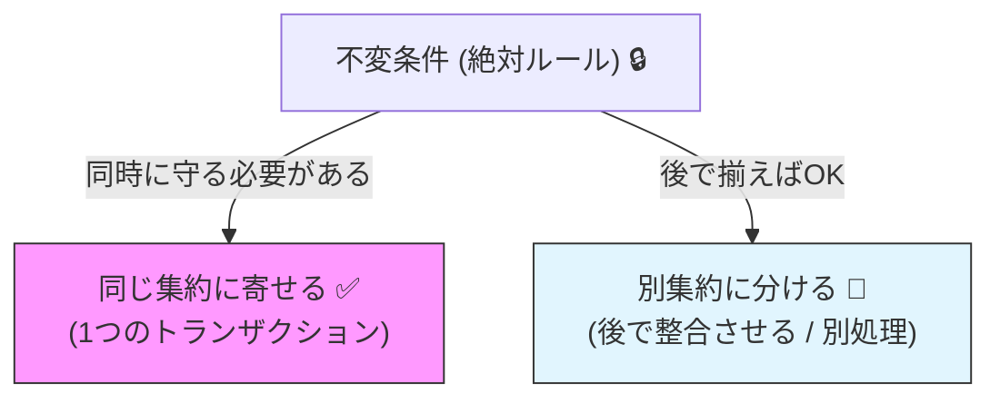
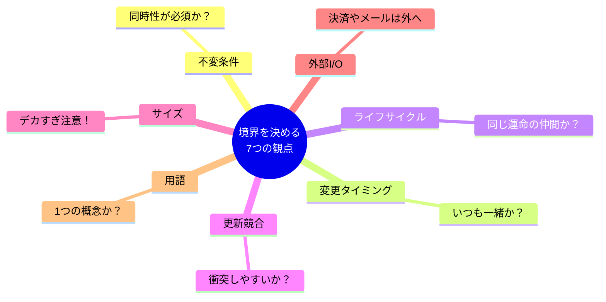

# 第11章：境界の決め方①（判断軸）🧭✨

## この章でできるようになること🎯

* 「集約の境界」を **センスじゃなく理由** で説明できるようになる😊✨
* 境界を決めるための **判断軸チェックリスト** を作れる✅
* チェックリストを **YES/NO質問** にして、チームでも使える形にできる🗣️🧩
* ミニEC（注文🛒・在庫📦・支払い💳）で「どこまでを1つにまとめるか」を考えられる💡

---

## 1. いちばん大事な結論💎

集約の境界は、だいたいこれで決まります👇

**「同じトランザクション（同時に成功/失敗）で守りたい不変条件🔒」が何か？**

* 「別々でも壊れない（後で揃えばOK）」なら → **分ける候補** ✅



この章は、この“理由づけ”をできるようにする回だよ🧁✨

---

## 2. 判断軸（境界を決める7つの観点）🧭✨

## 観点①：不変条件は「同時」に守る必要ある？🔒⚡

* 例）「支払い済み💳なら、注文🧾は“支払い済み状態”になってるべき」
  → これを **同時に** 守れないと困る？ それとも **後で整合** でもOK？

✅ **“同時じゃないと困る”ほど強い不変条件** があるほど、同じ集約に寄りやすいよ。

---

## 観点②：同じコマンドで一緒に変更される？✍️🔁

* 例）「注文に商品を追加する🛒」とき、更新するのは

  * 注文ヘッダ🧾
  * 明細（OrderItems）📦
    みたいに **必ずセットで変更** されるよね？

✅ 「いつも一緒に変わる」は、同じ集約にしやすいサイン🧲

---

## 観点③：ライフサイクルは同じ？🌱➡️🌳➡️🍂

* いつ作られ、いつ消える？いつ“独立”する？
* 例）注文🧾が消えたら、明細📦も消える（=同じ運命）
* 例）支払い💳は、外部決済や返金などで、注文と別の運命になりがち

✅ 「同じ運命の仲間」は一緒にしやすい👯‍♀️

---

## 観点④：同時更新されやすい？（競合しやすい？）😱💥

* もし「注文」と「在庫」が同じ集約だと、
  注文操作🛒 と 在庫補充📦 が同時に来たときに **衝突** しやすいかも。

✅ **衝突が多い** ところは分けるとラクになることが多い🙂🛡️

---

## 観点⑤：サイズが巨大化しそう？🐘📦

* 集約がデカすぎると

  * 1回の更新が重い🐢
  * ロックや競合が増える😵
  * テストがつらい🧪💦

✅ 「大きすぎ注意⚠️」は分割検討のサイン！

---

## 観点⑥：外部I/O（決済API・メール送信等）を中に入れてない？🔌🚫

集約は「不変条件を守る箱」だから、基本は **純粋にドメインルールだけ** に寄せたい🧼✨
外部I/Oは遅いし失敗するし、集約の中に混ぜると境界が壊れやすいよ😇

✅ 外部I/Oが絡むもの（決済、配送、通知）は **別の関心** として分けやすい

---

## 観点⑦：用語（ユビキタス言語）として自然？🗣️✨

「それって1つの“もの”として会話してる？」が地味に効く💡

* 「注文」って言うと、明細も含んだ“かたまり”を想像するよね🧾
* 「在庫」は注文と別の部署・別の画面・別の責任で扱いがち📦

✅ 会話の単位が境界のヒントになるよ🧠🧩



---

## 3. 判断軸チェックリスト✅（コピペして使えるやつ📋✨）


境界を考えるとき、候補Aと候補Bの「関係」を1つずつ確認していこう👇
（例：A=注文🧾、B=支払い💳）

|  # | 質問（YES/NO）                        | YESなら…  |
| -: | --------------------------------- | ------- |
|  1 | AとBの不変条件を「同じ瞬間」に守らないと壊れる？🔒⚡      | 同じ集約寄り✅ |
|  2 | 同じコマンドでAとBは“いつも”一緒に更新される？✍️🔁     | 同じ集約寄り✅ |
|  3 | 作られる/消えるタイミングが同じ？🌱🍂             | 同じ集約寄り✅ |
|  4 | AとBを別々に更新する担当・画面・権限がある？👩‍💻👩‍🏫 | 分ける寄り✅  |
|  5 | 同時更新が多くて衝突しそう？😱💥                | 分ける寄り✅  |
|  6 | Bが外部I/Oや非同期の中心？🔌📨               | 分ける寄り✅  |
|  7 | 会話上、AとBは“別のもの”として話される？🗣️         | 分ける寄り✅  |

📝コツ：**#1（不変条件）だけは最優先**。他は調整材料だよ🎛️✨

---

## 4. チェックリストをYES/NO質問に“整形”する🤖🎯（AI活用）

チェックリストって、文章がふわっとしてると使われなくなりがち…😢
だから、AIに「短いYES/NO」へ整形してもらおう✨

## 使えるプロンプト例🪄

* 「ミニECの“注文🧾”と“支払い💳”の境界を決めたい。境界判断のためのYES/NO質問を10個作って。質問は短く、1文で、迷いにくい表現にして。さらに“YESなら同じ集約寄り / NOなら分離寄り”も添えて。」

* 「次の不変条件リストを読んで、“同じトランザクションで守るべきか？”を判定できるYES/NO質問に変換して：…（不変条件を貼る）」

---

## 5. 手を動かす🛠️：チェックリストをTypeScriptで“道具化”する🧩✨

「境界議論」をするとき、ふんわり会話だけだと疲れるから😵
簡単なスコアツールにして、議論の土台を作ろう📌

```ts
// /tools/aggregate-boundary-checklist.ts

type Direction = "together" | "separate";

type Question = {
  id: string;
  text: string;
  ifYes: Direction; // YESならどっち寄り？
  weight: 1 | 2 | 3; // 重要度（1=軽い, 3=最重要）
};

const questions = [
  {
    id: "inv-now",
    text: "AとBの不変条件を“同じ瞬間”に守らないと壊れる？🔒⚡",
    ifYes: "together",
    weight: 3,
  },
  {
    id: "change-together",
    text: "同じコマンドでAとBはいつも一緒に更新される？✍️🔁",
    ifYes: "together",
    weight: 2,
  },
  {
    id: "lifecycle",
    text: "作成/削除のタイミングはほぼ同じ？🌱🍂",
    ifYes: "together",
    weight: 2,
  },
  {
    id: "separate-roles",
    text: "別担当・別画面・別権限で更新される？👩‍💻👩‍🏫",
    ifYes: "separate",
    weight: 2,
  },
  {
    id: "conflict",
    text: "同時更新が多くて衝突しそう？😱💥",
    ifYes: "separate",
    weight: 2,
  },
  {
    id: "io-center",
    text: "外部I/O（決済API等）の中心になりそう？🔌",
    ifYes: "separate",
    weight: 2,
  },
  {
    id: "language",
    text: "会話上、AとBは別の“もの”として語られる？🗣️",
    ifYes: "separate",
    weight: 1,
  },
] as const satisfies readonly Question[];

// 回答（YES=true, NO=false）
type Answers = Record<(typeof questions)[number]["id"], boolean>;

export function evaluate(answers: Answers) {
  let together = 0;
  let separate = 0;

  for (const q of questions) {
    const yes = answers[q.id];
    if (!yes) continue;

    if (q.ifYes === "together") together += q.weight;
    else separate += q.weight;
  }

  return { together, separate };
}
```

🧁ポイント：

* `satisfies` を使うと「型チェックしつつ、リテラルも保てる」ので、ツール作りに便利だよ✨（TypeScriptの最新リリースは 5.9.3 が “Latest” 扱いになってるよ）([GitHub][1])

---

## 6. ミニECでやってみよう🛒📦💳（境界の当てはめ練習）

## ケース：注文🧾 と 支払い💳 を同じ集約にする？分ける？🤔

### まず“不変条件”を言葉にする🔒

例）

* 「支払い成功💳なら、注文は“支払い済み”状態である」
* 「支払い失敗😵なら、注文は“支払い待ち”のまま」
* 「二重決済は絶対ダメ🙅‍♀️」

ここで大事な質問👇
**これって“同じ瞬間”に守らないと壊れる？** それとも **イベントで後追いでもOK？** ⏳

* 決済って外部I/Oで、失敗も遅延も起きる世界🔌🌪️
* なので「支払い処理そのもの」は注文集約の外に出したくなることが多いよ🙂✨
* でも「支払い済みになったら注文状態を変える」は、注文側で安全に取り込みたいよね🧾✅

このへんが次章（境界案比較📊）につながるよ🧩

---

## 7. ありがちな失敗あるある😇⚠️

## 失敗①：「一緒にしたほうが安全そう」だけで巨大集約にする🐘💥

* 安全そうに見えて、競合・性能・実装が死ぬやつ😵‍💫
* まず #1（不変条件）を言語化してから判断しよう🔒

## 失敗②：境界の理由が説明できない🌀

* 「なんとなく」だと、後で必ず揉める😂
* チェックリストで “YESだからこう” を残すのが勝ち🏆

## 失敗③：知らないリポジトリや拡張機能をうっかり信頼する😱🔓

最近も、悪意あるVS Codeプロジェクトや拡張機能が問題になってるので、**Workspace Trust** をちゃんと使おう🛡️
VS Codeは「信頼したフォルダではコード実行や拡張機能の動作が変わる」仕組みがあるよ（迷ったら制限モードのままでOK）([Visual Studio Code][2])
不審なリポジトリを開いてタスク実行が悪用されるケースも報告されてるよ([jamf.com][3])
さらに「AIっぽい名前の悪性拡張」が見つかった事例もあるので、入れる拡張は発行元や評判をよく見てね👀✨([The Hacker News][4])

---

## 8. 章末ミニテスト🧠✨（3問だけ！）

1. 集約の境界を決める最優先の判断軸はどれ？

* A: ファイル数
* B: 同じ瞬間に守りたい不変条件🔒
* C: 画面の数

2. 「外部I/O（決済API等）が中心」になりやすいものは、集約の中に入れる？外に出す？🔌

3. 「同時更新が多くて衝突しそう」な2つは、同じ集約にするとどうなりがち？😱💥

---

## 9. 次章に向けた宿題📘✨（軽め）

ミニECで、次のペアをチェックリストで判定してみよう✅
（AとBが一緒か分離か、**理由を1行** で書く✍️）

* A=注文🧾、B=注文明細📦
* A=注文🧾、B=在庫📦
* A=支払い💳、B=返金↩️
* A=注文🧾、B=配送🚚

---

## 2026時点のツール小メモ🧷💻

* VS Code の安定版は 1.108（リリース日が 2026-01-08 として案内されてるよ）([Visual Studio Code][5])
* Node.js は v24 が Active LTS、v25 は Current だよ（学習・安定運用ならLTS寄りが無難）([nodejs.org][6])

[1]: https://github.com/microsoft/typescript/releases "Releases · microsoft/TypeScript · GitHub"
[2]: https://code.visualstudio.com/docs/editing/workspaces/workspace-trust?utm_source=chatgpt.com "Workspace Trust"
[3]: https://www.jamf.com/blog/threat-actors-expand-abuse-of-visual-studio-code/?utm_source=chatgpt.com "Threat Actors Expand Abuse of Microsoft Visual Studio Code - Jamf"
[4]: https://thehackernews.com/2026/01/malicious-vs-code-ai-extensions-with-15.html?utm_source=chatgpt.com "Malicious VS Code AI Extensions with 1.5 Million Installs Steal ..."
[5]: https://code.visualstudio.com/updates "December 2025 (version 1.108)"
[6]: https://nodejs.org/en/about/previous-releases "Node.js — Node.js Releases"
