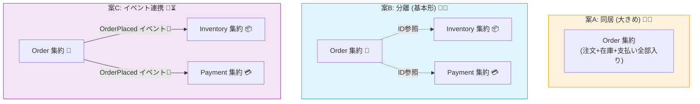

# 第12章：境界の決め方②（ミニECで境界案を比較）🛒📊

## この章でできるようになること 🎯✨

* 「集約の境界」を **案を並べて比較**しながら決められるようになる😊
* 「小さめの集約🧺」と「大きめの集約🧺💦」の **メリデメ**を説明できるようになる🗣️✨
* “どこまでを1回で整合させるか”を、**実シナリオ**で判断できるようになる✅

---

## 1. まず「守りたいこと」を固定しよう 🔒🧠

境界比較は、最初にここがブレると全部グラグラします😵‍💫
ミニEC（注文🛒・在庫📦・支払い💳）で、よくある “守りたいこと” を整理します✨

## 1-1. すぐ守りたい（強い一貫性がほしい）✅⚡

* 注文の合計金額がマイナスにならない💰🚫
* 注文の状態遷移が変（例：未払い→出荷済み）にならない🧾🚫
* 注文内の明細（アイテム）と合計が一致する🧾🧮✅

👉 こういうのは **Order集約の不変条件**として、集約の中でガードするのが基本だよ💪🔒

## 1-2. すぐじゃなくてもいい（後で整うのでもOK）⏳🧩

* 「支払い完了」と「出荷準備」の反映が数秒ズレてもOK📣⌛
* 在庫引当が「最終的に正しくなる」ならOK（ただしユーザー体験は注意）📦⚠️

👉 ここが **境界を小さくする余地**になります😊✨

---

## 2. 境界案を3つ出すよ 🧺🧺🧺

この章では「案A / 案B / 案C」を並べて、同じシナリオで比べます📊✨



---
## 登場する概念（ざっくり）🧩

* 注文：Order🛒（注文作成、明細追加、合計計算、状態遷移）
* 在庫：Inventory📦（引当/解除、残数）
* 支払い：Payment💳（認可/確定/失敗）

---

## 3. 案A：大きめ集約（注文＋支払い＋在庫を同居）🧺💳📦

## 形（イメージ）🗂️

* 1つの集約に全部が入る
* 1回の更新で「在庫引当→支払い→注文確定」をまとめてやりやすい✨

**メリット😊**

* “1回で全部成功/全部失敗” をやりやすい✅⚛️
* 整合性は分かりやすい（とにかく中で守ればいい）🔒

**デメリット😵**

* 集約が太りやすい（責務が増える）🍔💦
* 同時更新に弱くなりがち（ロック範囲が広い）🔁⚠️
* テストのセットアップが重くなりがち🧪🧱

---

## 4. 案B：分離（注文／支払い／在庫を別集約）🧺🧺🧺

## 形（イメージ）🗂️

* Order集約：注文の不変条件を守る🛒🔒
* Payment集約：支払いの状態を守る💳🔒
* Inventory集約：在庫の不変条件を守る📦🔒
* Orderは PaymentId / ReservationId を **ID参照**で持つ（中身は抱えない）🧷✨

**メリット😊**

* 集約がスリムで理解しやすい📘✨
* 同時更新・性能の調整がしやすい🔁🚀
* テストが軽くなりやすい🧪✨

**デメリット😵**

* 「注文確定」みたいな処理が “跨ぎやすい” ⚠️
* どこまでを同一トランザクションでやるか設計が必要🧠🧱

---

## 5. 案C：さらに分離＋イベントでつなぐ（最終的整合性寄り）📣📮⏳

## 形（イメージ）🗂️

* Orderは「注文を受けた事実」を確定🛒✅
* その後の在庫・支払いは **イベント（例：OrderPlaced）**で連携📣
* 失敗時は補償（キャンセル・引当解除など）↩️🧵

**メリット😊**

* “跨ぐ処理” を現実的に扱いやすい（非同期で分割）📨✨
* 拡張しやすい（後から配送やクーポンが増えても繋ぎやすい）🧩➕

**デメリット😵**

* 設計の難易度が上がる（失敗・再試行・重複対策）🔁⚠️
* 観測性（ログ・相関ID）が必要になる🔍🧾
* ユーザー体験（待ち/表示）を丁寧に設計する必要あり😊⚠️

---

## 6. 比較表でいったん俯瞰しよう 📋👀✨


| 観点         | 案A：同居（大きめ）🧺    | 案B：分離（基本形）🧺🧺🧺 | 案C：イベント連携📣     |
| ---------- | --------------- | ---------------- | --------------- |
| 整合性の分かりやすさ | 高い✅（中で守る）       | 中✅（境界を意識）        | 低〜中⏳（最終的整合性）    |
| 実装の単純さ     | 中（集約は太る）🍔      | 中（分割設計が必要）🧠     | 低（考えること多い）😵‍💫 |
| 拡張のしやすさ    | 低〜中（巨大化）⚠️      | 高い✨              | 高い✨             |
| 同時更新への強さ   | 低（範囲が広い）🔁⚠️    | 高い🔁✅            | 高い🔁✅           |
| テストの軽さ     | 低（準備が重い）🧪💦    | 高い🧪✨            | 中〜低（イベント絡む）📣🧪 |
| 失敗時の扱い     | 単純に見えるが肥大化しがち😵 | 設計次第で綺麗にできる✨     | 補償・再試行が前提↩️🔁   |

---

## 7. 同じシナリオで比べる（ここが本番）🔥🧠

## シナリオ①：注文確定（在庫引当→支払い→注文確定）🛒📦💳

**やりたいこと**：ユーザーに「注文確定しました！」って言う瞬間、何が保証されてるべき？😊

* 案A：1回でまとめやすい✅
  ただし集約が太る（在庫・支払いの都合がOrderに乗る）🍔💦
* 案B：

  * 「注文の内容が正しい」までは Orderだけで確定✅
  * 在庫/支払いは **別集約**で扱うので、“どこまでを同一トランザクションにするか” を決める🧠🧱
* 案C：

  * 注文受付だけ先に確定し、残りはイベントで進める📣⏳
  * UXは「確定」ではなく「処理中」表示が必要になることが多い😊⌛

---

## シナリオ②：支払い失敗（在庫は引当済み）💳❌📦

**事故**：支払いが失敗したのに在庫だけ確保され続ける😱

* 案A：集約内で “全部失敗” に戻しやすい✅
* 案B：

  * Payment失敗 → Inventory引当解除 → Order状態更新…みたいに跨ぐ⚠️
  * ただし設計が良ければ「責務が分かれてて読みやすい」になれる✨
* 案C：

  * 失敗イベントで補償（引当解除、注文キャンセル）↩️📣
  * 再試行・重複対策が必須🔁🔑

---

## シナリオ③：同時注文で在庫がギリギリ（最後の1個）📦😱

**事故**：2人が同時に買って在庫がマイナス🧨

* 案A：ロック範囲が広くなりがちで詰まりやすい🔁💦
* 案B：Inventory集約で「在庫はマイナス不可」を集中管理しやすい📦🔒✅
* 案C：Inventory側で最終的に整合は取れるけど、UX（売り切れ確定のタイミング）が難しい⚠️🛒

---

## シナリオ④：リトライ（二重送信）🔂📨

**事故**：「確定」ボタン連打で二重決済💳💥

* 案A：集約が太いので “どこを冪等にするか” が曖昧になりがち😵
* 案B：Payment集約に冪等キーを持たせる、など分離しやすい🔑✨
* 案C：イベントの重複が普通に起こりうるので、冪等性は必須科目🔂✅

---

## 8. ここで結論を出すための「質問リスト」🧭✅

境界を決めるときの “Yes/No質問” を用意します✨（これ超強い💪）

1. 注文の不変条件は **Orderだけで完結**できる？🛒🔒
2. “支払い成功” は **注文確定の必須条件**？それとも後追いOK？💳⏳
3. 在庫の整合性は **即時必須**？それとも最終的でOK？📦⏳
4. 同時更新が多い？（セール、人気商品）🔥🔁
5. 失敗時に「補償（戻す）」を受け入れられる？↩️🙂
6. “確定表示” を出すまでに、何を保証したい？🧾✅

この答えで、案A/B/Cの向き不向きがかなり見えてくるよ👀✨

---

## 9. 手を動かす：案Aと案Bを「最小コード」で比べよう 🧪💻✨

ここは “完全実装” じゃなくて、**境界の違いが見える最小**でOK😊
（読む人が「あ、ここが違うんだ！」ってなるのが目的🫶）

## 9-1. 共通の型（超ミニ）🧱

```ts
// 値オブジェクトは既に作ってある前提でもOK👌
// この章では「IDが分かれてる」ことが大事なので最小だけ！

export type OrderId = string & { readonly __brand: "OrderId" };
export type PaymentId = string & { readonly __brand: "PaymentId" };
export type Sku = string & { readonly __brand: "Sku" };

export const OrderId = (v: string) => v as OrderId;
export const PaymentId = (v: string) => v as PaymentId;
export const Sku = (v: string) => v as Sku;

export type OrderStatus = "Draft" | "PendingPayment" | "Paid" | "Cancelled";
```

---

## 9-2. 案A：Order集約の中に支払い状態も抱える（大きめ）🧺💳

```ts
type PaymentState = "NotStarted" | "Authorized" | "Captured" | "Failed";

export class Order_A {
  private status: OrderStatus = "Draft";
  private payment: PaymentState = "NotStarted";
  private items: Array<{ sku: Sku; qty: number }> = [];

  constructor(public readonly id: OrderId) {}

  addItem(sku: Sku, qty: number) {
    if (this.status !== "Draft") throw new Error("Draft以外では明細追加できないよ🚫");
    if (qty <= 0) throw new Error("数量は正でね📦");
    this.items.push({ sku, qty });
  }

  // ここで「支払い」も「注文状態」も同じ集約で更新する
  authorizePayment() {
    if (this.items.length === 0) throw new Error("空注文はダメ🛒🚫");
    this.status = "PendingPayment";
    this.payment = "Authorized";
  }

  capturePayment() {
    if (this.payment !== "Authorized") throw new Error("未認可から確定は不可💳🚫");
    this.payment = "Captured";
    this.status = "Paid";
  }

  failPayment() {
    this.payment = "Failed";
    this.status = "Cancelled";
  }
}
```

**観察ポイント👀✨**

* 1つのクラスで全部やれるから分かりやすい😊
* でも “支払いの都合” が注文に入り込んで太りやすい🍔💦

---

## 9-3. 案B：OrderとPaymentを分ける（基本形）🧺🧺

```ts
export class Order_B {
  private status: OrderStatus = "Draft";
  private items: Array<{ sku: Sku; qty: number }> = [];
  private paymentId: PaymentId | null = null;

  constructor(public readonly id: OrderId) {}

  addItem(sku: Sku, qty: number) {
    if (this.status !== "Draft") throw new Error("Draft以外では明細追加できないよ🚫");
    if (qty <= 0) throw new Error("数量は正でね📦");
    this.items.push({ sku, qty });
  }

  requestPayment(pid: PaymentId) {
    if (this.items.length === 0) throw new Error("空注文はダメ🛒🚫");
    if (this.status !== "Draft") throw new Error("支払い要求は1回だけにしよ🙂");
    this.paymentId = pid;
    this.status = "PendingPayment";
  }

  markPaid() {
    if (this.status !== "PendingPayment") throw new Error("支払い待ち以外でPaidは不可💳🚫");
    this.status = "Paid";
  }

  cancel(reason: string) {
    // 本当はreasonをVOにしたりするけど、ここでは雰囲気だけ🙂
    this.status = "Cancelled";
  }

  getPaymentId() {
    return this.paymentId;
  }
}

type PaymentStatus = "Authorized" | "Captured" | "Failed";

export class Payment_B {
  private status: PaymentStatus = "Authorized";

  constructor(
    public readonly id: PaymentId,
    public readonly orderId: OrderId,
  ) {}

  capture() {
    if (this.status !== "Authorized") throw new Error("未認可から確定は不可💳🚫");
    this.status = "Captured";
  }

  fail() {
    this.status = "Failed";
  }

  isCaptured() {
    return this.status === "Captured";
  }

  isFailed() {
    return this.status === "Failed";
  }
}
```

**観察ポイント👀✨**

* Orderは “注文の不変条件” に集中できる🛒🔒
* Paymentは “支払いの不変条件” に集中できる💳🔒
* でも「captureしたらOrderもPaidにする」みたいな **跨ぎ**が出る⚠️🧱

---

## 9-4. “跨ぎ” が見えるユースケース例（案B）🎮🧩

「支払い確定」ユースケースの流れを、あえて素直に書くとこう👇

```ts
interface OrderRepo {
  find(id: OrderId): Promise<Order_B>;
  save(order: Order_B): Promise<void>;
}
interface PaymentRepo {
  find(id: PaymentId): Promise<Payment_B>;
  save(payment: Payment_B): Promise<void>;
}

// ここではDBは仮。重要なのは「順番」と「境界」だよ🙂✨
export class CapturePaymentUseCase {
  constructor(private orders: OrderRepo, private payments: PaymentRepo) {}

  async execute(orderId: OrderId) {
    const order = await this.orders.find(orderId);
    const pid = order.getPaymentId();
    if (!pid) throw new Error("支払いが紐づいてないよ💳❓");

    const payment = await this.payments.find(pid);

    // 1) 支払いを確定
    payment.capture();
    await this.payments.save(payment);

    // 2) 注文をPaidへ
    order.markPaid();
    await this.orders.save(order);
  }
}
```

**ここが比較の核心💥**

* 案A：この “2つ更新” は **同じ集約内**にできる
* 案B：この “2つ更新” をどう扱うか（同一トランザクション？最終的整合性？）が設計ポイント🧠🧱

---

## 10. 比較演習（ワーク）📝✨

## 演習①：比較表をあなたの言葉にする📋🖊️

案A / B / C について、次の欄を埋めてね😊

* 一言メリット✨
* 一言デメリット⚠️
* 「この案が向く状況」🎯

（AI活用🤖）

* 「案A/B/Cの比較観点を追加で10個」出してもらって、採用/却下を自分で決める✅✨

---

## 演習②：この要件ならどれ？を決める🧭

次の要件を想像して、案を選んで理由を書くよ✍️✨

* 毎日セールでアクセス多い🔥
* 支払いは外部サービス（失敗も多い）💳⚠️
* 在庫はギリギリの商品が多い📦😱
* 「注文確定」表示は早く出したい（処理中は嫌）😤

👉 どの案が一番 “筋がいい” と思う？
（正解は1つじゃないよ🙆‍♀️✨ “理由が説明できる” のが勝ち！）

---

## 演習③：境界チェック（Yes/No）を3つ増やす➕✅

さっきの質問リストに、あなたの視点で3つ追加してね😊
（例：監査ログが必要？返金が多い？配送が複雑？など🧾🚚）

---

## 11. まとめ 🧠✨

* 境界は “センス” じゃなくて、**守りたいこと（不変条件）とシナリオ**で決める🧭✅
* 案Aは分かりやすいけど太りやすい🍔💦
* 案Bは基本形で、跨ぎが設計ポイント🧺🧺🧺
* 案Cは現実向きだけど、イベント・補償・冪等性が必須📣↩️🔂

---

## コラム：2026年のTypeScriptまわり（超短）🧩🆕

* TypeScriptは（2026-01-27時点）**5.9系が最新**で、npm上では **5.9.3** が最新として案内されています。([typescriptlang.org][1])
* Node.jsは **v24がActive LTS**として掲載されています（同ページに更新日も記載あり）。([nodejs.org][2])
* TypeScriptは今後、ネイティブ実装（Project Corsa）を含む大きな動きが“早期2026”目標として報じられています。([infoworld.com][3])

[1]: https://www.typescriptlang.org/download/?utm_source=chatgpt.com "How to set up TypeScript"
[2]: https://nodejs.org/en/about/previous-releases?utm_source=chatgpt.com "Node.js Releases"
[3]: https://www.infoworld.com/article/4100582/microsoft-steers-native-port-of-typescript-to-early-2026-release.html?utm_source=chatgpt.com "Microsoft steers native port of TypeScript to early 2026 ..."
