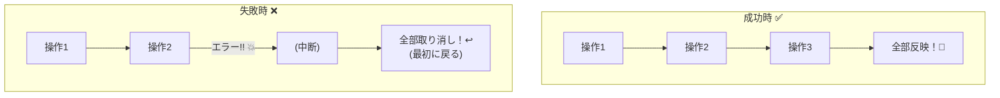
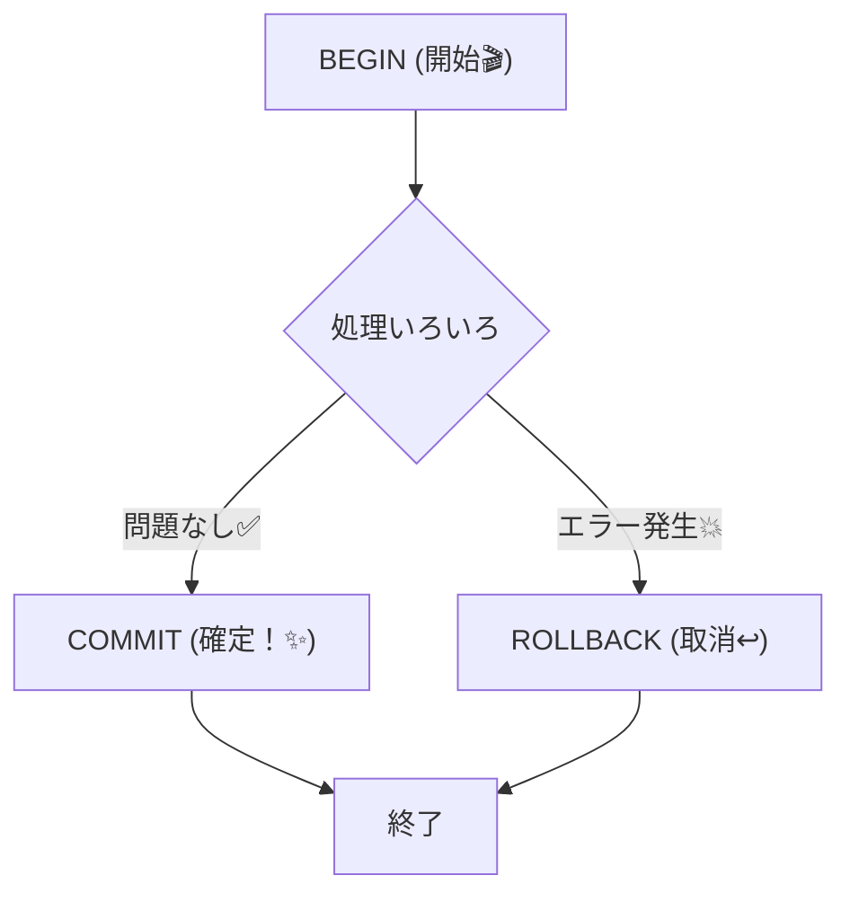

# 第13章：トランザクション境界 超入門（1回で整合する範囲）🧪📦

## この章でできるようになること🎯✨

* 「トランザクション境界」って何かを、**“全部成功 or 全部なかったこと”**の感覚で説明できる😊
* ミニEC（注文🛒・在庫📦・支払い💳）で、**成功/失敗シナリオ**を書ける✍️
* TypeScriptで、**失敗したら全部戻る**をミニ実装で体験できる🧪🔥

---

## 13.1 トランザクション境界ってなに？🧱⚛️


トランザクション境界は一言でいうと…

**「ここからここまでを“ひとまとまり”として、成功なら全部反映✅／失敗なら全部取り消し↩️ する範囲」**だよ〜！😊✨



---
たとえば、注文確定でこんな更新が起きるよね👇

* 注文を作る（ordersにINSERT）🧾
* 注文明細を入れる（order_itemsにINSERT）🧺
* 在庫を減らす（stockをUPDATE）📦⬇️

この3つのうち **1つでも失敗したら**、中途半端に保存されると事故る😱💥
だから「この3つは同じ運命（まとめて成功/失敗）にしようね」って決めるのが境界の話！

---

## 13.2 ミニECで「事故る世界」と「守られた世界」🌍🧯

### 事故る世界（トランザクション境界がない）😱


* 注文は作れた✅
* でも在庫更新でエラー💥
* 結果：**注文だけ残る**（在庫は減ってない/明細が欠けてる など）🧟‍♀️

これ、後から見た人が混乱するやつ〜！
「注文あるのに明細ないんだけど？」「出荷できないんだけど？」みたいな…😇

### 守られた世界（境界がある）🛡️✨


* 途中で失敗したら **全部ロールバック↩️**
* 「注文も明細も在庫も、最初から無かったこと」になる
* データが常に“筋が通る”✅

SQLiteも「トランザクション＝ACID（原子性など）を満たす」ことを前提に説明してるよ。([sqlite.org][1])

---

## 13.3 ACIDを“肌感覚”で覚える🧪（特にAが超大事！）⚛️


ACIDはよく出るけど、まずはこのノリでOKだよ😊✨

* **A（Atomicity / 原子性）⚛️**
  → **全部成功 or 全部失敗**（“途中だけ成功”は禁止🚫）
* **C（Consistency / 一貫性）✅**
  → ルール（制約）を壊さない（例：在庫はマイナス不可）
* **I（Isolation / 分離）🚧**
  → 同時実行でも変な見え方にならない（ここは後の章で深掘りするよ）
* **D（Durability / 永続性）💾**
  → コミットしたら落ちても残る

SQLiteは「Atomic / Consistent / Isolated / Durable」を満たす説明を公式でしてるよ。([sqlite.org][1])

---

## 13.4 DBのトランザクションはこの3つで覚える🔁


SQLの基本はこれ👇

* `BEGIN`：トランザクション開始🎬
* `COMMIT`：成功！確定！✅
* `ROLLBACK`：失敗…取り消し↩️

SQLiteの公式ドキュメントでも、トランザクション文（BEGINなど）をまとめて説明してるよ。([sqlite.org][2])



---

## 13.5 まずは文章で「成功/失敗」を書いてみよ✍️🧠

ここ、めちゃ大事！いきなりコードより先に **“何を同じ運命にするか”**を言葉にするよ😊✨

### お題：注文確定（placeOrder）🛒

次の2パターンを書いてみて👇（短くてOK！）

#### ✅ 成功シナリオ

* 在庫が足りてる📦
* 注文と明細を保存🧾
* 在庫を減らす📉
* 注文ステータスをCONFIRMEDにする✅

#### ❌ 失敗シナリオ（例：在庫不足）

* 注文を作りかけた🧾
* でも在庫が足りない😵
* → **注文も明細も在庫減少も、全部なかったこと**↩️✨

---

## 13.6 AIで Given-When-Then に整形しよ🤖🧁

文章をテストっぽくすると、境界がクリアになるよ〜！😊

AIにこうお願いしてみて👇

```text
次の日本語シナリオを Given-When-Then 形式にして。
「Given」は前提、「When」は操作、「Then」は期待結果。
失敗シナリオは「Then」に“ロールバックされる（部分反映がない）”も必ず入れて。

--- シナリオ ---
（ここに自分の文章を貼る）
```

できあがった Given-When-Then は、後の章のテストにもそのまま使えるよ🧪✨

---

## 13.7 ハンズオン：失敗したら全部戻る、をTypeScriptで体験🧪🔥


今回は “体験” が目的だから、SQLiteを超小さく使うよ😊
（SQLiteがACIDなトランザクションを提供するのは公式に説明されてるよ。([sqlite.org][1])）

### 使うライブラリ：better-sqlite3📦

* Node.js v14.21.1以降が必要
* LTS向けに prebuilt がある（つまり入れやすいことが多い）
* ES Modulesのimport例もREADMEに載ってるよ([GitHub][3])

> Node.jsはLTSを選ぶと安定しやすいよ。2026-01-27時点のLTSラインは v24 系で案内されてるよ。([Node.js][4])

### インストール📥

```powershell
npm i better-sqlite3
npm i -D @types/better-sqlite3
```

### サンプル：`src/tx-demo.ts` 🧪

このコードのポイントは「**例外が投げられたら、全部なかったこと**」って体験することだよ😊✨
（`CHECK(qty >= 0)` みたいな制約で “おかしな状態” も防げる！✅）

```ts
import Database from "better-sqlite3";

type Line = { sku: string; qty: number };

const db = new Database("tx-demo.db");

// WALはパフォーマンス理由で推奨されることが多いよ（READMEでも触れてる）🧠
db.pragma("journal_mode = WAL");

db.exec(`
  PRAGMA foreign_keys = ON;

  CREATE TABLE IF NOT EXISTS stock (
    sku TEXT PRIMARY KEY,
    qty INTEGER NOT NULL CHECK(qty >= 0)
  );

  CREATE TABLE IF NOT EXISTS orders (
    id TEXT PRIMARY KEY,
    status TEXT NOT NULL
  );

  CREATE TABLE IF NOT EXISTS order_items (
    order_id TEXT NOT NULL,
    sku TEXT NOT NULL,
    qty INTEGER NOT NULL CHECK(qty > 0),
    PRIMARY KEY (order_id, sku),
    FOREIGN KEY(order_id) REFERENCES orders(id) ON DELETE CASCADE
  );
`);

db.prepare("INSERT OR IGNORE INTO stock(sku, qty) VALUES (?, ?)").run("APPLE", 3);

const placeOrder = db.transaction((orderId: string, lines: Line[]) => {
  db.prepare("INSERT INTO orders(id, status) VALUES (?, ?)").run(orderId, "CREATED");

  const getStock = db.prepare("SELECT qty FROM stock WHERE sku = ?");
  const decStock = db.prepare("UPDATE stock SET qty = qty - ? WHERE sku = ?");
  const insertItem = db.prepare(
    "INSERT INTO order_items(order_id, sku, qty) VALUES (?, ?, ?)"
  );

  for (const line of lines) {
    const row = getStock.get(line.sku) as { qty: number } | undefined;

    if (!row) throw new Error(`unknown sku: ${line.sku}`);
    if (row.qty < line.qty) throw new Error(`out of stock: ${line.sku} (${row.qty} < ${line.qty})`);

    decStock.run(line.qty, line.sku);
    insertItem.run(orderId, line.sku, line.qty);
  }

  db.prepare("UPDATE orders SET status = ? WHERE id = ?").run("CONFIRMED", orderId);
});

function dump() {
  const stock = db.prepare("SELECT * FROM stock").all();
  const orders = db.prepare("SELECT * FROM orders ORDER BY id").all();
  const items = db.prepare("SELECT * FROM order_items ORDER BY order_id, sku").all();

  console.log("stock:", stock);
  console.log("orders:", orders);
  console.log("items:", items);
  console.log("----");
}

console.log("✅ success order");
placeOrder("O-1", [{ sku: "APPLE", qty: 2 }]);
dump();

console.log("❌ failed order (should rollback)");
try {
  placeOrder("O-2", [{ sku: "APPLE", qty: 10 }]); // 在庫不足で例外
} catch (e) {
  console.log("error:", (e as Error).message);
}
dump();
```

### 期待する観察ポイント👀✨

* ✅ `O-1` は **orders と items が増えて**、stock が減る
* ❌ `O-2` は **例外が出るけど**、orders に `O-2` が残らない（＝中途半端反映がない）
* stock も `O-2` のせいでは減ってない

これが「トランザクション境界」の体験だよ〜！🧪⚛️

> ちなみに `better-sqlite3` のREADMEには、インストール要件やESM import例、WAL pragma の話が載ってるよ。([GitHub][3])

---

## 13.8 よくある勘違いトップ3😇⚠️

### ① 「try/catchすればトランザクションみたいなもんでしょ？」🙅‍♀️


try/catch は “エラー処理” であって、**DBの更新を巻き戻す力**はないよ〜！
巻き戻しは **BEGIN/ROLLBACK の世界**。([sqlite.org][2])

### ② 「外部API呼び出しも同じトランザクションで包めば完璧！」🙅‍♀️

外部APIはDBと違って **ロールバックできない**ことが多いよ😵
だから「境界をどう設計するか」が後の章で超大事になる（ここは伏線💣✨）

### ③ 「境界がデカいほど安全！」🙅‍♀️

デカすぎるとロック/待ち/衝突が増えがち😱
まずは **必要最小**で考えるのがコツだよ🧠✨

---

## 13.9 ミニまとめ🧁✨

* トランザクション境界＝**まとめて成功/失敗にする範囲**🧱⚛️
* DBでは `BEGIN / COMMIT / ROLLBACK` が基本🔁([sqlite.org][2])
* SQLiteはACIDなトランザクションを提供する前提で説明されてる✅([sqlite.org][1])
* 小さい実装でも「失敗したら全部戻る」を体験すると一気に腑に落ちる🧪🔥

---

## 章末チェック✅📝（3問だけ！）

1. トランザクション境界を一言でいうと？🧱
2. 注文作成・明細作成・在庫減少のうち1つ失敗したら、何が起きるべき？↩️
3. `ROLLBACK` は何をする？🔁([sqlite.org][2])

[1]: https://www.sqlite.org/transactional.html?utm_source=chatgpt.com "SQLite Is Transactional"
[2]: https://www.sqlite.org/lang_transaction.html?utm_source=chatgpt.com "Transaction"
[3]: https://github.com/WiseLibs/better-sqlite3 "GitHub - WiseLibs/better-sqlite3: The fastest and simplest library for SQLite3 in Node.js."
[4]: https://nodejs.org/en/about/previous-releases "Node.js — Node.js Releases"
