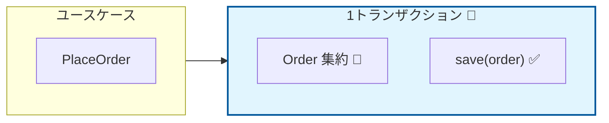
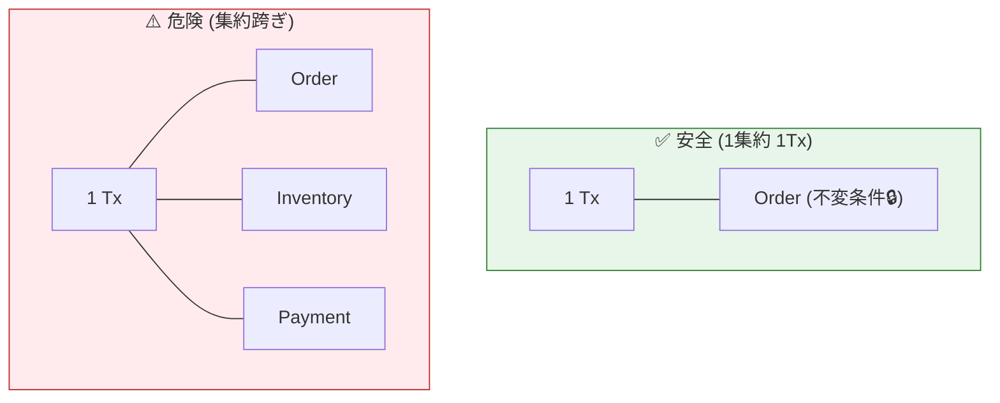

# 第14章：集約とトランザクションの関係（基本ルール）🧠🧱

## 🎯 この章でできるようになること

* 「集約＝不変条件を守る単位」「トランザクション＝成功/失敗をまとめる単位」をセットで理解できる😊
* **基本ルール：1集約＝1トランザクション**が、なぜ強いのか説明できる💪
* ミニEC（注文🛒）で「1回の更新に含める操作」を自分で決められる✅
* 集約をまたぐ更新が出たときに「危険サイン」を見つけられる⚠️👀

---

## 🧠 まず1分で整理：集約とトランザクションって何？⏱️✨

### 🧺 集約（Aggregate）

* ざっくり言うと、**「このルール（不変条件🔒）は絶対壊さない！」を守るための“まとまり”**
* 外から触れる入口は **集約ルート（Aggregate Root）🚪👑** だけ

### 🧪 トランザクション

* **「全部成功したら確定✅／途中で失敗したら全部なかったことにする↩️」** のまとまり
* “途中で半分だけ反映”が一番事故るので、それを防ぐ仕組み🧯

---

## 🧱 基本ルール：**1集約＝1トランザクション**（まずはこれだけ覚える）🔁✅


> つまり「1ユースケースの中でも、更新の“確定”は集約ごとに分ける」のが安全✨



---

## 🤔 なんで「1集約＝1トランザクション」が強いの？（理由5つ）💡

1. **不変条件が守りやすい🔒**
   集約は“不変条件の最後の砦”🏰
   1つのトランザクション内で集約を完結させると、ルール違反が入りにくい✅

2. **ロックや競合が減る🔁💥→🙂**
   複数集約を同時に更新すると、どこかが詰まりやすい（待ちやすい）😵
   1集約なら「混みやすい範囲」が小さくなる✨

3. **テストがラク🧪**
   「この集約をこう操作したらこうなる」が単体で確認できる✅
   集約またぎが多いほど、テスト準備が地獄化しがち😇

4. **責務がブレにくい🧭**
   「注文のルールは注文の集約」
   「在庫のルールは在庫の集約」
   …みたいに整理しやすい📦

5. **“分ける設計”の逃げ道が使える🚪**
   どうしても跨ぐときは、後の章で出てくる
   ドメインイベント📣 / Outbox📮 / Saga🧵 みたいな“安全な跨ぎ方”ができる✨

---

## 🛒 ミニECで見る：「1集約＝1トランザクション」だと何が嬉しい？😊

ここでは（例）注文🛒を **Order集約** として考えるよ✨

### ✅ 1集約（Order）だけで完結する更新（安全！）🟢

* 注文に商品を追加する（addItem）🧺
* 数量を変更する（changeQuantity）🔁
* 注文の合計金額を再計算する（recalculateTotal）🧮
* 注文の状態遷移（例：Draft→Submitted）🚦

だから **1トランザクションで確定**しやすい✅



### ⚠️ 集約をまたぐ更新（危険が増える）🟠

* 注文確定と同時に「在庫引当📦」も更新したい
* 注文確定と同時に「決済状態💳」も更新したい

👉 ここで無理に1トランザクションで全部やると、
「途中で片方だけ成功😱」とか「同時実行で競合💥」が増える

---

## 🧪 ハンズオン：Order集約で「1回の更新」に入れる操作を決めよう✍️✨

### ① まず “更新の粒度” を決めるルール（超シンプル版）🧠

* **同じ不変条件セットを守るなら、同じトランザクションに入れてOK✅**
* **別の集約の不変条件が関わるなら、基本は分ける⚠️**

### ② 操作を仕分けする表を作る📋

次の表をノートかMarkdownで作って埋めてみてね😊

| 操作                  | 触る集約      | 1回で確定？ | 理由（不変条件はどれ？） |
| ------------------- | --------- | ------ | ------------ |
| 商品追加 addItem        | Order     | ✅      | 合計/明細の整合だけ   |
| 注文確定 submit         | Order     | ✅      | 状態遷移ルール      |
| 在庫引当 reserveStock   | Inventory | ❌（別Tx） | 在庫の不変条件が別    |
| 決済確定 capturePayment | Payment   | ❌（別Tx） | 決済の不変条件が別    |

※ “別Tx”＝別トランザクションの意味だよ🧪

---

## 💻 TypeScript例：1集約を1トランザクションで確定する形🧱✅

ポイントはこれだけ😊

* ユースケースは **「取得→変更→保存」**
* 変更は **集約メソッド** でやる（外から直接いじらない）👑
* 保存は **最後に1回**（ここがトランザクション境界っぽい場所）🧪

```ts
// domain/order/Order.ts
export type OrderId = string;

export type OrderStatus = "Draft" | "Submitted";

export type OrderItem = {
  sku: string;
  quantity: number;
  unitPrice: number;
};

export class Order {
  private status: OrderStatus = "Draft";
  private items: OrderItem[] = [];

  constructor(public readonly id: OrderId) {}

  addItem(item: OrderItem) {
    if (this.status !== "Draft") throw new Error("Draft以外は追加できないよ🙅‍♀️");
    if (item.quantity <= 0) throw new Error("数量は1以上だよ🔢");
    if (item.unitPrice < 0) throw new Error("価格はマイナス不可💰");

    const existing = this.items.find(x => x.sku === item.sku);
    if (existing) {
      existing.quantity += item.quantity;
    } else {
      this.items.push({ ...item });
    }
  }

  submit() {
    if (this.status !== "Draft") throw new Error("二重submitはダメ🙅‍♀️");
    if (this.items.length === 0) throw new Error("空の注文は確定できない🛒");
    this.status = "Submitted";
  }

  getSnapshot() {
    return {
      id: this.id,
      status: this.status,
      items: this.items.map(x => ({ ...x })),
      total: this.items.reduce((sum, x) => sum + x.quantity * x.unitPrice, 0),
    };
  }
}
```

```ts
// application/PlaceOrder.ts
import { Order } from "../domain/order/Order";

export interface OrderRepository {
  findById(id: string): Promise<Order | null>;
  save(order: Order): Promise<void>;
}

// ここでは「トランザクションっぽい枠」をインターフェースで表現しておく✨
export interface TransactionRunner {
  run<T>(fn: () => Promise<T>): Promise<T>;
}

export class PlaceOrder {
  constructor(
    private readonly tx: TransactionRunner,
    private readonly orders: OrderRepository
  ) {}

  async execute(input: { orderId: string; sku: string; quantity: number; unitPrice: number }) {
    return this.tx.run(async () => {
      const order = (await this.orders.findById(input.orderId)) ?? new Order(input.orderId);

      order.addItem({
        sku: input.sku,
        quantity: input.quantity,
        unitPrice: input.unitPrice,
      });

      order.submit();

      await this.orders.save(order);
      return order.getSnapshot();
    });
  }
}
```

✅ この形の“気持ちよさ”

* **Orderだけ触って、最後にsaveで確定**できる
* 「途中で失敗したら↩️」が作りやすい（実DBでも同じ考え方でOK）

---

## ⚠️ ダメな例：集約またぎを“ついで”でやると壊れやすい😱🧨

例えばユースケースがこうなりがち👇

* Order更新
* ついでにInventory更新
* ついでにPayment更新

これを「全部同じトランザクションでやる」と…

* 依存が増えて、失敗パターンが爆増💥
* どれかが遅いと全部巻き添えで遅くなる🐢
* テスト準備が増えて、直すのが怖くなる😇

---

## ✅ じゃあ跨ぐ必要が出たらどうするの？（今日の結論）🧩✨

ここは“全部を今やらない”でOK😊
ただし、判断の軸だけ持って帰ろう🛍️

### 🟢 強い一貫性が本当に必要？

* **「絶対に同時じゃないとダメ」** な不変条件がある？🔒

  * 例：「在庫が1個しかない商品を、同時に2人が買ったら絶対ダメ」
* その場合でも、まずは

  * 「境界を見直す（集約の切り方を変える）」
  * 「在庫側を“単一の集約”として守る」
    みたいな設計で解けないか考える🧠

### 🟡 同時じゃなくてもOKなら（最終的整合性⏳）

* OrderはOrderで確定✅（1Tx）
* 在庫引当は在庫側で確定✅（別Tx）
* つなぎは **イベント📣**（後の章で本格的にやるよ✨）

---

## 🤖 AI活用（Copilot / Codex向け）プロンプト例🪄

* 「このユースケースが触っている集約を列挙して、1集約1Txの原則に反している箇所を指摘して」🔎
* 「Order集約の不変条件になりそうなルールを10個出して、トランザクションに入れる操作を整理して」🧠
* 「“注文確定”を、Order更新（同期）＋在庫引当（非同期）に分ける設計案を3つ出して。メリデメも」📣📦

---

## ✅ まとめ（チェックリスト）🧾✨

* ✅ 集約は「不変条件🔒を守る単位」
* ✅ トランザクションは「成功/失敗をまとめる単位🧪」
* ✅ **基本は 1集約＝1トランザクション**（守りやすい・速い・テストしやすい）
* ⚠️ 集約をまたぐ更新は、まず「本当に同時でないとダメ？」を疑う🧐
* 🧩 跨ぐなら、後の章のイベント/Outbox/Sagaが“安全な逃げ道”になる

---

## 📌 最新メモ（2026年1月時点の周辺事情）🗓️✨

* TypeScript は **5.9 が 2025-08-01 にリリース**され、5.9系のリリースノートが公開されているよ📘 ([Microsoft for Developers][1])
* Node.js は **v24 が Active LTS（Krypton）**としてスケジュールが公開されているよ🟩 ([nodejs.org][2])

[1]: https://devblogs.microsoft.com/typescript/announcing-typescript-5-9/?utm_source=chatgpt.com "Announcing TypeScript 5.9"
[2]: https://nodejs.org/en/about/previous-releases?utm_source=chatgpt.com "Node.js Releases"
