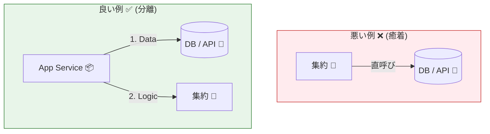
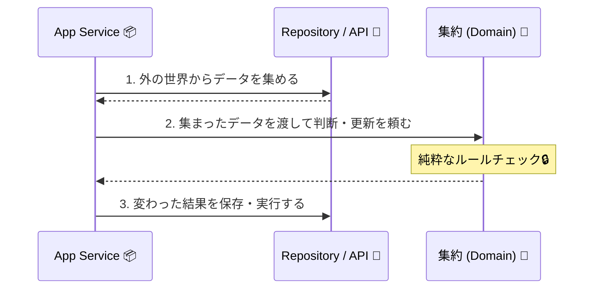

# 第15章：集約に入れていいもの／ダメなもの（I/O分離）🚫🔌

## 15.1 まず結論：集約は「純粋にドメインのルール担当」🧠✨

集約（Aggregate）は **不変条件（壊れちゃダメなルール）を守るための“砦”** でしたよね🔒🏰
だから集約の中身は、できるだけ **「決める」「計算する」「状態を遷移させる」** みたいな “思考系” に寄せます🧩

逆に、集約の中に **DBアクセス・HTTP・ファイル・現在時刻取得** みたいな **I/O（外の世界との通信）** を入れると、急にややこしくなります😵‍💫💥
「ドメインをインフラ都合から守る」考え方として、ビジネスロジック（内側）をDBや外部API（外側）から切り離すのが定石です🧱➡️ ([AWS ドキュメント][1])

---

## 15.2 なんで集約にI/Oを入れちゃダメなの？（事故るポイント）😱🧨

### ❌ 理由1：テストが地獄になる🧪💔



### ❌ 理由1：テストが地獄になる🧪💔

集約がDBやHTTPを呼ぶと、ユニットテストが **「ネットワーク・DB・時刻」** に振り回されます🌪️
本当は集約のテストって「入力→判定→状態変化」をサクッと見たいだけなのにね…🥲

### ❌ 理由2：集約が“汚れた依存”で太る🐷📦

集約が `fetch()` や DB クエリを知った瞬間、
「ドメインの中心」だったはずが「なんでも屋」になって肥大化します🍔🍟

### ❌ 理由3：トランザクション境界がぐちゃる🧯

集約の中で外部I/Oを始めると、
「失敗したら全部戻す」みたいな整理が難しくなります（外部APIは戻せないこと多い😇）

### ❌ 理由4：依存の向きが逆になる🧭💥

クリーンアーキテクチャ／ヘキサゴナルの基本は
**「内側（ドメイン）は外側（DB/フレームワーク）を知らない」** です🧱
特にヘキサゴナルは、DBや外部APIなどのインフラコードからドメインロジックを隔離するのが目的だよ〜って説明されます📌 ([AWS ドキュメント][1])

---

## 15.3 ここ超重要！「集約に入れてOK / ダメ」早見表📋✨

| たぶんやりたいこと            | 集約の中に入れてOK？ | 置き場所のおすすめ            | 理由           |
| -------------------- | ----------: | -------------------- | ------------ |
| 合計金額計算🧮             |        ✅ OK | 集約（Entity/VO）        | 純粋計算で安全      |
| 状態遷移（Created→Paid）🔁 |        ✅ OK | 集約                   | 不変条件の中心      |
| 不変条件チェック🔒           |        ✅ OK | 集約                   | “最後の砦”       |
| 乱数生成🎲               |     ⚠️ 基本NG | アプリ層で作って渡す / Port化   | テスト再現性が死ぬ    |
| 現在時刻取得🕒             |     ⚠️ 基本NG | Clock（Port）/ アプリ層で渡す | テストが不安定に     |
| DB保存/取得🗄️           |        ❌ NG | Repository（アプリ層から呼ぶ） | 依存逆転＆肥大化     |
| 外部API呼び出し🌐          |        ❌ NG | アプリ層 or Adapter      | 失敗・再試行・補償が必要 |
| ファイル操作📁             |        ❌ NG | Adapter              | 環境依存が強い      |
| ログ出力🧾               |     ⚠️ 原則NG | アプリ層（または横断）          | I/Oであり副作用    |

ポイントはこれ👇
**集約＝ドメインのルールを決める場所**
**I/O＝外の世界との“やりとり”は外でやる** 🚪✨ ([AWS ドキュメント][1])

---

## 15.4 ありがちなアンチパターン（悪い例）😇💣

ミニEC題材：注文（Order）集約が「在庫をDBで見に行ってから」注文確定しちゃう例👇

```ts
// ❌ 悪い例：集約がI/O（Repository）を直に触ってる
class Order {
  private status: "Draft" | "Placed" = "Draft";

  place(repo: StockRepository) { // ← 集約がRepository依存しちゃった！
    const ok = repo.hasEnoughStock(/* ... */); // ← DBに行くかもしれない
    if (!ok) throw new Error("在庫不足");

    this.status = "Placed";
    repo.reserve(/* ... */); // ← さらにI/O！
  }
}

interface StockRepository {
  hasEnoughStock(...args: any[]): boolean;
  reserve(...args: any[]): void;
}
```

これ、ぱっと見「便利」なんだけど…

* テストでRepositoryモックが必須🧸
* `place()` の責務が「判断＋I/O」になって膨張🐷
* 失敗時の整合性が地獄😱
  って感じで、じわじわ壊れます🧨

---

### ✅ 正しい形（王道）：アプリケーションサービスがI/Oして、集約は判断だけ👑



---
```ts
// ✅ 集約は「判断と状態遷移」だけ
class Order {
  private status: "Draft" | "Placed" = "Draft";

  place(canReserve: boolean) {
    if (this.status !== "Draft") throw new Error("状態が不正");
    if (!canReserve) throw new Error("在庫不足");
    this.status = "Placed";
  }
}

// ✅ I/Oはアプリケーションサービス側でやる
class PlaceOrderService {
  constructor(private stockRepo: StockRepository, private orderRepo: OrderRepository) {}

  async execute(orderId: string) {
    const order = await this.orderRepo.findById(orderId);

    const canReserve = await this.stockRepo.hasEnoughStock(/* orderの内容 */);
    order.place(canReserve); // ← 集約は判断だけ！

    await this.orderRepo.save(order);
    if (canReserve) await this.stockRepo.reserve(/* ... */);
  }
}

interface StockRepository {
  hasEnoughStock(...args: any[]): Promise<boolean>;
  reserve(...args: any[]): Promise<void>;
}

interface OrderRepository {
  findById(id: string): Promise<Order>;
  save(order: Order): Promise<void>;
}
```

この形にすると、集約テストが超ラクになります🧪✨
`order.place(true)` / `order.place(false)` で確認できるからね💕

---

## 15.6 「でも現在時刻が必要なんだけど？」の扱い🕒🧠

たとえば「注文は30分以内に支払いしないと期限切れ」みたいなルール、時刻が欲しいよね⏳

### ❌ 集約の中で `new Date()` しちゃうと…

* テストが不安定（実行した瞬間で結果が変わる）😵‍💫
* “今”に依存して再現不能になる💔

### ✅ よくある解決：Clock（ポート）か、時刻を引数で渡す⌚✨

**① 引数で渡す（いちばん簡単）**

```ts
class Order {
  expireIfNeeded(now: Date) {
    // nowを基準に期限切れ判定する
  }
}
```

**② Port（インターフェース）で抽象化する**（ヘキサゴナルの発想）

```ts
interface Clock {
  now(): Date;
}

class Order {
  expireIfNeeded(clock: Clock) {
    const now = clock.now();
    // 期限切れ判定…
  }
}
```

ヘキサゴナルは、外部とのI/Oをアダプタ側に寄せて、ドメインを独立させるのが狙いです🧱✨ ([AWS ドキュメント][1])

---

## 15.7 ドメインイベントで「副作用を外に追い出す」📣📮（ちょい先取り）

集約の中では「支払い完了した！」みたいな **事実（イベント）** を記録するだけにして、
メール送信📧や外部決済照会💳みたいな副作用は外でやるのがキレイです✨

（この考え方は後半章で本格的にやるよ〜！📚）

---

## 15.8 すぐできる！ミニ演習✍️🧪

### 演習A：I/O追い出しリファクタリング🏃‍♀️💨

次の要素が「集約の中」にいたら、外へ追い出してね👇

* DB取得
* HTTP呼び出し
* 現在時刻取得
* 乱数生成

**目標**：集約メソッドが「引数→チェック→状態変更」だけになること✅✨

### 演習B：ユニットテストを書いて“勝ち”を体験🧪🏆

```ts
import { describe, it, expect } from "vitest";

describe("Order.place", () => {
  it("在庫OKならPlacedになる", () => {
    const order = new Order();
    order.place(true);
    expect(order.getStatus()).toBe("Placed");
  });

  it("在庫NGならエラー", () => {
    const order = new Order();
    expect(() => order.place(false)).toThrow("在庫不足");
  });
});
```

こういうテストがスルスル書けたら、I/O分離できてるサインだよ〜💖✨

---

## 15.9 「集約に入れてOK？」クイズ🎮✨（○×で答えてね）

1. 集約メソッドの中で `fetch()` を呼ぶ 🌐
2. 集約メソッドは `canReserve: boolean` を引数に受け取って判定する ✅
3. 集約の中で `new Date()` を呼んで期限判定する 🕒
4. 集約の中で「OrderPaid」というイベントを配列に積む 📣
5. 集約の中でSQL文字列を組み立てる 🗄️

答え👇

1. ❌　2) ✅　3) ❌（工夫すればOK寄りにできる）　4) ✅　5) ❌

---

## 15.10 AI活用🤖✨（この章での使いどころ）

* 「この処理はI/O？それとも純粋ロジック？」判定クイズを作ってもらう🎮
* 既存コードを貼って「集約がI/Oしてる箇所を指摘して、分離案を3つ出して」って頼む🧠
* テストケースの抜け（境界値・状態遷移）を列挙させる🧪💪

---

## 15.11 まとめ：集約は“ルール担当”、I/Oは“外の世界担当”🧱✨

* 集約は **不変条件と状態遷移** に集中🔒🔁
* I/O（DB/HTTP/ファイル/時刻/乱数）は基本 **集約の外へ** 🚫🔌
* ヘキサゴナル／クリーンの考え方で、ドメインを外部から守る🛡️ ([AWS ドキュメント][1])

### 最終チェックリスト✅

* [ ] 集約メソッドは「引数→判定→状態変更」になってる？
* [ ] `fetch()` / DB / ファイル / 時刻取得が集約の中にない？
* [ ] 集約のユニットテストが “簡単に” 書ける？🧪✨

[1]: https://docs.aws.amazon.com/prescriptive-guidance/latest/cloud-design-patterns/hexagonal-architecture.html?utm_source=chatgpt.com "Hexagonal architecture pattern - AWS Prescriptive Guidance"
