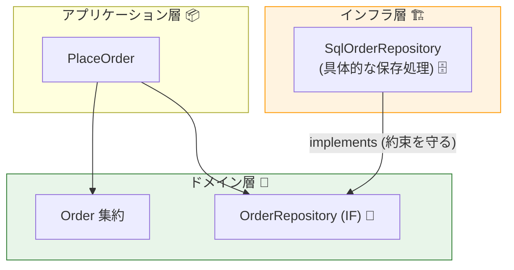
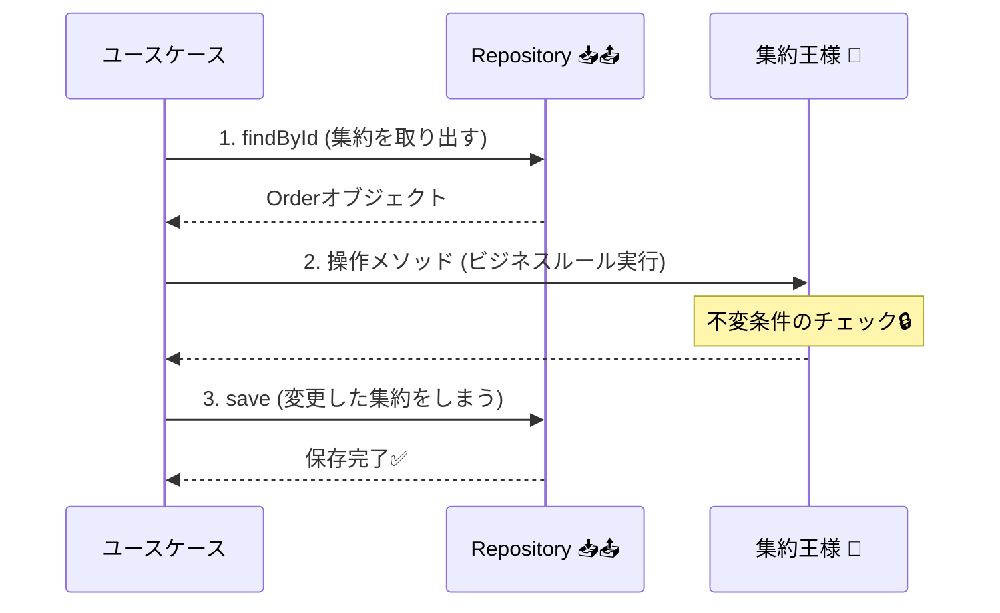

# 第16章：Repository入門（集約の出し入れ係）📥📤

## この章でできるようになること🎯✨

* Repositoryが「何を守るための仕組み」か説明できる🧠💡
* 集約（Aggregate）を **保存/取得** するための `OrderRepository` インターフェースを定義できる🧾✅
* DBがなくても（＝テストやインメモリでも）同じユースケースが動く設計にできる🧪🚀

> この章のコードは **TypeScript 5.9** 相当の最新仕様を想定してOKだよ🧡 ([typescriptlang.org][1])
> ランタイムは安定運用しやすい **Node.js v24 (Active LTS)** が無難（例：24.13.0 はセキュリティリリース）🔐 ([Node.js][2])

---

## 1. Repositoryってなに？🍱📦（ひとことで）


Repositoryは、**集約を「出し入れ」するための窓口**だよ📥📤
イメージは「倉庫の受付」みたいな感じ🏬✨

* アプリ側：「注文（Order）ちょうだい！」「注文（Order）しまって！」
* Repository側：「OK！保存/取得やっておくね！（DBとかの事情はこっちで面倒みる）」

ここが超大事👇
Repositoryは、**ドメイン（集約）にDBの存在を知らせない**ための仕組み🧼🫧

---

## 2. Repositoryが嬉しい理由💖（初心者がハマりやすい所を先に回避）

### 2.1 ドメインが“汚れない”🧼✨


もしドメインモデルがDBの型やSQLを知ってると…

* `Order` の中に `SELECT ...` とか出てきて地獄😇🔥
* テストが「DB必須」になって遅い・壊れる・だるい😵‍💫🧨
* 変更（DB移行、ORM変更）に弱くなる🫠

Repositoryを挟むと…

* `Order` は純粋に「注文のルール」だけに集中できる👑🔒
* 保存先がDBでもAPIでもファイルでも、後で差し替えられる🔁✨
* テストでインメモリに差し替えやすい🧪🧸

この「依存の向き」を守るのがポイントだよ🧭✨

---

## 3. 置き場所（フォルダ）と依存の向き🧱➡️


Repositoryは「インターフェース（約束）」と「実装（現実）」に分けるよ✂️✨

* **インターフェース**：domain（または application の port）側
* **実装**：infrastructure 側（DB・HTTP・ファイルなど現実の世界）

図にするとこんな感じ👇

```text
application  ─────→  domain
   │                （集約・ルール）
   │
   └────→  domain の Repository interface（約束）🧾

infrastructure  ──implements──→  domain の Repository interface（約束）🛠️
（DB/ORM/HTTPなど）
```

「ドメインがインフラに依存しない」＝勝ち🏆✨



---

## 4. Repositoryが扱う範囲🧺（集約ルール）


Repositoryが扱うのは原則これ👇

* ✅ **集約ルート（Aggregate Root）だけ**
* ✅ 集約を「丸ごと」出し入れする感覚
* ❌ 集約の内部Entityを単体で保存/取得しない（境界が壊れやすい）💥

例：Order集約なら、Repositoryの主役は `Order` 👑
`OrderItem` 単体のRepositoryは基本作らない（まずは）🙅‍♀️

---

## 5. インターフェース設計のコツ🧩✨（迷ったらこれ）

### 5.1 メソッドは“ユースケース基準”で最小に🧠🎮


最初に持つのはだいたいこれでOK👇

* `findById(id)`：注文を取得する🔎
* `save(order)`：注文を保存する💾

いきなり `findAll()` とか `searchBy...` を増やすと、Repositoryが「なんでも屋」になって太りがち🍔😇
検索が必要になったら、後で **Query側（読み取り）** と分ける発想（CQS）も出てくるよ👀🔀（第19章につながる✨）

### 5.2 asyncにしておく（現実に強い）⏳🌍

DBアクセスは非同期になりやすいから、最初から `Promise` で定義しちゃうのが楽💡
（インメモリでも `async` にして返せばOK）

---

## 6. Hands-on：OrderRepository を定義しよう🛠️📘

### 6.1 前提の型（すでにある想定）🧱

* `OrderId`（薄い型）
* `Order`（集約ルート）

もしまだ無い場合の最小例👇（※サンプルなので必要なら合わせてね🧡）

```ts
// src/domain/order/OrderId.ts
export class OrderId {
  private constructor(private readonly value: string) {}

  static of(value: string): OrderId {
    if (!value) throw new Error("OrderId is required");
    return new OrderId(value);
  }

  toString(): string {
    return this.value;
  }
}
```

```ts
// src/domain/order/Order.ts
import { OrderId } from "./OrderId";

export class Order {
  private constructor(
    public readonly id: OrderId,
    private status: "Draft" | "Placed" = "Draft"
  ) {}

  static create(id: OrderId): Order {
    return new Order(id);
  }

  place(): void {
    if (this.status !== "Draft") throw new Error("Order is already placed");
    this.status = "Placed";
  }
}
```

### 6.2 Repositoryインターフェースを作る🧾✨

`OrderRepository` は **ドメイン側** に置くのが王道🧡

```ts
// src/domain/order/OrderRepository.ts
import { Order } from "./Order";
import { OrderId } from "./OrderId";

export interface OrderRepository {
  findById(id: OrderId): Promise<Order | null>;
  save(order: Order): Promise<void>;
}
```

これで「注文の出し入れ口」ができたよ〜！📥📤🎉

---

## 7. Repositoryの使い方（ユースケース側）🎮🧩


Repositoryは **アプリケーションサービス（ユースケース）** から使うのが基本だよ🔁✨
よくある流れはこれ👇

1. 取得する（find）🔎
2. 集約に操作させる（ルール適用）👑🔒
3. 保存する（save）💾

```ts
// src/application/PlaceOrder.ts
import { OrderId } from "../domain/order/OrderId";
import { OrderRepository } from "../domain/order/OrderRepository";

export class PlaceOrder {
  constructor(private readonly orderRepo: OrderRepository) {}

  async execute(orderIdRaw: string): Promise<void> {
    const orderId = OrderId.of(orderIdRaw);

    const order = await this.orderRepo.findById(orderId);
    if (!order) throw new Error("Order not found");

    order.place();               // ✅ ルールはドメイン（集約）が担当
    await this.orderRepo.save(order); // ✅ 保存はRepositoryが担当
  }
}
```



ここが気持ちいいポイント😳💓
ユースケースがDBを知らないのに、ちゃんと処理できる！

---

## 8. テストで差し替える（Repositoryの真価）🧪✨


インターフェースにしてると、テストで「偽物Repository」を差し込めるよ🧸💕

例：Vitestで簡単テスト（Vitestは公式ガイドが継続更新されてるよ）🧪 ([Vitest][3])

```ts
// src/application/PlaceOrder.test.ts
import { describe, it, expect } from "vitest";
import { PlaceOrder } from "./PlaceOrder";
import { Order } from "../domain/order/Order";
import { OrderId } from "../domain/order/OrderId";
import { OrderRepository } from "../domain/order/OrderRepository";

class FakeOrderRepository implements OrderRepository {
  private store = new Map<string, Order>();

  async findById(id: OrderId): Promise<Order | null> {
    return this.store.get(id.toString()) ?? null;
  }

  async save(order: Order): Promise<void> {
    this.store.set(order.id.toString(), order);
  }

  // テスト用ヘルパ（interface外なのでpublicでOK）
  seed(order: Order): void {
    this.store.set(order.id.toString(), order);
  }
}

describe("PlaceOrder", () => {
  it("注文をplaceして保存できる🛒✅", async () => {
    const repo = new FakeOrderRepository();
    const id = OrderId.of("order-1");
    repo.seed(Order.create(id));

    const usecase = new PlaceOrder(repo);
    await usecase.execute("order-1");

    const saved = await repo.findById(id);
    expect(saved).not.toBeNull();
    // ここでは内部状態を覗いてないけど、次章以降でドメインの観測方法も整えていくよ😉✨
  });

  it("存在しない注文はエラー😢", async () => {
    const repo = new FakeOrderRepository();
    const usecase = new PlaceOrder(repo);

    await expect(usecase.execute("missing")).rejects.toThrow("Order not found");
  });
});
```

テストでDBいらないの、最高〜！🎉🥳

---

## 9. AI活用（Copilot/Codex等）🤖✨

### 9.1 メソッド粒度チェック🎯

AIにこう投げると便利だよ👇

* 「OrderRepositoryに必要な最小メソッドを、ユースケース（注文確定/キャンセル/支払い）から逆算して提案して」
* 「`findById` と `save` 以外を増やすなら、増やす理由とデメリットもセットで」

### 9.2 命名の整形🪄

* 「`place` / `cancel` / `addItem` みたいに “動詞＋目的語” で命名を揃えて」
* 「Repositoryのメソッド名がDBっぽくならないように（例: `selectOrder` みたいなのNG）候補を出して」

---

## 10. よくある落とし穴集⚠️😇


* **落とし穴①：Repositoryが“検索なんでも屋”になる** 🔎🍔
  → まずは最小（`findById` / `save`）から！必要になってから増やす🧠✨

* **落とし穴②：RepositoryがDTOやDB行を返す** 📄➡️😵
  → Repositoryは基本「ドメインの `Order` を返す」ほうがスッキリ👑

* **落とし穴③：ドメインがDBの型に引っ張られる** 🧲💥
  → `Order` が `Date` とか `number` で雑に持ってると後で事故りやすい（VOで守る）🧱🔒

* **落とし穴④：同期メソッドで作って後から全部async地獄** ⏳🫠
  → 最初から `Promise` にしておくと平和🕊️✨

---

## 11. ミニ演習💪📝

### 演習A：Repositoryを増やす判断🧠

次の要求が来たとして、`OrderRepository` に追加する？しない？理由も書いてね✍️✨

1. 「注文一覧をページングで見たい」📄
2. 「注文の詳細を画面表示したい（住所・氏名・金額など）」👀
3. 「特定商品の購入回数ランキングが欲しい」🏆

ヒント💡：

* 1)〜3) は“読み取り”が強い → Query側に寄せたくなるかも👀🔀

### 演習B：`findById` の戻り値を考える🤔

`Order | null` 以外に、どんな設計があり得る？

* `Result<Order, NotFoundError>` とか、例外にするとか…🚨📦
  （第20章につながるよ✨）

---

## まとめ🎀✨

* Repositoryは **集約を出し入れする窓口** 📥📤
* 目的は **ドメインをDBから隔離して、変更とテストに強くする** 🧼🧪
* まずは `findById` と `save` の **小さな約束** から始めるのが正解🙆‍♀️💖

[1]: https://www.typescriptlang.org/docs/handbook/release-notes/typescript-5-9.html?utm_source=chatgpt.com "Documentation - TypeScript 5.9"
[2]: https://nodejs.org/en/about/previous-releases?utm_source=chatgpt.com "Node.js Releases"
[3]: https://vitest.dev/guide/?utm_source=chatgpt.com "Getting Started | Guide"
