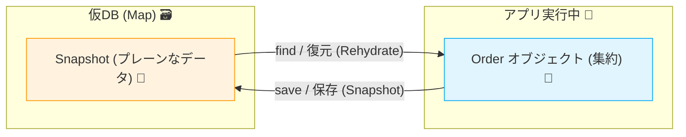

# 第17章：インメモリRepositoryでまず動かす（理解優先）🚀🧪

## この章のゴール🎯✨

* DBなしでも「集約を取り出す → 変更する → 保存する」が一通りできるようになる😊
* Repositoryが“差し替え可能”ってこういうことか！を体感する🔁✨
* ユースケース（アプリ層）を1本、ちゃんと動かしてテストまで通す🧪✅

---

## 17.1 なぜインメモリRepositoryから始めるの？🤔🧠


DBが入ると、学ぶことが一気に増えちゃうのね😵‍💫💦

* SQL、ORM、接続、マイグレーション…などなど
* それって「集約の境界」や「不変条件」を学ぶ邪魔になりがち🧱💥

そこでまずは、**Mapで保存する“仮のDB”**＝インメモリRepositoryを作るよ🗃️✨
これで「設計の形」が先に見えるようになるのが最高なんだ〜！🥳🎉

---

## 17.2 今回のミニECでやること🛒📦

この章では、注文（Order）集約を **保存できる形にする**よ😊

やることリスト✅

* `OrderRepository`（インターフェース）を用意する🧩
* `InMemoryOrderRepository`（Mapで保持）を作る🧠
* `PlaceOrder`（注文作成ユースケース）を動かす🎮
* Vitestでユースケースをテストする🧪✨（Vitestは公式ガイドに沿うよ） ([Vitest][1])

---

## 17.3 重要ポイント：インメモリでも“それっぽく”するコツ🔑✨

インメモリは便利なんだけど、雑にやると事故る😇💥
特にこれ👇

## 🚫「保存したオブジェクトをそのまま返す」問題

もしRepositoryが**同じ参照（同じオブジェクト）**を返すと…

* 取得したOrderをちょっといじっただけで、**保存してないのにDB側も変わった**ように見える
* テストが“たまたま”通って、後で本物DBに変えた時に崩壊😭

## ✅対策：Snapshot（プレーンデータ）で保管する📸


* Repository内部では **プレーンなデータ（Snapshot）**を持つ
* 取り出す時に **Orderを作り直す（rehydrate）**

これで「保存しないと反映されない」っぽい動きになるよ👏✨



---

## 17.4 実装していこう！📁💻

## 17.4.1 フォルダの置き場所（目安）🗂️


* `src/domain/order/...`（ドメイン）🧠
* `src/infrastructure/repository/...`（インフラ：インメモリ実装）🧰
* `src/application/...`（ユースケース）🎮
* `src/tests/...`（テスト）🧪

---

## 17.5 ドメイン：Order集約（超ミニ版）🧺✨

> ここでは「Repositoryの動作」を理解するのが目的なので、Orderは最小構成にしてあるよ😊
> （第6〜第16章で作ったVOたちがあるなら、そこに置き換えてOKだよ💎）

## `src/domain/order/Order.ts` 🧾


```ts
export type OrderStatus = "Draft" | "Placed";

export type OrderItemSnapshot = {
  productId: string;
  unitPriceCents: number;
  quantity: number;
};

export type OrderSnapshot = {
  id: string;
  status: OrderStatus;
  items: OrderItemSnapshot[];
};

export class Order {
  private constructor(
    private readonly _id: string,
    private _status: OrderStatus,
    private _items: OrderItemSnapshot[],
  ) {}

  // ✅ 新規作成（生成時に「無効状態」を作らない入り口）
  static create(id: string): Order {
    return new Order(id, "Draft", []);
  }

  // ✅ 永続化から復元（Repositoryが使う）
  static fromSnapshot(s: OrderSnapshot): Order {
    return new Order(s.id, s.status, [...s.items]);
  }

  // ✅ 永続化用のスナップショット
  toSnapshot(): OrderSnapshot {
    return {
      id: this._id,
      status: this._status,
      items: this._items.map((x) => ({ ...x })),
    };
  }

  get id(): string {
    return this._id;
  }

  get status(): OrderStatus {
    return this._status;
  }

  get items(): ReadonlyArray<OrderItemSnapshot> {
    return this._items;
  }

  // ✅ 集約の操作：商品を追加
  addItem(productId: string, unitPriceCents: number, quantity: number): void {
    if (quantity <= 0) throw new Error("quantity must be > 0");
    if (unitPriceCents < 0) throw new Error("unitPriceCents must be >= 0");

    this._items.push({ productId, unitPriceCents, quantity });
  }

  // ✅ 集約の操作：注文確定
  place(): void {
    if (this._items.length === 0) throw new Error("cannot place empty order");
    if (this._status !== "Draft") throw new Error("order already placed");
    this._status = "Placed";
  }

  totalCents(): number {
    return this._items.reduce((sum, x) => sum + x.unitPriceCents * x.quantity, 0);
  }
}
```

---

## 17.6 ドメイン：Repositoryインターフェース🧩📤

## `src/domain/order/OrderRepository.ts` 📦

```ts
import { Order } from "./Order";

export interface OrderRepository {
  findById(id: string): Promise<Order | null>;
  save(order: Order): Promise<void>;
}
```

---

## 17.7 インフラ：InMemoryOrderRepository（Mapで保存）🗃️✨


## `src/infrastructure/repository/InMemoryOrderRepository.ts` 🧠

```ts
import { Order } from "../../domain/order/Order";
import { OrderRepository } from "../../domain/order/OrderRepository";

export class InMemoryOrderRepository implements OrderRepository {
  // ✅ ここが「仮のDB」！OrderそのものではなくSnapshotを保存するのがコツ📸
  private store = new Map<string, ReturnType<Order["toSnapshot"]>>();

  async findById(id: string): Promise<Order | null> {
    const snapshot = this.store.get(id);
    if (!snapshot) return null;

    // ✅ 復元して返す（参照共有しない！）
    return Order.fromSnapshot(snapshot);
  }

  async save(order: Order): Promise<void> {
    // ✅ 保存するときもSnapshotにして保管（参照共有しない！）
    this.store.set(order.id, order.toSnapshot());
  }

  // 🧪 テスト用：全削除（本番IFには入れないのが普通）
  clearForTest(): void {
    this.store.clear();
  }
}
```

---

## 17.8 ユースケースを1本“動かす”🎮💨

## やりたいこと🛒

* 注文を作る
* 商品を追加する
* 注文を確定する
* 保存する
* 最後に取り出して確認する👀✨

## `src/application/PlaceOrderService.ts` 🧩


```ts
import { Order } from "../domain/order/Order";
import { OrderRepository } from "../domain/order/OrderRepository";

export type PlaceOrderInput = {
  orderId: string;
  items: Array<{
    productId: string;
    unitPriceCents: number;
    quantity: number;
  }>;
};

export class PlaceOrderService {
  constructor(private readonly orderRepo: OrderRepository) {}

  async execute(input: PlaceOrderInput): Promise<{ orderId: string; totalCents: number }> {
    const order = Order.create(input.orderId);

    for (const item of input.items) {
      order.addItem(item.productId, item.unitPriceCents, item.quantity);
    }

    order.place();
    await this.orderRepo.save(order);

    return { orderId: order.id, totalCents: order.totalCents() };
  }
}
```

---

## 17.9 手で動かしてみる（ミニ実行ファイル）▶️✨

## `src/main.ts` 🏁

```ts
import { InMemoryOrderRepository } from "./infrastructure/repository/InMemoryOrderRepository";
import { PlaceOrderService } from "./application/PlaceOrderService";

async function main() {
  const repo = new InMemoryOrderRepository();
  const service = new PlaceOrderService(repo);

  const result = await service.execute({
    orderId: "order-001",
    items: [
      { productId: "p-apple", unitPriceCents: 120, quantity: 2 },
      { productId: "p-banana", unitPriceCents: 80, quantity: 1 },
    ],
  });

  const loaded = await repo.findById(result.orderId);

  console.log("placed:", result);
  console.log("loaded status:", loaded?.status);
  console.log("loaded total:", loaded?.totalCents());
}

main().catch((e) => {
  console.error(e);
  process.exit(1);
});
```

---

## 17.10 テストを書く（Vitest）🧪✅

Vitestは **Vite系のテストフレームワーク**で、導入が軽くて動くのが早いよ💨
（公式ガイドに沿って使えるのも安心） ([Vitest][1])

## `package.json`（scriptsの例）🧰

```json
{
  "scripts": {
    "test": "vitest",
    "test:watch": "vitest --watch"
  }
}
```

## `src/tests/placeOrder.test.ts` 🧪

```ts
import { describe, it, expect, beforeEach } from "vitest";
import { InMemoryOrderRepository } from "../infrastructure/repository/InMemoryOrderRepository";
import { PlaceOrderService } from "../application/PlaceOrderService";

describe("PlaceOrderService", () => {
  const repo = new InMemoryOrderRepository();
  const service = new PlaceOrderService(repo);

  beforeEach(() => {
    repo.clearForTest();
  });

  it("注文を作成して確定し、保存して取り出せる🛒✅", async () => {
    const result = await service.execute({
      orderId: "order-001",
      items: [{ productId: "p-apple", unitPriceCents: 120, quantity: 2 }],
    });

    expect(result.totalCents).toBe(240);

    const loaded = await repo.findById("order-001");
    expect(loaded).not.toBeNull();
    expect(loaded!.status).toBe("Placed");
    expect(loaded!.totalCents()).toBe(240);
  });

  it("空の注文は確定できない🚫😇", async () => {
    await expect(
      service.execute({
        orderId: "order-002",
        items: [],
      }),
    ).rejects.toThrow("cannot place empty order");
  });
});
```

---

## 17.11 AI活用コーナー🤖✨（サクッと使えるプロンプト集）

※そのままコピペでOKだよ〜💬💕

## ① テストデータ生成を手伝ってもらう🧪🍱

* 「Orderのitems配列のテストデータを、境界値（0,1,大きい数）で5パターン作って」

## ② “参照共有バグ”を見つけてもらう👀💥

* 「InMemoryRepository実装で“参照共有”が起きるポイントを指摘して。Snapshot方式に直して」

## ③ ユースケース責務のチェック🎮🧠

* 「PlaceOrderServiceがやりすぎてない？責務を箇条書きで分解して、分けるならどう分ける？」

---

## 17.12 よくあるハマりどころ😵‍💫🧯

## ハマり①：findByIdが“保存されてない変更”まで反映しちゃう😇


* 原因：Orderオブジェクト参照をMapにそのまま保存してる
* 対策：**Snapshot保存 → 復元**（この章の方式）📸✅

## ハマり②：テストが通るのに、本物DBで壊れる😭

* 原因：インメモリが優しすぎる（トランザクション、同時更新、失敗がない）
* 対策：この先の章で **同時更新・version・冪等性** を足していくよ🛡️🔁

---

## 17.13 練習問題（5〜10分）✍️🌟

1. `findById` を `getById` に変えて、見つからない時は例外にしてみよう🚨
   　→ その結果、ユースケース側の書き方がどう変わる？🧠

2. `save` する前に `order.status === "Placed"` じゃなかったら例外にしてみよう🔒
   　→ Repositoryにルールを入れるのはアリ？ナシ？理由も書いてみよ✍️

---

## 17.14 最新動向メモ（2026年1月）📰✨

* Node.jsは **v24系がActive LTS**、最新更新日は **2026-01-12**。安定運用ならLTSが定番だよ🧘‍♀️✨ ([Node.js][2])
* Node.jsは **v25.5.0がCurrent（最新版）で、2026-01-26にリリース**されてるよ🚀 ([Node.js][3])
* TypeScriptは **5.9系（5.9.3など）が公開されている**よ📘✨ ([GitHub][4])
* Vitestは公式ガイドが継続更新されていて、導入〜実行の流れがまとまってるよ🧪✅ ([Vitest][1])

[1]: https://vitest.dev/guide/?utm_source=chatgpt.com "Getting Started | Guide"
[2]: https://nodejs.org/en/about/previous-releases?utm_source=chatgpt.com "Node.js Releases"
[3]: https://nodejs.org/en/blog/release/v25.5.0?utm_source=chatgpt.com "Node.js 25.5.0 (Current)"
[4]: https://github.com/microsoft/typescript/releases?utm_source=chatgpt.com "Releases · microsoft/TypeScript"
