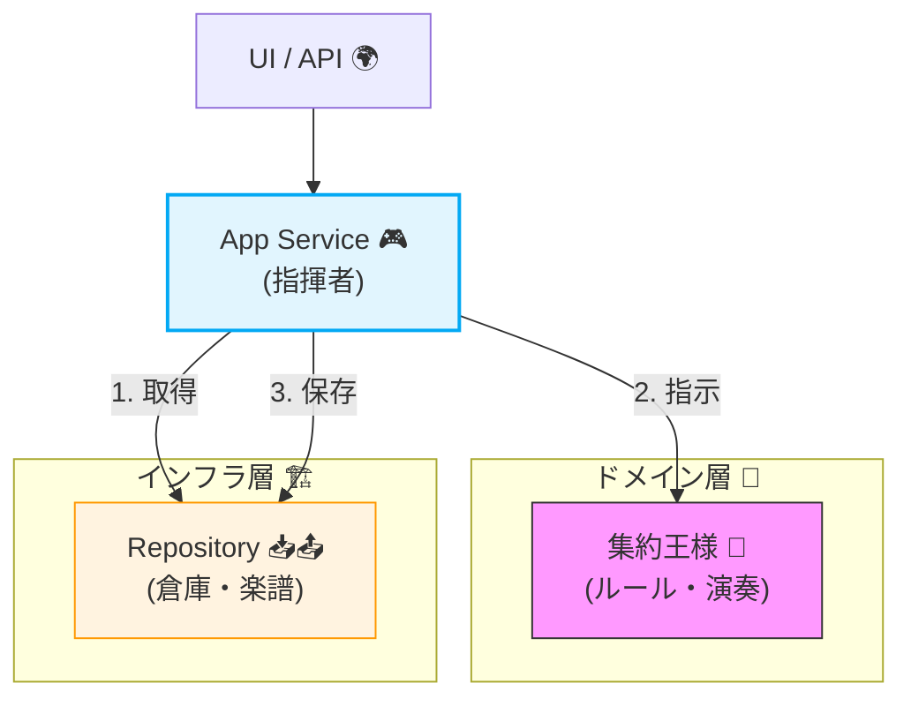
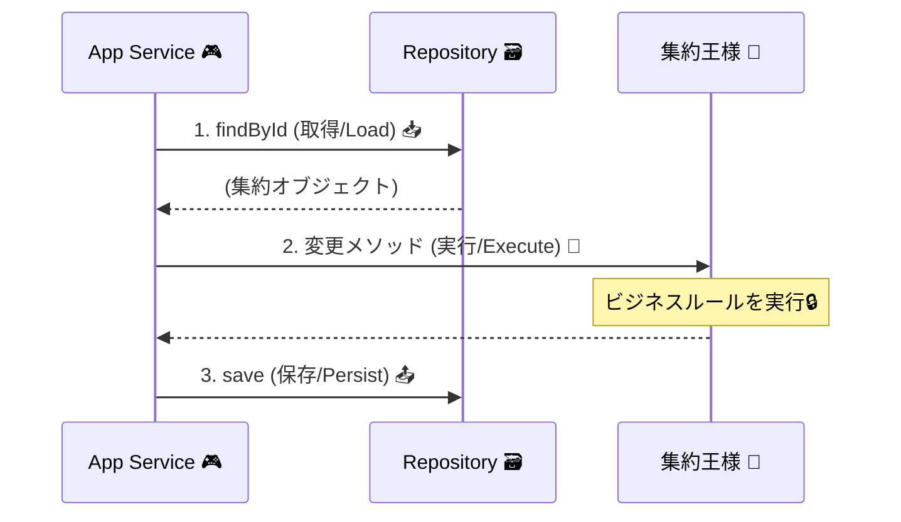

# 第18章：アプリケーションサービス（ユースケース）基礎🎮🧩

## この章でできるようになること✅✨

* 「集約をどう動かすか？」を **手順（ユースケース）** として書けるようになる🎬
* 典型の流れ **取得→変更→保存** を、迷わず型で書ける🔁🧠
* 「どこまでがドメイン？どこからがアプリ？」の境界がわかる🧱✨
* **テストしやすいユースケース** を、インメモリRepositoryでサクッと検証できる🧪💕

---

## 1. アプリケーションサービスって何？🎮




---
アプリケーションサービス（= ユースケース層）は、ざっくり言うとこう👇

* 🧩 **ドメイン（集約）を直接いじる“指揮者”**
* 📜 ビジネスルールの本体は書かない（ルールは集約が守る🔒）
* 🔁 手順を組み立てる（必要なら複数の集約/外部サービスもまとめる）
* 🧪 テストの主役になりやすい（仕様＝ユースケースだから）

### ドメイン（集約）との役割分担🧱


**ドメイン（集約）**がやること👑

* 不変条件を守る🔒（例：合計金額はマイナス不可、支払い後は明細を変更できない等）
* 状態遷移を正しくする🔁（例：Draft → Paid → Shipped）

**アプリケーションサービス**がやること🎮

* 入力を受け取る📩（Command）
* 必要な集約をロードする📦
* 集約メソッドを呼ぶ🧠（ここでルールは集約が守る）
* 保存する💾（Repository）
* 返す形を整える📤（DTO/Result）

---

## 2. 鉄板パターン「取得→変更→保存」🔁✨




---
多くのユースケースは、だいたいこの形に落ち着きます👇

1.  **取得（Load）**：Repositoryから集約を取り出す📥
2.  **変更（Execute）**：集約メソッドを呼んで状態を変える🧠
3.  **保存（Persist）**：Repositoryへ戻す📤

この形にしておくと、うれしいことがいっぱい😍

* ✅ どこで何が変わったか追いやすい
* ✅ 変更は集約内に閉じる（不変条件が散らばらない）
* ✅ テストがめちゃ簡単になる（DBなしでもOK）

---

## 3. ミニEC例：ユースケースを1本つくる🛒✨

ここでは「**注文作成（Create Order）**」ユースケースを作ります🎉
さらに「取得→変更→保存」の形がわかりやすいように、次に「**商品追加（Add Item）**」も軽くやります💪

---

## 4. フォルダ配置（例）📁

（第5章の層構造に合わせたイメージ）

* `src/domain/...` 🧠（集約・VO・不変条件）
* `src/application/...` 🎮（ユースケース）
* `src/infrastructure/...` 🔌（DB/外部I/O）
* `src/tests/...` 🧪（テスト）

---

## 5. まずは型：Command / DTO / Result を用意しよう📦✨


### Result（成功/失敗を型で返す）🚦

例外を乱発しないために、まずは軽い `Result` を作ります（第20章で本格化するけど、今から使うとラク！）😊

```ts
// src/application/shared/Result.ts
export type Result<T, E> =
  | { ok: true; value: T }
  | { ok: false; error: E };

export const Ok = <T>(value: T): Result<T, never> => ({ ok: true, value });
export const Err = <E>(error: E): Result<never, E> => ({ ok: false, error });
```

---

## 6. ドメイン側（超ミニ）🧠🔒

すでに第6〜第10章で作ってる前提だけど、ユースケースの例が読める最小だけ置きます👀✨
（ポイントは「ルールは集約が守る」こと！）

```ts
// src/domain/order/Order.ts
import { Money } from "../shared/Money";
import { Quantity } from "../shared/Quantity";
import { OrderId } from "./OrderId";

export type OrderStatus = "Draft" | "Paid" | "Cancelled";

export class OrderItem {
  constructor(
    public readonly productId: string,
    public readonly unitPrice: Money,
    public readonly quantity: Quantity
  ) {}

  get lineTotal(): Money {
    return this.unitPrice.mul(this.quantity);
  }
}

export class Order {
  private _items: OrderItem[] = [];
  private _status: OrderStatus = "Draft";
  private _version = 0;

  private constructor(public readonly id: OrderId) {}

  static create(id: OrderId): Order {
    return new Order(id);
  }

  get items(): readonly OrderItem[] {
    return this._items;
  }

  get status(): OrderStatus {
    return this._status;
  }

  get version(): number {
    return this._version;
  }

  addItem(item: OrderItem) {
    // 例：支払い後に明細変更は不可（不変条件の一部）🔒
    if (this._status !== "Draft") {
      throw new Error("ORDER_NOT_EDITABLE");
    }
    this._items.push(item);
    this._version++;
  }

  total(): Money {
    return this._items.reduce((acc, x) => acc.add(x.lineTotal), Money.zero("JPY"));
  }
}
```

（VOの例も超ミニ）

```ts
// src/domain/shared/Money.ts
import { Quantity } from "./Quantity";

export class Money {
  private constructor(
    public readonly amount: number,
    public readonly currency: "JPY"
  ) {
    if (!Number.isFinite(amount)) throw new Error("MONEY_INVALID");
    // 例：金額はマイナス不可🔒
    if (amount < 0) throw new Error("MONEY_NEGATIVE");
  }

  static jpy(amount: number) {
    return new Money(amount, "JPY");
  }

  static zero(currency: "JPY") {
    return new Money(0, currency);
  }

  add(other: Money): Money {
    if (this.currency !== other.currency) throw new Error("CURRENCY_MISMATCH");
    return new Money(this.amount + other.amount, this.currency);
  }

  mul(qty: Quantity): Money {
    return new Money(this.amount * qty.value, this.currency);
  }
}
```

```ts
// src/domain/shared/Quantity.ts
export class Quantity {
  constructor(public readonly value: number) {
    if (!Number.isInteger(value)) throw new Error("QTY_NOT_INT");
    if (value <= 0) throw new Error("QTY_NON_POSITIVE");
  }
}
```

```ts
// src/domain/order/OrderId.ts
export class OrderId {
  private constructor(public readonly value: string) {
    if (!value) throw new Error("ORDER_ID_EMPTY");
  }
  static from(value: string) {
    return new OrderId(value);
  }
}
```

---

## 7. Repository（集約の出し入れ係）📥📤

```ts
// src/domain/order/OrderRepository.ts
import { Order } from "./Order";
import { OrderId } from "./OrderId";

export interface OrderRepository {
  findById(id: OrderId): Promise<Order | null>;
  save(order: Order): Promise<void>;
}
```

---

## 8. ここから本題：ユースケースを書く🎮✨

## 8-1. ユースケース①：注文作成（CreateOrder）🛒✨


「注文を新規作成して保存する」だけでも、**ユースケースとして層に置く**のが大事です😊
（UIやAPIがどうであれ、仕様はユースケースとして残るから📘）

### Command / DTO

```ts
// src/application/usecases/CreateOrder.ts
import { Order } from "../../domain/order/Order";
import { OrderId } from "../../domain/order/OrderId";
import { OrderRepository } from "../../domain/order/OrderRepository";
import { Result, Ok, Err } from "../shared/Result";

export type CreateOrderCommand = {
  orderId: string; // ここでは外から受け取る想定（実際は発番してもOK）✨
};

export type CreateOrderOutput = {
  orderId: string;
  status: "Draft";
};

export type CreateOrderError =
  | { type: "ALREADY_EXISTS" }
  | { type: "INVALID_INPUT"; message: string };
```

### ユースケース本体（超シンプル）🎮

```ts
export class CreateOrderUseCase {
  constructor(private readonly orders: OrderRepository) {}

  async execute(cmd: CreateOrderCommand): Promise<Result<CreateOrderOutput, CreateOrderError>> {
    // 1) 入力チェック（UIの入力チェックとは別。ここは“アプリとしての最低限”）🧼
    if (!cmd.orderId || cmd.orderId.trim().length === 0) {
      return Err({ type: "INVALID_INPUT", message: "orderId is required" });
    }

    const id = OrderId.from(cmd.orderId.trim());

    // 2) 既存チェック（重複作成を防ぐ）🧯
    const exists = await this.orders.findById(id);
    if (exists) {
      return Err({ type: "ALREADY_EXISTS" });
    }

    // 3) 集約生成（ルールはOrder側が守る）👑
    const order = Order.create(id);

    // 4) 保存（トランザクション境界の“締め”になりやすい）💾
    await this.orders.save(order);

    // 5) 返す（DTO）📤
    return Ok({ orderId: order.id.value, status: "Draft" });
  }
}
```

### ここが超重要ポイント📌✨

* ユースケースは「手順」🧾
* ルールは `Order.create()` / `order.addItem()` などの **集約メソッド** が守る🔒
* ユースケースは「どう呼ぶか」「どこに保存するか」を担当💾

---

## 8-2. ユースケース②：商品追加（AddItem）で「取得→変更→保存」を体で覚える🔁🛒

Createだけだと「取得」が弱いので、追加でもう1本いきます💪✨

```ts
// src/application/usecases/AddItemToOrder.ts
import { OrderRepository } from "../../domain/order/OrderRepository";
import { OrderId } from "../../domain/order/OrderId";
import { Money } from "../../domain/shared/Money";
import { Quantity } from "../../domain/shared/Quantity";
import { OrderItem } from "../../domain/order/Order";
import { Result, Ok, Err } from "../shared/Result";

export type AddItemCommand = {
  orderId: string;
  productId: string;
  unitPrice: number; // JPY
  quantity: number;
};

export type AddItemError =
  | { type: "NOT_FOUND" }
  | { type: "INVALID_INPUT"; message: string }
  | { type: "DOMAIN_ERROR"; code: string };

export type AddItemOutput = {
  orderId: string;
  itemCount: number;
  totalAmount: number;
};

export class AddItemToOrderUseCase {
  constructor(private readonly orders: OrderRepository) {}

  async execute(cmd: AddItemCommand): Promise<Result<AddItemOutput, AddItemError>> {
    // 0) 入力の最低限チェック🧼
    if (!cmd.orderId?.trim()) return Err({ type: "INVALID_INPUT", message: "orderId is required" });
    if (!cmd.productId?.trim()) return Err({ type: "INVALID_INPUT", message: "productId is required" });

    const id = OrderId.from(cmd.orderId.trim());

    // 1) 取得📥
    const order = await this.orders.findById(id);
    if (!order) return Err({ type: "NOT_FOUND" });

    // 2) 変更🧠（ここで不変条件に当たると集約が止める）
    try {
      const item = new OrderItem(
        cmd.productId.trim(),
        Money.jpy(cmd.unitPrice),
        new Quantity(cmd.quantity)
      );
      order.addItem(item);
    } catch (e) {
      // 本格的には第20章で「例外境界」を整えるけど、今は簡易でOK👌
      const code = e instanceof Error ? e.message : "UNKNOWN";
      return Err({ type: "DOMAIN_ERROR", code });
    }

    // 3) 保存📤
    await this.orders.save(order);

    // 4) 返す📦
    return Ok({
      orderId: order.id.value,
      itemCount: order.items.length,
      totalAmount: order.total().amount
    });
  }
}
```

---

## 9. 「ユースケースが太る」あるある😇🧨（避け方つき）


### あるある①：ユースケースにビジネスルールを書き始める🫠

例：`if (order.totalAmount > 10000) discount...` みたいなやつをユースケースに直書き
➡️ **ルールは集約へ**（メソッドとして名前をつけると最高）👑✨

✅ 直し方の合言葉

* 「それ、ドメイン用語で言える？」🗣️
* 言えるなら集約メソッドにする（例：`order.applyCampaign(...)`）🎁

---

### あるある②：集約の外からコレクションを直接いじる🖐️📦

`order.items.push(...)` みたいなの
➡️ 不変条件がすり抜ける🚨
✅ 集約に「やっていい操作」だけ公開する（`addItem` みたいに）🔒

---

### あるある③：ユースケースが“なんでも屋”になる🧺

* DBも触る
* HTTPも呼ぶ
* ログも作り込み
* フォーマットも全部やる
  ➡️ テストが地獄😇

✅ 直し方

* 外部I/Oは **ポート（interface）** にして差し替える🔌
* まずは「Repository + 集約」だけで成立する形を最優先💨

---

## 10. テスト：インメモリRepositoryでユースケースを検証🧪💖

テスト環境は、今どき **Vitest** が定番級で強いです💪（Vitest 4.0 のリリース情報）([Vitest][1])
（細かいセットアップは第23〜24章で深掘りするよ！）

### インメモリRepository（最小）🧸

```ts
// src/tests/InMemoryOrderRepository.ts
import { OrderRepository } from "../domain/order/OrderRepository";
import { OrderId } from "../domain/order/OrderId";
import { Order } from "../domain/order/Order";

export class InMemoryOrderRepository implements OrderRepository {
  private store = new Map<string, Order>();

  async findById(id: OrderId): Promise<Order | null> {
    return this.store.get(id.value) ?? null;
  }

  async save(order: Order): Promise<void> {
    this.store.set(order.id.value, order);
  }
}
```

### CreateOrder のテスト🧪✨

```ts
// src/tests/CreateOrderUseCase.test.ts
import { describe, it, expect } from "vitest";
import { InMemoryOrderRepository } from "./InMemoryOrderRepository";
import { CreateOrderUseCase } from "../application/usecases/CreateOrder";

describe("CreateOrderUseCase", () => {
  it("creates a new order", async () => {
    const repo = new InMemoryOrderRepository();
    const usecase = new CreateOrderUseCase(repo);

    const res = await usecase.execute({ orderId: "ord-001" });

    expect(res.ok).toBe(true);
    if (res.ok) {
      expect(res.value.orderId).toBe("ord-001");
      expect(res.value.status).toBe("Draft");
    }
  });

  it("rejects duplicate orderId", async () => {
    const repo = new InMemoryOrderRepository();
    const usecase = new CreateOrderUseCase(repo);

    await usecase.execute({ orderId: "ord-001" });
    const res2 = await usecase.execute({ orderId: "ord-001" });

    expect(res2.ok).toBe(false);
    if (!res2.ok) {
      expect(res2.error.type).toBe("ALREADY_EXISTS");
    }
  });
});
```

---

## 11. ちょい最新メモ🧠✨（2026の空気感）

* Nodeは **LTS系（例：v24がActive LTS）** を選ぶのが安定運用では鉄板だよ🧱（公式のリリース表）([Node.js][2])
* TypeScriptは npm の `latest` タグ基準で **5.9.2** が最新として表示されているよ（versions/tags）([npmjs.com][3])

> ※この章のユースケース設計自体は「どのバージョンでも通用する型」なので、土台としてずっと使えるよ😊📘

---

## 12. AI活用🤖✨（Copilot/Codexに投げると強いプロンプト例）

### ① ユースケース骨組みを作る🦴

「次の条件で TypeScript のユースケースクラスを作って：

* 入力は Command 型
* 返り値は Result 型
* 流れは load → execute → save
* ドメインルールは集約メソッドに寄せる
* 例は AddItemToOrder（注文に明細追加）」

### ② “責務が太ってないか”レビューしてもらう🔎

「このユースケースがアプリ層として適切かレビューして。

* ドメインルールが混ざってない？
* Repositoryの使い方は自然？
* テストしやすい？
* メソッドが長すぎない？（分割案も）」

### ③ 命名を整える🗣️✨

「Command/UseCase/DTO の命名を、英語として自然でドメイン寄りに整えて。
動詞＋目的語で、更新系/参照系が混ざらないようにして」

---

## 13. まとめ🧾✨


* アプリケーションサービスは **集約を動かす“手順の台本”** 🎬
* 基本は **取得→変更→保存** 🔁
* ルールは **集約が守る** 🔒（ユースケースに直書きしない）
* インメモリRepositoryで **テストが爆速** 🧪💨

次の章（第19章）で **CQS（読みと書きの分離）** を入れると、ユースケースがさらに読みやすくなるよ👀✨

[1]: https://vitest.dev/blog/vitest-4?utm_source=chatgpt.com "Vitest 4.0 is out!"
[2]: https://nodejs.org/en/about/previous-releases?utm_source=chatgpt.com "Node.js Releases"
[3]: https://www.npmjs.com/package/typescript?activeTab=versions&utm_source=chatgpt.com "typescript"
