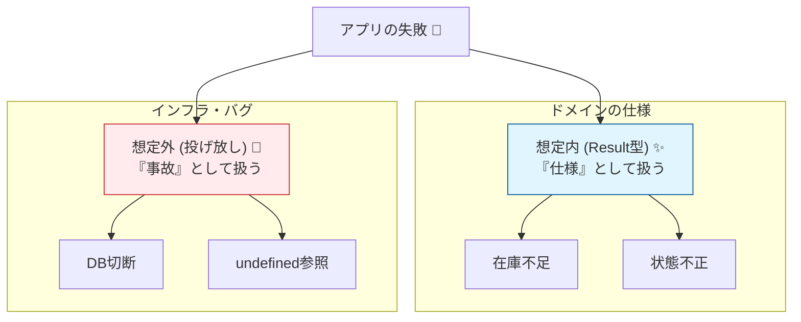

# 第20章：エラーを“仕様”にする（Result型と例外境界）🚨📦

---

## 20.0 この章でできるようになること 🎯✨

* 「起こりうる失敗」を**仕様として先に言語化**できる📝
* `try/catch` だらけを卒業して、**戻り値（Result型）で安全に失敗を運べる**ようになる📦✅
* **例外（throw）を使う場所**を「境界」に寄せて、ドメインをキレイに保てる🧼🧱
* ミニECの例（注文🛒・在庫📦・支払い💳）で、**在庫不足**や**不正状態**を“型”で表現できる🔒

---

## 20.1 そもそも「エラーを仕様にする」ってなに？🤔💡




---
アプリの失敗って、大きく2種類あるよね👇

* **想定内の失敗**（仕様に書ける）
  例：在庫不足📦❌、支払い前なのに出荷しようとした🚚❌、クーポン期限切れ🎟️⏰
* **想定外の失敗**（バグ or インフラ事故）
  例：`undefined`参照💥、DB接続断⚡、外部決済APIが落ちた🌩️

この章のポイントはこれ👇✨

> **想定内の失敗は “戻り値” として扱う（Result型）**
> **想定外の失敗は “例外” として扱い、境界で握る** 🧱

TypeScriptの世界だと、`try/catch` は「何が起きるか型で追えない」問題が出やすいのね😵‍💫
だから **“失敗も値として返す”** にすると、コードがグッと読みやすくなるよ📖✨（Result型の発想）([GitHub][1])

---

## 20.2 エラーの分類：まずは3つに分けよう🧺🧠


ミニECで起きる失敗を、こんな感じで分けるとスッキリするよ👇

## A) ドメインエラー（業務ルール違反）👑🔒

* 在庫不足
* 注文状態が不正（未払いなのに出荷、キャンセル済みなのに支払い、など）
* 金額がマイナス、数量が0以下 など

👉 **ドメイン層が一番責任を持つ**（ここが“最後の砦”）🛡️

## B) アプリケーションエラー（ユースケース都合）🎮⚙️

* 注文IDが見つからない（リポジトリから取れない）
* 競合（楽観ロックで弾かれた）
* 入力の形式が違う（UIバリデーション寄りだけど、アプリ層で扱うことも多い）

## C) インフラエラー（環境・外部要因）🔌🌩️

* DB接続できない
* 外部決済APIがタイムアウト
* ネットワーク障害

👉 **ここは例外が起きてもOK**。ただし **ドメインに持ち込まない** のが大事🧱✨

---

## 20.3 Result型を自作してみよう（超ミニ）🧪📦


まずは最小構成でいくよ💨
「成功 or 失敗」を **判別可能（discriminated union）** にするのがコツ✅

```ts
// Result型（超ミニ版）
export type Result<T, E> =
  | { ok: true; value: T }
  | { ok: false; error: E };

export const ok = <T>(value: T): Result<T, never> => ({ ok: true, value });
export const err = <E>(error: E): Result<never, E> => ({ ok: false, error });
```

## 便利メソッドも少しだけ ✨（map / andThen）

```ts
export const map = <T, E, U>(r: Result<T, E>, f: (v: T) => U): Result<U, E> =>
  r.ok ? ok(f(r.value)) : r;

export const andThen = <T, E, U>(
  r: Result<T, E>,
  f: (v: T) => Result<U, E>
): Result<U, E> => (r.ok ? f(r.value) : r);
```

これだけでも「失敗の道」がコードで見えるようになるよ👀✨

---

## 20.4 ドメインエラーを “型” にする（仕様そのもの）🧱📝

例：在庫📦と注文🛒で起きそうな失敗を、**union型**で表現してみよ！

```ts
// 例：ドメインエラー（仕様）
export type DomainError =
  | { type: "InsufficientStock"; sku: string; requested: number; available: number }
  | { type: "InvalidOrderState"; orderId: string; state: "Draft" | "Paid" | "Shipped" | "Canceled"; action: string }
  | { type: "NegativeMoney"; amount: number; currency: "JPY" | "USD" };
```

✨ここが大事👇

* **type（タグ）**を必ず入れる（分岐が安全になる）🔖✅
* UIに見せる文言はここに直接書かない（後で“境界”で変換する）🧱🙂

---

## 20.5 集約（Order）で「不正状態」をResultで返す👑🚪


例：支払い（pay）をするとき、状態が `Draft` じゃないとダメ！みたいなルールを守るよ🔒

```ts
import { Result, ok, err } from "./result";
import { DomainError } from "./domainError";

type OrderState = "Draft" | "Paid" | "Shipped" | "Canceled";

export class Order {
  constructor(
    public readonly id: string,
    private state: OrderState,
    private totalAmount: number
  ) {}

  pay(): Result<void, DomainError> {
    if (this.state !== "Draft") {
      return err({
        type: "InvalidOrderState",
        orderId: this.id,
        state: this.state,
        action: "pay",
      });
    }
    if (this.totalAmount < 0) {
      return err({ type: "NegativeMoney", amount: this.totalAmount, currency: "JPY" });
    }

    this.state = "Paid";
    return ok(undefined);
  }
}
```

✅ **例外を投げてない**のに、失敗の理由がちゃんと運べてる📦✨
呼び出し側は `try/catch` しなくていいのが気持ちいい😆🎉

---

## 20.6 ユースケース層で「エラーを合成」する🎮🧩

ユースケースはだいたいこう👇
**取得 → 変更 → 保存** 🔁

ここで「ドメインエラー」と「見つからない」みたいなアプリ層エラーを合体させるよ🧺

```ts
import { Result, ok, err, andThen } from "./result";
import { Order } from "./order";
import { DomainError } from "./domainError";

type AppError =
  | DomainError
  | { type: "NotFound"; orderId: string }
  | { type: "Conflict"; message: string };

export interface OrderRepository {
  findById(id: string): Promise<Order | null>;
  save(order: Order): Promise<void>;
}

export class PayOrderUseCase {
  constructor(private readonly repo: OrderRepository) {}

  async execute(orderId: string): Promise<Result<void, AppError>> {
    const order = await this.repo.findById(orderId);
    if (!order) return err({ type: "NotFound", orderId });

    const paid = order.pay();
    if (!paid.ok) return err(paid.error); // DomainErrorをそのまま上に返す📦

    await this.repo.save(order);
    return ok(undefined);
  }
}
```

---

## 20.7 例外（throw）はどこで使う？👉「境界」だけ🧱🚧


Result型で扱うのは **想定内の失敗**。
でもインフラ障害みたいな “想定外” は例外が起きうるよね🌩️

このときの鉄板ルール👇

* **ドメイン層：例外をなるべく出さない**（出してもドメイン内で閉じる）🔒
* **境界（HTTPハンドラ/CLI/ジョブ）で例外を捕まえて、ログ＆安全な応答に変換**🧱🧯

さらに最近のJSでは `Error` に `cause` を付けて原因をつなげられるよ🔗（ログが超ラク）✨([tc39.es][2])

```ts
try {
  // 例：外部決済API呼び出し、DB保存など
} catch (e) {
  // “原因” をつなげて上に投げ直す（境界でだけやるイメージ）
  throw new Error("Payment gateway failed", { cause: e });
}
```

---

## 20.8 境界で「エラー → ユーザー向け表示」に変換する🪄🙂


ドメインエラーのまま画面に出すと、ちょっと冷たい＆危険なことがあるよね😅
そこで、境界で **表示用メッセージ** に変換するよ🧱✨

```ts
type UiError = { code: string; message: string };

export const toUiError = (e: { type: string } & Record<string, unknown>): UiError => {
  switch (e.type) {
    case "InsufficientStock":
      return { code: "STOCK_SHORT", message: "ごめんね🙏 在庫が足りなかったよ📦💦" };
    case "InvalidOrderState":
      return { code: "INVALID_STATE", message: "この操作は今の状態ではできないよ😵‍💫" };
    case "NotFound":
      return { code: "NOT_FOUND", message: "対象の注文が見つからなかったよ🔎💦" };
    default:
      return { code: "UNKNOWN", message: "予期しないエラーが起きたよ…😢" };
  }
};
```

💡ポイント

* **ドメイン層にはUI文言を入れない**（言葉が変わるのはUI側の都合だからね）🧱
* `switch` は **default** を入れておく（将来の追加に強い）🛡️

---

## 20.9 ライブラリを使うなら？（neverthrow / Effect）📚✨

自作Resultで学んだら、実務ではライブラリも便利だよ😊

* **neverthrow**：`Result` / `ResultAsync` が揃ってて分かりやすい📦✨([GitHub][1])
* **Effect**：Result的な発想を含む“もう少し大きい道具箱”🧰（強力だけど慣れが必要）([Effect][3])

「Resultだけ欲しい！」なら neverthrow が選ばれやすいよ🫶（有名どころ）([GitHub][1])

---

## 20.10 よくある事故パターン集 😱🧯


## ① なんでも例外にしてしまう

* `throw new Error("在庫不足")` とかやると、呼び出し側は毎回 `try/catch` 😵‍💫
* しかも型で追えないから、分岐漏れが起きやすい💥

✅ 対策：**想定内はResult**、**想定外だけ例外**🧱✨

## ② catchして握りつぶす

* `catch { return ok(...) }` みたいにすると、障害が“なかったこと”になる😇💦

✅ 対策：境界でログ出す🪵、必要なら `Error` に `cause` を付けて上へ🔗([tc39.es][2])

## ③ UIメッセージをドメインに埋め込む

* ドメインが“画面の都合”で汚れる🧼❌

✅ 対策：**境界で変換**🙂🧱

---

## 20.11 手を動かす課題（ミニEC）✍️🛒📦💳

## 課題1：失敗を20個、先にリストアップ📝✨

* 注文🛒・在庫📦・支払い💳で「起こりうる失敗」を20個書く
* それぞれにラベル：`Domain / App / Infra` を付ける🏷️

## 課題2：DomainErrorを増やす🔒

* `PaymentDeclined`（カード拒否）
* `CouponExpired`（期限切れ）
* `QuantityTooLarge`（数量上限）
  を追加して union 型にする🧩

## 課題3：toUiError を育てる🙂

* `type` ごとに **ユーザー向け文言**を整える
* 「短い」「責めない」「次の行動が分かる」感じにする💬✨

---

## 20.12 AI活用プロンプト集 🤖💡（コピペOK）

## 失敗の洗い出し🧺

* 「ミニEC（注文・在庫・支払い）で起こりうる失敗を30個、Domain/App/Infraに分類して箇条書きで出して」

## DomainError設計🔒

* 「この失敗リストから、DomainErrorのunion型（typeタグ付き）を提案して。switchで分岐しやすい形にして」

## UI文言改善🙂

* 「次のエラーをユーザーに優しい文言にして。短く、責めず、次の行動が分かる感じで：…」

---

## 20.13 まとめ📌✨

* **想定内の失敗＝Resultで返す**📦✅
* **想定外の失敗＝例外、でも境界で止める**🧱🧯
* **ドメインエラーはunion型で“仕様化”**すると、分岐漏れが減って安心🔒
* UIに出す言葉は **境界で変換**🙂✨
* TypeScriptの最新安定版（確認できる範囲）として 5.9 系が提供されているよ📌([npmjs.com][4])

[1]: https://github.com/supermacro/neverthrow?utm_source=chatgpt.com "supermacro/neverthrow: Type-Safe Errors for JS & TypeScript"
[2]: https://tc39.es/proposal-error-cause/?utm_source=chatgpt.com "Error Cause - TC39"
[3]: https://effect.website/docs/additional-resources/effect-vs-neverthrow/?utm_source=chatgpt.com "Effect vs neverthrow | Effect Documentation"
[4]: https://www.npmjs.com/package/typescript?utm_source=chatgpt.com "typescript"
