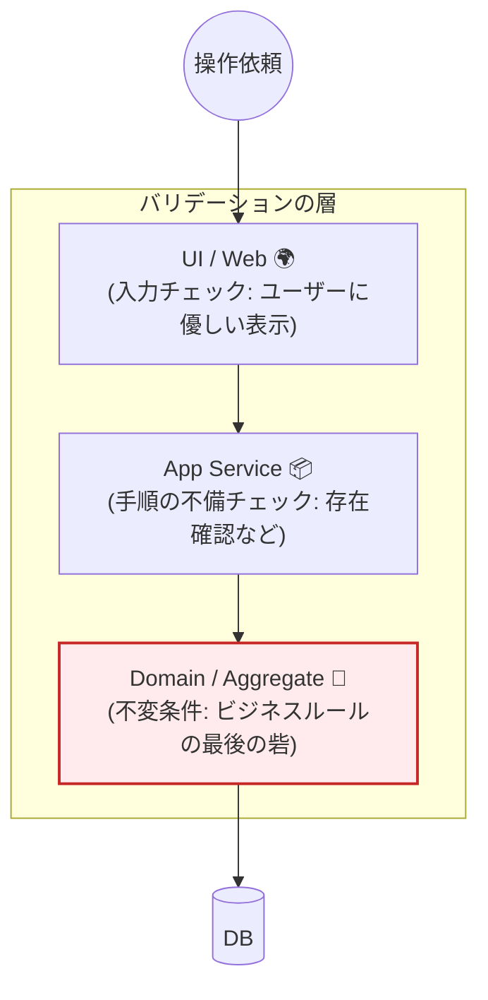
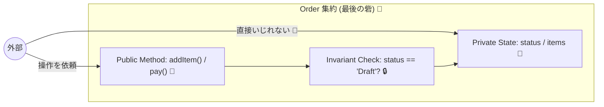

# 第21章：不変条件の置き場所①（ドメインで絶対守る）🔒👑

## 21.1 この章でできるようになること 🎯✨

* 「不変条件（Invariants）」を **“最後に守る場所”** がどこか分かるようになる 🧠🔒
* 不変条件を **集約（Aggregate）に閉じ込める** 書き方ができるようになる 🧺🧱
* 「入力チェック」と「ドメインのルール」をごちゃ混ぜにしなくなる 🧼🔒
* 不変条件が散らばってないか、コードで点検できるようになる 👀✅

---

## 21.2 不変条件ってなに？（超ざっくり）🔒🧠

**不変条件**は、「どんな操作が来ても、絶対に壊してはいけないルール」だよ💡
たとえばミニECだと…🛒

* 注文の数量は **1以上** 📦
* 合計金額は **0以上** 💰
* 支払い済みの注文に **商品追加しちゃダメ** 💳🚫
* キャンセル済みを **支払い済みに戻しちゃダメ** ↩️🚫

ポイントはこれ👇
**“誰が呼んでも” “どこから呼んでも” “どんな順番でも” 壊れないこと** 🧱✨

---

## 21.3 置き場所の結論（最短で覚える）🏁✨

不変条件は、基本この順で置くよ📦🔒

1. **Value Objectで守れるものはVOで守る** 💎

   * 例：Quantityは1以上、Moneyは0以上…みたいな「値そのもののルール」
2. **それでも守りきれない“状態のルール”は集約の中で守る** 🧺👑

   * 例：「支払い済みなら追加不可」「状態遷移の順番」など
3. **外から勝手に壊せないように“入口を絞る”** 🚪🔐

   * `new` を自由にさせない、プロパティを書き換えさせない、など

つまり…
**集約は“最後の砦（とりで）”** 🏰🔒
ここが崩れると、どこで守ってても結局事故るよ〜😱💥

---

## 21.4 「入力チェック」と「不変条件」は別物だよ 🧼🆚🔒

ここ、めっちゃ混ざりがち！😵‍💫

### ✅ 入力チェック（UI/フォーム）

* 「空欄はダメ」
* 「文字数は20文字まで」
* 「半角数字だけ」
  → これは **ユーザーに優しくするため** のチェック 😊🫶

### 🔒 不変条件（ドメイン/集約）

* 「支払い済みに商品追加は不可」
* 「合計金額が負になる状態は禁止」
* 「状態遷移は Draft → Paid → Shipped の順だけ」
  → これは **ビジネスとして壊れたら終わり** のルール 🧱⚡

入力チェックはすり抜けることがあるよ😇
（API直叩き、バッチ、他サービス、管理画面、将来の改修…）
だから **ドメインでも必ず守る** 🔒👑



---

## 21.5 ミニEC（Order集約）で「守るべき不変条件」を決めよう 🛒📝

この章では、Order集約を例にするよ🧺✨

### 🧾 Order集約の不変条件例

* 数量は **1以上** 📦
* 単価は **0以上** 💴
* 注文合計は **0以上** 💰
* 支払い済みなら **商品変更できない** 💳🚫
* キャンセル済みなら **何もできない** 🧊🚫
* 支払いは **1回だけ**（二重決済防止）🔁🚫

「値のルール」はVOへ💎
「状態や組み合わせのルール」は集約へ🧺👑

---

## 21.6 実装例：集約が“最後の砦”になる書き方 🧺🔒✨




### ✅ ざっくりフォルダ（例）📁

* `src/domain/order/`（集約まわり）

  * `Money.ts`
  * `Quantity.ts`
  * `Order.ts`
  * `OrderError.ts`
* `src/tests/`（テスト）

> 参考：TypeScriptの安定版は 2026-01-28 時点で npm “Latest” が **5.9.3** だよ📌 ([npmjs.com][1])
> テストは Vitest の npm “Latest” が **4.0.18**（2026-01-28 時点）📌 ([npmjs.com][2])

---

### 21.6.1 Result型（失敗も型で返す）📦🚨

※ 第20章の続きとして「例外を乱発しない」スタイルでいくよ✌️

```ts
// src/domain/shared/Result.ts
export type Ok<T> = { ok: true; value: T };
export type Err<E> = { ok: false; error: E };
export type Result<T, E> = Ok<T> | Err<E>;

export const ok = <T>(value: T): Ok<T> => ({ ok: true, value });
export const err = <E>(error: E): Err<E> => ({ ok: false, error });
```

---

### 21.6.2 Value Object：Quantity（値そのものの不変条件）💎📦

```ts
// src/domain/order/Quantity.ts
import { Result, ok, err } from "../shared/Result";
import { OrderError } from "./OrderError";

export class Quantity {
  private constructor(public readonly value: number) {}

  static of(value: number): Result<Quantity, OrderError> {
    if (!Number.isInteger(value)) {
      return err({ type: "InvalidQuantity", message: "数量は整数にしてね🧮" });
    }
    if (value < 1) {
      return err({ type: "InvalidQuantity", message: "数量は1以上だよ📦" });
    }
    return ok(new Quantity(value));
  }
}
```

✅ これで「Quantity が 0」とか「Quantity が -3」とか **存在できない** 🙅‍♀️✨
（＝無効状態を作れない！最高！🎉）

---

### 21.6.3 集約：Order（状態の不変条件はここで守る）👑🔒

```ts
// src/domain/order/OrderError.ts
export type OrderError =
  | { type: "InvalidQuantity"; message: string }
  | { type: "InvalidMoney"; message: string }
  | { type: "CannotEditPaidOrder"; message: string }
  | { type: "CannotPayEmptyOrder"; message: string }
  | { type: "AlreadyPaid"; message: string };
```

```ts
// src/domain/order/Money.ts
import { Result, ok, err } from "../shared/Result";
import { OrderError } from "./OrderError";

export class Money {
  private constructor(public readonly amount: number, public readonly currency: "JPY") {}

  static of(amount: number, currency: "JPY" = "JPY"): Result<Money, OrderError> {
    if (!Number.isFinite(amount)) {
      return err({ type: "InvalidMoney", message: "金額が変だよ💰" });
    }
    if (amount < 0) {
      return err({ type: "InvalidMoney", message: "金額は0以上だよ💰" });
    }
    return ok(new Money(amount, currency));
  }

  static zero(currency: "JPY" = "JPY") {
    return new Money(0, currency);
  }

  add(other: Money) {
    // 同通貨だけ扱う前提（教材の簡略化）
    return new Money(this.amount + other.amount, this.currency);
  }

  mul(n: number) {
    return new Money(this.amount * n, this.currency);
  }
}
```

```ts
// src/domain/order/Order.ts
import { Result, ok, err } from "../shared/Result";
import { Money } from "./Money";
import { Quantity } from "./Quantity";
import { OrderError } from "./OrderError";

type OrderStatus = "Draft" | "Paid";

type OrderItem = {
  productId: string;
  unitPrice: Money;
  quantity: Quantity;
};

export class Order {
  #status: OrderStatus = "Draft";
  #items: OrderItem[] = [];
  #total: Money = Money.zero("JPY");
  #paidAt: Date | null = null;

  // 外から new させない（入口を絞る）🚪🔐
  private constructor(public readonly id: string) {}

  static create(id: string) {
    return new Order(id);
  }

  get status() {
    return this.#status;
  }
  get total() {
    return this.#total;
  }
  get items() {
    // 外から配列を書き換えられないようにコピーで返す🧊
    return [...this.#items];
  }

  addItem(productId: string, unitPrice: Money, quantity: Quantity): Result<void, OrderError> {
    // 🧱 状態の不変条件：支払い済みは編集不可
    if (this.#status === "Paid") {
      return err({ type: "CannotEditPaidOrder", message: "支払い済みは編集できないよ💳🚫" });
    }

    this.#items.push({ productId, unitPrice, quantity });
    this.#recalcTotal();
    this.#assertInvariants(); // 念のため（内部のバグ検知）🧨
    return ok(undefined);
  }

  pay(now: Date = new Date()): Result<void, OrderError> {
    if (this.#status === "Paid") {
      return err({ type: "AlreadyPaid", message: "もう支払い済みだよ🔁🚫" });
    }
    // 🧱 状態の不変条件：空の注文は支払えない
    if (this.#items.length === 0) {
      return err({ type: "CannotPayEmptyOrder", message: "商品が0件だと支払えないよ🛒🚫" });
    }

    this.#status = "Paid";
    this.#paidAt = now;
    this.#assertInvariants();
    return ok(undefined);
  }

  #recalcTotal() {
    this.#total = this.#items.reduce((sum, item) => {
      return sum.add(item.unitPrice.mul(item.quantity.value));
    }, Money.zero("JPY"));
  }

  #assertInvariants() {
    // 🔒 ここは「ユーザー起因の失敗」じゃなくて「実装ミス検知」用！
    // 例：recalcTotal忘れ、items直接いじっちゃった等
    if (this.#total.amount < 0) {
      throw new Error("InvariantViolation: total must be >= 0");
    }
    if (this.#status === "Paid" && this.#items.length === 0) {
      throw new Error("InvariantViolation: paid order must have items");
    }
  }
}
```

#### ここが“最後の砦”ポイントだよ👑🔒

* **外から `new Order()` できない** → 無効な作り方を封じる 🚪🔐
* **状態を private に閉じる** → 勝手に `status = "Paid"` とかできない 🧊
* **操作はメソッド経由** → ルールチェックが必ず通る 🧱✅
* **VOで値を守る** → そもそも変な値が入りにくい 💎✨

---

## 21.7 「不変条件が散らばってる」あるある事故 😱💥

次の匂いがしたら要注意だよ👃⚠️

* 同じチェックが **UIにもAPIにもバッチにも** コピペされてる 🧟‍♀️🧟‍♀️🧟‍♀️
* `Order.status` が public で、どこからでも書き換え可能 ✍️😱
* `items.push(...)` が外部でできちゃう 📦💥
* 「支払い済みチェック」が **アプリ層にしかない**（別ルートから破られる）🕳️

✅ 対策はシンプル：**守るべきものは集約に寄せる** 🧺🔒

---

## 21.8 テストで守る：不変条件テスト（3本）🧪✅

Vitest を使う例だよ（Vitest 4系）🧪✨ ([npmjs.com][2])

```ts
// src/tests/order.invariants.test.ts
import { describe, it, expect } from "vitest";
import { Order } from "../domain/order/Order";
import { Money } from "../domain/order/Money";
import { Quantity } from "../domain/order/Quantity";

describe("Order invariants 🔒", () => {
  it("支払い済みの注文には商品追加できない💳🚫", () => {
    const order = Order.create("o-1");
    const q = Quantity.of(1);
    const p = Money.of(500);

    if (!q.ok || !p.ok) throw new Error("setup failed");

    order.addItem("p-1", p.value, q.value);
    order.pay();

    const r = order.addItem("p-2", p.value, q.value);
    expect(r.ok).toBe(false);
    if (!r.ok) expect(r.error.type).toBe("CannotEditPaidOrder");
  });

  it("空の注文は支払えない🛒🚫", () => {
    const order = Order.create("o-2");
    const r = order.pay();
    expect(r.ok).toBe(false);
    if (!r.ok) expect(r.error.type).toBe("CannotPayEmptyOrder");
  });

  it("Quantityは1以上じゃないと作れない📦", () => {
    const r = Quantity.of(0);
    expect(r.ok).toBe(false);
  });
});
```

テストは「壊れたら困る順」に書くと気持ちいいよ🥰🎯
（＝不変条件は最優先でテスト！🔒✅）

---

## 21.9 AI活用：不変条件を散らさないための“質問テンプレ”🤖✨

AIに頼むときは、「お願い」じゃなくて **チェック観点を引き出す** のがコツだよ🪄

### ① 不変条件の洗い出し📝

* 「Order集約で“絶対に壊せないルール”を10個候補出して。ミニEC（注文・在庫・支払い）で。」

### ② 置き場所の判定（VO？集約？）🧭

* 「このルールは“値のルール”だからVO？それとも“状態のルール”だから集約？理由つきで分類して。」

### ③ 散らばり検知👀⚠️

* 「同じルールがUI/アプリ/ドメインに重複しやすいポイントを列挙して。重複した時の事故も。」

### ④ テストケース作り🧪

* 「上の不変条件に対して、Given-When-Then形式のテストケースを境界値つきで作って。」

---

## 21.10 ミニ演習（手を動かす）🛠️✨

### 演習A：置き場所クイズ🎮

次のルールを **VO / 集約 / どっちでもない** に分類してみてね👇

* 数量は1以上 📦
* 支払い済みなら編集不可 💳🚫
* メールアドレスの形式は `@` を含む 📧
* 合計金額が0以上 💰

### 演習B：集約に寄せるリファクタ🧹

アプリ層にある「支払い済みチェック」を探して、**Order集約のメソッドへ移動**してみよう🧺🔒

### 演習C：不変条件テストを1本追加🧪

「二重支払い禁止🔁🚫」のテストを追加してみよう！

---

## 21.11 まとめ 🧺🔒✨

* 不変条件は **ドメイン（集約）が最後の砦** 🏰
* 値そのもののルールは **Value Objectで無効状態を作らせない** 💎
* 状態や組み合わせのルールは **集約のメソッドで必ずチェック** 🧱
* **入口を絞る（new禁止・private・コピー返却）** と守りが固くなる 🚪🔐
* テストで不変条件を固定して、未来の改修で壊れないようにする 🧪✅

[1]: https://www.npmjs.com/package/typescript?activeTab=versions&utm_source=chatgpt.com "typescript"
[2]: https://www.npmjs.com/package/vitest?activeTab=versions&utm_source=chatgpt.com "vitest"
