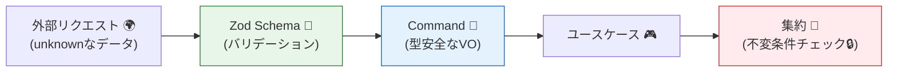

# 第22章：不変条件の置き場所②（UI入力・アプリ層との分担）🪜🧠

## この章でできるようになること🎯✨

* 「入力チェック」と「ドメイン不変条件」の違いを、言葉で説明できる🗣️
* UI🖥️／アプリ層🎮／ドメイン層👑 の“分担表”を作れる📋
* ありがちな事故（UIにしかチェックがない、ドメインがスカスカ等）を回避できる🧯
* エラーを「ユーザーに見せる文言」まで落とし込める😇💬

---

## 1. まず結論：3か所で守る（でも役割が違う）🧱🛡️


### UI（画面）🖥️✨：**早く・わかりやすく**

* 目的：ユーザーの入力ミスを、その場で減らす🧼
* 特徴：**体験（UX）**のため。サクサク反応してほしい⚡
* 注意：UIは改ざんできるので、**UIだけに任せるのはNG**🙅‍♀️

### アプリ層（ユースケース）🎮🧩：**入口で安全にして、手順を守る**

* 目的：外から来たデータ（`unknown`）を**安全な型**に変換する🔄
* 目的：権限チェック🔐、存在チェック🔎（DBで商品がある？など）、処理手順の制御🎬
* 注意：ここは「便利なチェック置き場」になりがち。置きすぎ注意⚠️

### ドメイン（集約）👑🔒：**最後の砦（絶対に壊れないルール）**

* 目的：不変条件を**必ず守る**（何が来ても守る）🛡️
* 特徴：テストしやすい🧪、壊れにくい✅
* 注意：ここが弱いと、最終的に事故る😱（二重決済、在庫マイナス等）

---

## 2. “分担”の見分け方：チェックを4種類に分ける🔍🧠


チェックって、実は性格が違うんだよね😊
ミニEC（注文🛒・在庫📦・支払い💳）で分類するとこう👇

| チェックの種類         | 例                                 | 主に置く場所     | 理由                |
| --------------- | --------------------------------- | ---------- | ----------------- |
| ① 形式・入力ミス       | 郵便番号の桁、必須入力、数値かどうか                | UI ＋ アプリ層  | UX改善＆入口で安全化🧼     |
| ② 型・構造          | items配列の形、quantityがnumber、空配列禁止など | アプリ層（入口）   | `unknown`を安全にする🚪 |
| ③ 参照整合（外部データ依存） | 商品IDが存在する？価格は最新？在庫は足りる？           | アプリ層（＋別集約） | DB/外部I/Oが要る🔌     |
| ④ ドメイン不変条件      | 数量は1以上、合計金額は整合、支払い後は変更不可          | ドメイン（集約）   | 破ったら“仕様違反”だから🔒   |

ポイント💡：

* **UIは“親切”**、アプリ層は**“入口の門番＋手順係”**、ドメインは**“法律”**👑⚖️

---

## 3. 入口パターン：アプリ層で「コマンド」を型安全にする🚪🧾




---
UIから来る値は信用しないで、まずアプリ層でこうするのが定番😊✨

* `unknown` → **Schemaで検証** → **安全なCommand型** → ユースケース実行

Zod v4 は安定版として案内されていて、TypeScriptと相性よく使えるよ🧩✨ ([Zod][1])

```ts
// application/commands/placeOrderCommand.ts
import { z } from "zod";

// 入口（外から来るデータ）を検証して「安全な形」にする
export const placeOrderSchema = z.object({
  customerId: z.string().min(1),
  items: z.array(
    z.object({
      productId: z.string().min(1),
      quantity: z.number().int().min(1),
    })
  ).min(1),
  couponCode: z.string().trim().min(1).optional(),
  shippingAddress: z.object({
    postalCode: z.string().regex(/^\d{3}-\d{4}$/), // 形式チェック
    line1: z.string().min(1),
  }),
});

export type PlaceOrderCommand = z.infer<typeof placeOrderSchema>;
```

✅ここでやってるのは「入口の安全化」

* `postalCode` の形式みたいな“入力ミス”はUIでもやるけど、アプリ層でも**最低限**守る🧼
* そして「ドメインのルール」はここじゃなくて、次のドメインで守るよ👑🔒

---

## 4. ドメイン側：不変条件は“メソッドの中で”守る👑🔒


ここが第21章の続きの本番ポイント！
「正しい状態しか作れない」ようにする😊✨

```ts
// domain/order/order.ts
export type DomainError =
  | { type: "InvalidQuantity"; message: string }
  | { type: "OrderAlreadyPaid"; message: string }
  | { type: "EmptyOrder"; message: string };

type OrderStatus = "Draft" | "Paid";

export class Order {
  private status: OrderStatus = "Draft";
  private items: Array<{ productId: string; quantity: number }> = [];

  addItem(productId: string, quantity: number): DomainError | null {
    if (this.status === "Paid") {
      return { type: "OrderAlreadyPaid", message: "支払い後は追加できません" };
    }
    if (!Number.isInteger(quantity) || quantity < 1) {
      return { type: "InvalidQuantity", message: "数量は1以上です" };
    }
    this.items.push({ productId, quantity });
    return null;
  }

  pay(): DomainError | null {
    if (this.status === "Paid") {
      return { type: "OrderAlreadyPaid", message: "二重決済は禁止です" };
    }
    if (this.items.length === 0) {
      return { type: "EmptyOrder", message: "商品が1つもありません" };
    }
    this.status = "Paid";
    return null;
  }
}
```

ここでの大事ポイント💡

* UIがどれだけ頑張っても、**最後はドメインが守る**🛡️
* だから `addItem()` / `pay()` の中で不変条件チェックする✅

---

## 5. アプリ層の役割：ドメインエラーを「見せ方」に変換する🔁💬


ドメインのエラーは「仕様」だけど、ユーザーにそのまま出すと冷たい/分かりにくいこともあるよね🥺
だから **変換（マッピング）**するのはアプリ層が得意✨

```ts
// application/errorMapping.ts
import type { DomainError } from "../domain/order/order";

export type UiError = {
  code: string;
  userMessage: string;
  field?: string; // どの入力欄に紐づける？
};

export function toUiError(err: DomainError): UiError {
  switch (err.type) {
    case "InvalidQuantity":
      return { code: "QTY_INVALID", userMessage: "数量は1以上で入力してね🙏", field: "items.quantity" };
    case "OrderAlreadyPaid":
      return { code: "ORDER_ALREADY_PAID", userMessage: "この注文はすでに支払い済みだよ💳✅" };
    case "EmptyOrder":
      return { code: "ORDER_EMPTY", userMessage: "商品を1つ以上入れてね🛒✨", field: "items" };
  }
}
```

---

## 6. 分担の“完成形”イメージ（ミニEC：注文確定）🛒🎬

### UI（画面）🖥️

* 郵便番号の形式をその場でチェック✅
* 数量の入力欄に `min=1` 的なガード✅
* エラー文を分かりやすく出す😊💬

### アプリ層（ユースケース）🎮

* `placeOrderSchema.parse()` で入口を検証🚪
* 商品IDが存在するか（Repositoryで）確認🔎
* Order集約をロード→変更→保存🔁
* DomainErrorをUiErrorに変換して返す📦

### ドメイン（Order集約）👑

* 支払い後は変更不可🔒
* 数量は1以上🔒
* 空注文は支払い不可🔒

---

## 7. よくある間違い集（ここ超大事😇⚠️）


1. **「UIでチェックしたからOK」**
   → 改ざんで突破されるよ😱 → アプリ層でも入口チェックは必須🧼

2. **「アプリ層に全部置く」**
   → どこがルールか分からなくなる迷子状態🌀
   → 不変条件はドメインへ👑🔒

3. **「ドメインが外部I/Oに触る」**（DB検索、HTTP、現在時刻取得など）
   → テスト地獄＆依存が汚れる😵‍💫
   → 外部が必要なことはアプリ層でやって、ドメインには“結果”を渡す🔌➡️👑

4. **「存在チェック＝不変条件」だからドメインでDB検索したい**
   → “不変条件の判断”に外部が要るときは、設計の工夫が必要🧠
   → 例：商品は別集約で管理し、Orderは `productId` だけ持つ（境界を守る）🧱

5. **「バリデーションが散らばる」**
   → ルールが二重三重で矛盾しやすい😵
   → 分担表を作って、置き場所を固定する📋✅

6. **「例外（throw）で全部返す」**
   → どこで何が起きたか追いづらい😇
   → “期待される失敗”はResult/エラー型で扱う方が読みやすいこと多い📦

---

## 8. 手を動かす課題：分担表を作ろう📋✍️✨

### お題：次のチェックはどこに置く？（3つに分ける）🪜

1. 郵便番号が `123-4567` の形式か
2. quantity が 1以上か
3. items が空じゃないか
4. productId がDBに存在するか
5. 注文がPaidなら変更禁止
6. クーポンコードが“期限内”か（DB参照）
7. 住所が必須（配送ありの場合）

✅作業手順（おすすめ）

* まず「UI / アプリ層 / ドメイン」の3列で表を作る🧾
* それぞれに「理由」を1行で書く（ここが学びになる！）🧠✨
* 迷ったら分類ルール👇を使う

**迷ったときの合言葉**🪄

* UXのため？ → UI
* `unknown`を安全にする？ → アプリ層（入口）
* DB/外部がいる？ → アプリ層
* 絶対に破っちゃダメ？ → ドメイン（集約）

---

## 9. AI活用🤖✨：よくある間違い例を出してもらう（学びが早い！）

### ① 分担案を3パターン出させる🧠

* 「このチェックをUI/アプリ/ドメインに分ける案を3つ。メリデメ付きで」

### ② “事故る実装”を作らせる🧨

* 「UIにしかチェックがない例を作って、どう突破されるか説明して」

### ③ エラー文言の改善を手伝わせる💬

* 「このDomainErrorをユーザー向けに優しい日本語にして。短めで」

👉 AIが言ってることは、そのまま採用せずに

* **不変条件がドメインにあるか？**
* **ドメインがI/Oしてないか？**
  この2点だけは必ず目視チェック👀✅

---

## 10. おまけ：最近の周辺ツール小ネタ🧰✨

* Node.js は v24 系が Active LTS として案内されていて、v25 系は Current 扱いだよ🟢 ([nodejs.org][2])
* Prettier は 3.8 系のリリース情報が出ているよ🧼 ([prettier.io][3])
* ESLint は v10 の RC が出ていて、大きめ更新が進んでるよ🧹 ([eslint.org][4])
* テストは Vitest がViteベースで使いやすく、4系の流れが見えてるよ🧪🚀 ([vitest.dev][5])
* TypeScript は “initのデフォルト設定をより実用寄りにする”流れも進んでるよ（例：`module: nodenext` や `target: esnext` など）🧠 ([typescriptlang.org][6])

---

## まとめ🏁✨

* UIは「親切」🖥️、アプリ層は「門番＋手順」🎮、ドメインは「法律（不変条件）」👑
* 不変条件は **ドメイン（集約）に置く**のが基本🔒
* アプリ層は **入口で型安全化＋外部参照チェック＋エラー変換**が主戦場🚪🔁
* 分担表を作ると、設計が一気にブレなくなるよ📋✅

[1]: https://zod.dev/v4?utm_source=chatgpt.com "Release notes"
[2]: https://nodejs.org/en/about/previous-releases?utm_source=chatgpt.com "Node.js Releases"
[3]: https://prettier.io/blog/2026/01/14/3.8.0?utm_source=chatgpt.com "Prettier 3.8: Support for Angular v21.1"
[4]: https://eslint.org/blog/2026/01/eslint-v10.0.0-rc.1-released/?utm_source=chatgpt.com "ESLint v10.0.0-rc.1 released"
[5]: https://vitest.dev/guide/?utm_source=chatgpt.com "Getting Started | Guide"
[6]: https://www.typescriptlang.org/docs/handbook/release-notes/typescript-5-9.html "TypeScript: Documentation - TypeScript 5.9"
